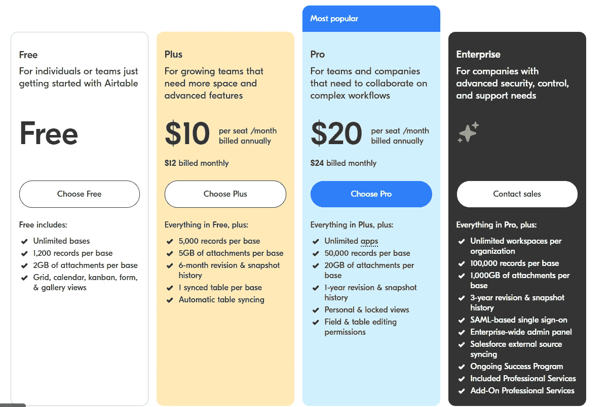
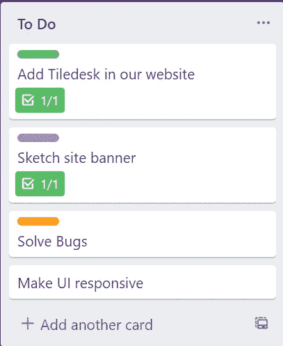
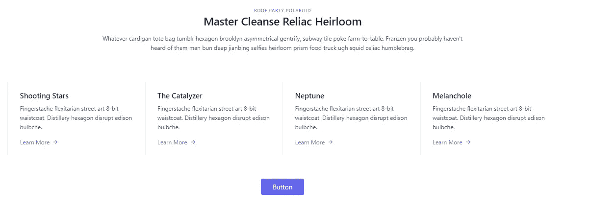

# 我每天都在使用的 11 个 Web 开发工具，因为它们让我的生活变得更加轻松

> 原文：<https://javascript.plainenglish.io/11-web-development-tools-i-use-every-day-because-they-make-my-life-easier-54ede59743c2?source=collection_archive---------4----------------------->

## 他们也一定会为你做同样的事情。

Photo by [Trust "Tru" Katsande](https://unsplash.com/@iamtru?utm_source=medium&utm_medium=referral) on [Unsplash](https://unsplash.com?utm_source=medium&utm_medium=referral)

当我第一次开始前端 web 开发时，我按照相同的步骤编写 HTML 代码，玩 CSS，使用 JavaScript。

然后，我学习了 React，因为它被 web 开发人员大量使用。

但是我很慢，因为我不知道我可以使用的最新技术工具。感谢那些帮助我的创业公司和科技公司。

在创业公司和其他公司工作后，我学到了很多东西。我们很多人都知道前端开发人员有很多任务。有时候，花几个小时解决一个奇怪的问题真的很烦人。

所以，我会帮助你推进你的网络开发之旅。我确信你一定会学到新的工具来帮助你解决问题。

> 在这里，工具通常是指技术和软件平台等，可以帮助我们完成 web 开发任务。

在本文中，我将通过提供一些有用的工具来帮助您，这些工具您可能没有听说过，但是会喜欢使用。

这不是一个联盟帖子，在这个帖子里没有一个联盟链接。让这篇文章更重要的是，我们将要学习的大多数 web 开发工具都是免费使用的。

激动吗？开始吧！

# 1.充气台

此前，我没有听说过 [Airtable](https://airtable.com/) 。我想你们中的大多数人可能还不知道它，或者到目前为止还没用过它。

但是当我研究了一下，发现大多数公司都倾向于使用它时，我感到很困惑。

但是尼廷，什么是空中桌？

根据 [Business Insider](https://www.businessinsider.in/enterprise/heres-how-to-use-airtable-the-user-friendly-spreadsheet-app-thats-taking-silicon-valley-by-storm/articleshow/63523870.cms) 的说法，Airtable 可以将信息存储在一个电子表格中，这个电子表格在视觉上很有吸引力并且易于使用，但它也足够强大，可以作为一个数据库，企业可以使用它进行客户关系管理(CRM)、任务管理、项目规划和跟踪库存。

简单来说，基本就是用来管理工作流的。

现在让我们看看价格，

Src: [Airtable](https://airtable.com/pricing)

所以，它是免费使用的，有很多功能。如果你想要更多的功能，跳到付费计划。

有几个替代品，但是我没有用过，所以我就不写了。

# 2.特雷罗/米拉诺特

当我在一家初创公司工作时，为了节省时间，他们通常会在 [Trello](https://trello.com/) 给我分配任务。

Src: Trello

我习惯于添加清单，所以当我完成一项任务时，我会点击从清单中删除它。

之后，我在 Trello 中创建了自己的模板，以我喜欢的方式管理我的时间和安排我的任务。

是的，我通常在前一天晚上写下我第二天的任务。每当我完成一项特定的任务时，它都有助于激励我。它还帮助我减少了花在不必要任务上的时间。

它也可以在一定范围内免费使用，我正在使用免费版本来管理我的日常任务。

我也用过[Mila note](https://milanote.com/)(Trello 的替代品)，但我更喜欢 Trello 界面。

# 3.拉开

到目前为止，我已经创建了至少 10 个专业网站，我知道插图让它们变得更酷。

我不想浪费时间从头开始创作插图，所以我使用 Undraw。

[Undraw](https://undraw.co/illustrations) 是一个开源的任何想法的插图工具。所以，我把它下载到 SVG 中，并根据我的需要进行修改。

[这里的](/how-to-create-an-svg-animation-illustration-for-your-website-d5a31ba2e712)是我创作插图的一个简单过程。

# 4.蒂列德斯克

为了吸引更多的客户，开发人员使用了许多策略，如利用数据科学预测客户的购买体验，通过人工智能/人工智能推荐类似的产品，创建聊天机器人来解决客户问题等。

是的，数据科学和 AI/ML 是广阔的领域，但我们可以在几分钟内创建聊天机器人。

如果你不知道聊天机器人，那么…

根据甲骨文公司的说法，“聊天机器人是一种模拟和处理人类对话(书面或口头)的计算机程序，允许人类与数字设备互动，就像他们在与真人交流一样。”

此外，根据[调查](https://www.globenewswire.com/news-release/2021/03/26/2199940/0/en/The-global-Chatbot-market-size-to-grow-from-USD-2-9-billion-in-2020-to-USD-10-5-billion-by-2026-at-a-Compound-Annual-Growth-Rate-CAGR-of-23-5.html)，全球聊天机器人市场规模预计将从 2020 年的 29 亿美元增长到 2026 年的 105 亿美元，复合年增长率(CAGR)为 23.5%。

我们可以使用 [Tiledesk](https://tiledesk.com/) 免费创建一个聊天机器人。它是一个开源的实时聊天平台，用 Angular、Node.js 和 MongoDB 编写。它允许代理直接从他们的设备与访问者聊天。

[这里的](/dont-spend-dollars-to-build-chatbots-use-tiledesk-instead-12ef7b1d812c)是为你的网站创建一个的简单过程。

# 5.顺风 CSS

是的，我知道这是一个 CSS 框架，但它确实会节省你创建网站的宝贵时间，这就是为什么我在这里写它。

假设您想使用 HTML 和 CSS 创建上面的部分。你会怎么做？

大部分是从头开始创建或者使用任何 CSS 框架。

对于专业的 web 开发人员来说，这通常需要几分钟，对于初学者来说则需要半个小时。

但是如果我说任何人都可以在几秒钟内创建它呢？

如果我告诉你，你可以在几分钟内创建一个博客或电子商务网站的基本网站 UI，会怎么样？你可能不会相信我。

你可以的。Tailwind CSS 有大量的资源来做这件事。

让我解释一个这样的资源。有一个网站叫做 [Tailblocks](https://tailblocks.cc/) 。Tailblocks 是一个现成的 Tailwind CSS 块和组件的集合，用于 15 个不同的网站类别，如博客、定价、电子商务等等。

有很多像这样的[其他资源](https://github.com/aniftyco/awesome-tailwindcss)可以帮助你。

我知道你们中的一些人可能不喜欢使用 Tailwind CSS，这是你们的选择。我给[写了一篇文章](/stop-using-css-and-bootstrap-use-tailwind-css-instead-94c689ec3b8a)，其中一些读者提到不想使用 Tailwind CSS。

所以这完全取决于你。

# 6.Loading.io

我是这个[网站](https://loading.io/)的新手，但我真的很喜欢它。

据他们的[网站](https://loading.io/about/)介绍，Loading.io 是一家从 2014 年开始提供即时创作简单动画的在线服务提供商。

作为服务提供商，他们主要致力于为不同领域提供图形和动画工具，如 web 开发、市场营销、新闻和多媒体内容创作。

简单来说，这个网站帮助我们将一切可以动画化的东西动画化。

# 7.iloveIMG

有时，当我需要创建由假图像组成的网站时，我更喜欢从 Unsplash、Pexels、Pixabay 或 Canva 下载它们。

但是它们的尺寸往往很大。所以，我使用 [iloveIMG](https://www.iloveimg.com/) 。它有助于压缩图像和加载图像容易。

它还有其他功能，你可以使用像裁剪图像，调整图像大小，编辑图像等。

# 8.Svg 波

有时我想创建 SVG 波，使网站看起来更有吸引力。

最初，我不得不花很长时间在页脚或其他部分制作 SVG 波形。

但是后来发现 [Svg 波](https://svgwave.in/)，真的省了我的时间。

您有几种颜色，以及其他属性，如波，层，高度可供选择。

此外，您可以将其导出为 SVG 或 PNG 格式。

# 9.CSS 网格生成器

一个网站几乎每个页面都使用 grid 或者 flexbox。Flexbox 很容易实现，但是要实现一个网格至少要写 5-6 行代码。

假设你不想使用 TailwindCSS 并在 HTML 和 CSS 中创建一个网格。你会做什么？编写并创建它？

相反，你可以使用 [CSS 网格生成器](https://cssgrid-generator.netlify.app/)。

# 10.迅雷客户端

以上所有工具只是为了管理你的工作流程，让 UI 更好。

但是前端也需要后端，这可以使用 API 请求来完成。

到目前为止，我们一直使用邮递员。但是现在大家都在暗示[迅雷客户端](https://www.thunderclient.io/)。

实际上，它是一个测试 API 的 VSCode 扩展。它还将帮助您节省时间并在 VSCode 中工作。

# 11.Ngrok

是的，我们可以使用各种托管平台来托管前端和后端，如 Heroku、Netlify、Vercel、Amazon AWS、Microsoft Azure 等。

但是 Ngrok 有点不同。它允许我们通过链接显示本地主机。

简单来说，你可以通过 Ngrok 生成的链接向你的团队、客户或老板展示你的工作。

根据 ngrok.com 的，我们可以创造:

1.  公开本地 web 服务器的公共 URL。
2.  用于在移动设备上测试的公共 URL。
3.  用于构建 webhook 集成的公共 URL。
4.  用于向客户端发送预览的公共 URL。
5.  用于 SSH 访问您的 Raspberry Pi 的公共 URL。
6.  用于测试聊天机器人的公共网址。

要了解更多，你可以阅读— [如何使用 Ngrok](/how-to-create-and-locally-host-your-websites-in-seconds-using-ngrok-44b5d94abbd9) 在几秒钟内创建和本地托管你的网站。

当你想向你的客户或老板展示你的作品时，它会给你很大的帮助。

# 让我们结束吧

我想我已经用我使用的最新工具更新了你。

是的，还有其他几个工具可以帮助你的 web 开发之旅，比如 Canva、Dribbble、Figma、GitHub、[can use](https://caniuse.com/)、ColorZilla 等。你也可以使用它们。

如有疑问，欢迎评论。还有，用不用这些工具是你自己的选择。

***如果你喜欢我的工作，想要支持，可以*** [***请我喝杯咖啡！***](https://www.buymeacoffee.com/nitinfab)

谢了。

 [## 一个有 30 多年经验的程序员教给我的 8 条人生经验

### 就连千禧一代也在放弃六位数的技术工作。

javascript.plainenglish.io](/8-life-lessons-a-programmer-with-30-years-of-experience-taught-me-2a9fb090a398)  [## 停止使用 Redux——如果你愿意，请考虑简单

### 较少的样板代码使它成为更好的选择

better 编程. pub](https://betterprogramming.pub/stop-using-redux-consider-easy-peasy-if-you-want-3214c41bcce5) 

*更多内容看*[***plain English . io***](http://plainenglish.io/)