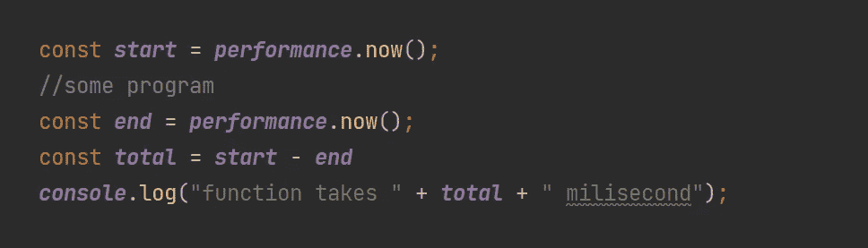
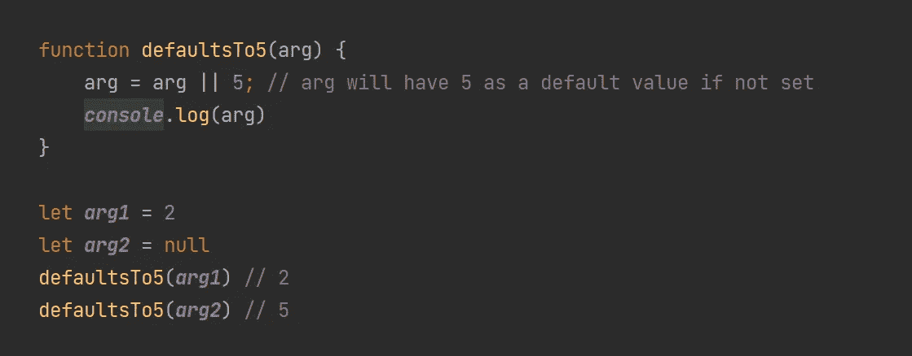
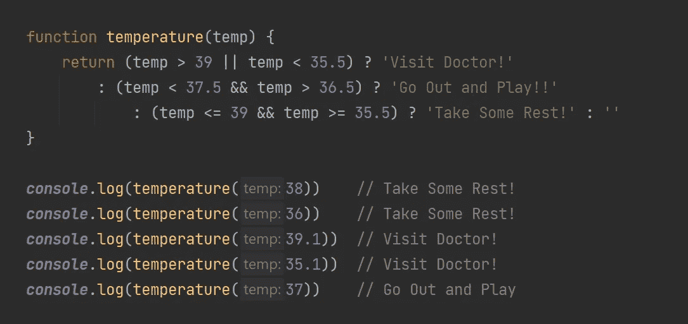

# 每个 Web 开发人员都应该知道的 12 个重要 JavaScript 函数

> 原文：<https://javascript.plainenglish.io/12-important-javascript-functions-every-web-developer-should-know-e488c4bbf521?source=collection_archive---------0----------------------->

## 作为 web 开发人员，节省时间和优化代码的 12 个重要 JavaScript 函数。

Photo by [Caspar Camille Rubin](https://unsplash.com/@casparrubin?utm_source=unsplash&utm_medium=referral&utm_content=creditCopyText) on [Unsplash](https://unsplash.com/s/photos/javascript?utm_source=unsplash&utm_medium=referral&utm_content=creditCopyText)

在本文中，我将向每个 web 开发人员展示 12 个重要的 JavaScript 函数。你在这里学到的一切都将加速你的发展，节省你的宝贵时间！

# 1.缩短控制台日志

您是否厌倦了在代码中一遍又一遍地编写 console.log()。这个简单的脚本使用`bind`来缩短控制台日志以加速开发过程*(每个函数都可以这么做)。*

# 2.将两个数组合并为一个

如果您想将任意大小的两个数组合并成一个数组，您可以使用`concate` JavaScript 函数。

# 3.将两个对象合并成一个

如果你正在处理对象，你可以用这个简单的技巧将它们合并在一起。

# 4.缩短数组

对于 web 开发人员来说，有一种简单方法可以缩短数组。您需要使用 length 方法并传递一个小于实际数组大小的数字。

# 5.打乱数组

有时你想随机排列数组中的值。要实现这一点，你可以使用随机`compareFunction`的`Array.sort`功能。

# 6.使用 isNum 验证数字

使用这个函数，你可以检查一个值或变量是否是一个数字(int，float 等)。

# 7.使用 isStr 来验证字符串

使用这个函数，您可以检查一个值或变量是否是字符串格式。

# 8.使用 isNull

通常，检查结果或数据是否为空是有用的。

# 9.计算函数的性能

如果你想检查一个函数运行多长时间，你可以在你的程序中使用这种方法

# 10.从数组中删除重复项

我们经常会遇到一个数组中有重复的数据，并使用循环来删除这些重复的数据。这个函数可以用一种简单的方式删除重复项，而不需要使用循环。

# 11.使用逻辑 AND/for 条件

您可以使用逻辑 AND/OR 来代替 if 条件。这可以在执行命令的函数中使用

或者用于赋值

# 12.三元运算符

三元运算符很酷。你可以避免不好看的嵌套条件 ***，如果..埃尔塞夫..elseif* 与三元运算符**。

# 结束语

希望这篇文章对你有帮助！如果你也有好的 JavaScript 函数可以分享，欢迎在这里发表评论并与其他开发者分享。**快乐 JavaScript 编码。**

此外，我创建了一个访问函数的要点，可以在我的 GitHub 简介中找到[:](https://gist.github.com/paulknulst/6a6dd09218913728349dd64f864bf8f4)

# 这篇博客到此结束。我很想听听你的想法和想法🤗请把它们记在下面👇👇👇

# ✍️作者

# 保罗·克努特

👨🏻‍💻🤓🏋️‍🏸🎾🚀

丈夫，两个孩子的父亲，极客，终身学习者，技术爱好者和软件工程师

*更多内容看* [*说白了. io*](http://plainenglish.io/) *。在这里注册我们的* [*免费周报*](http://newsletter.plainenglish.io/) *。*