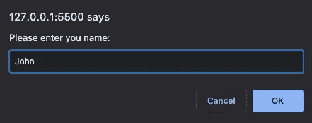
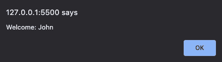
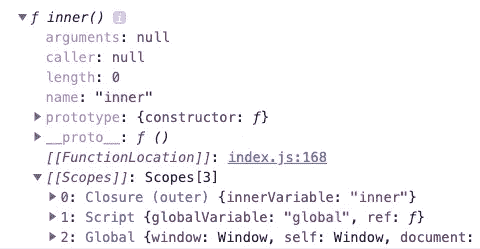

# 每个优秀的 Web 开发人员都应该知道的 12 个 JavaScript 概念

> 原文：<https://javascript.plainenglish.io/12-javascript-concepts-that-every-good-web-developer-should-know-6fac820b507c?source=collection_archive---------6----------------------->

## 帮助您成为更好的 JavaScript 开发人员的重要概念


Photo by [Adam Winger](https://unsplash.com/@awcreativeut?utm_source=medium&utm_medium=referral) on [Unsplash](https://unsplash.com?utm_source=medium&utm_medium=referral)

如果你是一个 JavaScript 开发人员，有任何水平的专业知识，你需要理解它的基本概念和后台的工作原理。

在这里，我们将看到 12 个概念的列表，它们将帮助你用更少的努力写出更干净的代码，并帮助你更好地掌握开发技能。

# 1.解构

析构只不过是分散数组中的元素或给定对象的属性。因此，可以将它们赋给变量或直接在代码中使用。

你可以看下面的例子来理解你如何为不同的目的使用数组的析构。

如示例所示，析构的用途之一是一次分配多个值。您还可以将值分散到一个数组中，并且只将少数几个值分配给可用的变量。分配是基于元素的位置完成的。

在下面的例子中，你可以看到如何对一个对象使用析构。

您可以将对象中的值赋给变量，也可以将对象中的一些属性赋给所需的变量。要记住的是变量名应该与对象中的键名相匹配。

如果您想更改变量的名称，而不是使用相同的名称作为键名，您可以给它一个别名，如下所示。

```
let { firstname: name, city: livesIn } = person;
```

# 2.扩展运算符和 Rest 语法

扩展操作符(`…`)允许您将数组元素或对象属性扩展到单个元素。您可以使用它们作为单独的参数传递给函数，或者如果您需要单独使用每个元素/属性，也可以使用它们。

rest 语法也使用相同的`…`操作符，但是功能完全相反。它将多个元素/属性合并到一个变量中，而不是分散开来。

# 3.模板文字

当你使用字符串并需要连接一些变量时，你可以使用模板文字而不是使用`+`操作符。你也不需要担心间距。

您也可以将它们用于多行字符串。您不必担心新的行和标签，因为内容的显示方式与在````中写入的方式相同。

# 4.箭头功能

箭头函数是一种更简洁地编写函数语法的方法。

如果只有一条语句要返回，甚至可以跳过 return 关键字和花括号。

```
const greet = (name) => “Hello ” + name;
```

> ***注意:*** 你需要记住`this`关键字在常规函数和箭头函数中的行为。在一个普通函数中，`this`将引用调用该函数的对象。但是，在一个箭头函数中，`this`将总是引用拥有这个箭头函数的对象，不管是谁调用它。

# 5.复试

回调是作为参数传递给另一个函数的函数，稍后在该函数内部被回调。

一旦某个操作完成，就可以使用回调来完成另一个操作。因为它们可能相互依赖，或者这些操作必须按顺序执行。你可以在下面的例子中看到如何使用回调。



> ***注意:*** 建议不要在一个回调函数中嵌套太多的回调函数，因为这可能会变得混乱，并且有点难以维护。

# 6.承诺

JavaScript 中的承诺是保证异步操作最终会完成(要么成功，要么失败)。

一个承诺可以同时处于以下三种状态中的任何一种:

*   悬而未决的
*   断然的
*   拒绝

如何使用承诺的例子？

你也可以用一个`finally`从句来表示承诺。一个示例用例可以是执行需要评估的操作，而不管承诺的结果(成功/失败)。

如果你对另一个承诺的结果有任何依赖，你也可以将一个承诺嵌套在另一个承诺中。您应该避免过多地嵌套承诺，因为代码会变得混乱，以后会更难维护。

# 7.异步和等待

`async`和`await`没有带来任何新的功能，但是它们提供了一种更简单的语法来处理 JavaScript 中的承诺/异步代码。您可以使用`async`和`await`关键字以更简单的方式获得相同的结果，而不是将一个承诺链接到另一个承诺中。

您可以将`async`关键字放在任何函数之前。它使得那个函数总是返回一个承诺，即使里面的代码不执行任何异步操作。

关键字`await`使执行等待，直到一个承诺或一个异步代码返回值。然后执行以下语句。

在下面的例子中，您可以看到使用`async`和`await`关键字处理异步代码是多么容易。

# 8.数组方法

JavaScript 数组方法帮助您以一种非常简单和容易的方式对数组中的元素执行不同的操作。我们将使用下面的数组来演示所有不同方法的功能。

```
const numbers = [1, 2, 3, 4, 5, 6, 7, 8, 9, 10];
```

## 地图

让你获取每个元素，按照给定的函数对其执行一些操作，并将结果作为一个新的数组返回。

```
numbers.map((element) => element * 2));
// output: [ 2, 4, 6, 8, 10, 12, 14, 16, 18, 20 ]
```

## 减少

`reduce`方法采用两个参数，一个用于累加结果，另一个用于引用当前元素，并根据给定函数返回累加结果。

```
numbers.reduce((aggregate, current) => aggregate + current);
// output: 55
```

## 过滤器

`filter`允许你根据提供的函数中的条件检查数组中的每个元素，并返回那些返回`true`的元素。

```
numbers.filter((e) => e % 5 === 0);
// output: [ 5, 10 ]
```

## 发现

`find`返回满足给定条件的第一个元素。

```
numbers.find((el) => el > 5);
// output: 6
```

## 索引 Of

`indexOf`返回数组中给定元素的索引，如果该元素不存在，则返回`-1`。

```
numbers.indexOf(5);
// output: 4
```

## 推

`push`用于在数组末尾添加新元素。

```
numbers.push(11);
// numbers: [ 1, 2, 3, 4, 5, 6, 7, 8, 9, 10, 11 ]
```

## 流行音乐

`pop`用于从数组中移除最后一个元素。

```
numbers.pop();
// numbers: [ 1, 2, 3, 4, 5, 6, 7, 8, 9, 10 ]
```

## 变化

`shift`用于从一个数组的开头删除一个元素。

```
numbers.shift();
// numbers: [ 2, 3, 4, 5, 6, 7, 8, 9, 10 ]
```

## 松开打字机或键盘的字型变换键

`unshift`允许你在数组的开头添加新元素。

```
numbers.unshift(1);
// numbers: [ 1, 2, 3, 4, 5, 6, 7, 8, 9, 10 ]
```

## 接合

`splice`允许您从给定位置移除几个元素，并从该位置开始添加所提供的元素。

这里说从第 0 个索引开始，删除`2`元素，从第 0 个位置开始添加`“0”`、`“1”`和`“2”`。

```
numbers.splice(0, 2, "0", "1", "2");
// numbers: [ '0', '1', '2', 3, 4, 5, 6, 7, 8, 9, 10 ]
```

## 薄片

`slice`返回一个新数组，其元素在给定的开始(包括)到结束索引内，如果没有给定结束位置，则返回该数组从开始到结束的所有元素。

```
numbers.slice(5);
// output: [ 5, 6, 7, 8, 9, 10 ]
```

## 分类

`sort`默认情况下，按升序对元素进行排序。您可以提供一个函数作为比较器，一次接受两个元素，对于您给定的条件，如果结果是`0`或负数，数组保持不变，或者如果返回正数，元素被翻转。

```
numbers.sort((a, b) => b — a));
// numbers: [ 10, 9, 8, 7, 6, 5, 4, 3, '2', '1', '0' ]
```

这里，让我们取第一组`1`和`2`，因为`2–1`返回肯定结果，所以元素被翻转，因为对每一对重复该过程，从而使得数组以降序排序。

# 9.平等

在 JavaScript 中，我们有两个操作符，`===`和`==`，它们检查给定的两个操作数是否相等。它们之间的区别是，一个也对数据类型进行严格的相等检查，另一个忽略类型并在比较前转换值(如果可能)。

## 简单等式(==)

你可以看看下面的例子来更好地理解，在这里，`==`在检查之前尝试转换是否可能。

## 严格相等(===)

`===`操作符也通过考虑数据类型来进行比较。

# 10.关闭

闭包是一种包含函数和对周围状态的引用的包(*词法范围*)，这意味着函数可以访问它的外部范围。每次在 JavaScript 中创建新函数时都会创建闭包。

**内部函数中的闭包示例**



Output showing closure for the inner function (Image by the author)

如您所见，内部函数创建了一个闭包，引用该函数中使用的变量以及脚本中作为全局变量可用的变量。

**用 var 声明变量的 for 循环中的闭包。**

由于使用`var`声明的变量有函数作用域，`i`的值将在`for`循环中被重新赋值。当条件检查失败且代码流中断时，所有增量后的最终值将是`3`。因此`3`稍后将显示三次，因为对`i`的最新引用保存了`3`的值。

**一个 for 循环中的闭包，使用 let 声明了一个变量**

使用`let`声明的变量有块作用域，每次赋给`i`的值都会绑定到`setTimeout`方法。因此，在代码流脱离`for`循环之前，三个不同的值将被赋给`i`，稍后它们将被打印出来。

# 11.范围

范围决定了代码中特定部分的变量、对象和函数的可访问性。

在高层次上，有两种类型的作用域，局部和全局。JavaScript 中还有一个函数作用域，即每个函数在创建时都会创建自己的作用域。

## 局部变量

函数中声明的变量将是该函数的局部变量。局部变量有一个**函数作用域**，这意味着它们只能从该函数内部访问。

## 全局变量

在任何函数之外声明的变量将有一个**全局**范围。全局变量有一个**全局作用域**，这意味着它们可以从网页上的任何地方访问。

> ***注意:*** 如果你给一个还没有声明的变量赋值，它会自动拥有一个全局范围**。**

## 变量的生命周期

变量的生命周期从它们被声明时开始。

当函数执行完成时，局部变量被删除，当您关闭浏览器窗口(或选项卡)时，全局变量被删除。

# 12.提升

提升意味着将所有的变量声明移到脚本的顶部。

在 JavaScript 中，使用`var`声明的变量甚至在声明之前就可以被访问。下面给出的两个例子等同于同一件事。

你使用`let`和`const`定义的变量将被提升到顶部，但是，在它们被声明之前，你将不能使用它们。

在声明前使用一个`let`变量会抛出一个`ReferenceError`。

```
name = "John";
let name;
```

在声明之前使用一个`const`变量将会抛出一个`Syntax Error`。

```
name = "John";
const name;
```

> ***注意:*** 只有声明会被提升到顶部，而初始化不会。在初始化之前使用任何用`var`、`let`和`const`声明的变量，将会把它们显示为`undefined`、`ReferenceError`或`Syntax Error`。

## 结论

这是 12 个概念的列表，我希望你已经从我们讨论的这些概念中获得了一些知识。请让我知道你认为评论中还有哪些重要的概念。

感谢阅读，祝学习愉快！

如果你喜欢阅读这样的故事，并想支持我成为一名作家，可以考虑[注册成为一名媒体会员](https://nehalk.medium.com/membership)。一个月 5 美元，你可以无限制地阅读 Medium 上的所有故事。如果你[用我的链接](https://nehalk.medium.com/membership)注册，我会赚一小笔佣金。

[](https://nehalk.medium.com/membership) [## 通过我的推荐链接加入 Medium-Nehal Khan

### 作为一个媒体会员，你的会员费的一部分会给你阅读的作家，你可以完全接触到每一个故事…

nehalk.medium.com](https://nehalk.medium.com/membership) 

## 喜欢这篇文章吗？这里还有一些你可能会喜欢的文章

[](/how-does-javascript-actually-work-under-the-hood-567f9f17b855) [## JavaScript 实际上是如何工作的？

### JavaScript 引擎、事件循环、回调队列和 Web APIs 的概述。

javascript.plainenglish.io](/how-does-javascript-actually-work-under-the-hood-567f9f17b855) [](/30-awesome-javascript-shorthand-techniques-that-are-good-to-know-6590545ced3d) [## 你应该知道的 30 种可怕的 JavaScript 速记技术

### 使用这些速记技术来简化和优化您的 JavaScript 代码

javascript.plainenglish.io](/30-awesome-javascript-shorthand-techniques-that-are-good-to-know-6590545ced3d) 

*更多内容看*[***plain English . io***](https://plainenglish.io/)