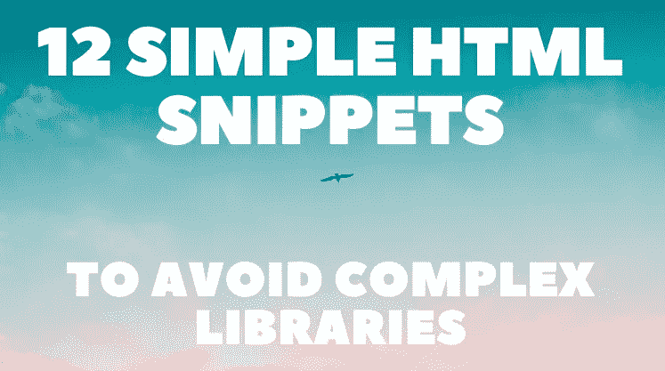

# 12 个简单的 HTML 代码片段，避免复杂的库⚡✨

> 原文：<https://javascript.plainenglish.io/12-simple-html-snippets-to-avoid-complex-libraries-7f2965087312?source=collection_archive---------6----------------------->

不了解基本技术有时会增加规模，影响性能，并给项目增加额外的复杂性。

这篇文章提醒你，如果你想让你的网页看起来漂亮，只需要普通的 HTML 和一点 CSS 就可以做很多事情。

我收集了一些最有用的 HTML 标签和属性，所以你可以研究它们，并在你的下一个项目中使用它们。

我还创建了 12 个单独的[代码笔](https://codepen.io/collection/mrbBrR?grid_type=grid)，因此您可以体验一下，并尝试一下这些示例。

## 🎨颜色选择器

通常，在开发人员的工作流程中，您可能希望访问色谱，并能够从中提取任何色调。

您可以使用`<input type="color">`，否则从头开始编写将是一项耗时的任务。

## 📚引用

写文章时，你可能想突出一些你最喜欢的引言。

您可以使用一个`<blockquote>`标签。添加一些自定义样式，你就有了一个很好的元素，它将从文本的其余部分中脱颖而出。

## 🎵音频播放器

从头开始编写自己的音频播放器可能是一个挑战。

您可以使用内置的`<audio>`标签，它提供了播放音频文件的基本功能。

## 📺影像播放机

你可以在项目中使用的另一种多媒体是视频。同样，你不能只是在 HTML 中包含视频链接，然后希望它能播放。

要正确播放视频，您可以使用内置的`<video>`标签。

## 🔷手风琴

有时您可能想要隐藏一些内容，并允许用户手动显示它(例如，为了节省视口的空间)。

多亏了`
`标签，你可以用纯 HTML 实现所描述的功能。

## 📅日期选择器

处理日期是开发人员搜索外部库的最常见原因之一。

HTML 提供了一个`<input type="date">`标签，它提供了一个很好的 UI，可以通过点击来选择日期。

## ⚪滑块

滑块是收集特定数值范围内的用户输入的常用组件。

您可以使用`<input type="range">`获得一个全功能的滑块，在这里您可以设置最小值、最大值和当前值。

## ✍内容编辑器

为了编辑内容，您不必使用输入或文本区域字段并为它们设置默认值。

相反，您可以使用`contenteditable`属性，例如，它允许编辑 div 的内容。

## 📷图片标签

您可能希望在不同的屏幕尺寸上显示不同的图像，以提高性能和 UI/UX。

你可以使用内置的`<picture>`标签，而不是使用默认的``标签来检测视口，并创建一个在图像间切换的方法。

## ⌛进度条

`<progress>`标签表示任务的完成进度。

您可以使用它来显示各种操作，如下载、文件传输或安装。

## 🔻下拉式

通常，您可能需要收集具有多种可能选择的用户输入。您可以将它们包含在下拉列表中，而不是在屏幕上列出所有选项。

使用`<datalist>`标签将允许用户从下拉列表中选择选项，同时也允许他们输入自己的值。

## 💭工具提示

如果你需要给出一个详细的描述，包含一个弹出窗口总是好的。

默认情况下，HTML 内置的`title`属性提供了这一点。

在本文中，我们回顾了在处理文本、音频、图像、视频等时可以使用的功能性 HTML 元素。

下次您需要相同的功能时，请确保仔细检查 HTML 本身是否已经提供了该功能。

写作一直是我的激情所在，帮助和激励他人给我带来了快乐。如果您有任何问题，请随时联系我们！

在 [Twitter](https://twitter.com/madzadev) 、 [LinkedIn](https://www.linkedin.com/in/madzadev/) 和 [GitHub](https://github.com/madzadev) 上连接我！

检查我的[投资组合](https://madza.dev/code)的所有项目。

*更多内容看* [***说白了. io***](http://plainenglish.io/)