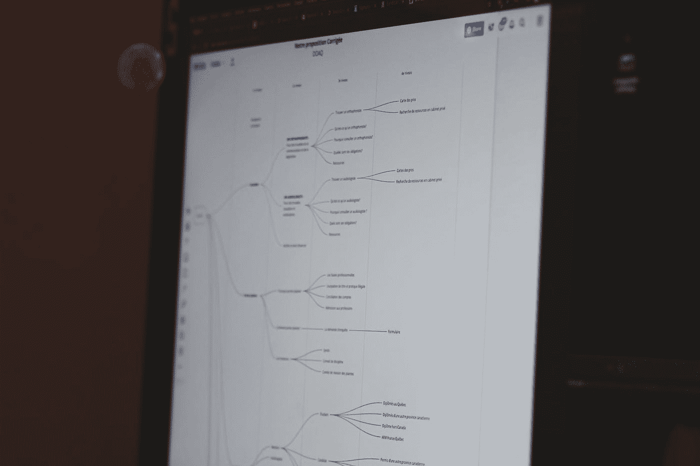

# 帮助你解决网站上出现的 UX 问题的 12 个工具

> 原文：<https://javascript.plainenglish.io/12-tools-that-will-help-you-solve-ux-problems-appearing-on-your-website-a5451eaf5804?source=collection_archive---------20----------------------->

## 因为可用性无非就是用户体验。

Photo by [Sigmund](https://unsplash.com/@sigmund?utm_source=medium&utm_medium=referral) on [Unsplash](https://unsplash.com?utm_source=medium&utm_medium=referral)

可用性无非就是用户体验。UX 无可争议的权威 Jakob Nielsen 指出了 UX 的构成。它是访问者浏览你的网站，找到他们需要的内容，并使用其功能的便利。但是，当然，同样重要的是使用网站的满意度，当然还有错误的数量。

不用说，良好的可用性也转化为跳出率——这是所有网站管理员都关心的问题。因此，除了好的内容营销，用户体验是成功的关键。下面我提出了一个工具列表，可以帮助你解决网站上出现的问题。

# 页面速度

可用性的第一个也是最重要的标准。人们认为，一个网站要想运行得快，必须在眨眼之间加载。这实际上是几分之一秒。如果你的网站需要 3-4 秒来显示所有的内容，你就有让用户泄气的风险。

*   [**gt metrix**](https://gtmetrix.com/)**——**这个免费工具帮助你定位网站减速元素。它允许你运行一次性测试，或者，如果你需要，创建一个帐户，并在保存的网页上下载每月报告。多亏了这些报告，您将知道代码、CSS 样式或图像的哪些部分有错误。
*   [**Google PageSpeed 工具**](https://developers.google.com/speed)**——**这个开发者工具有助于识别问题的根源，使网站更快、更适合移动设备。
*   [**Pingdom**](https://tools.pingdom.com/)**—**在线 URL 分析工具。把你的网址复制到 Pingdom，你会发现是什么原因导致页面停滞，以及消除什么来提高它的速度。

# 设计和导航

如果你不给读者接触的机会，即使是最好的内容也不会为自己辩护。这就是设计和导航应该帮助的——它们应该引导用户流畅地浏览页面内容。

如果你正在做一个大项目，使用卡片分类技术。然后，在网站启动之前，一组用户有机会以他们认为最有效和最直观的方式安排菜单选项。不要害怕使用他们的经验！

*   [**OptimalSort**](https://www.optimalworkshop.com/optimalsort/)**——**这是一个应用程序，你可以用它邀请用户自己安排你网站上的内容。OptimalSort 不是 OptimalWorkshop 提供的唯一工具。

# 互动

你是否一直很好奇你的用户的兴趣，他们在看什么，他们点击了什么？如果你明白什么抓住了他们的注意力，你将改善你的网站，从而提高你的 UX 质量。

*   **CrazyEgg —** 是什么拒绝了你的访客？页面的哪些部分最吸引人的注意？你可以在 CrazyEgg 上查看所有这些信息——每个计划在前 30 天都是免费的，最便宜的计划每月只需 9 美元。

# 登录页面

只要设计得当，这是最有效的转换工具之一。许多营销人员定期使用 A / B 测试，看看哪些准备好的版本更受欢迎，更有说服力。这也适用于可用性。一组工具将允许你显示一个带有可选标题、设计或布局的页面，看看哪个更有影响力。

*   [**谷歌内容实验**](https://support.google.com/analytics/answer/9366791?hl=en&visit_id=637608066657515862-2869294607&rd=1)**——**这个免费的开发者工具将帮助你用你的分析账户测试一个网站的多达五个不同版本。
*   [**Optimizely**](https://www.optimizely.com/)**——**这个程序不是免费的，但是 30 天，你可以加载一个页面，改变它的内容。Optimizely 的最大优势是它的易用性——几个按钮和几个点击，你的网站就改变了，并且……可以测试了。

# 有效性

为什么人们不用你的网站？是什么让他们迅速逃离现场？原因之一可能是技术本身。

*   [**BrowserShots**](https://browsershots.org/)**——**在多种设备和浏览器上测试你的网站是一项耗时的任务，但是 browser shots 稍微简化了它。这个网站将允许你在许多不同版本的浏览器上测试你的网站。立正！选择的浏览器越多，网站运行速度越慢，所以最好把重点放在选择的版本上。
*   [**W3C 标记验证器服务**](https://validator.w3.org/)**——**你的网站可能看起来不起眼，但它已经测试网站的 W3C 兼容性超过 20 年了。输入你的网址，你会得到一个快速压缩的 HTML 和 XHTML 错误报告。
*   [**检查我的颜色**](https://www.checkmycolours.com/)**——**你确定你的布局的配色方案同样用户友好吗？在这里，您可以测试对比度、亮度和色彩饱和度，以消除潜在的错误和干扰。

# 其他工具

最后，我展示了研究 UX 其他方面的工具。

*   [**usability hub**](https://usabilityhub.com/)**—**它是一组工具，包括五秒钟测试(针对设计)、点击测试(针对登陆页面)和转换测试。它们不是免费的，但是如果你选择帮助检查和评估其他网站，你可以免费测试你的网站。
*   [**Zurb**](https://zurb.com/)**——**这是一套可用性测试工具。就像 Spur 对“视觉”UX 测试有用一样，Zurb 会告诉你人们在访问你的站点后还记得什么(线索)或者你的项目的弱点是什么(Ax)。要使用 Zurb，你需要一个每月 20 美元的付费账户。

这些或类似的工具和测试 UX 的各个方面将帮助你提高网站用户体验的质量。反过来，更好的 UX 总是转化为你的网站的受欢迎程度，跳出率和满意的用户数量。

*更多内容请看*[***plain English . io***](http://plainenglish.io/)