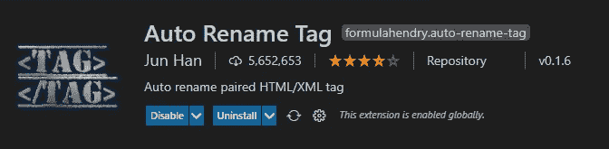
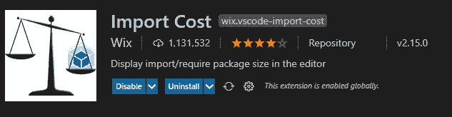
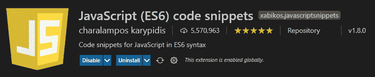
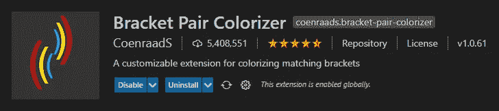
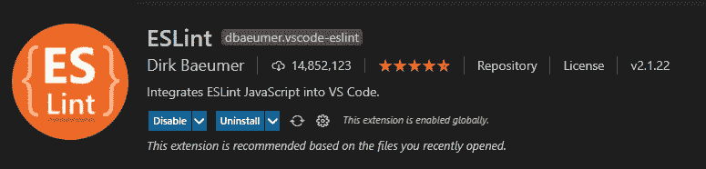
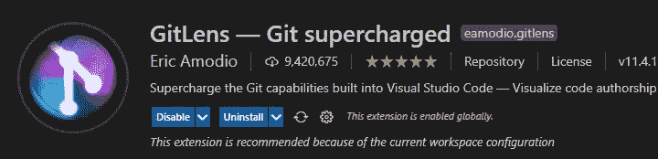
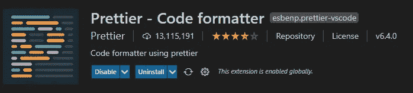
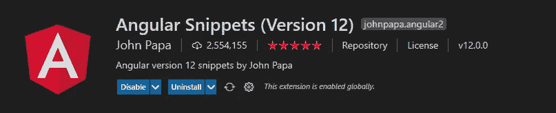

# 12 个有用的 VS 代码扩展，帮助简化 Web 开发

> 原文：<https://javascript.plainenglish.io/12-useful-vs-code-extensions-to-help-make-web-development-easier-6960680c56d4?source=collection_archive---------5----------------------->

## 提高开发人员的工作效率。

Photo By [**Paulius Andriekus**](https://unsplash.com/@paulando14)

扩展在 SWE 的生命周期中扮演着非常重要的角色。它们非常有助于通过自动化任务和使 VS 代码更强大来节省时间。但是拥有太多的扩展会降低机器的性能，所以这里列出了我个人使用和推荐的扩展。

## 1.ChakrounAnas 的涡轮控制台日志

这是我最喜欢的扩展之一。这个方便的小工具可以自动编写有意义的日志消息，这使得调试更加容易。

只需选择你想记录的变量，按下“Ctrl+Alt+l”和 boom，它会为你产生日志信息。

## 2.Steoates 汽车进口

在从事基于 typescript 的项目时，我非常依赖这个扩展。当创建一个需要从另一个文件导入的新组件或模块时，例如函数、类、变量，它会自动为您导入它们以节省时间。

## 3.韩军自动重命名标签

如果重命名了开始标记，该扩展有助于自动重命名结束标记。《出埃及记》假设你想将`<h1>Hello</h1>`改为`<h3>Hello</h3>`，然后简单地将`<h1>`重命名为`<h3>`，这个扩展将完成它的收尾工作。

## 4.Wix 的导入成本

这个扩展将向您显示导入的第三方库的大小，这有助于了解您导入的依赖项的成本。

## 5.Charalampos Karypidis 的 JavaScript (ES6)代码片段

最受欢迎的 JavaScript 代码片段扩展之一，至今已有超过 500 万次安装。它为 JavaScript、TypeScript、React、Vue 和 HTML 提供了 ES6 语法。

## 6.科恩拉德公司的括号对着色机

这个扩展允许匹配的括号用颜色识别，并用线条连接它们。这在处理嵌套括号时节省了大量时间。

## 7.自然重装

这个扩展将在 VS 代码编辑器右下角的状态栏中添加 reload 按钮。这是一个简单的扩展，当你有困难或者你想让编辑器生效时，可以快速重新加载你的窗口。

## 8.德克·鲍默的《埃斯林特》

通过分析您的代码中常见的错误类型并识别有问题的模式，这个扩展可以帮助您保持良好的代码卫生。

## 9.Git lens——Eric Amodio 为 Git 增压

VS 代码中最有用的扩展之一。它可以帮助你在一个特定的文件中显示不同时间的差异，这对追溯你的代码很有用。它还显示了隐藏的变化，标签等。我一定会把这个扩展推荐给每一个开发者。

## 10.吉拉和比特巴克特(官方)

如果您的项目使用 Atlassian 产品，那么这是一个必备的扩展，它能够直接从 VS 代码中创建和查看吉拉问题或拉请求。它还提供了许多其他功能，如开始构建、获取构建状态、进行代码审查等等。

## 11.Ritwick Dey 的实时服务器

在为 web 开发时，每当您进行更改时，Live server 都会刷新您的浏览器。这非常有用，因为我们不再需要手动刷新页面，这有点烦人。

## 12.更漂亮——更漂亮的代码格式化程序

与 ESLint/TSLint 结合使用，Prettier 是一个非常方便的工具。它会自动格式化你的文件，使你的代码更具可读性。

## 奖金

## 13.约翰爸爸的棱角分明的片段。

代码片段扩展有助于您不用花太多时间编写样板文件。这个扩展增加了 Angular，TypeScript 和 HTML 的代码片段。

## 结论

我希望这些扩展能帮助你节省时间，提高效率。请做评论，如果你知道其他一些很酷的扩展。感谢您的阅读。

*更多内容看*[***plain English . io***](http://plainenglish.io)