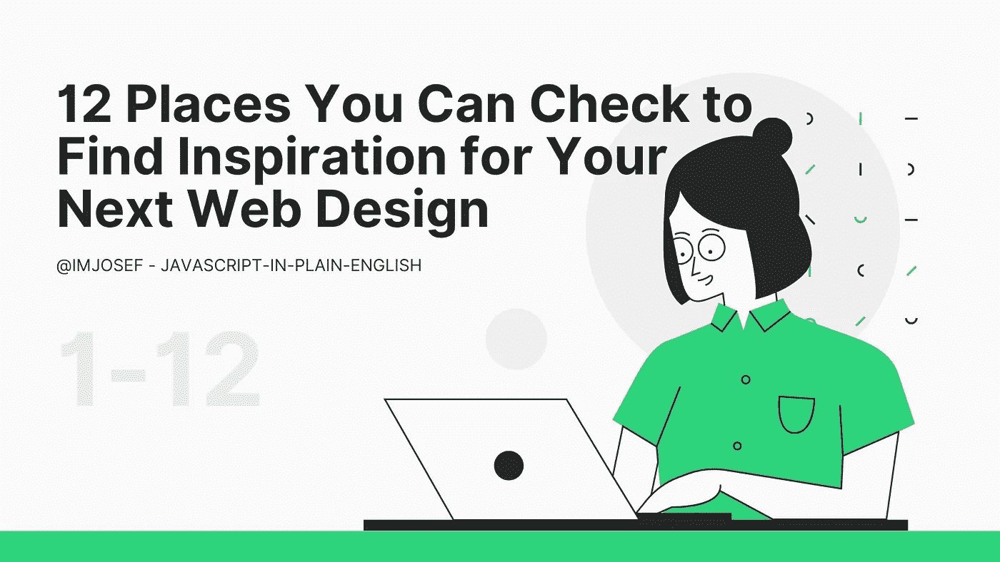

# 你可以查看 12 个网站，为你的下一个网页设计寻找灵感

> 原文：<https://javascript.plainenglish.io/12-websites-you-can-check-to-find-inspiration-for-your-next-web-design-8f7f8ab36b4e?source=collection_archive---------5----------------------->

## 无需雇佣设计师就可以复制的设计。

Photo supplied by the author

我做了几个网站，已经记不清了，但不幸的是，尽管我为网页设计项目做网页设计，但没有一个是杰出的或一流的。

网页设计伴随着许多网站设计者内心遵循的方程式。你不能仅仅设计一个网站而不掌握这些方程式，并期望你的设计满足你所有的期望。

要快速启动你的网页设计项目，你可以查看网页设计师精心挑选的不同网页设计范例。

## 1.[Webdesign-inspiration.com](http://Webdesign-inspiration.com)

如果你正在寻找不同行业中关于网页标准的顶级网页设计。它们还提供可以集成到 WooCommerce、Shopify、OpenCart 和 VirtueMart 等电子商务平台的主题。

## 2. [Lapa.ninja](http://Lapa.ninja)

如果你只是在寻找电子商务，投资组合，应用程序，代理设计的设计灵感，帕拉忍者向你展示了最佳的网页设计灵感。

## 3. [Pttrns](http://Pttrns)

这个网站展示了从计算器、浏览器等移动设计的所有部分的移动设计模式。，这是各地产品建造者最好的设计资源、界面模式和灵感。

## 4. [Onepagelove](http://Onepagelove)

这是完美的人谁只想要一个网页设计网站。这个网站的特点是所有不同行业的优秀单页网站模板。

## 5.[Collectui.com](http://Collectui.com)

如果你正在寻找个人、商业或信息用途的顶级 UI 设计网站，这是你的首选资源，因为它们每天都有不同的设计。你可以从 404 到结帐页面找到模板。

## 6. [Bestwebsite.gallery](http://Bestwebsite.gallery)

这是一个名叫大卫·赫尔曼的平面设计师/开发人员的个人收藏。这个网站从 2008 年开始，一直在网上收集漂亮的网站。

## 7.[Screenlane.com](http://Screenlane.com)

这是一个网站和时事通讯，以最新的网络和移动设计灵感为特色。这个网站不仅有网页设计，还有手机设计灵感。

## 8.[Landingfolio.com](http://Landingfolio.com)

他们在网上展示了最好的登陆页面灵感、模板、资源和例子。从每天更新的 1，982 个登录页面设计和 3，829 个组件示例中学习。

## 9.[Saaslandingpage.com](http://Saaslandingpage.com)

如果你有兴趣看看顶尖的软件即服务公司在他们的网站设计上做了什么，这个网站提供了网络上最好的设计，所以你可以为你的下一个设计项目获得想法和灵感。

## 10. [Ecomm.design](http://Ecomm.design)

网站名称说明了一切。这个网站以电子商务网站为特色，他们可以在网上找到奇妙的设计灵感。他们的网站使用不同的平台，如 Shopify、Magneto、WooCommerce 等等。

## 11.【Land-book.com 

如果你只是在寻找你下一个设计项目所需的网页设计灵感，你可以依靠这个网站，因为他们的目标是收集令人敬畏的网站，帮助创意人员找到灵感和动力来做 rad 的东西。

## 12.[Siteinspire.com](http://Siteinspire.com)

这个网站做了大量的工作来寻找有创意和独特的，但在网上可用的互动网站。他们每周都会添加新的网站，所以你总能发现一些你可能认为不存在的新的网页设计。

## 结论

我希望你能从我为你列出的这 12 个网站中找到新的灵感来设计你的下一个网页。