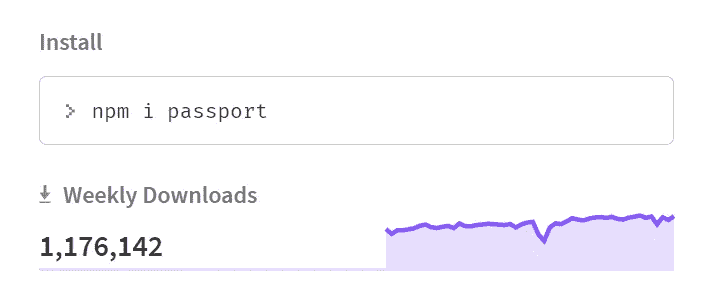
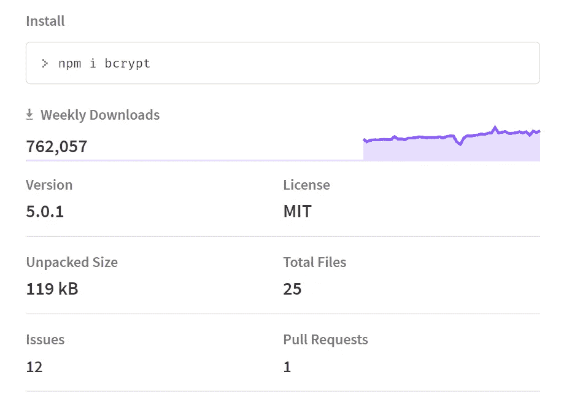
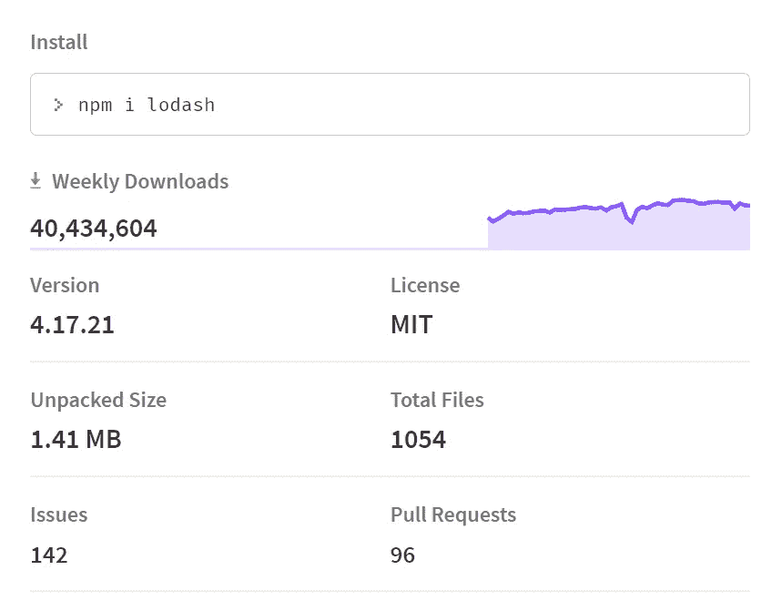
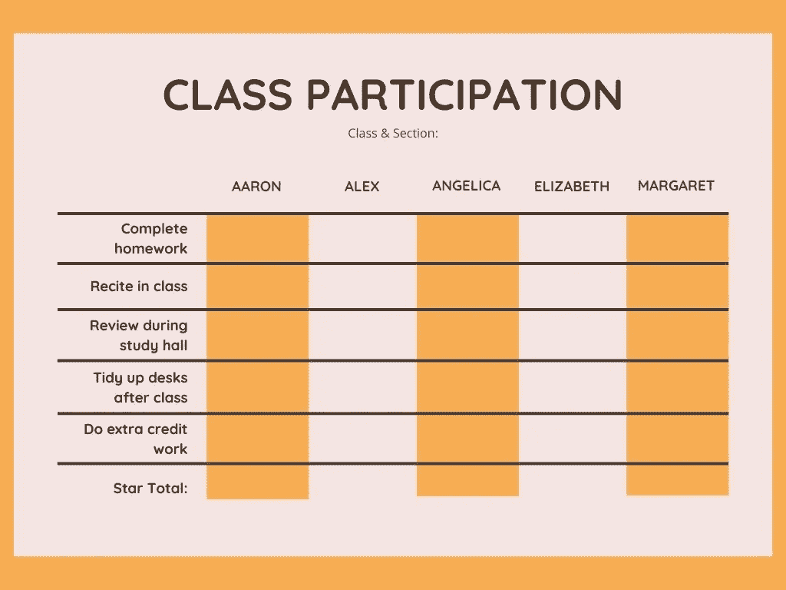
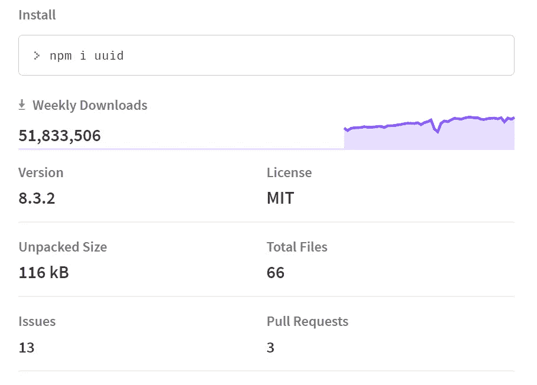
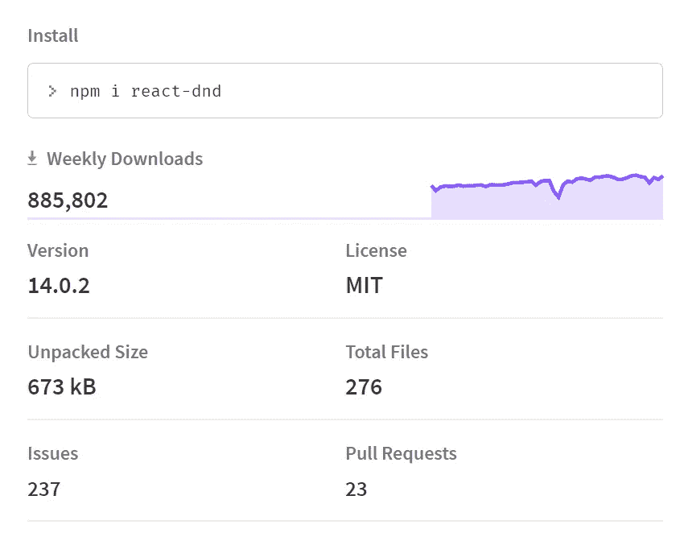
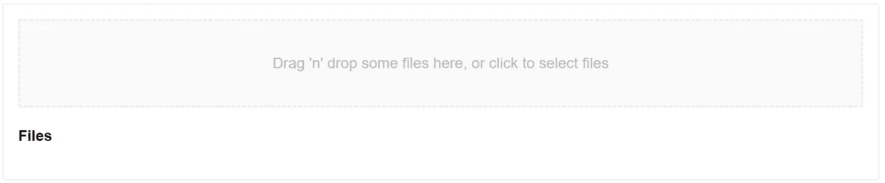
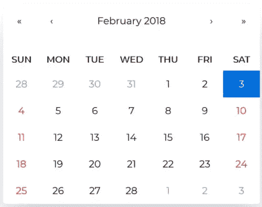
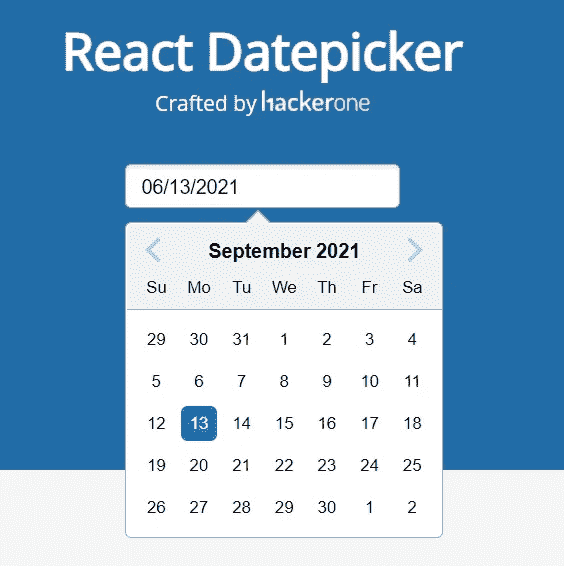
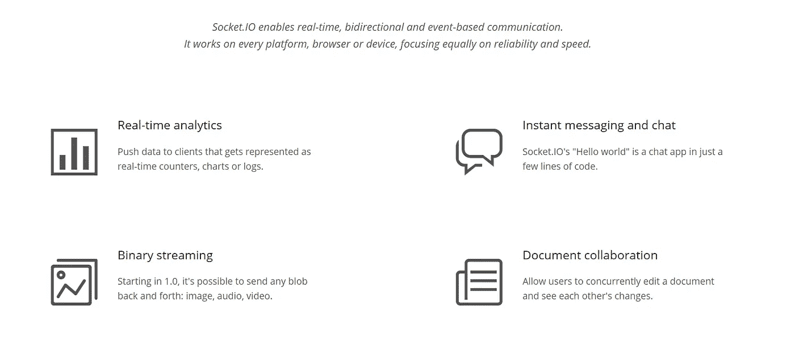

# 13 个免费 NPM 套餐帮助我赚取了 1500 美元的利润

> 原文：<https://javascript.plainenglish.io/13-free-npm-packages-that-helped-me-to-earn-a-1500-profit-ddab299bdd37?source=collection_archive---------9----------------------->

## 这些肯定会提高你的收入和生产力。

Photo by [Alexander Mils](https://unsplash.com/@alexandermils?utm_source=medium&utm_medium=referral) on [Unsplash](https://unsplash.com?utm_source=medium&utm_medium=referral)

昨天，我计算了一下我上个月的收入，我的主要收入来源之一是 1497 美元。

让我给一些更多的细节，我已经与三个客户合作，为他们创建网站。简单来说，我必须为我的两个客户从头开始创建网站，而对于另一个客户，我必须重新设计网站。

他们总共付给我 1497 美元。

很简单。

对于所有这一切，我必须管理好我的时间，在更短的时间内给出结果。

帮助我的一个主要因素是免费的 NPM 套餐。

是的，我还必须学习状态管理工具，如 Redux 和 [Easy Peasy](https://betterprogramming.pub/stop-using-redux-consider-easy-peasy-if-you-want-3214c41bcce5) (也反应上下文)，使用 Axios 的[API](/display-api-data-using-axios-in-a-react-app-with-hooks-eb9ca298f27)，聊天机器人的[Tiledesk](/dont-spend-dollars-to-build-chatbots-use-tiledesk-instead-12ef7b1d812c)等等。

但是 NPM 软件包帮了我很多，在这里我也将与你分享。他们绝对值得你花时间。

嗯，我想你们大多数人都知道 Axios，所以它不会在列表中。这里大部分包都是 React 的，因为我只用 React 来创建一个网站。

我们开始吧。

# 1.Dotenv

Photo by [Dan Nelson](https://unsplash.com/@danny144?utm_source=medium&utm_medium=referral) on [Unsplash](https://unsplash.com?utm_source=medium&utm_medium=referral)

是的，我知道这很常见，但许多初学者并不知道，他们分享他们的关键细节，甚至将他们的 AWS 密钥发送到 GitHub。

因此，Dotenv 会帮助你。

> 根据 [Dotenv 官方文档](https://www.npmjs.com/package/dotenv)，Dotenv 是一个零依赖模块，将环境变量从`*.env*`文件加载到`*process.env*`中。将配置存储在独立于代码的环境中是基于十二因素应用程序方法的。

简单来说，你可以在根目录下创建一个`.env`文件，并将你的关键细节写入其中。在那之后，你可以很容易地加载你的详细资料。

# 2.护照

几家顶级公司遭到黑客攻击，而且数量还在增加。所以对于你的网站来说，安全必须是你必须处理的关键因素。

为此，你可以使用[护照](https://www.npmjs.com/package/passport)。

# 3.Bcrypt

Src: NPM

另一个很棒的 NPM 库是 Bcrypt。

# 4.洛达什

Source: NPM

根据官方文档，Lodash 通过消除处理数组、数字、对象、字符串等的麻烦，使 JavaScript 变得更加简单。Lodash 的模块化方法非常适合:

*   迭代数组、对象和字符串
*   操纵和测试值
*   创建复合函数

简单来说，假设你正在创建一个博客网站。在其中，你希望当用户点击博客帖子的卡片时，它必须在不同的页面中呈现，并且 URL 具有小写的博客帖子名称。

对于 URL 部分，可以使用 Lodash。

# 5.反应表

Source: [Canva](https://www.canva.com/)

每个 Web 开发人员都从 HTML、CSS 和 JavaScript 开始。之后，他/她学习[不同的](/why-how-you-should-learn-web-development-in-todays-world-d0fdf9f7bf66)语言。但是我们每个人至少尝试过使用 HTML 和 CSS 创建一个表格。

毫无疑问，它工作得很好。但是，如果您需要从 API 中[获取数据或者添加过滤、排序甚至分页，该怎么办呢？](/display-api-data-using-axios-in-a-react-app-with-hooks-eb9ca298f27)

你会怎么做？

为此，您可以使用[反应表](https://www.npmjs.com/package/react-table)。

根据[官方文档](https://react-table.tanstack.com/)，React table 的一些特性是:

*   轻量级(5kb — 14kb+取决于使用的功能和树摇动)
*   无头(100%可定制，自带用户界面)
*   自动开箱即用、完全可控的 API
*   排序(多且稳定)
*   过滤
*   旋转和聚集
*   行选择
*   行扩展
*   列排序
*   可制作动画
*   可虚拟化
*   可调整大小的
*   服务器端/受控数据/状态
*   可通过基于钩子的插件系统扩展

# 6.UUID

Source: NPM

有时，您需要为您的数据生成一个唯一的随机 ID。你不会真的为成吨的数据设置 ID，所以你可以为此使用 [UUID](https://www.npmjs.com/package/uuid) 。

我被这个包每天的下载量震惊了。

# 7.反应 DnD

Src: NPM

假设您想要一个拖放部分到您的网站。

你会怎么做？使用 [React Dnd](https://www.npmjs.com/package/react-dnd) 构建简单和复杂的拖放界面。

# 8.反应下降区

Src: Official website

你在一些网站上看到过，他们接受用户的输入来上传他们的图片或视频。

现在假设你想把你的图片放到你的网站上，或者想让用户把他们的图片上传到你的网站上。

为此，您可以使用 [React Dropzone](https://www.npmjs.com/package/react-dropzone) 。

# 9.反应日历

Src: NPM

如果你想在你的网站上放一个日历呢？通过 HTML、CSS 和 JavaScript 创建它。

不，我在开玩笑。只需使用 [React 日历 NPM 包](https://www.npmjs.com/package/react-calendar)即可。

# 10.反应日期选择器

Src: [Official Website](https://reactdatepicker.com/)

但是 Nitin，如果我只想要一个日期选择器呢？

为此，你可以使用[反应日期选择器](https://www.npmjs.com/package/react-datepicker)。

# 11.对僵硬的反应

Photo by [Jamie Street](https://unsplash.com/@jamie452?utm_source=medium&utm_medium=referral) on [Unsplash](https://unsplash.com?utm_source=medium&utm_medium=referral)

迟早，如果你想在你的网站上添加通知，你可以使用[React to stify](https://www.npmjs.com/package/react-toastify)来实现。

这里的是官方文档。

# 12.Socket.io

Src: [Official documentation](https://socket.io/)

我喜欢这个包，你也会喜欢的。我们在日常生活中都使用消息应用。

但我们是开发者，我们开发这样的消息应用。

好吧，但是怎么做？使用 Socket.io

Socket.io 使用户只需编写几行代码就能进行双向交流。

# 13.redux & Easy-peas

你还需要对你的网站进行状态管理，为此，有多种选择。

比如可以用 [React Context](https://reactjs.org/docs/context.html) ，Redux，Easy Peasy。还有其他的第三方软件包，但是我没有用过，所以我不能写出来。

要学习 Redux 你可以访问[官方文档](https://redux.js.org/)。

为了简单起见，你可以访问[这里](https://easy-peasy.dev/)，你也可以阅读这个——[停止使用 Redux——如果你想要](https://betterprogramming.pub/stop-using-redux-consider-easy-peasy-if-you-want-3214c41bcce5)就考虑简单。

# 让我们结束吧

所以我想，我已经介绍了我用过的最有用的 NPM 软件包。

如果你知道其他帮助你的 NPM 软件包，你可以在这里评论，我一定会把它们添加到列表中。

就这样——谢谢。

 [## 2021 年为网页设计师和网页开发者提供 80+免费资源。

### 成为网页开发者的完整指南。

javascript.plainenglish.io](/80-free-resources-for-web-designers-and-web-developers-in-2021-f400be2875ea)  [## 如何利用免费资源学习 Web 开发

### 初学者的深入指南。

javascript.plainenglish.io](/how-to-learn-web-development-using-free-resources-1c677e70de14)  [## 为什么&如何在当今世界学习 Web 开发

### 一个完整的指南，以消除你的疑虑，让你开始为世界的网页开发

javascript.plainenglish.io](/why-how-you-should-learn-web-development-in-todays-world-d0fdf9f7bf66) 

*更多内容请看*[*plain English . io*](http://plainenglish.io/)