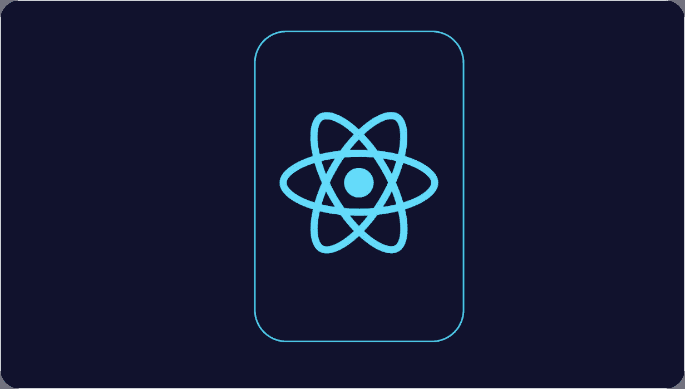
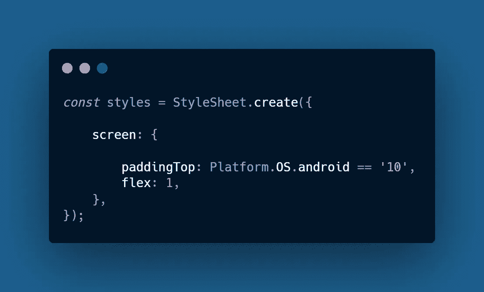

# React 母语面试中需要准备的 13 个问题

> 原文：<https://javascript.plainenglish.io/13-questions-you-must-prepare-for-your-react-native-interview-b38757d67af7?source=collection_archive---------6----------------------->

## 深入了解高级反应原生生物

## 1.为什么平面列表比滚动视图好？

在 **React Native** 中， **FlatList** 组件可以显示一个很长的数据列表，就像我们在新闻应用程序中一样，主摘要显示在主页上的卡片中，这些卡片是使用 **FlatList 组件实现的。**

众所周知，平面列表可以处理很长的数据列表，其中条目的数量可能会随着时间的推移而变化，它只呈现当前在屏幕上可见的元素，而不是一次呈现所有元素。 **FlatList** 在性能方面比 **ScrollView** 有更大提升，而且当用户开始滚动页面时，FlatList 会在运行时创建一个卡片。

## 2.React Native 中的高阶组件是什么？

因为我们在 **JavaScript** 中对高阶函数有很多好处，所以在 React Native 中也是如此。组件也是函数，在 React 生态系统中称为组件，而 HOC 只是将组件作为参数或返回另一个组件的组件，这是 React Native 中呈现组件的一种灵活方式。他们的输出完全基于我们提供的输入值。

***比如*****Redux**中的 connect 函数也是一个**高阶组件，**它以***mapStateToProps***和***mapdispatctoprops***为参数，返回一个可以访问 ***redix*** 存储的新组件。

## 3.React Native 中渲染道具模式是什么？

将函数作为道具传递被称为渲染道具模式，它指的是使用其值为函数的道具在 React 组件之间共享代码的技术。具有呈现属性的组件采用返回 React 元素并调用它的函数，而不是实现自己的呈现逻辑。

***比如*** 调用 prop 函数和 return 元素的子组件会被父组件插入。使用这种模式，子组件可以很容易地修改父组件，而无需处理 ***引用*** 。

## 4.React 本机组件中的键是什么？

当我们被要求遍历一个数组来创建一个组件列表时，如果我们没有为 key 属性提供新元素，那么当 key 没有被分配给元素时，React 就会抛出一个错误。在 React Native 中，如果我们必须用相应的数据标识唯一的虚拟元素，这些键就会起作用。

这些键必须是唯一的**数字**或**字符串**，使用这些键，React 只需对元素重新排序，而不是重新渲染它们，这将通过减少元素的数量来提高应用程序的性能。

## 5.我们如何在一个大而可扩展的反应本地应用程序中管理状态？

我们遵循**组件驱动的**开发，这意味着我们编写几个**有状态的**或**无状态的**可重用组件，然后将它们组合起来构建整个应用程序，随着应用程序变得越来越大，有时会有一个组件想要访问任何其他组件的状态。但是这种方法只在特定的规模水平上有效。

如果我们真的想变得更大，那么 ***Redux*** 会开始工作，它提供了一个保存**应用级**状态的存储区，我们可以编写这些动作和 reduce 来模拟存储区中的状态。任何组件都可以通过 **Redux 的 ad HOC**与商店连接，任何组件都可以发出一个到达减速器的动作，并更新商店中的状态。

## 6.我们如何使用 Axios 进行本地反应？

使用 Axios，我们可以向 **REST API** 发送 **GET、POST、PUT** & **DELETE** 请求并对应用程序做出响应，这是一个基于承诺的 **HTTP** 客户端，使得在 React Native 中获取任务变得容易。

***Axios 的某些特征:***

*   支持反应本地应用编程接口
*   提供客户端功能，保护应用程序免受 **XSRF** 的攻击
*   自动转换响应和请求数据

## 7.什么是 React Native 中的受控和非受控成分？

**对照品:**

*   值的边界及其内部的更改将在代码中通过使用基于事件的回调来处理。
*   并不能维持它的内部状态
*   接受当前值作为道具

**非受控成分:**

*   类似于 **HTML** 输入，但是数据是由 DOM 本身处理的
*   保持内部状态。
*   参考用于其当前值

## 8.我们如何在 React Native 中创建 SQLite 数据库？

*   在项目文件夹中创建一个空目录
*   创建数据库文件
*   将创建的文件添加到项目中
*   选择要添加的文件
*   验证项目的结构

## 9.什么是反应原生中的织物？

Fabric 是 React Native 的最新架构，由该公司提出，旨在开发比原生应用更接近、更好的移动应用用户体验。

## 10.Native 如何处理不同的屏幕大小？

*   **Flexbox:** 使用 3 个主要属性: **flexDirection、justifyContent、alignItems，在不同的屏幕尺寸上提供一致的布局。**
*   **像素比:**使用这个属性，我们可以通过 **PixelRatio** 类访问像素密度，如果我们在一个高像素密度设备上，它通过提供更高分辨率的图像来工作。
*   **aspectation:**用于设置高度，反之亦然，该属性只在 React Native 中出现，在标准 **CSS** 中没有。

## 11.如何在 React Native 中编写特定于平台的代码？

React Native 提供了一个**平台**模块，用于检测应用运行的平台。我们可以很容易地检测到 Android**&**iOS**来编写跨平台的代码，这些代码可以在两种设备上无误地运行。**

****

## **12.React Native 中的 Watchman 是什么？**

**由*脸书*开发的一个开源项目，监视文件&跟踪文件的变化。React Native 使用它来提供 react-native 中的热重载特性。此外，它有助于开发人员更快地构建应用程序，如果开发人员在项目文件中进行了任何更改，watchman 将检测到该更改并调用构建来自动反映这些更改，而无需任何干预。**

## **13.React Native 中的瑜伽是什么？**

**一个跨平台的布局引擎，它释放了一些激动人心的特性，如脱离主线程计算布局，以帮助确保流畅的 UI 性能。在 React Native 中，shadow 线程为您在 JS 线程中编写的布局构建一棵树。在这个影子线程中，React Native 使用布局引擎 Yoga，它将基于 **flexbox 的**布局转换成一个布局系统，以便本地主机可以轻松理解。**

** [## 掌握 Git 命令行

### 像专家一样使用 Git 版本控制系统

medium.com](https://medium.com/javascript-in-plain-english/mastering-the-git-command-line-b2c6efe4f4ad)** ** [## 8 个开源的 React 本地项目

### CRUD 应用程序、音乐播放器等

medium.com](https://medium.com/javascript-in-plain-english/8-open-source-react-native-projects-to-check-out-1940bb4cc466)**