# 每个开发者都必须使用的 13 个 Sublime Text 3 插件

> 原文：<https://javascript.plainenglish.io/13-sublime-text-3-plugins-that-every-developer-must-use-a9b839ceae6b?source=collection_archive---------9----------------------->

## 崇高文本 3 插件

## 崇高文本 3 是最受欢迎的免费 ide 之一。这些是可能对你有用的最常见的插件。

Photo by [Mika Baumeister](https://unsplash.com/@mbaumi?utm_source=unsplash&utm_medium=referral&utm_content=creditCopyText) on [Unsplash](https://unsplash.com/s/photos/sublime-text?utm_source=unsplash&utm_medium=referral&utm_content=creditCopyText)

Sublime Text 3 是编写代码最流行的免费 ide 之一。你可以用它来打开文件。txt 等等)，也适用于使用 Python 和 Web-dev 的小型项目。早些时候，我写过一篇关于 [VSCode 扩展](/13-vscode-extensions-that-every-web-developer-must-use-d86fe3798f76)的文章。然而，如果你更喜欢使用 Sublime Text 3 而不是 VSCode，那么这 13 个插件的编译正是为你准备的。

我认为这些是每个开发人员(不管你是谁——全栈开发人员还是数据科学家)都应该使用的最常见和最伟大的 Sublime Text 3 插件。

## 1.包装控制

刚安装 Sublime Text 3 的时候，要马上安装 [**包控**](https://packagecontrol.io/packages/Package%20Control) 插件。这是最基本的插件，可以让你轻松地安装、删除、编辑其他插件，没有任何问题。正如我前面所说，安装这个插件后，你不必再这样做了。

*   使用命令*ctrl+shift+p*(Windows 或 Linux)或*cmd+shift+p*(Mac)。
*   键入" *Install-Package Control* "并按回车键。

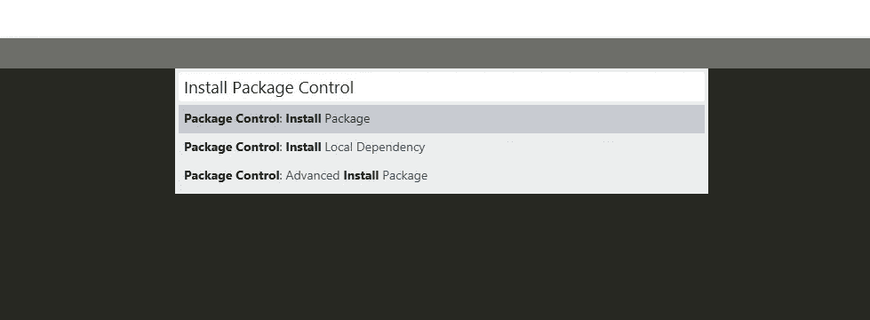

## 2.蚂蚁

这个插件是第二受欢迎的，也是最有用的插件之一。[**Emmet**](https://packagecontrol.io/packages/Emmet)**帮你少写很多。它允许您使用缩写词，这些缩写词可以自动压缩成功能完整的代码。**

**您将需要使用我们前面提到的包控制。再次写入“*安装包控制*”，然后写入*“Emmet”*并按回车键。**

**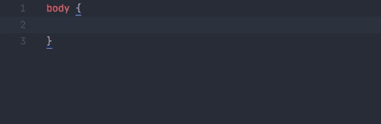****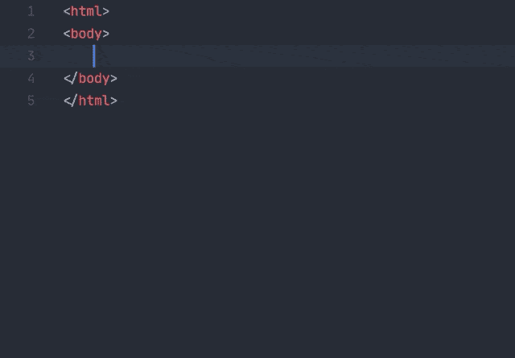**

## **3.对齐**

**[对齐](https://packagecontrol.io/packages/Alignment)是一个用于对齐多个部分或多行部分的有用工具，这意味着您可以通过=等分隔符对齐多个选择或行。只需在 Windows 上键入 *ctrl + alt + a* ，或者在 Mac 上键入 *cmd + ctrl + a* 。并再次使用“*安装-软件包控制*命令进行安装。**

**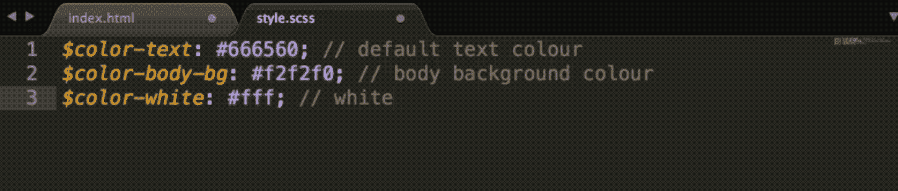**

## **4.饭桶**

**这个插件将 [Git](https://packagecontrol.io/packages/Git) 带入了 Sublime Text 3，所以你不需要在命令行和你的文本编辑器之间来回切换。要快速开始，安装插件并使用命令面板启动 Git 命令**

**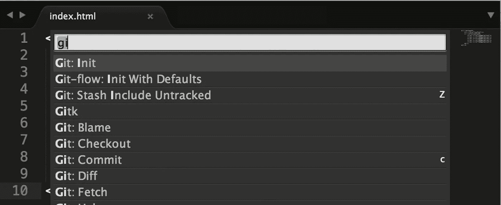**

## **5.JSHint**

**JSHint 是一个非常好的插件，没有它我无法正常编写 JavaScript 代码。您可能已经注意到，它对您的 JavaScript 代码有所帮助，特别是它显示了您在哪里犯了错误，并建议您如何修复它。**

**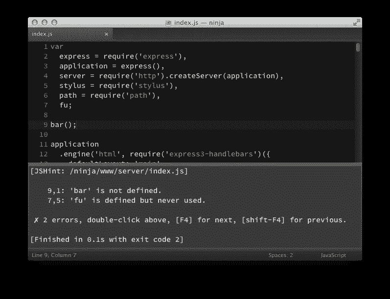**

## **6.颜色选择器**

**这是 Sublime Text 3 的一个非常好的插件，因为它给你的 CSS 代码添加了一个颜色面板。要打开颜色选择器，只需在 Mac 上键入 *cmd+shift+c* ，或者在 Windows 或 Linux 上键入 *ctrl+shift+c* 。**

**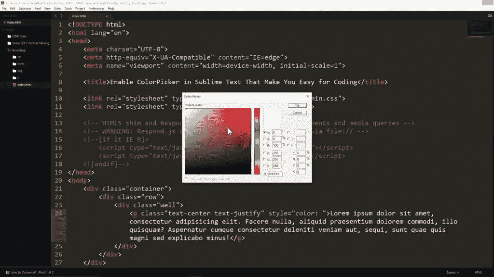**

## **7.末端的**

**[终端](https://packagecontrol.io/packages/Terminal)插件让你直接从 Sublime Text 3 打开终端中的项目文件夹——带有热键。当你需要在给定的文件夹中执行命令行时，这是一个非常有用的插件。**

**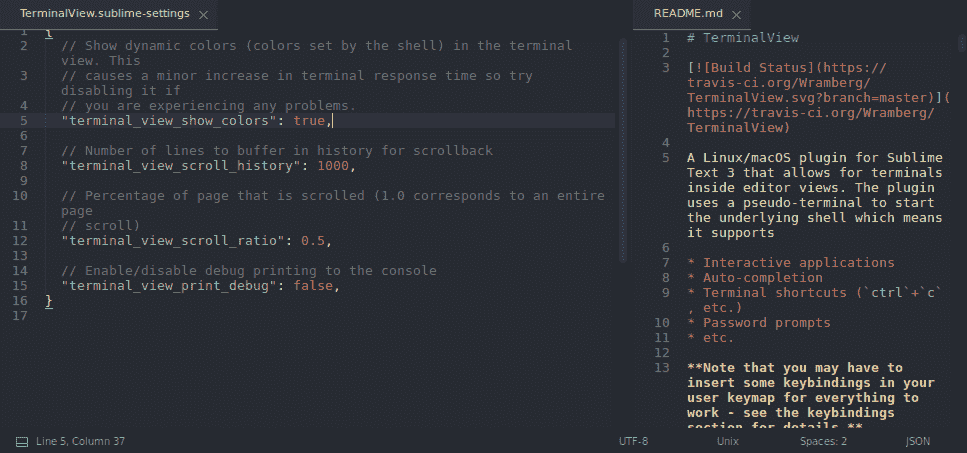**

## **8.托架打火机**

**当你处理大量的括号时，找到正确的括号是非常困难和痛苦的。[括号高亮显示](https://packagecontrol.io/packages/BracketHighlighter)下划线并高亮显示所有括号。**

**BracketHighlighter 匹配多种支架如:`[]`、`()`、`{}`、`""`、`''`、`<tag></tag>`，甚至自定义支架。**

**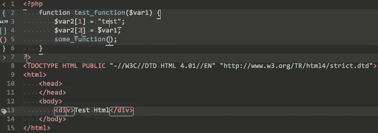**

## **9.肝负荷**

**一个对大多数网络开发者来说很小但很必要的插件是 [LiveReload](https://packagecontrol.io/packages/LiveReload) 。每次你对一个文件做了微小的改变，而不是必须刷新你的浏览器才能看到结果，LiveReload 将简单地与你选择的浏览器同步，并立即显示更新的结果。**

## **10.自动命名**

**自动命名插件自动完成文件名。它会触发一个下拉列表，其中包含与现有文件相关的文件名以及您键入的后续路径。例如，当你想为你的 HTML 标签中的 url 属性写点什么的时候，它会建议你的文件夹中的文件名。**

**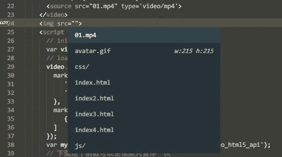**

## **11.侧边栏增强**

**sidebareenhancements 插件为你的 Sublime Text 3 增加了一个新窗口，你可以在这里轻松管理你的文件夹。此外，它提供了删除选项，如“移动到垃圾桶”，包括一个“打开方式…”，让您能够移动文件等等。**

**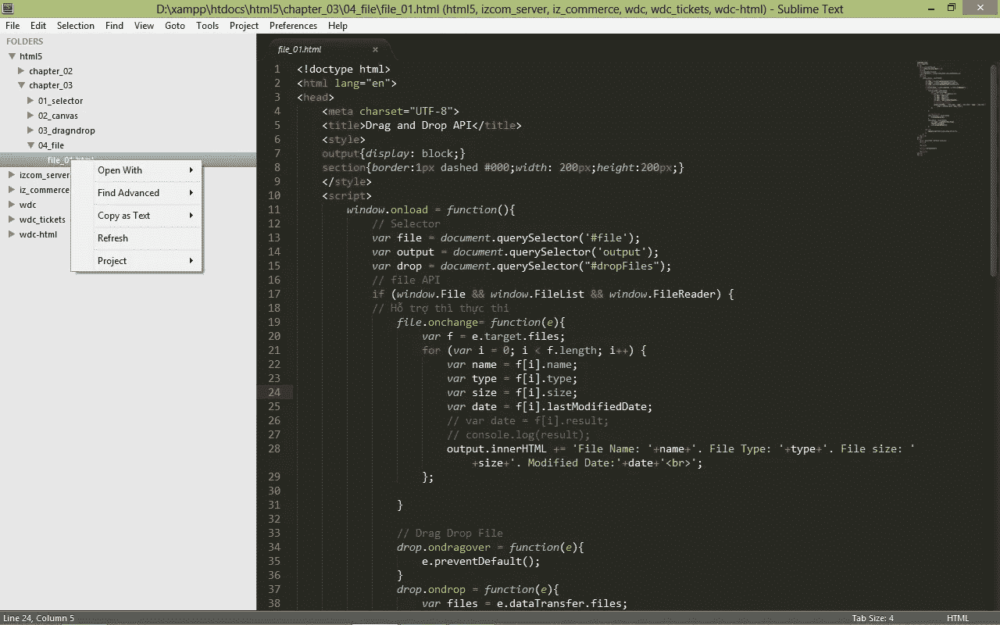**

## **12.文件图标**

**这个[插件](https://packagecontrol.io/packages/A%20File%20Icon)可以很容易地扫描你项目中的文件。它只是在你的项目边栏中为支持的文件添加漂亮的可定制图标。**

**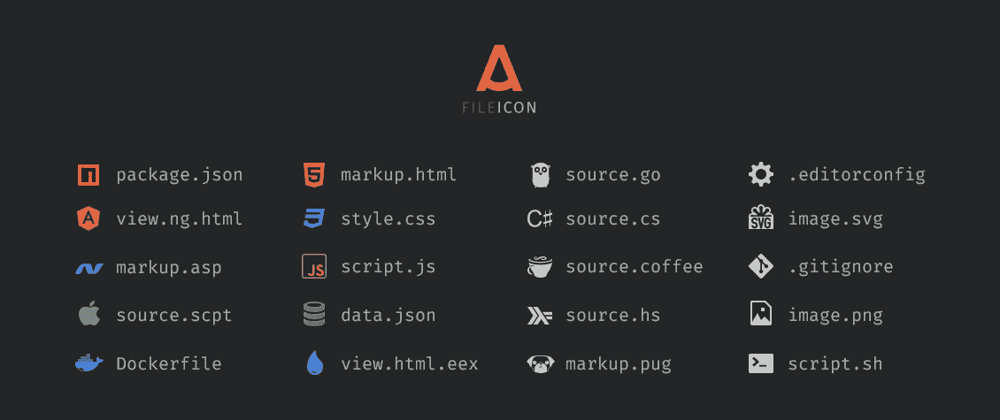**

## **13.主题—一片黑暗**

**今天最后一个插件是[【一片黑暗】](https://packagecontrol.io/packages/Theme%20-%20One%20Dark)，这是崇高文本的一个主题。这个插件没有任何功能，但是增加了一个非常漂亮的界面，你可以用它在一个更漂亮的环境中编码。**

**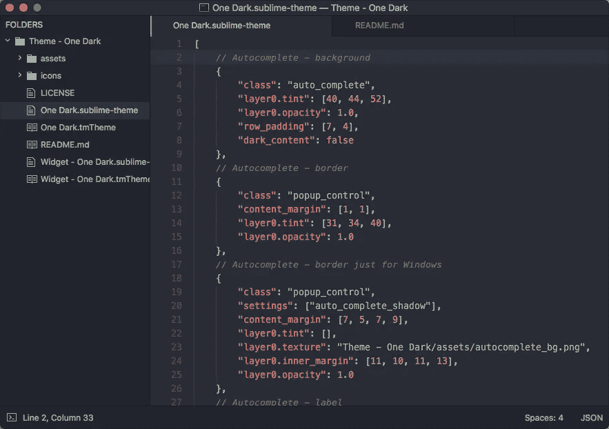**

## **结论**

**这些是 Sublime Text 3——最流行的 ide 之一——最常见和最有用的插件。我希望你喜欢这篇文章。如果你想要更多这样的文章，请在评论中告诉我。**

***更多内容请看*[*plain English . io*](http://plainenglish.io/)**