# 我用来制作悬停动画的 14 个很酷的 JavaScript 和 CSS 库

> 原文：<https://javascript.plainenglish.io/14-cool-javascript-and-css-libraries-that-i-use-for-hover-animations-7ce18d8bff9?source=collection_archive---------5----------------------->

## 用简单的悬停动画让你的网站看起来令人惊叹。

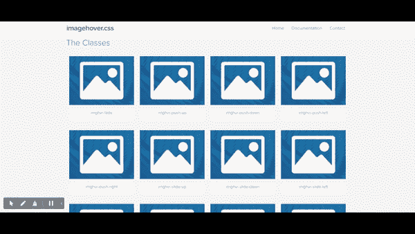

Gif provided by the author.

作为一名互联网用户，我总是惊讶地看到网站在图像、边框、背景甚至文本上有令人惊叹的动画效果。不管我看多少次，我都看不够。

作为一名 web 开发人员，我发现看到我工作的网站充满了很酷的悬停效果是一种自我实现。

这篇文章将向你介绍一些很酷的悬停动画效果，你会发现它们对你的网站很有用。也许你已经知道其中的一些，但是我希望你能找到新的来添加到你的 web 开发工具包中。

## 1.[盘旋。CSS](http://ianlunn.github.io/Hover/)

你可以使用这个工具来创建 CSS 驱动的悬停效果，你可以用在链接，按钮，标志，图像等。有背景、边框、图标等过渡效果。

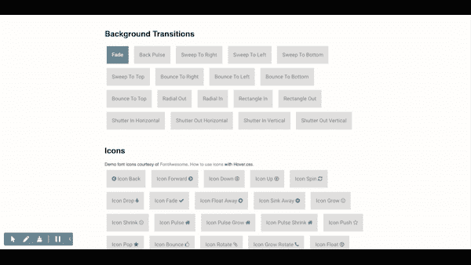

Gif provided by the author.

## 2.[自举图像悬停](https://miketricking.github.io/bootstrap-image-hover/)

这是一个图像悬停效果的设计集合。有 16 种图像悬停效果可供选择，您也可以复制代码并在您的网站上使用，以获得更好的图像悬停效果。

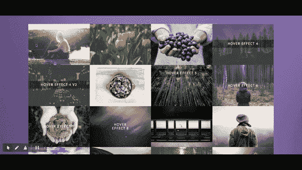

Gif provided by the author.

## 3.[方向揭示](https://nigelotoole.github.io/direction-reveal/)

这个插件提供了惊人的不同的悬停效果，你一定会喜欢。这些效果基于用户来自哪里，当光标点击内容时就会触发。

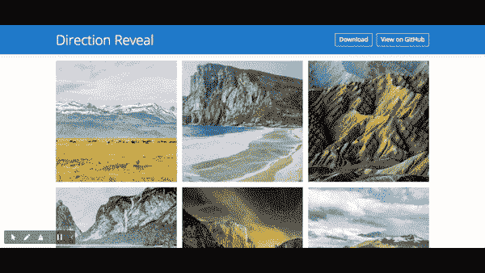

Gif provided by the author.

## 4.[莫卡辛。CSS](https://eliezerpujols.github.io/mocassin.css/)

你可以使用这个工具在你的图片标题上创建令人惊叹的悬停效果。这是一个反应灵敏的工具，每个标题效果将适应你的图像的大小。

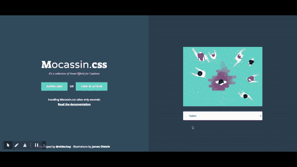

Gif provided by the author.

## 5. [iHover](https://github.com/gudh/ihover)

这个库中有超过 30 个使用纯 CSS 的悬停效果。易于使用，你所要做的就是编写 HTML 标记，包括 CSS 文件，你已经准备好了。

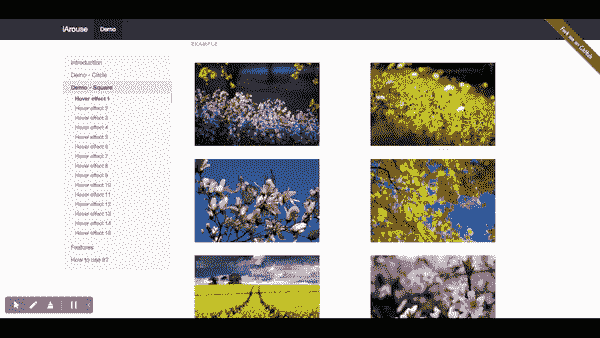

Gif provided by the author.

## 6.[悬停按钮](https://varin6.github.io/Hover-Buttons/)

我使用这个库在我网站的按钮上创建悬停按钮效果。你也可以使用它们的边框悬停效果，看起来很惊艳，也很容易实现。当你点击你喜欢的效果时，每个悬停按钮效果代码都可以复制。

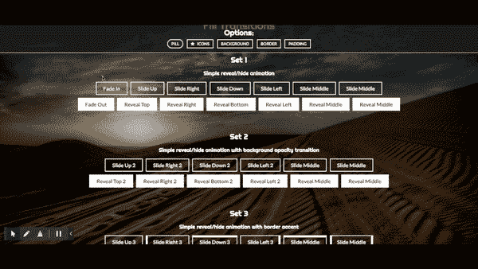

Gif provided by the author.

## 7.[倾斜。JS](https://github.com/gijsroge/tilt.js)

Tilt.js，一个小巧易用的 60+fps requestAnimationFrame 支持的用于 jQuery 的视差悬停倾斜效果。

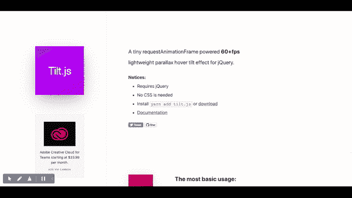

Gif provided by the author.

## 8.[图像悬停。CSS](https://github.com/ciar4n/imagehover.css)

这个库可能看起来类似于 Direction Reveal，但是 ImageHover 的效果在纯 CSS 中是静态的。这个库中有不同的翻转效果，你可以从中选择，最小的只有 19KB。

Gif provided by the author.

## 9.[滑动悬停](https://github.com/wayou/SlipHover)

这类似于上面的方向显示库，但与这个库不同，它为图像的标题提供了滑动悬停效果。我用这个工具来驱动像房地产或时尚这样的网站。

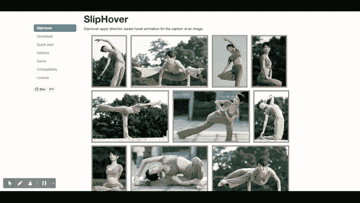

Gif provided by the author.

## 10. [Hover3d](http://ariona.github.io/hover3d/index.html)

jQuery Hover3d 是一个简单的悬停脚本，用于在图像上创建 tilt 3D 悬停效果。

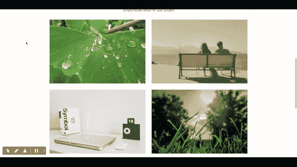

Gif provided by the author.

## 11.[文本悬停效果](https://github.com/DesignDrastic/text-hover-effects-in-css)

我用这个工具在文本上创建一个悬停效果。效果很简单，但它们可以赋予你的内容生命。

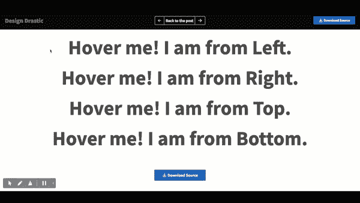

Gif provided by the author.

我发现了这个 CSS 文本效果的大集合，你可能会对其中的代码和演示感兴趣。

 [## 25+有趣的 CSS 文本效果

### 在今天的帖子中，我们分享了一些最有趣和不寻常的 CSS 文本效果——有些是在…

1stwebdesigner.com](https://1stwebdesigner.com/css-text-effects/) 

## 12.[扭曲悬停效果](https://github.com/robin-dela/hover-effect)

这是一个很小的库，可以使用位移图像创建 WebGL 支持的扭曲悬停效果。我使用这个 JavaScript 库在悬停时绘制图像并制作动画。

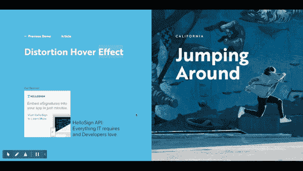

Gif provided by the author.

## 13.[冷冻架](https://github.com/ctrl-freaks/freezeframe.js)

这个库可以让你通过鼠标悬停/鼠标点击/触摸事件或触发/释放功能来点击播放/暂停网站上的动画 GIF。

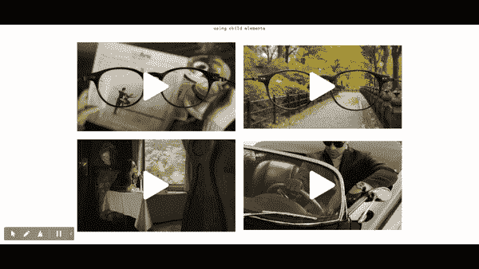

Gif provided by the author.

## 14. [Puffin.js](https://github.com/Treast/puffin.js)

这是一种将鼠标悬停在图像上的新方法。

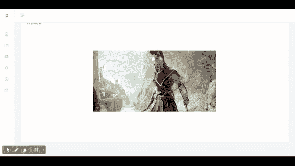

Gif provided by the author.

## 关于 JavaScript 的更多有用的简单英语资源

 [## 14 个有用的工具，我用它们来更快更容易地进行 Web 开发

### 您喜欢使用的有用的在线开发工具。

javascript.plainenglish.io](/14-useful-tools-for-faster-and-easier-web-development-9fd0ebc1f3f8)  [## 18 个有用的备忘单，帮助开发人员更快更聪明地工作

### 你会喜欢的 Cheatsheet 资源。

javascript.plainenglish.io](/18-useful-cheat-sheets-for-developers-to-work-faster-and-smarter-43254200ccd)