# 14 个有用的工具，我用它们来更快更容易地进行 Web 开发

> 原文：<https://javascript.plainenglish.io/14-useful-tools-for-faster-and-easier-web-development-9fd0ebc1f3f8?source=collection_archive---------0----------------------->

## 您喜欢使用的有用的在线开发工具。

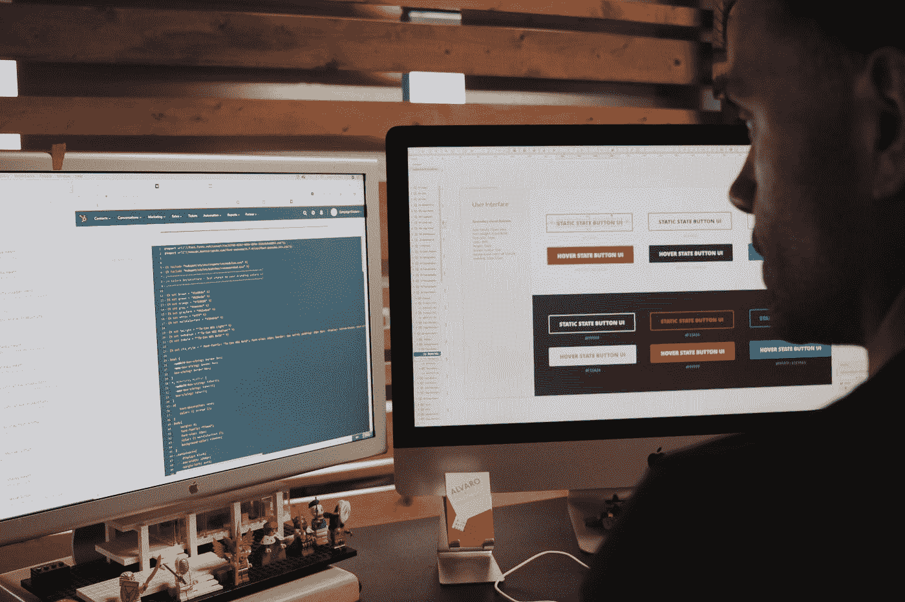

Photo by [Campaign Creators](https://unsplash.com/@campaign_creators?utm_source=medium&utm_medium=referral) on [Unsplash](https://unsplash.com?utm_source=medium&utm_medium=referral)

我开发网站已经很多年了，我不相信保留我自己使用的工具会给我在就业市场竞争中带来很大的优势。

我知道网络开发真的很令人沮丧，但是在在线工具的帮助下，我们可以让我们的工作变得越来越快。

所以我很乐意分享我使用的工具，这些工具使我的 web 开发任务变得更容易。

# 1.Metatags.io

我用这个工具来测试和查看我的网站在谷歌、脸书或推特上的预览。您将看到您的网站的标题、描述和图像，就像访问者看到的一样。

我还可以上传你自己的图片，修改你网站的标题和描述标签，而不改变网站上的任何东西。

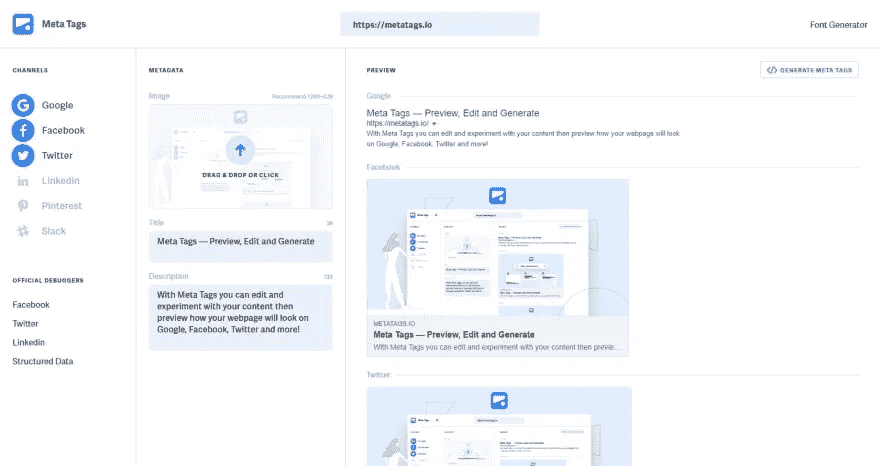

Source: Metatags.io

# 2.提取

我使用这个在线工具从 HTML 文档中提取元素 ID、类和内联样式，并将它们输出为 CSS 样式表。除了输入或复制/粘贴 HTML，我什么都不用做，这个工具就能完成工作。

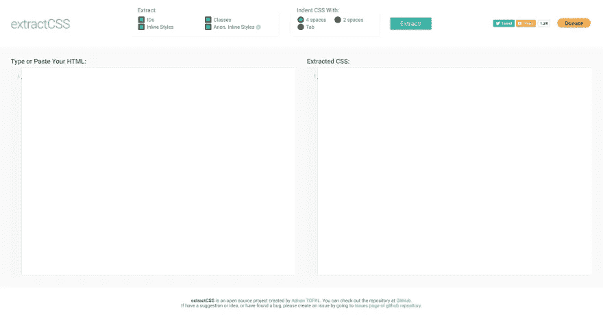

Source: ExtractCSS.com

# 3.什么运行

这个工具总是很有用。这有助于我窥视其他网站的主题，插件和服务器信息。WhatRuns 可以安装在 Firefox 和 Chrome 上，而不会占用你电脑的太多内存空间。

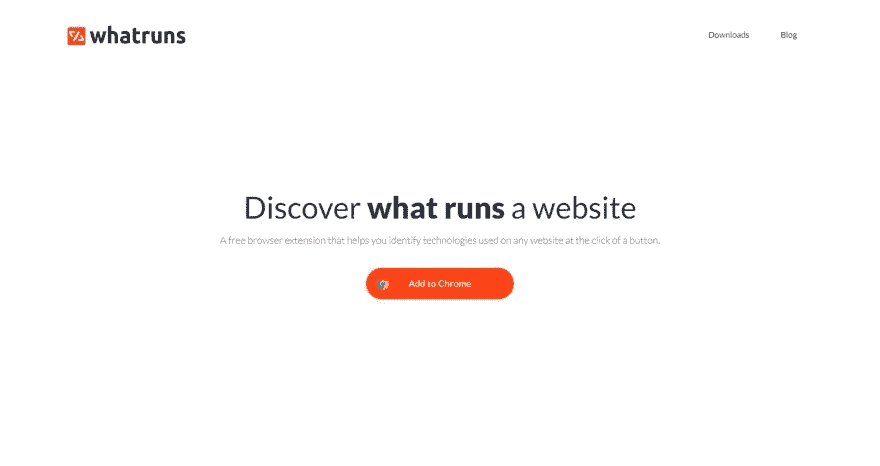

Source: Whatruns.com

# 4.不均匀

一个免费的工具来解开 JavaScript，CSS，HTML，XML 和 JSON 代码，使其可读和漂亮。

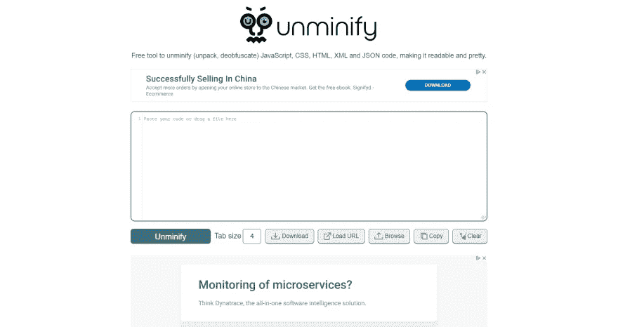

Source: Unminify.com

# 5.八叉树

这个扩展是伟大的探索，但如果你确切地知道你在找什么，按下键盘上的“T”键，并立即在回购中搜索文件名。这会为你节省一些时间，尽管情况并不总是如此。

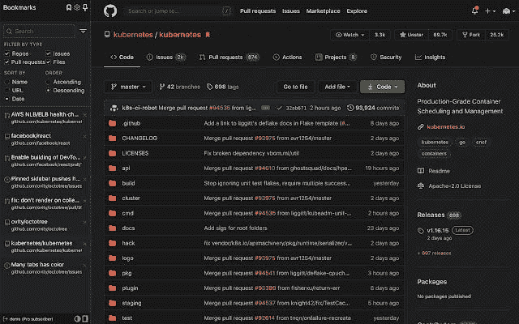

Source: chrome.google.com/webstore/

# 6.Web 开发人员清单

有时候我会忘记检查我工作的网站的元素。当我开始使用这个清单时，我完全改变了一切，它总是提醒我在一个网站上要检查的重要事情，从前端，SEO 到移动设备。

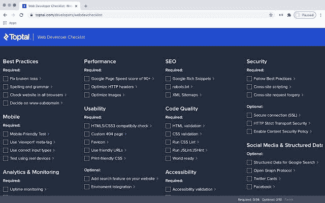

Source: chrome.google.com/webstore/

# 7.Web 开发人员表单填充程序

我可以说我不是唯一一个受够了填表的人，不管它有用还是没用。这个工具对于开发人员测试表单功能很方便。这不仅能节省你输入所需细节的时间，还能帮助你更快地完成工作。

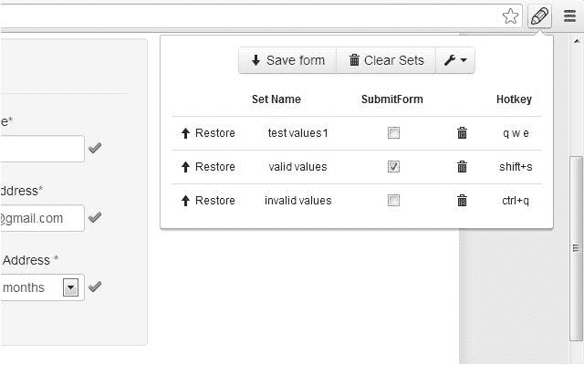

Source: chrome.google.com/webstore/

# 8.编辑 ThisCookie

老实说，作为一名 web 开发人员，这是我的必备品。我很高兴能够轻松地修改 cookies，而不需要费尽周折。我喜欢这个工具的粒度，同时又如此简单易用。当你在一个站点上时，所有的粒度和能力都是点击就能得到的。

Source: chrome.google.com/webstore/

# 9.GTMetrix

这让我能够确定是什么让我的网站变慢，并在我解决了确定的问题后提高转化率。有时，问题往往与服务器相关，或者问题与超大图像、代码问题以及许多其他有助于您解决的问题相关。

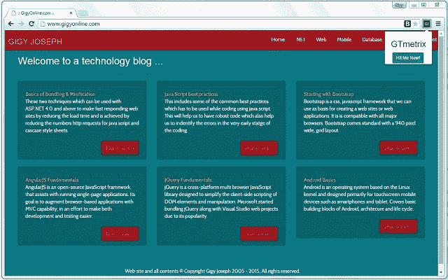

# 10.谷歌页面速度

我用这个工具扫描任何网站，寻找任何需要改进的后端问题，比如是什么导致页面加载变慢。

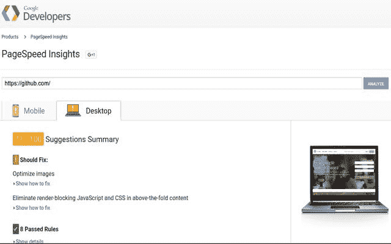

Source: chrome.google.com/webstore/

# 11.浏览

这让我可以在 Opera、Chrome 和 Firefox 等不同浏览器中浏览任何网站。我还可以更改我正在访问的操作系统，例如 Windows 或 Android 技术。

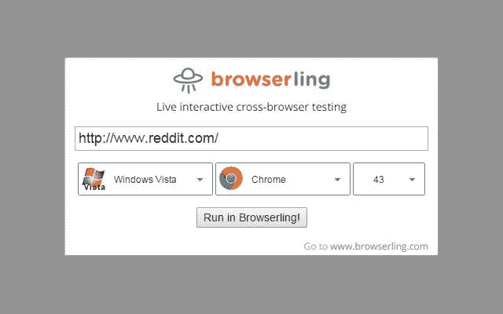

Source: Source: chrome.google.com/webstore/

# 12.响应性应用程序

这款浏览器旨在帮助您一次看到您的网站在不同技术设备上的外观。当我的工具箱里没有这个工具时，我会一次在不同的设备上查看网站。想象一下我要花多少时间才能完成？

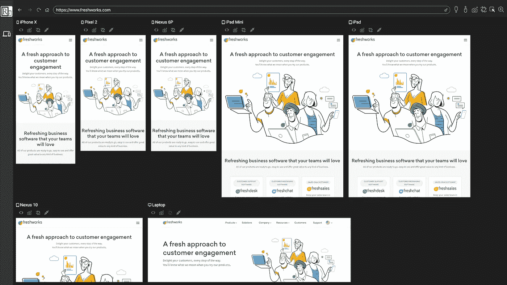

Source: responsively.app

以下是我最喜欢的终端开发者工具，我离不开它们。

 [## 我离不开的 11 个前端开发工具

### 作为一名前端开发人员，这些工具肯定能让你更有效率。

javascript.plainenglish.io](/11-front-end-developer-tools-i-cant-live-without-c3a62b5d0db2) 

# 13.Compressior.io

我使用这个工具来减少我的手机和 DSLR 相机上拍摄的图像，因为默认情况下，它们的文件大小超过 1MB，这对图像来说太大了。质量不变，尺寸却大不一样。

您可以使用此工具在线优化和压缩 JPEG、PNG、SVG、GIF 和 WEBP 图像，而无需费力。

 [## Compressor.io —优化和压缩 JPEG 照片和 PNG 图像

### 在线优化和压缩 JPEG、PNG、SVG、GIF 和 WEBP 图像。免费压缩、调整和重命名您的照片。

compressor.io](https://compressor.io/) 

# 14.绘图工具包

我用这个工具在我的网页设计中寻找免费的矢量插图。这些设计是干净的，专业的，是为任何人都可以使用的网站而设计的。

 [## DrawKit 美丽的自由矢量插图

### 免费矢量 SVG 插图供您在您的下一个项目中使用，无需署名！矢量插图…

www.drawkit.io](https://www.drawkit.io/) 

如果你喜欢这篇文章，你也会喜欢我最喜欢的工具。