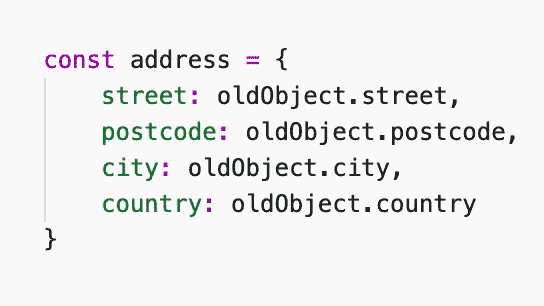

# 我每天使用的 14 个 VS 代码键盘快捷键

> 原文：<https://javascript.plainenglish.io/14-vs-code-keyboard-shortcuts-i-use-every-day-303252fb0933?source=collection_archive---------10----------------------->

## Visual Studio 代码快捷方式，以增压您的生产力。

Photo by [John Petalcurin](https://www.pexels.com/@john-petalcurin-750345?utm_content=attributionCopyText&utm_medium=referral&utm_source=pexels) from [Pexels](https://www.pexels.com/photo/close-up-photo-of-gaming-keyboard-2115257/?utm_content=attributionCopyText&utm_medium=referral&utm_source=pexels)

我们，软件工程师，往往是非常高效的存在。我们的目标是优化一切，而不仅仅是代码。

这就是为什么我们不想花 10 秒钟在 GUI 上寻找一些东西。我们不想花哪怕 2 秒钟。当我们可以通过使用强大的键盘快捷键在 0.1 秒内完成时，我们为什么要这样做呢？

如果我重复做同样的动作，我总是谷歌它的快捷方式。通常，我会找到它。

我来和大家分享一下我每天使用的快捷方式。我打赌你不知道他们中的许多人！

## 1.按名称搜索文件

好的，我们将从列出最常见和最简单的快捷方式开始。

`cmd + P` (Mac) / `crtl + P` (Windows)会打开一个搜索领域，具有不可思议的强大模糊搜索功能。我可能一天要用 100 多次。

## 2.搜索设置

这个也差不多；点击`cmd + P` (Mac) / `crtl + P` (Windows)后，输入`>`即可。你现在可以输入任何搜索词，只有设置会受到影响。

## 3.多个光标

这个功能太酷了，我希望我可以在其他任何地方使用它！

只需按下`alt`并开始点击编辑器。会出现多个光标！

## 4.多光标 v2

不用四处点击也可以做类似的事情。`cmd option + arrow down` (Mac) / `shift alt + arrow down` (Windows)会在下面多插入一个光标。

显然，你可以用`arrow up`在上面插入一个光标。

## 5.选择所有事件

这个挺不一般的，但是功能极其强大！首先，您需要选择一些文本。

然后，`cmd shift + L` (Mac) / `crtl shift + L` (Windows)选择该文本的所有匹配项。这对于重命名文件中的变量非常有用:

Magic

想象一下，手动重命名一个在文件中重复 30 次的变量。噩梦。

## 6.删除一行

`cmd shift + K` (Mac) / `crtl shift + K` (Windows)在这里就做到了。

## 7.复制一行

将光标放在要复制的行上。

按`cmd + C`，然后按`cmd + V` (Mac) / `crtl + C`，然后按`crtl + V` (Windows)。瞧啊。

## 8.在文件中搜索

这一点在所有常见的应用程序(如浏览器)中都很熟悉:`cmd + F` (Mac) / `crtl + F` (Windows)。

`cmd + G` (Mac) / `crtl + G` (Windows)搜索下一个事件，而`cmd shift + G` (Mac) / `crtl + shift + G` (Windows)搜索上一个事件。

## 9.在文件中替换

如果你想替换你搜索的词，请点击`cmd option + G` (Mac) / `crtl shift + G` (Windows)。

然后，点击`enter`替换当前事件。

如果想全部替换，点击`cmd + enter` (Mac) / `crtl + enter` (Windows)。

## 10.在所有文件中搜索

没有在所有文件中进行良好的旧搜索，什么都不会存在。

`cmd shift + F` (Mac) / `ctrl shift + F` (Windows)做到了。

如果要按大小写匹配文本，请按`cmd option + C` (Mac) / `crtl shift + C` (Windows)。

也可以通过按`cmd option + W` (Mac) / `crtl shift + W` (Windows)来匹配整个单词。

## 11.在所有文件中替换

是否要替换项目中所有文件中的所有匹配项，即搜索/替换？

令人惊讶的是，`cmd option + H` (Mac) / `crtl shift + H` (Windows)做到了。

`cmd option + enter` (Mac) / `crtl alt + enter` (Windows)触发替换。

## 12.拆分编辑器

一个标签是不够的，你需要很多！太好了，只需按`cmd + \` (Mac) / `alt shift + 0` (Windows)。重复，直到你满意为止。

## 13.关闭选项卡

这个和 Chrome 里的一样——`cmd + W`(Mac)/`crtl + W`(Windows)。

## 14.在打开的选项卡之间切换

您想打开上一个标签页吗？`crtl + tab`确实管用。

是否要转到已知位置的选项卡？`crtl + [index]`确实如此。

最后，您可以通过按下`cmd option + arrow left/right` (Mac) / `crtl page down/up` (Windows)来拾取左侧/右侧的选项卡。

# 结论

我不建议马上把它们都背下来——试着用其中的一两个，然后慢慢适应你的工作。

保存这篇文章，以防你以后想重温它。

使用更多的键盘快捷键会提高你的工作效率。

哦，感觉真好。

*更多内容看*[***plain English . io***](http://plainenglish.io/)