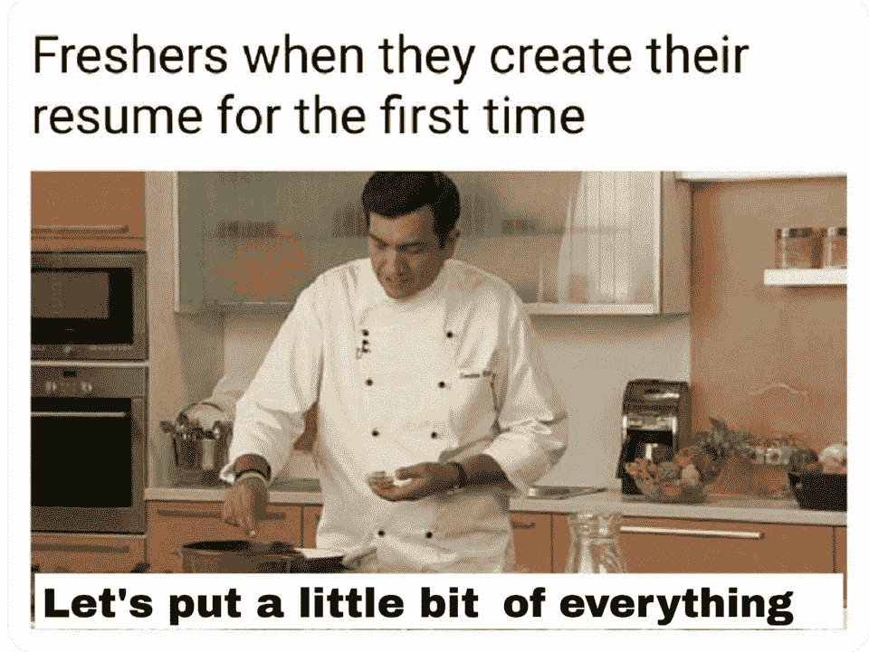

# 减轻心情的 15 个最佳编程笑话

> 原文：<https://javascript.plainenglish.io/15-best-programming-jokes-to-lighten-your-mood-5d7dc653f9e5?source=collection_archive---------3----------------------->

## 最佳编程笑话汇编

Photo by [Brooke Cagle](https://unsplash.com/@brookecagle?utm_source=medium&utm_medium=referral) on [Unsplash](https://unsplash.com?utm_source=medium&utm_medium=referral)

你听说过“笑是减轻压力的良药”吗

但如何实现呢？当你心情不好的时候，如何笑？

今天，我正在整理一些我在互联网和社交媒体上找到的与节目制作相关的最好的**笑话/模因**。这些笑话给我带来了微笑，希望它们也能给你带来微笑。

> *好戏开始了。准备好第一剂。*

# 真的？人们会在评论中加上这个吗？

**资料来源:**[https://programmer 幽默. io/JavaScript-memes/原谅我是一个非常常见的项目注释-2/](https://programmerhumor.io/javascript-memes/forgive-me-is-quite-a-common-comment-in-github-projects-2/)

# 编译器错误？等等，让我加上分号…

**来源:**[https://programmer 幽默. io/programming-memes/fixing-compiler-errors-like/](https://programmerhumor.io/programming-memes/fixing-compiler-errors-like/)

# 我希望这种人工智能在未来…

**资料来源:**[https://programme 幽默. io/programming-memes/the-translation-I-要人-2/](https://programmerhumor.io/programming-memes/the-translation-i-need-2/)

# 编程父母？你在看这个吗？

**资料来源:**[https://programmer 幽默. io/programming-memes/parents-wish-2/](https://programmerhumor.io/programming-memes/parents-wish-2/)

# 实际上，我在大学的时候也是这么做的……

**资料来源:**[https://programmer 幽默. io/programming-memes/总有那么一个人 2/](https://programmerhumor.io/programming-memes/theres-always-that-one-guy-2/)

# 无意冒犯，但黑暗模式就是生活……

**资料来源:**[https://programmer 幽默. io/programming-memes/黑暗模式-用户喜欢%f0%9f%a4%90-2/](https://programmerhumor.io/programming-memes/dark-mode-users-be-like%f0%9f%a4%90-2/)

# 哪一个优先？技术债务还是积压？

**来源:**[https://programmer 幽默. io/programming-memes/与你的 po-2 对话/](https://programmerhumor.io/programming-memes/talking-to-your-po-2/)

# 真正的不同…你是否错过了在办公室工作？

**来源:**[https://programmer humor . io/programming-memes/work-from-home vs . work-from-the-office/](https://programmerhumor.io/programming-memes/work-from-home-vs-work-from-the-office/)

# 经常发生，当我的循环变得无限时…

【https://programmerhumor.io/programming-memes/just-do-it/】来源:

# 是我… LOL

**来源:**[https://www . Reddit . com/r/programmer humor/comments/q 1237g/pr _ descriptions _ in _ private _ repos/](https://www.reddit.com/r/ProgrammerHumor/comments/q1237g/pr_descriptions_in_private_repos/)

# 哈哈…你也是这样吗？

**来源:**[https://www . Reddit . com/r/programmer humor/comments/q0zgkd/the _ power _ of _ the _ sun _ is _ in _ the _ fingers _ of _ my _ hands/](https://www.reddit.com/r/ProgrammerHumor/comments/q0zgkd/the_power_of_the_sun_is_in_the_fingers_of_my_hands/)

# 为什么？为什么要更新？

来源:[https://programmer humor . io/programming-memes/windows-10-be-like/](https://programmerhumor.io/programming-memes/windows-10-be-like/)

# 可重用组件在这种情况下不起作用…哈哈

**来源:**[https://www . monkey user . com/assets/images/2021/225-reusable-components . png](https://www.monkeyuser.com/assets/images/2021/225-reusable-components.png)

# 小虫子…

**来源:**[https://www . monkey user . com/assets/images/2021/204-ignorable-error . png](https://www.monkeyuser.com/assets/images/2021/204-negligible-error.png)

# 公关…

**来源:**[https://www.monkeyuser.com/2021/confidence/?sc=true&dir = random](https://www.monkeyuser.com/2021/confidence/?sc=true&dir=random)

# 奖励时间:

# 通常发生在我周五工作并为客户做演示的时候…

[https://www.facebook.com/ProgrammersCreateLife/photos/a.241809332534619/3750971258285058/](https://www.facebook.com/ProgrammersCreateLife/photos/a.241809332534619/3750971258285058/)

# 有时初级开发人员知道得更多…

[https://www.facebook.com/DZoneInc/photos/a.336758034711/10159280091324712](https://www.facebook.com/DZoneInc/photos/a.336758034711/10159280091324712)

# 我根据项目购买课程，当我按照这样的指示结束时…

[https://www.facebook.com/javascriptJS/photos/a.1387402908063976/2172042662933326/](https://www.facebook.com/javascriptJS/photos/a.1387402908063976/2172042662933326/)

# 当我试图修复一个让事情变得更糟的小错误时…

[https://www.quora.com/What-are-the-best-programming-comic-strips](https://www.quora.com/What-are-the-best-programming-comic-strips)

# 总有一些隐藏的错误..不要打扰他们…

[https://www.facebook.com/ProgrammersCreateLife/photos/a.241809332534619/3817315068317343/](https://www.facebook.com/ProgrammersCreateLife/photos/a.241809332534619/3817315068317343/)

# 当我的教练问我最喜欢哪台机器时…

[https://www.facebook.com/javascriptJS/photos/1833542923449970](https://www.facebook.com/javascriptJS/photos/1833542923449970)

# 星期五提前离开…

# 永远不要试图扰乱工作代码…

[https://www.facebook.com/javascriptJS/photos/1602108066593458](https://www.facebook.com/javascriptJS/photos/1602108066593458)

# 随着太多框架的出现…

[https://www.facebook.com/yuva.krishna.memes/photos/a.105527467815845/299995221702401/](https://www.facebook.com/yuva.krishna.memes/photos/a.105527467815845/299995221702401/)

# 当我的学长让我在代码中添加注释时…

[https://www.facebook.com/javascriptJS/photos/a.1387402908063976/2170533493084243/](https://www.facebook.com/javascriptJS/photos/a.1387402908063976/2170533493084243/)

# 添加所有东西，这样它就能在自动工具中捕捉到…

[https://www.reddit.com/r/ProgrammerHumor/comments/mnbgz1/knows_every_programming_language/](https://www.reddit.com/r/ProgrammerHumor/comments/mnbgz1/knows_every_programming_language/)

# 我最好的敌人是…

[https://www.facebook.com/DZoneInc/photos/10158920521754712](https://www.facebook.com/DZoneInc/photos/10158920521754712)

> 如果你喜欢这篇文章，请用这个链接加入 Medium，它帮助我得到一点钱。

> ["从此链接加入](https://sheetalpatel93.medium.com/membership)"

# 延伸阅读:

 [## 企业行话:我们日常使用的搞笑短语，以及它们的真实含义

### 他们所说的和他们真正的意思

javascript.plainenglish.io](/corporate-jargon-hilarious-phrases-we-use-daily-and-what-we-actually-mean-by-them-160ffb2a03a3)  [## 有趣的比较:程序员与普通人

### 是什么让程序员与众不同？

javascript.plainenglish.io](/funny-comparisons-programmers-vs-normal-people-3aa7002f62f0)  [## 20 个有趣的迷因给那些在敏捷框架中工作的人

### 最佳敏捷开发笑话汇编

javascript.plainenglish.io](/20-hilarious-memes-for-those-who-have-worked-in-the-agile-framework-e6c17b4d8260) 

*更多内容尽在*[***plain English . io***](http://plainenglish.io/)