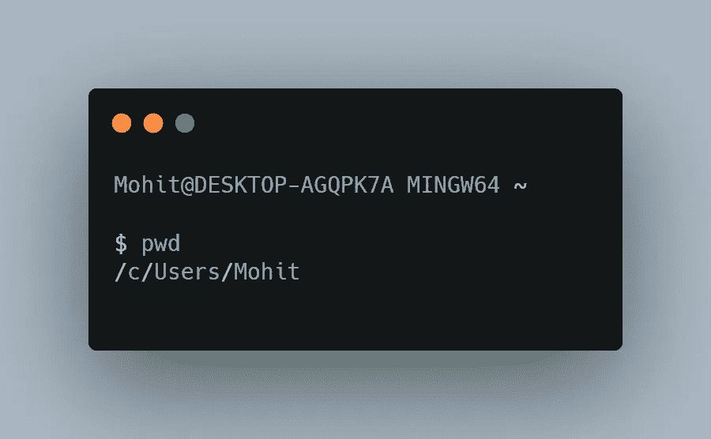
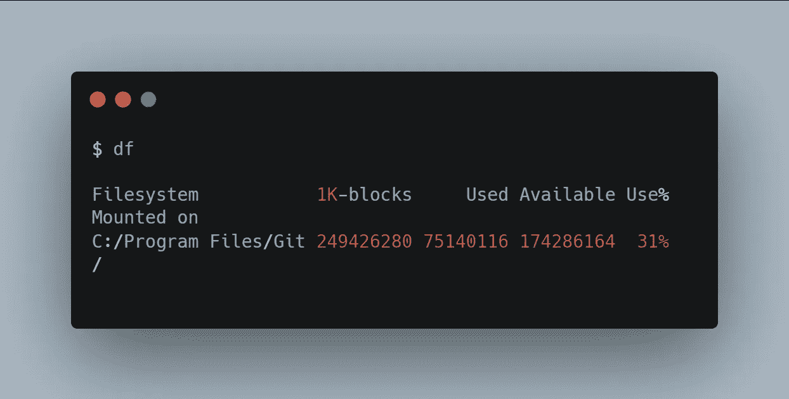
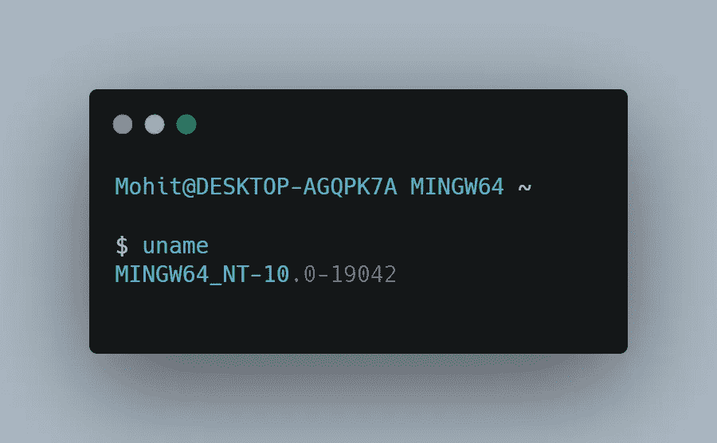
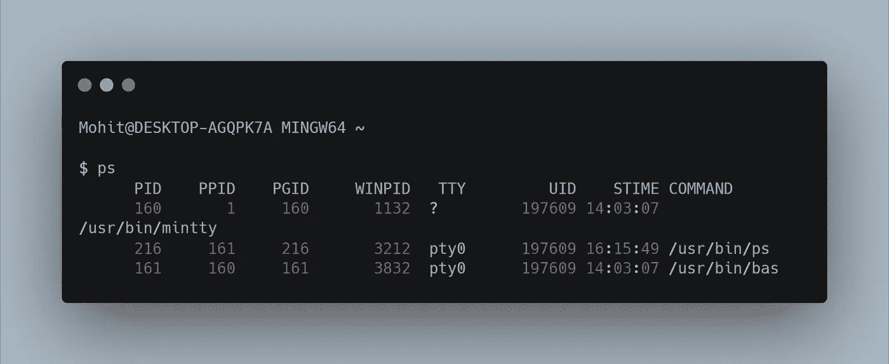
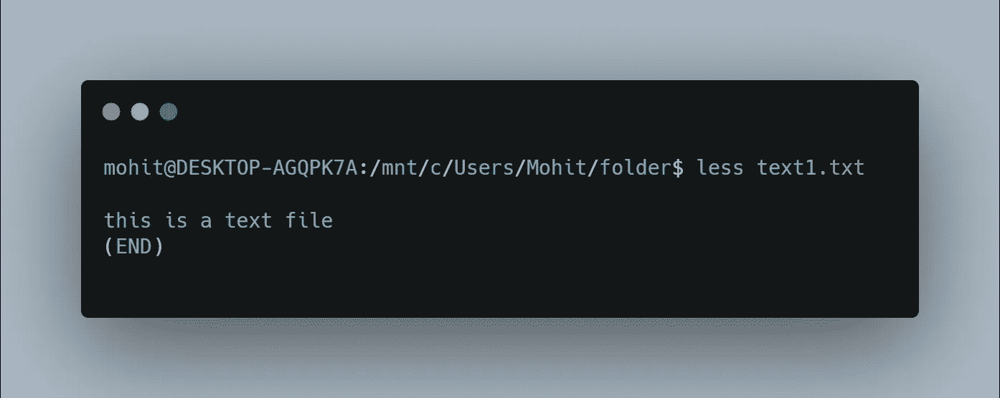
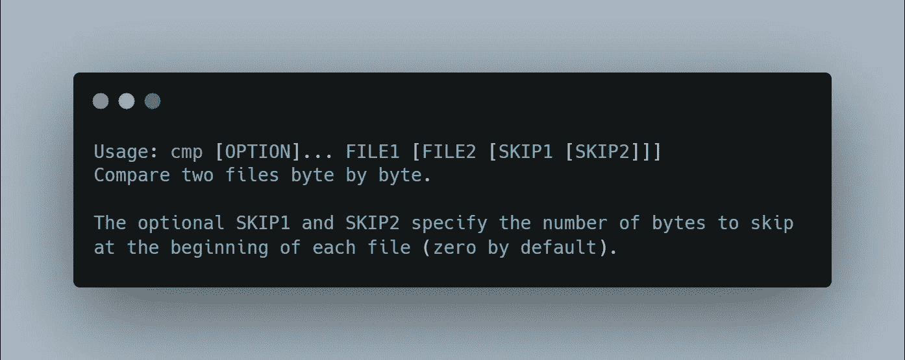
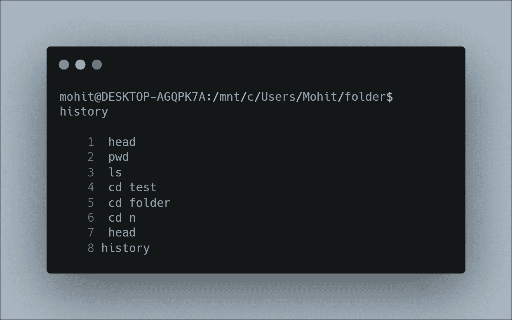
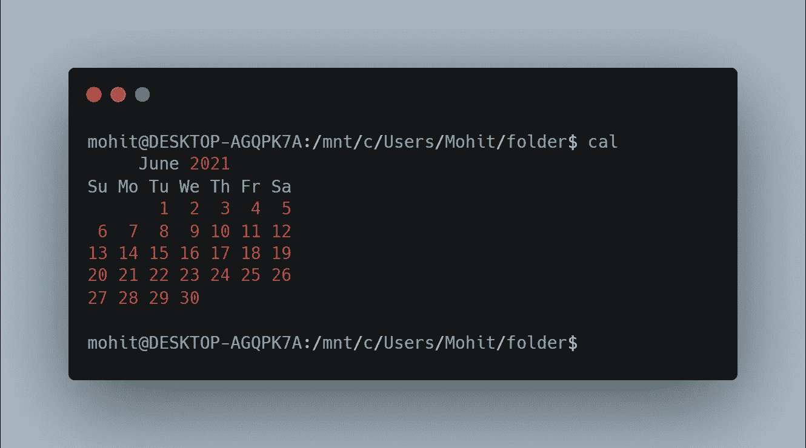
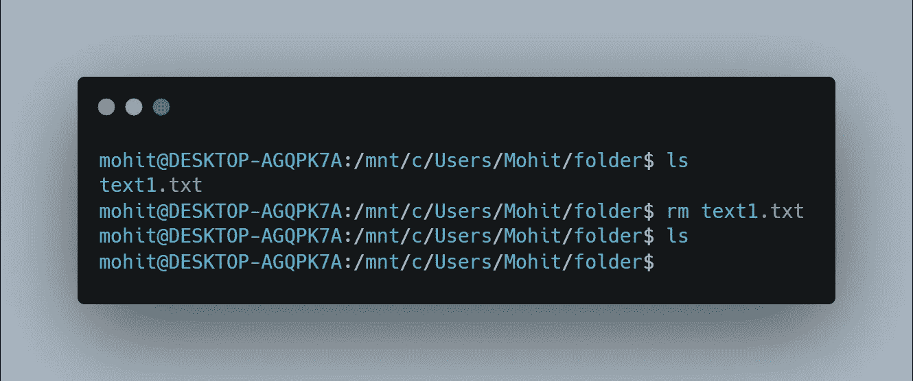

# 成为终端忍者你应该知道的 15 个终端命令

> 原文：<https://javascript.plainenglish.io/15-commands-that-will-make-you-a-terminal-ninja-403399ab55b6?source=collection_archive---------7----------------------->

面向高效开发人员的终端命令

## 1.显示当前工作目录

它代表*打印工作目录*，这是一个非常方便的命令，你可以用它来检查你当前的工作目录，用这个命令你可以毫无问题地快速检查你的工作目录。

## 2.df

您可以使用的一个强大的命令，它显示了文件系统上磁盘空间的基本信息。您可以使用这个命令来监控**实时服务器**或**面向网络的系统。**

## 3.乌梅

您可以轻松获得系统信息，如**名称**、**版本**，以及其他特定于系统的详细信息。同样，您可以用这个命令检查您的**操作系统**和*内核版本*。

## 4.著名图象处理软件

一个非常简单的终端命令，可以让你观察你的机器上正在运行什么进程。在分析系统资源时，您将能够通过终端操纵系统进程。

## 5.杀

这个命令有能力停止所有由于资源限制而停滞的进程。有经验的开发人员经常使用这个命令来保持机器上的整洁。

## 6.猫

您可以使用此命令实现多种目的，例如，您可以创建新文件，在终端中查看文件内容，而无需使用 GUI。

## 7.头

此命令允许您直接从终端查看文件或管道数据的开始。如果您经常处理文本，那么这可能是一个有用的命令。

## 8.平均变化

作为开发人员，我们都希望节省时间，使用这个命令，您可以在没有 GUI 的情况下执行剪切操作。您可以轻松地从不同位置移动单个或多个文件，也可以使用 **-f 参数**来传输大文件。

## 9.较少的

开发人员使用的另一个很好的命令是 **less** 命令，当您必须查看文件中的上下文时，它非常方便，这使得 less 命令成为高效开发人员的一个很好的选择。

## 10.金属波纹管

有时候我们想并排比较文件， **cmp** 命令会让你在几秒钟内比较任意文件 ***字节*** 乘 ***字节*** 。此外，这是用户处理大量文本文件时最常用的 Linux 命令之一。

## 11.别名

对于不喜欢打开文件并多次应用更改的开发人员来说，这是为您准备的，alias 命令允许您直接从终端用另一个字符串替换文件中的单词。

## 12.历史

任何时候你想检查你的终端历史，这个命令将让你知道你的终端会话中使用的每一个命令。

## 13.可做文件内的字符串查找

在大量文本文件中搜索模式时，这个命令非常方便。您可以提供您正在寻找的特定模式作为输入，并搜索指定的文件。

## 14.小卡

这一个可能有点不同，但是当长时间工作时，我甚至不想改变我的终端和文本编辑器的工作空间，直到我完成。为此，我们使用了**调用**命令来显示当前的月历。

## 15.空间

rm 命令非常简单明了，你可以很容易地从你的工作目录中删除文件。它的工作方式与 MS-DOS 中的 del 命令完全一样。

 [## 2021 年终极 React 原生开发者路线图

### 从基础到部署跨平台应用

javascript.plainenglish.io](/ultimate-react-native-developer-roadmap-for-2021-a34a2bf49699)  [## 初学 HTML 时你会犯的 7 个错误

### 你应该知道的 HTML 错误

javascript.plainenglish.io](/7-mistakes-you-are-making-as-a-beginner-in-html-e65ca41ad598)  [## 3 个隐藏的 CSS 功能

### 对前端开发者有用的 CSS 特性

javascript.plainenglish.io](/3-hidden-features-of-css-566e8c27597f) 

*更多内容尽在*[***plain English . io***](http://plainenglish.io/)