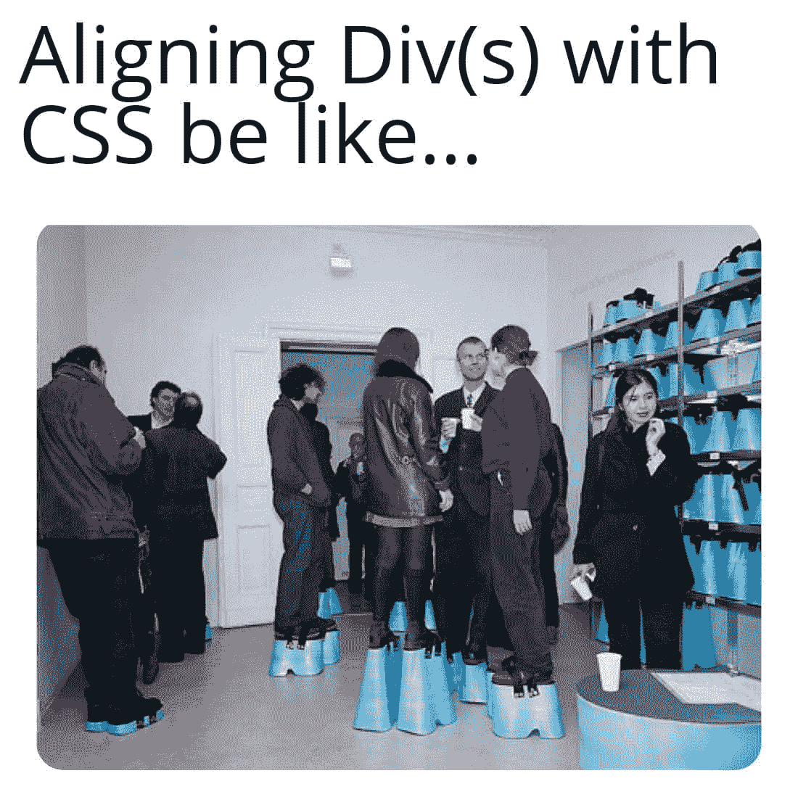

# 任何程序员都能理解的 15 个老套笑话

> 原文：<https://javascript.plainenglish.io/15-corny-jokes-any-programmer-can-relate-to-7a7104826866?source=collection_archive---------0----------------------->

## 开发者的顶级蹩脚编程笑话

Photo by [Ben White](https://unsplash.com/@benwhitephotography?utm_source=medium&utm_medium=referral) on [Unsplash](https://unsplash.com?utm_source=medium&utm_medium=referral)

在这篇文章中，我想介绍一些令人捧腹的笑话来减轻你的情绪，让你为即将到来的新年感到兴奋。

# “笑声是人类电脑的最佳刷新按钮”

那你还在等什么？准备好享受乐趣吧！

# 当我给我的下级提建议的时候…但是我的代码吹了…

Picture Credit: [https://www.facebook.com/javascriptJS/photos/a.1387402908063976/2360224960781761/](https://www.facebook.com/javascriptJS/photos/a.1387402908063976/2360224960781761/)

# 谁干的？英雄联盟

Picture Credit: [https://www.facebook.com/javascriptJS](https://www.facebook.com/javascriptJS/photos/a.1387402908063976/2360224960781761/)

# 什么是团队合作？有趣的插图…

Picture Credit: [https://www.monkeyuser.com/2020/teamwork/?sc=true&dir=random](https://www.monkeyuser.com/2020/teamwork/?sc=true&dir=random)

# 从来都不简单…障碍总是会出现…

Picture Credit: [https://www.monkeyuser.com](https://www.monkeyuser.com/2020/teamwork/?sc=true&dir=random)

# 我喜欢钱，这就够了...哈哈…

Picture Credit: [https://programmerhumor.io/programming-memes/err/](https://programmerhumor.io/programming-memes/err/)

# 这至少是为了这个 PJ 吧…

Picture Credit: [https://programmerhumor.io/programming-memes/so-thats-why-5/](https://programmerhumor.io/programming-memes/so-thats-why-5/)

# 虽然看起来不错…

Picture Credit: [https://programmerhumor.io/javascript-memes/insert-anywhere-2/](https://programmerhumor.io/javascript-memes/insert-anywhere-2/)

# 当您的功能不再需要时…

Picture Credit: [https://workchronicles.com/comics/](https://workchronicles.com/comics/)

# 工作量…请经理…

Picture Credit: [https://workchronicles.com/time-management-fixes-everything/](https://workchronicles.com/time-management-fixes-everything/)

# 没有人检查你有多加班…

Picture Credit: [https://workchronicles.com](https://workchronicles.com/time-management-fixes-everything/)

# 真的…

Picture Credit: [https://www.facebook.com/jokesvala/photos/a.2339158462775928/6892956897396039/](https://www.facebook.com/jokesvala/photos/a.2339158462775928/6892956897396039/)

# 程序员喜欢黑暗模式的完美理由…

Picture Credit: [https://www.facebook.com/photo?fbid=189693290001327&set=gm.1003401853551758](https://www.facebook.com/photo?fbid=189693290001327&set=gm.1003401853551758)

# 我也更喜欢打印/控制台…

Picture Credit: [https://www.facebook.com/jokesvala/photos/a.2339158462775928/6876680009023728/](https://www.facebook.com/jokesvala/photos/a.2339158462775928/6876680009023728/)

# 没时间，别担心..它看起来会一样…没有后端…

Picture Credit: [https://www.facebook.com/jokesvala/photos/a.2339158462775928/6878304942194568/](https://www.facebook.com/jokesvala/photos/a.2339158462775928/6878304942194568/)

# 看起来它们不起作用…因为我相信我的代码..英雄联盟

Picture Credit:[https://www.facebook.com/yuva.krishna.memes/photos/a.105527467815845/451792499856005/](https://www.facebook.com/yuva.krishna.memes/photos/a.105527467815845/451792499856005/)

# 更多的乐趣…

# 你喜欢幸运饼干吗？如果你收到这个，作为一个开发者你的反应是什么？

[https://www.facebook.com/yuva.krishna.memes](https://www.facebook.com/yuva.krishna.memes)

# 我也有同样的感觉…当我很少用纸和笔写字的时候…

[https://www.facebook.com/yuva.krishna.memes](https://www.facebook.com/yuva.krishna.memes)

# 我不在乎，我知道这是一种不好的态度，但让我享受这种感觉…

[https://www.facebook.com/yuva.krishna.memes](https://www.facebook.com/yuva.krishna.memes)

# 一切皆有可能..不管怎样，你都可以得到结果。

[https://www.facebook.com/yuva.krishna.memes](https://www.facebook.com/yuva.krishna.memes)

# 让我们来看看 Div 的虚拟世界…在我改变位置进行适当调整后，他们看起来是怎样的…

[https://www.facebook.com/yuva.krishna.memes](https://www.facebook.com/yuva.krishna.memes)

# 当我在代码中发现一个问题时，最常见的事情发生了…

[https://www.monkeyuser.com/](https://www.monkeyuser.com/)

# 下次我会试着写正确的代码…让我们今天就发出请求吧…

[https://www.monkeyuser.com/](https://www.monkeyuser.com/)

# 我的分支在做什么？

[https://www.facebook.com/ProgrammersCreateLife](https://www.facebook.com/ProgrammersCreateLife)

# 当我们每年收到太多的框架时..这很正常…

[https://www.facebook.com/programminggeeks.in](https://www.facebook.com/programminggeeks.in)

# 你喜欢什么？我正在学习一门新的语言…

[https://www.facebook.com/techindustan/](https://www.facebook.com/techindustan/)

# 为帮助我们脱帽致敬…

[https://www.facebook.com/programminggeeks.in](https://www.facebook.com/programminggeeks.in)

## 最后注意:

希望你喜欢这篇文章。一如既往地支持我。希望你在今年余下的日子里过得愉快。

*更多内容看*[***plain English . io***](http://plainenglish.io/)