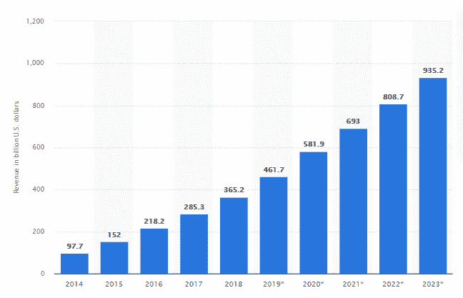

# 创业公司的 15 个优秀行业应用创意

> 原文：<https://javascript.plainenglish.io/15-excellent-industry-based-app-ideas-for-startups-43189c5f472c?source=collection_archive---------0----------------------->

Image Source: IDAP Group

应用市场正以指数速度增长。似乎每天都有新的游戏或应用出现，一夜之间就有数百万的下载量。不过，我们不是来谈论游戏的，我们想把重点放在商业应用上。

21%的千禧一代每天打开应用程序超过 50 次。

*——到 2021 年，应用程序被认为会产生超过*[*【9350 亿美元*](https://www.statista.com/statistics/269025/worldwide-mobile-app-revenue-forecast/) *的收入。*

Image Source: Statista

此外，如果你正在考虑创办自己的公司，你需要知道的一件事是，今天的消费者正在寻求的不仅仅是好的产品；他们也想要优质的客户服务。这意味着，如果你还没有为你的业务设置移动应用程序，现在是时候开始规划它们了！

所以让我们开始吧…

# 创业公司的创新应用理念

如果你正在寻找[有用的应用创意来创业](https://medium.com/geekculture/innovative-custom-software-development-ideas-in-2021-a-stepping-stone-for-start-up-success-bafdecbe84ff)，这里有 15 个**基于行业的应用创意**可以帮助你起步。这些应用程序的突出之处在于，它们都与当前有需求的行业相关。如果你对其中一个不感兴趣，那就去看看下一个，因为它可能正是你要找的！

# 医疗保健行业:应用创意

Image Source: Translate Media

这里提到的潮流应用创意，排名不分先后。然而，如果你在医疗保健或其他行业，需要一些灵感来开始你自己的应用程序想法——这个列表是给你的！

## **1。健康监护应用**

这是一个最好的创业想法，可以用来监测一些不同的身体功能，如体温和血压。用户可以输入自己的个人信息，这样应用程序就可以知道什么是正常或异常的读数。此外，这个应用程序应该有一个功能，用户可以通过文本、电话或视频聊天轻松地从程序中轻松联系他们的医生。

## **2。在线治疗应用程序**

随着影响当今社会的心理健康问题越来越多，在线治疗应用程序将对用户极其有益。这种程序可以包括许多不同的功能，如情绪跟踪和记录日常活动，以帮助个人更好地了解自己的行为。此外，应该有用户可以参与的与治疗师和支持团体的实时聊天会话。

## **3。戒毒 App**

这款应用程序旨在帮助那些正在与成瘾作斗争的人。它应该包括许多不同的功能，如每日激励报价，通过音频或视频冥想会议(选择在家里，工作等)。)，以及个人可以相互联系以寻求支持的群组聊天室。

如果您正在考虑开发一个领先的医疗保健应用程序，那么请利用来自最佳 IT 解决方案公司的**定制医疗保健软件开发服务**。这样做将能够在有限的时间内开发一个应用程序。

# 电子商务领域:应用创意

这里所说的电子商务应用程序的想法并不是你的典型想法。它们不仅仅是购物应用；他们解决电子商务行业的实际问题，并帮助您快速发展您的业务。

## **4。按需送餐 App**

一个送餐应用程序使用户能够在网上向他们喜欢的餐馆下单。这方面的一个很好的例子是 UberEATS，它让你从你最喜欢的餐馆点菜，并在一个小时内送到。

世界上有这么多餐馆，对按需送餐的需求很高。如果你正在考虑开始一项电子商务业务，并知道你的厨房周围的方式，这可能是完美的给你！

## **5。杂货 App**

这是一个独特的商业想法，允许用户在他们最喜欢的杂货店购物，但不是像往常一样在收银台排队付款——他们在网上支付。这样，你就可以买下所有的食品杂货，并在所有东西都付完款后再来取货。

这种生意有很多好处，其中之一是，如果人们在工作日没有时间去购买食品杂货，他们可以在周六早上完成，并在当天晚上准备好所有的食品杂货。

这个伟大的商业理念不仅对用户有益，对你也有利可图！

## **6。服装/时尚应用**

如果你曾经想创业，但不知道怎么做，这是一个绝佳的机会。经营自己的时尚品牌最具挑战性的事情之一是让人们注意到它——如果没有人知道他们想要什么类型的衣服或鞋子，这可能很难做到！这个应用程序可以解决你所有的问题。

人们可以下载该应用程序，挑选出他们想要的衣服类型(例如，牛仔裤或连衣裙)，然后定制它的每个方面——选择不同的颜色、尺寸，甚至是设计的一部分！这是一个很好的机会，对于那些想在时尚行业寻求突破而又不需要投入大量资金的管理者来说。

从优秀的电子商务应用开发公司雇佣电子商务开发人员可以帮助你开发有吸引力的购物应用。

# 银行和金融行业:应用创意

Image Source: Krishi Jagran

如果你有金融或银行业的历史，那么开始你自己的应用程序业务可能是你的绝佳机会！有许多应用程序可以让这个行业受益，并帮助人们在繁忙的工作日中节省时间。

此外，如果你打算制作一个多功能、多任务的银行金融应用程序，请联系在顶级区块链软件开发公司工作的区块链开发人员。

## **7。个人预算应用**

如果你对个人财务有所了解，这将是一个惊人的想法。如果有人想知道如何省钱，他们首先需要知道钱的去向。有了这些应用程序，你就可以做到这一点！

你可以按照租金/抵押贷款、食物、账单(电费和手机费)、工作用气价格等类别来制定预算——几乎是人们计划日常开支所需的一切。

这个应用程序将是任何人的救命稻草，他们在整个月的预算和储蓄计划中需要帮助！

## **8。银行应用**

这是该行业最知名的应用之一，因为每个人都需要它——尤其是当你在旅行或度假时(我们都知道这经常发生)。这个应用程序的好处是，它允许用户在旅途中访问他们的银行账户，在不同的金融机构之间转账。

这种类型的应用程序将是一个很好的机会，对于那些不仅有银行和金融经验，而且对技术也略知一二的人来说！如果你认为这听起来是一个惊人的想法，那么不要犹豫，试一试。

## **9。账单提醒手机应用**

这是一个为忙碌的人设计的应用程序。这个简单易用的程序会在您的账单到期时通知您，因此您可以按时支付账单，而不必担心罚款或滞纳金。

对于想自己创业但不知道怎么做的人来说，这是个好主意。你不仅可以节省金钱和时间，还可以帮助其他正在努力跟上财务状况的人。

当开始你自己的应用程序业务时，有如此多的机会——你所要做的就是发挥创造力！不管你是否对这个行业感兴趣，这些类型的应用程序将会在未来几年继续流行。

# 教育部门:应用创意

Image Source: Indium Software

教育是一个巨大的行业，在过去的几年里发展迅速。随着越来越多的人上学以获得他们梦想中的工作，如果你想自己创业，这是你应该考虑的一个领域！

## 10。私人学费申请

一个允许父母为他们的孩子找私人家教的应用程序——并在线支付。这是一个很好的主意，因为学生总是在校外寻求帮助，如果你不知道去哪里找，这可能会很困难！

这种类型的业务可以很容易地联系到世界各地想要辅导服务的人，而且开始比你想象的要容易。你所要做的就是建立一个网站或博客，使用社交媒体在网上做广告，然后看着订单进来！

## **11。电子书阅读 App**

这是一个很棒的应用程序，允许用户在线购买电子书，下载到他们的设备上，然后在任何地方阅读。用户将可以从各种类型的书籍中挑选，甚至可以购买某个特定内容的电子书——如果他们想的话，比如烹饪！

关于这种商业想法的一个有趣的事情是，你不必自己写电子书；你可以从像 Fiverr 这样的网站上购买，然后下载到你的应用程序上。这不仅会使启动电子商务业务更容易，而且更有利可图！

## **12。校车 App**

这个应用程序将允许父母为他们的孩子在校车上购买一个座位，然后在线支付。这是有益的，因为它允许住在远离学校或日托所的孩子能够和其他同路的学生一起骑车——也让他们更安全！

使用这种类型的应用程序开始电子商务业务会很容易，因为你所要做的就是创建一个网站，设计与你的品牌相匹配的标志和颜色，然后在网上做广告。

# 旅游行业:应用创意

Image Source: IDT Consulting & Services

如果你正在考虑创办自己的公司，没有比找到一个解决实际问题的应用创意更好的盈利方式了。以下是一些基于旅行的顶级应用创意！

## 13。旅游指南 App

这种类型的应用程序可以让用户搜索数据库，找到他们所在城市所有最好的事情。这不仅能帮助他们避开旅游陷阱，还能避免去他们不想去的地方，从而节省时间和金钱。

这个应用程序非常适合那些喜欢旅行的人，尤其是如果你正在寻找一家几乎不需要工作的企业(应用程序本身会为你做所有的营销工作)。

## **14。翻译和语言帮助应用**

这是一个应用程序，让用户拍摄一种语言的文本图片，并将其翻译成另一种语言，让他们学习如何说或读这种新语言。

即使这种类型的业务需要很少甚至没有启动成本，但这并不意味着你不需要营销成本；从这个想法中赚钱的可能性是无穷无尽的！想想这个巨大的市场吧——去一个新国家旅行的人，需要语言帮助的商人和妇女，等等。

## 15。旅行者的社交应用

一个面向旅行者的社交应用程序可以把在同一个城市、想做些有趣的事情(或者只是交朋友)的人联系起来。如果你喜欢结识新朋友，探索你的社区，这种想法是完美的。

这种类型的业务需要很少的启动成本，但它也令人难以置信的回报！如果你在寻找一个不用每天投入大量工作就能赚钱的点子，这是你最好的选择。

# 结尾词

上面列出的应用程序只是创业公司可以在当前市场中适应增长的创新应用程序想法的一小部分。有这么多针对特定行业的应用创意，重要的是要考虑如何让你的创业创意脱颖而出，并与所有行业的客户相关。

*更多内容看* [***说白了. io***](http://plainenglish.io/) ***。*** *报名参加我们的**[***免费每周简讯点击这里***](http://newsletter.plainenglish.io/) ***。****