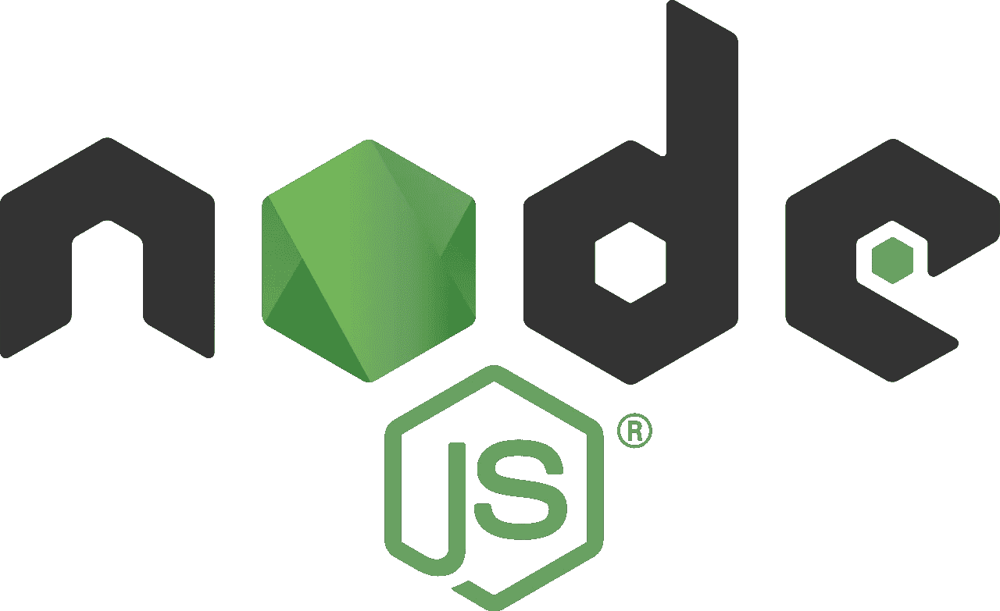

# 15 个框架 Node.js 开发者不容错过

> 原文：<https://javascript.plainenglish.io/15-framework-node-js-developers-cant-afford-to-miss-8197a52805c0?source=collection_archive---------0----------------------->

## 没有完美的框架，但是有好的框架。

Image Source: [https://commons.wikimedia.org/wiki/File:Node.js_logo.svg](https://commons.wikimedia.org/wiki/File:Node.js_logo.svg)

Node.js 是一个开源的 JavaScript 运行时。像任何编程语言一样，在浏览器之外运行 JavaScript 的执行环境。

这场革命允许世界上最流行的语言之一(JavaScript)用于客户端和服务器端脚本编程。

随着活跃的节点开发人员社区的增长，编程需求和解决这些需求的解决方案也成倍增加。这些解决方案已经整合到下面列出的框架中:

## 1.[分子](https://moleculer.services/)

Moleculer 是一个节点微服务框架。它是一个可扩展的框架，集成了许多可定制的模块，如缓存、传输器和序列化器。

此外，Moleculer 是一个具有容错能力的框架，集成了负载平衡、超时和自动中断。

## 2.[小伙子](https://github.com/ladjs/lad)

Lad 在前端和后端方面提供了多项高级功能，以及一系列针对安全性、性能和正确加载的集成微服务。它还具有自动翻译功能、电子邮件引擎以及高性能的错误管理系统。

## 3.[动作英雄](https://github.com/actionhero/actionhero)

ActionHero 是一个轻量级的快速节点框架，用于编程渐进式和可重用的 API 服务。它兼容各种 web 客户端和套接字，如 HTTP、HTTPS、TLS 和 TCP。

ActionHero 允许您创建后台任务，将它们放在不同的队列中，并在以后处理它们，这要感谢 Redis 支持的 Rescue 库。它还提供了一个优秀的缓存系统，分散通信，将数据从一个实体分发到多个服务器。

## 4. [KOA](https://koajs.com/)

Koa 允许使用限制回调使用的生成器。这反过来为开发人员提供了更好的错误处理。此外，Koa 将使您能够非常有效地管理页面的个性化，在单个 URL 中提供个性化的内容。

Koa 是一个轻量级但功能强大的节点框架，非常适合开发高性能和复杂的 web 应用程序。它提高了应用程序的互操作性和健壮性，并使编写中间件变得更加有趣。

## 5.[哈比神](https://github.com/hapijs/hapi)

Hapi.js 是一个高度可扩展的开源节点框架，用于 web 应用程序开发。哈比神框架兼容社交应用和实时聊天应用。它还支持 MySQL、MongoDB、Postgres 和其他数据库。

众多可靠的安全特性使得哈比神框架成为开发代理服务器和 REST APIs 的理想解决方案。它还提供了广泛的官方插件选择，允许您扩展其功能。

## 6.[风帆](https://github.com/balderdashy/sails)

Sails 是 Node.js 的 MVC(模型-视图-控制器)微框架。Sails 集成了与重要数据库兼容的 ORM(对象关系映射)解决方案，包括 MySQL、MongoDB 和 PostgreSQL。

船帆。Js 默认支持 Socket.io，使其成为社交媒体应用、聊天等的最佳选择之一。它还支持 Angular 和 React 等领先的前端技术。

## 7.[回环](https://loopback.io/)

LoopBack 是 Node.js 后端框架。LoopBack 使您能够快速、轻松地开发应用程序:它是一个通过易于使用的 CLI 管理的、有良好文档记录的开源框架。此外，它的结构化代码强调了它的模块化和可扩展性。

LoopBack 的特点是对数据存储、第三方访问和用户的出色管理。然而，它的优点是连接性:它可以连接到不同的数据库(如 Oracle、SQL、MongoDB 和 Postgres)，并且可以与其他节点框架和 API 服务集成。

## 8.[巢穴](https://github.com/nestjs/nest)

Nest 用于构建动态、可伸缩的服务器端企业级应用。它保证了模块化的体系结构，提供了出色的开发灵活性，并提供了支持各种库的完整开发工具包。

Nest 实现了 MVC 模式，并使用了 TypeScript，与 Angular 使用的 JavaScript 超集相同。因此，对于用 Nest.js 构建的后端应用程序和用 Angular 构建的前端应用程序，nest 和 Angular 经常一起使用。

## 9.[总计](https://www.totaljs.com/)

Total 是一个用纯 JavaScript 编写的开源节点框架。这看起来就像 Laravel 对于 PHP 或者 Django 对于 Python 一样。它用于编写 web 和桌面应用程序、物联网集成和云服务。Total 保证了一个稳定、快速、可扩展的开发过程，并且维护成本低。

它兼容各种前端框架(Angular、Polymer、Backbone.js、Bootstrap)以及 SQL 和 NoSQL 数据库(MySQL、MongoDB、PostgreSQL)。

## 10.[阿多尼斯](https://adonisjs.com/)

Adonis 是一个来自 Node 的 MVC 框架。它为开发人员提供了一个稳定的生态系统，用于编写服务器端可扩展的应用程序。此外，它易于使用，并为开发人员提供了一个安全的开发平台。特别是，使用 Laravel 的程序员对 Adonis 很熟悉，因为 Adonis 的 MVC 结构与 Laravel 非常相似。

这个 Node.js 框架支持 ORM 技术，允许通过 SQLite 和 Postgres 等数据库进行简单的数据管理。

## 11.[德比](https://github.com/derbyjs/derby)

Derby 是一个基于 MVC 框架的开源框架。它是一个全栈框架，兼容任何数据库和模块化—它使用 npm 来添加特性和功能。

Derby 被认为是实时开发 web 和移动协作应用程序的理想选择。它通过 Derby Racer 管理数据同步，Derby Racer 是一个用于浏览器、服务器和数据库之间数据同步的同步引擎。

## 12. [Feathers.js](https://feathersjs.com/)

Feathers.js 是一个极简和高度轻量级的 web 框架。它与几种前端技术无缝集成，并且是数据库不可知的——它通过单个接口为开发人员提供对关系和非关系数据库的支持。

它是一个具有实时功能的 NodeJs 框架，旨在简化 web 和移动应用程序的开发。此外，Feathers.js 允许集成插件，用于电子邮件、OAuth、令牌和其他机密用户信息的认证和授权。

## 13. [MEAN.io](https://github.com/linnovate/mean)

MEAN 是指一组开源技术(MongoDB、Express、AngularJS 和 Node.js)，为实时构建动态 web apps 提供了全栈 MVC 框架。

Mean.io 是一个完整的端到端开发堆栈，旨在以最佳方式集成不同的组件，而不需要额外的技术。

## 14.[按键音](https://github.com/keystonejs/keystone)

KeystoneJS 是一个开源许可的全栈框架，用于生成 GraphQL API 和 CMS。该框架与众多在线平台(如 Mandrill、Google Places 等)的本机集成也促进了数据管理。它是一个跨平台的框架，可以在 Windows、Mac、Linux 和 Solaris 操作系统上工作。

此外，Keystone 为内容管理提供了一个优秀的用户界面，可以根据您的需要定制路径和数据结构。

## 15.[重新定义](https://github.com/restify/node-restify)

Restify 是最早为 Nodejs 创建的框架之一。它旨在与 HTTP 操作、循环请求及其响应无缝集成。

由于使用了 Socket.io，Restify 可以实时保存数据，socket . io 提供了服务器端和客户端的双向通信以及对 DTrace 的自动支持。它还提供各种函数来拦截和管理错误，以便快速正确地编程。

# 结论

世上没有最好的节点框架。相反，在信息技术中，总是有最能满足特定需求的解决方案。这些框架各有利弊。根据自己的需求选择加深哪一个！

*更多内容看*[***plain English . io***](http://plainenglish.io)