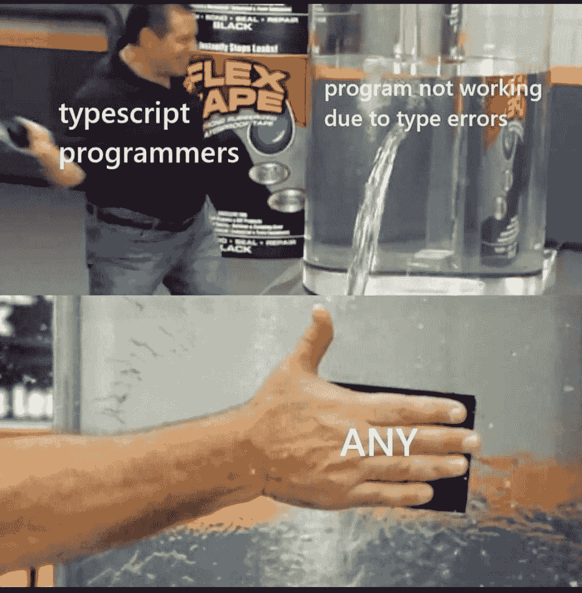
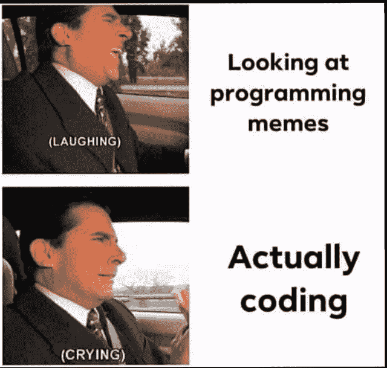
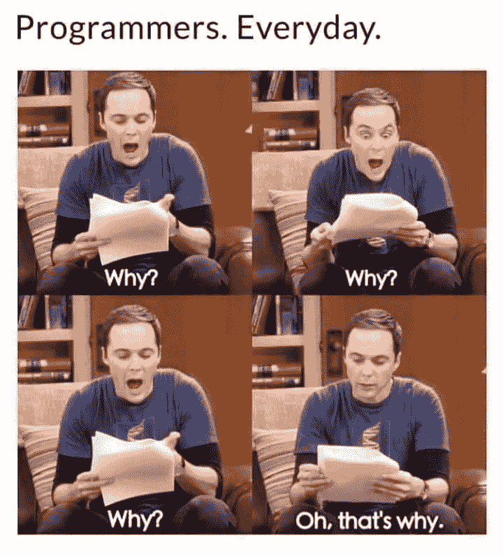
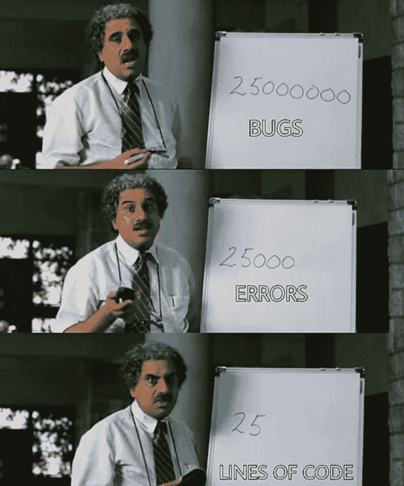

# 15 个只有程序员能理解的搞笑笑话

> 原文：<https://javascript.plainenglish.io/15-funny-jokes-only-programmers-can-understand-a50eb2eac66c?source=collection_archive---------1----------------------->

## 2021 年最佳编程笑话汇编


Photo by [Tim Mossholder](https://unsplash.com/@timmossholder?utm_source=medium&utm_medium=referral) on [Unsplash](https://unsplash.com?utm_source=medium&utm_medium=referral)

生活是不确定的，有时你会快乐或悲伤，但我们无法控制事情。你唯一能做的就是接受现状，无论如何都要开心。

我们(开发者)也是一样，有时候能解决或完成任务就很开心，有时候需要保持清醒直到完成某件事。

但是所有这些谈话和这篇文章之间有什么关系呢？关系是享受生活的每一刻，不管你周围的事情如何。

今天，我整理了一些与编程有关的最好的笑话，它们肯定能帮助你提高幸福感。

```
***A boy looks inside a girls shirt in a class.******Girl : Its bad manners***
***Boy : No. Its not***
***Girl : Y?***
***Boy : Members of the same class can access private data***
```

```
3 Database Admins walked into a NoSQL bar. A little while later they walked out because they couldn't find a table.
```

```
There is a C level. Everything above that is High level, eveything below that is Low level.
```

**来源:**

[https://www . Reddit . com/r/AskReddit/comments/1kv hmz/whats _ the _ best _ programming _ joke _ that _ you _ know/](https://www.reddit.com/r/AskReddit/comments/1kvhmz/whats_the_best_programming_joke_that_you_know/)

# 如何避免线头问题？用任何…英雄联盟



[https://www.facebook.com/photo/?fbid=507053803737120&set=gm.2892947247639492](https://www.facebook.com/photo/?fbid=507053803737120&set=gm.2892947247639492)

# 让我们与模拟响应并行工作，稍后我们将集成…


[https://www.facebook.com/101406868766057/photos/a.111476934425717/152664723640271/](https://www.facebook.com/101406868766057/photos/a.111476934425717/152664723640271/)

# 字面上的我，现在…



[https://www.facebook.com/101406868766057/photos/a.111476934425717/152664863640257/](https://www.facebook.com/101406868766057/photos/a.111476934425717/152664863640257/)

# 文档是什么？我知道，斯达克弗洛。


[https://www.facebook.com/photo?fbid=3878936845549373&set=gm.944860159405928](https://www.facebook.com/photo?fbid=3878936845549373&set=gm.944860159405928)

# 为什么它不工作…嗯…哦…这就是为什么…



[https://www.facebook.com/CodersPhilippines/photos/a.103712541841220/150585230487284/](https://www.facebook.com/CodersPhilippines/photos/a.103712541841220/150585230487284/)

# 找不到相同的结果，但是的…这是完美的定义


[https://www.facebook.com/photo/?fbid=4637136529652355&set=gm.6513183998707329](https://www.facebook.com/photo/?fbid=4637136529652355&set=gm.6513183998707329)

# 行内注释就像…


[https://www.reddit.com/r/ProgrammerHumor/comments/oxpi0x/inline_comments_be_like/](https://www.reddit.com/r/ProgrammerHumor/comments/oxpi0x/inline_comments_be_like/)

# 当你需要向你的经理解释某事时…


[https://www.reddit.com/r/ProgrammerHumor/comments/oxr93p/how_why/](https://www.reddit.com/r/ProgrammerHumor/comments/oxr93p/how_why/)

# 任何人都不应该碰一个功能…即使它没有用…


[https://www.reddit.com/r/ProgrammerHumor/comments/ox51s7/tf_does_it_even_do/](https://www.reddit.com/r/ProgrammerHumor/comments/ox51s7/tf_does_it_even_do/)

# 自动化脚本正在运行，但没有人更新它们…


[https://www.monkeyuser.com/2019/the-superficial-high/?sc=true&dir=random](https://www.monkeyuser.com/2019/the-superficial-high/?sc=true&dir=random)

# 奖励时间:

# 我还没想到土豆的这种深层次的激励信息…


[https://www.facebook.com/javascriptJS/photos/a.1387402908063976/2154381918032734/](https://www.facebook.com/javascriptJS/photos/a.1387402908063976/2154381918032734/)

# 乍一看，对我来说是一样的..然后发现括号是如何处理的…可能太旧了，因为我们现在已经格式化了…


[https://www.facebook.com/groups/programming.jokes](https://www.facebook.com/groups/programming.jokes)

# 当我的学长要求编写单元测试时…我相信我的程序也是这样做的…


[https://www.monkeyuser.com/](https://www.monkeyuser.com/)

# 语法错误，我们这里不这样做… python


Source:[https://www.facebook.com/programminggeeks.in](https://www.facebook.com/programminggeeks.in)

# 当你想象编程术语在我脑海中的样子…


[https://www.monkeyuser.com/](https://www.monkeyuser.com/)

# 可能需要两者的同等比例来平衡行业…


[https://www.facebook.com/techindustan/](https://www.facebook.com/techindustan/)

# 电影《三个白痴》中的一段对话是关于薪酬的，这与软件行业的薪酬完全相符…



[https://www.thecoderpedia.com/blog/programming-memes](https://www.thecoderpedia.com/blog/programming-memes)

# 谁能定义什么是最好的开发者？对我来说，大概是这样的…


[https://www.monkeyuser.com/](https://www.monkeyuser.com/)

# 当你和很多人打交道时…一切都是公平的…甚至谎言也是…哈哈


[https://www.facebook.com/javascriptJS/photos/a.1387402908063976/2150614578409468/](https://www.facebook.com/javascriptJS/photos/a.1387402908063976/2150614578409468/)

# 最糟糕的时刻是当你的学长要求一起审查我的代码，因为他什么也不懂…


[https://www.facebook.com/ProgrammersCreateLife](https://www.facebook.com/ProgrammersCreateLife)

# 延伸阅读:

[](/15-best-programming-jokes-to-lighten-your-mood-5d7dc653f9e5) [## 15 个让你心情轻松的最佳编程笑话

### 最佳编程笑话汇编

javascript.plainenglish.io](/15-best-programming-jokes-to-lighten-your-mood-5d7dc653f9e5) [](/20-hilarious-memes-for-those-who-have-worked-in-the-agile-framework-e6c17b4d8260) [## 20 个有趣的迷因给那些在敏捷框架中工作的人

### 最佳敏捷开发笑话汇编

javascript.plainenglish.io](/20-hilarious-memes-for-those-who-have-worked-in-the-agile-framework-e6c17b4d8260) [](/corporate-jargon-hilarious-phrases-we-use-daily-and-what-we-actually-mean-by-them-160ffb2a03a3) [## 我们在办公室或家里日常工作中使用的俚语

### 他们所说的和他们真正的意思

javascript.plainenglish.io](/corporate-jargon-hilarious-phrases-we-use-daily-and-what-we-actually-mean-by-them-160ffb2a03a3) 

*更多内容尽在*[***plain English . io***](http://plainenglish.io/)