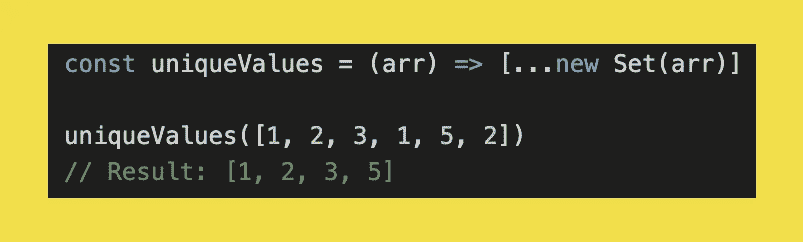

# 15 个有用的 JavaScript 一行程序

> 原文：<https://javascript.plainenglish.io/15-helpful-javascript-one-liners-946e1d1a1653?source=collection_archive---------1----------------------->

## 只需几分钟就能更好地掌握 JavaScript

无论您是 JavaScript 新手还是更有经验的开发人员，学习一些新东西总是好的。在本文中，我们将浏览一组 JavaScript 一行程序，希望这些程序可以帮助您解决一些您最终会遇到的日常 JavaScript 问题。

希望你能学到一两件事！

# 1.生成一个范围内的随机数

使用 *Math.random()* 函数可以很容易地在 JavaScript 中获得一个随机值。但是一定范围内的随机数呢？对此没有标准的 JavaScript 函数。下面的函数可以用来解决这个问题。


注意*最大*值是*包含在*范围内。如果您想从范围中排除*最大值*，您可以从功能中删除`+ 1`。

```
const randomNumberInRange = (min, max) => Math.floor(Math.random() * (max - min + 1)) + min;
```

# 2.切换布尔值

切换布尔值是所有编程书籍中最古老的技巧之一。一个非常基本的编程问题，可以用很多不同的方法解决。不要使用 if 语句来确定将布尔值设置为什么值，而是可以使用下面的函数——在我看来这是最干净的方法。


```
const toggle = (value) => value = !value
```

# 3.以随机顺序对数组元素进行排序

使用 *Math.random()* 函数可以对数组中的元素进行随机排序。这是一个常见问题的非常简洁的解决方案。但是，这种排序方式不应该用于实现完全的随机性。为此，应该使用 *sort()* 函数**而不是**。你可以在这里找到关于这个话题[的更多信息。](https://javascript.info/task/shuffle)


```
const sortRandom = (arr) => arr.sort(() => Math.random() - 0.5)
```

# 4.将字符串大写

与 Python、C#和 PHP 等其他流行的编程语言不同，JavaScript 没有允许将字符串大写的功能。然而，这是一个经常使用的基本功能。你可以在这个函数中放入一个单词或一个完整的句子，只要它是一个字符串。


```
const capitalize = (str) => str.charAt(0).toUpperCase() + str.slice(1)
```

# 5.检查变量是否是数组

有几种方法可以检查一个变量是否是一个数组，但这是我更喜欢的方法——简洁且易于理解。


```
const isArray = (arr) => Array.isArray(arr)
```

# 6.从 URL 提取主机名

虽然这个函数从技术上来说不是一行程序，但它仍然是一个非常有用的函数。这对于检查链接是外部的还是内部的很有用。在此基础上，您可以为某些链接添加不同的行为或样式。

这个函数也适用于包含端口号或查询字符串的 URL。


```
const extractHostname = (url) => {
  let hostname = (url.indexOf("//") > -1) ? url.split('/')[2] : url.split('/')[0] // Remove port number.
  hostname = hostname.split(':')[0] // Remove querystring.
  hostname = hostname.split('?')[0] return hostname
}
```

# 7.获取数组中的唯一值

一个非常简单，但是非常简洁的技巧来删除数组中所有重复的值。这个技巧将我们用作第一个参数的数组转换成一个*集合*，然后再转换回一个数组。



```
const uniqueValues = (arr) => [...new Set(arr)]
```

# 8.检查数组中的所有项目是否满足特定条件

*every* 方法检查数组中的所有元素是否满足特定条件。此方法将回调作为其唯一的参数，并返回一个布尔值。

*提示:如果你只需要数组中的一个元素来满足某个条件，你可以使用 some()方法。*


```
const isOldEnough = (age) => age >= 18
const ages = [7, 19, 12, 33, 15, 49]ages.every(isOldEnough) // Results in falseconst olderPeople = [39, 51, 33, 65, 49]olderPeople.every(isOldEnough) // Results in true
```

# 9.基于区域设置格式化浮动

格式化浮动可以通过几种方式来完成。但是，如果您使用的应用程序支持多种语言环境，格式可能会有所不同。下面的一行程序支持不同地区的格式化浮点。

*提示:如果您需要支持多个地区，您可以为该地区向该函数添加第三个参数。*


```
const formatFloat = (floatValue, decimals) => parseFloat(floatValue.toFixed(decimals)).toLocaleString("en-US")
```

# 10.更新查询字符串

例如，在使用过滤器时，更新查询字符串非常有用。这里有一个例子，说明如何用 JavaScript 的 *URLSearchParams* 接口更新查询字符串。


```
const searchParams = new URLSearchParams(window.location.search)searchParams.set('key', 'value')history.replaceState(null, null, '?' + searchParams.toString())
```

注意，传递给 *URLSearchParams* 的 *window.location.search* 将保持当前查询字符串不变。这意味着，在本例中， *key=value* 将被添加到当前查询字符串中。如果您想从头开始构建一个查询字符串，请省略 *window.location.search* 参数。

# 11.只允许正数

有时候，您希望变量只包含正数。您可以使用下面的一行程序，而不必使用 if 语句来检查数字是否为负数:


```
const getPositiveNumber = (number) => Math.max(number, 0)
```

可以使用这个一行程序代替如下所示的代码片段:


*Math.max()* 的解决方案干净多了吧？

# 12.显示打印对话框

下面一行代码将显示打印对话框，如果您想为用户提供一种友好的方式来打印您网站上的某个页面，这个对话框会很有帮助。

```
const showPrintDialog = () => window.print()
```

# 13.将文本复制到剪贴板

将文本复制到剪贴板是一个问题，可以通过多种方式解决。

如果您只关心支持现代浏览器，下面的例子就足够了:


```
const copyTextToClipboard = async (text) => {
  await navigator.clipboard.writeText(text)
}
```

这是一个非常干净的解决方案，不依赖于任何 DOM 元素。

*注意，这个函数是异步的，因为 writeText 函数返回一个承诺。*

然而，如果你想支持像 Internet Explorer 这样的老浏览器，你必须采用这种方法:


这种解决方案依赖于输入字段，而不是以前的基于承诺的解决方案。

```
// HTML<input id="input" type="text" value="This is the text that gets copied">
<button id="copy">Copy the text</button>// JavaScriptconst copy = () => {
  const copyText = document.querySelector('#input')
  copyText.select()
  document.execCommand('copy')
}

document.querySelector('#copy').addEventListener('click', copy)
```

# 14.将数组中的所有值强制转换

我们可以在一个数组上使用 *map* 函数来将它的所有条目转换成某种类型。在示例中，您将看到我们首先将一个字符串数组转换为一个数字数组。之后，我们将数字数组转换为布尔值。


```
const arrayToNumbers = (arr) => arr.map(Number)
const numbers = arrayToNumbers(['0', '1', '2', '3'])const arrayToBooleans = (arr) => arr.map(Boolean)
const booleans = arrayToBooleans(numbers)
```

# 15.计算两个日期之间的天数

如果您经常用 JavaScript 编程，计算两个日期之间的天数可能会不止一次。为了省去每次都要弄清楚如何解决这个问题的麻烦，您可以使用这个为您提供便利的函数。

由于使用了 *Math.abs()* ，日期参数的顺序无关紧要。


```
const daysBetweenDates = (dateA, dateB) => {
  const timeDifference = Math.abs(dateA.getTime() - dateB.getTime())

  // Seconds * hours * miliseconds
  return Math.floor(timeDifference / (3600 * 24 * 1000))
}daysBetweenDates(new Date('2020/10/21'), new Date('2020/10/29'))
// Result: 8daysBetweenDates(new Date('2020/10/21'), new Date('2021/10/29'))
// Result: 373
```

# 就这样！

现在你已经达到了这个列表的末尾，我希望你学到了一些新的东西。希望您能够将其中一些技巧付诸实践。如果你知道一个很棒的 JavaScript 单行，但不在这个列表上，请告诉我。我想看更多精彩的俏皮话。

谢谢你的阅读！