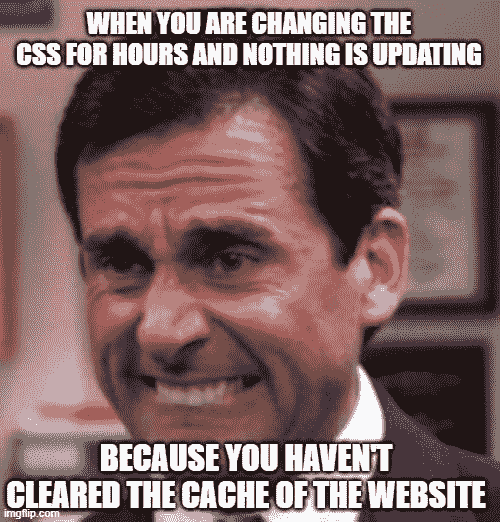
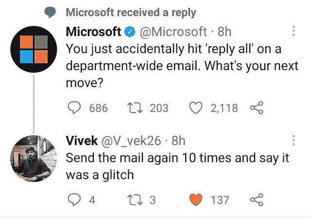
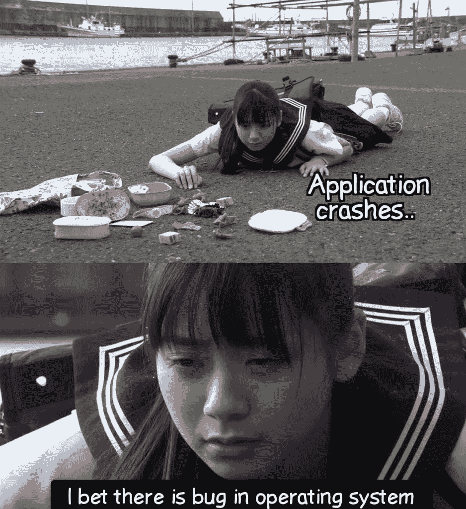
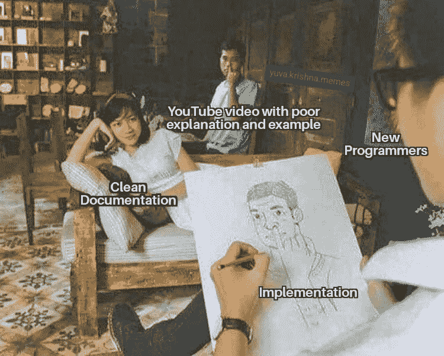
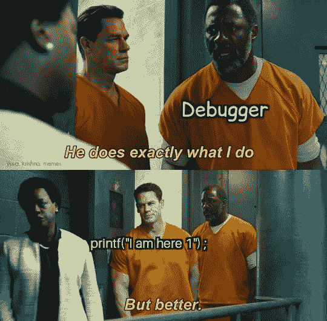
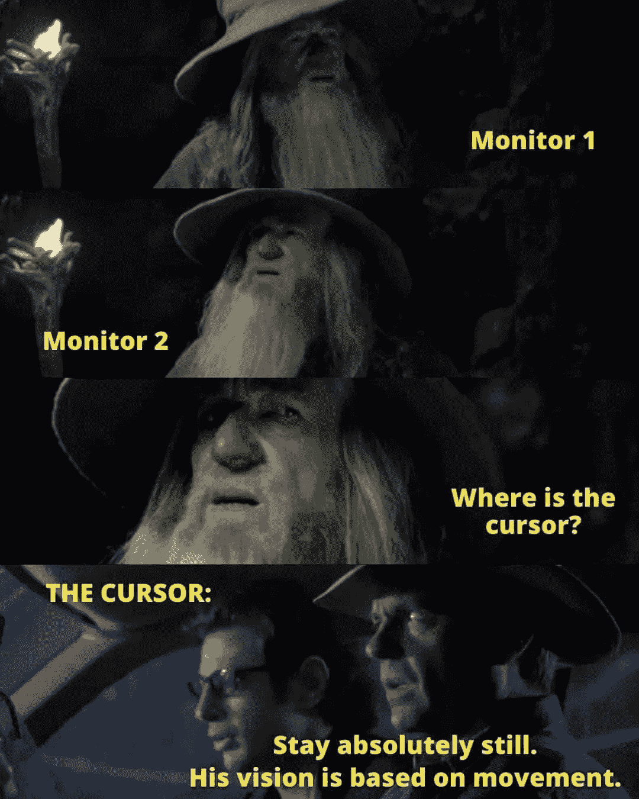
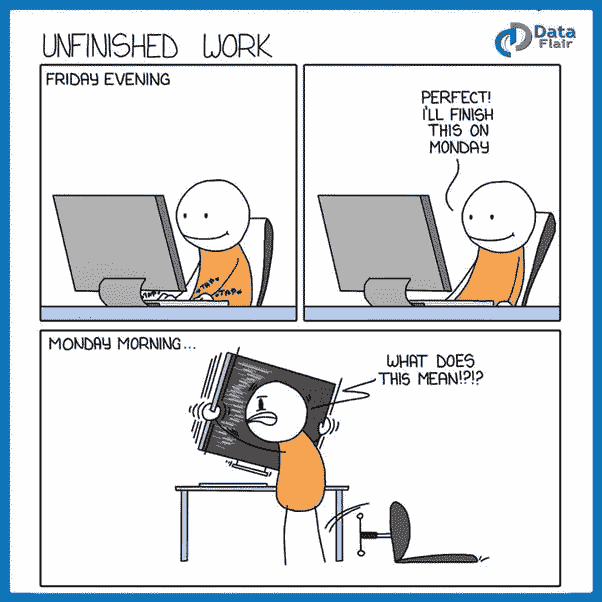
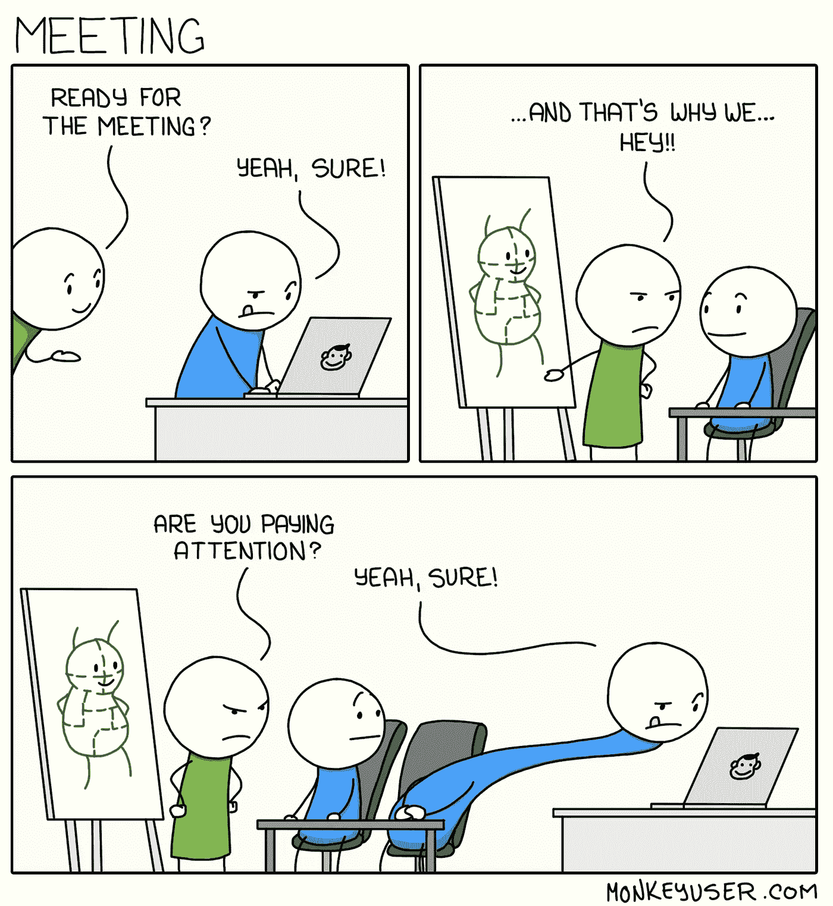
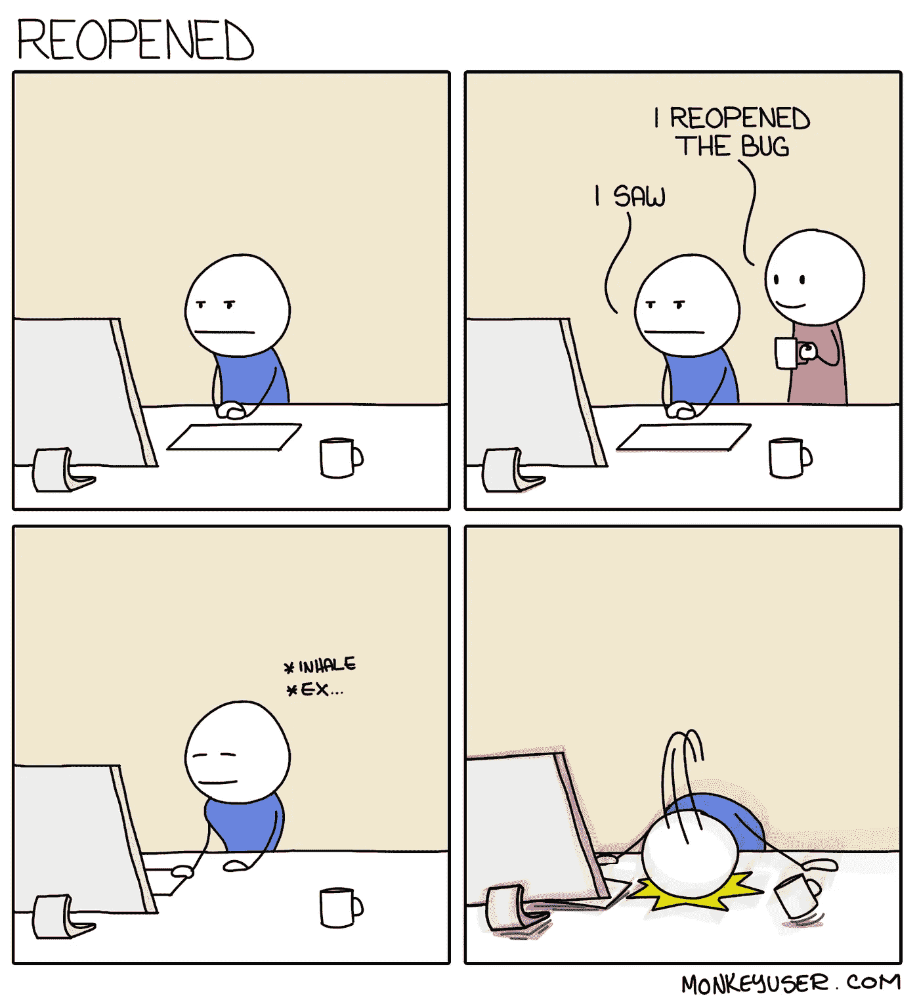

# 15 个只有程序员能理解的蹩脚笑话

> 原文：<https://javascript.plainenglish.io/15-lame-jokes-only-programmers-can-understand-6db955ae84b2?source=collection_archive---------1----------------------->

## 程序员的最佳幽默

Photo by [MI PHAM](https://unsplash.com/@phammi?utm_source=medium&utm_medium=referral) on [Unsplash](https://unsplash.com?utm_source=medium&utm_medium=referral)

你是程序员吗？如果是的话，你是否需要打破常规，找点乐子？在这篇文章中，我收集了一些最好的笑话，它们肯定会像“刷新”按钮一样为你工作。

# 展示自己的作品总是更好… LOL

[https://www.facebook.com/DZoneInc/photos/a.336758034711/10159513354989712](https://www.facebook.com/DZoneInc/photos/a.336758034711/10159513354989712)

# 发生了很多次…我总是去不同的页面…

[https://www.facebook.com/DZoneInc/photos/a.336758034711/10159513354989712](https://www.facebook.com/DZoneInc/photos/a.336758034711/10159513354989712)

# 为什么编译器不够智能，无法自动修复所有问题？

[https://www.facebook.com/DZoneInc/photos/a.336758034711/10159505422369712/](https://www.facebook.com/DZoneInc/photos/a.336758034711/10159505422369712/)

# 看起来很管用…那应该够了…哈哈…

[https://www.facebook.com/DZoneInc/photos/a.336758034711/10159501229644712/](https://www.facebook.com/DZoneInc/photos/a.336758034711/10159501229644712/)

# 我们周一继续吧…

[https://www.facebook.com/photo?fbid=2965577677092733&set=gm.2875612219372995](https://www.facebook.com/photo?fbid=2965577677092733&set=gm.2875612219372995)

# 时间是可以定义的，程序员

[https://www.facebook.com/photo?fbid=352070916544458&set=gm.2875632262704324](https://www.facebook.com/photo?fbid=352070916544458&set=gm.2875632262704324)

# 你身后藏着可怕的东西…

[https://www.facebook.com/DZoneInc/photos/10159479172079712](https://www.facebook.com/DZoneInc/photos/10159479172079712)

# 那种和平是无法想象的…

[https://www.facebook.com/javascriptJS/photos/a.1387402908063976/2251831714954420/](https://www.facebook.com/javascriptJS/photos/a.1387402908063976/2251831714954420/)

# 在家工作…饼图…老实说，不是真的…

[https://www.facebook.com/yuva.krishna.memes](https://www.facebook.com/yuva.krishna.memes)

# 开发与质量保证版本…

[https://www.monkeyuser.com/2018/happy-flow/?sc=true&dir=random](https://www.monkeyuser.com/2018/happy-flow/?sc=true&dir=random)

# 当任务管理器有责任关闭没有响应的东西时…

[https://www.facebook.com/photo?fbid=10159630257979673&set=gm.2870233513227290](https://www.facebook.com/photo?fbid=10159630257979673&set=gm.2870233513227290)

# 奖金时间

# 你喜欢幸运饼干吗？如果你收到这个，作为一个开发者你的反应是什么？

[https://www.facebook.com/yuva.krishna.memes](https://www.facebook.com/yuva.krishna.memes)

# 我也有同样的感觉…当我很少用纸和笔写字的时候…

[https://www.facebook.com/yuva.krishna.memes](https://www.facebook.com/yuva.krishna.memes)

# 我不在乎，我知道这是一种不好的态度，但让我享受这种感觉…

[https://www.facebook.com/yuva.krishna.memes](https://www.facebook.com/yuva.krishna.memes)

# 一切皆有可能..不管怎样，你都可以得到结果。

[https://www.facebook.com/yuva.krishna.memes](https://www.facebook.com/yuva.krishna.memes)

# 奖励时间:

# 当你是一名 UI 开发人员时的那种感觉…

[https://www.facebook.com/DZoneInc/photos/a.336758034711/10159569905119712/](https://www.facebook.com/DZoneInc/photos/a.336758034711/10159569905119712/)

**来源:**【https://www.facebook.com/DZoneInc】T2

# 好主意…

[https://www.facebook.com/DZoneInc/photos/a.336758034711/10159571645609712/](https://www.facebook.com/DZoneInc/photos/a.336758034711/10159571645609712/)

【https://www.facebook.com/DZoneInc】来源:

# 应用程序没有问题…可能是操作系统有问题…

[https://www.facebook.com/yuva.krishna.memes/photos/a.105527467815845/393835342318388/](https://www.facebook.com/yuva.krishna.memes/photos/a.105527467815845/393835342318388/)

**来源:**[https://www.facebook.com/yuva.krishna.memes/](https://www.facebook.com/yuva.krishna.memes/photos/a.105527467815845/393835342318388/)

# 当我选择一个不同的解释…并最终错了…

[https://www.facebook.com/yuva.krishna.memes/photos/a.105527467815845/392224995812756/](https://www.facebook.com/yuva.krishna.memes/photos/a.105527467815845/392224995812756/)

**来源:**[https://www.facebook.com/yuva.krishna.memes/](https://www.facebook.com/yuva.krishna.memes/photos/a.105527467815845/393835342318388/)

# Printf 和 Console.log 永远是调试的首选…

[https://www.facebook.com/yuva.krishna.memes/photos/a.105527467815845/392218212480101/](https://www.facebook.com/yuva.krishna.memes/photos/a.105527467815845/392218212480101/)

**来源:**[https://www.facebook.com/yuva.krishna.memes/](https://www.facebook.com/yuva.krishna.memes/photos/a.105527467815845/393835342318388/)

# 哈哈…但这也是客户代表给的第一个建议…

[https://www.facebook.com/photo/?fbid=2200511293425288&set=gm.6577293868963008](https://www.facebook.com/photo/?fbid=2200511293425288&set=gm.6577293868963008)

**来源:【https://www.facebook.com/groups/it.humor.and.memes】T22**

# 广告…他们创建一个弹出窗口——“看起来你正在使用广告块”

[https://www.facebook.com/socialhax/photos/a.814008878654578/4263937503661681/](https://www.facebook.com/socialhax/photos/a.814008878654578/4263937503661681/)

**来源:**【https://www.facebook.com/groups/it.humor.and.memes】T2

# 经常发生…当我的光标玩捉迷藏的时候…

[https://www.facebook.com/codevweb95/photos/a.109799858049136/122073340155121/](https://www.facebook.com/codevweb95/photos/a.109799858049136/122073340155121/)

【https://www.facebook.com/groups/programmer.wey/】来源:

# 你的代码…你的问题…即使你们在同一个团队…

[https://www.facebook.com/codevweb95/photos/a.109799858049136/121960703499718/](https://www.facebook.com/codevweb95/photos/a.109799858049136/121960703499718/)

**来源:**[https://www.facebook.com/codevweb95/](https://www.facebook.com/codevweb95/)

# 经常发生..当我忘记周五我在做什么的时候…

[https://www.facebook.com/codevweb95/photos/a.109799858049136/122580386771083/](https://www.facebook.com/codevweb95/photos/a.109799858049136/122580386771083/)

**来源:**[https://www.facebook.com/codevweb95/](https://www.facebook.com/codevweb95/)

# 有时你被一些工作困住，需要参加一个会议…

[https://www.monkeyuser.com/2019/meeting/?sc=true&dir=random](https://www.monkeyuser.com/2019/meeting/?sc=true&dir=random)

**来源:**[https://www.monkeyuser.com/](https://www.monkeyuser.com/)

# 当 QA 发现一个不同的场景失败了，bug 被重新打开…

[https://www.monkeyuser.com/2018/reopened/?sc=true&dir=random](https://www.monkeyuser.com/2018/reopened/?sc=true&dir=random)

**来源:【https://www.monkeyuser.com/】T22**

> 如果你喜欢这篇文章，请用这个链接加入 Medium，它帮助我得到一点钱。

> [“从此链接加入](https://sheetalpatel93.medium.com/membership)”

# 来源:

 [## 最佳编程笑话

### 所有这些笑话现在都在我的新编程漫画中有插图。看看吧！~~~~~~~~~~两个字节…

www.devtopics.com](https://www.devtopics.com/best-programming-jokes/)  [## 45 个只有程序员才会懂的内幕笑话

### 做一名程序员并不容易。他们整天编码，整夜调试，检查成千上万的代码行，试图…

www.hongkiat.com](https://www.hongkiat.com/blog/programming-jokes/) 

*更多内容请看*[***plain English . io***](http://plainenglish.io/)