# 15 种只有程序员才能理解的迷因

> 原文：<https://javascript.plainenglish.io/15-memes-only-programmers-can-relate-to-447d5874cb5f?source=collection_archive---------1----------------------->

## 我笑了整整两分钟，你也会喜欢:D 的

Photo by [Magdalena Smolnicka](https://unsplash.com/@magdaleny?utm_source=unsplash&utm_medium=referral&utm_content=creditCopyText) on [Unsplash](https://unsplash.com/s/photos/humor?utm_source=unsplash&utm_medium=referral&utm_content=creditCopyText)

编程是一项艰苦的工作。当我们坐在电脑前时，可能不会流汗(虽然我有时会流汗)，但对于我们来说，在截止日期前完成任务和解决问题是一种巨大的精神压力。

所以，让我们休息一下，享受一些迷因。我保证这将是你今天度过的最有趣的两分钟。

想法:互联网

照片和编辑致谢:作者

## 迷因 1:

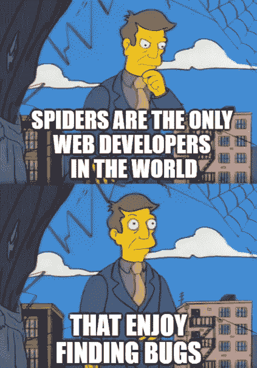

Credit: Author/Adobe Photoshop

## 迷因 2:

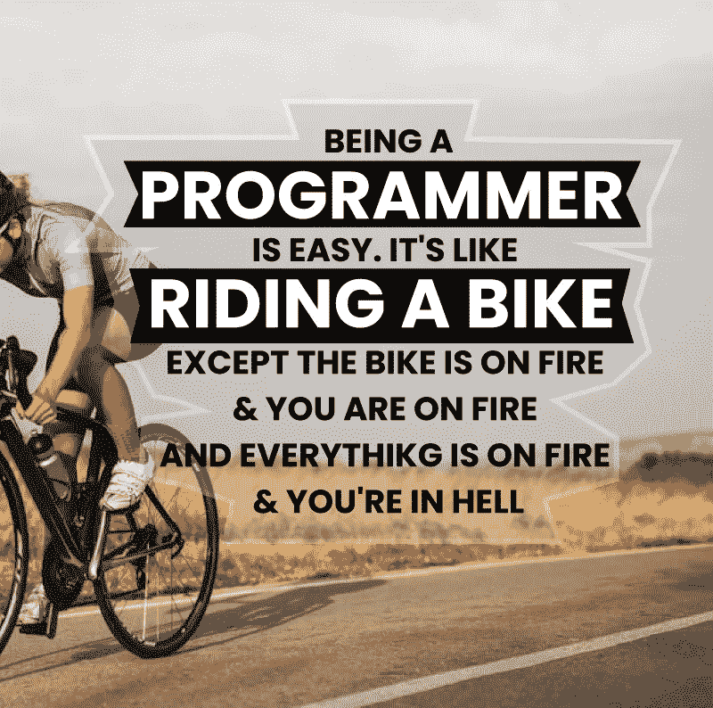

Credit: Author/Adobe Photoshop

## 迷因 3:

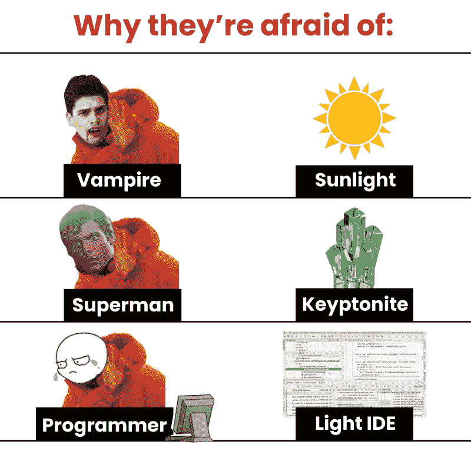

Credit: Author/Adobe Photoshop

## 迷因 4:

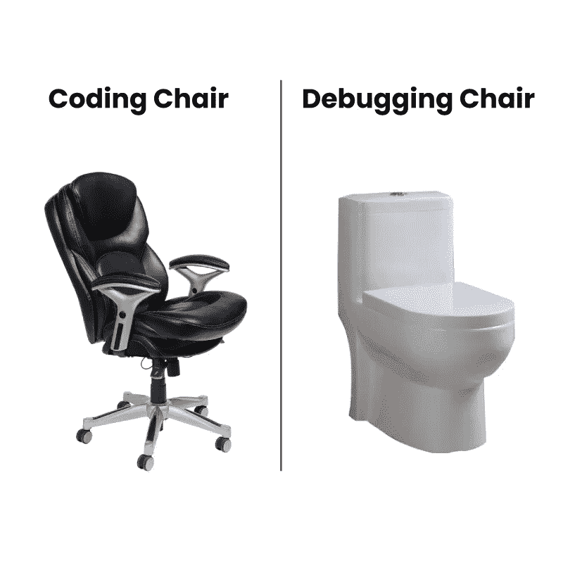

Credit: Author/Adobe Photoshop

## 迷因 5:

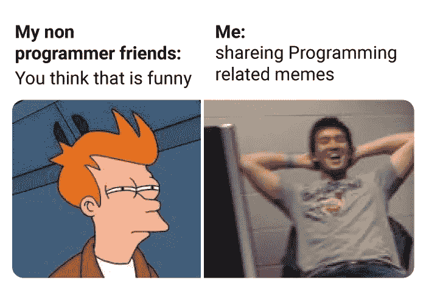

Credit: Author/Adobe Photoshop

## 迷因 6:

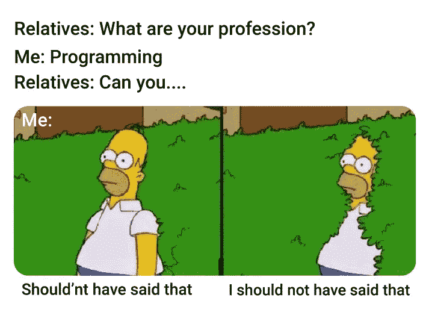

Credit: Author/Adobe Photoshop

## 迷因 7:

Credit: Author/Adobe Photoshop

## 迷因 8:

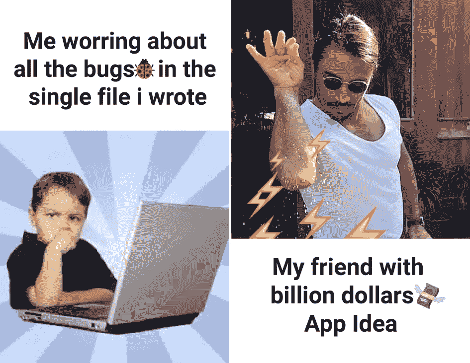

Credit: Author/Adobe Photoshop

## 迷因 9:

Credit: Author/Adobe Photoshop

## 迷因 10:

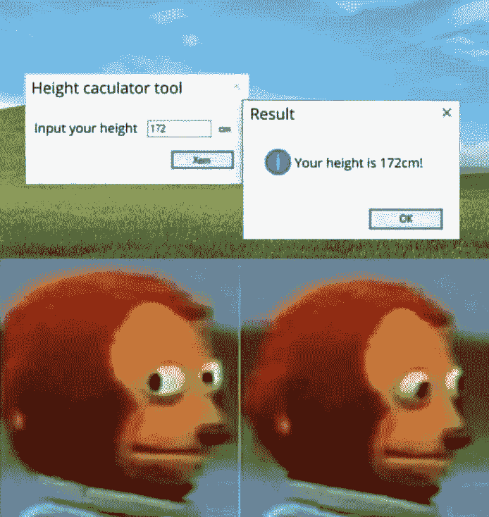

Credit: Author/Adobe Photoshop

## 迷因 11:

Credit: Author/Adobe Photoshop

## 迷因 12:

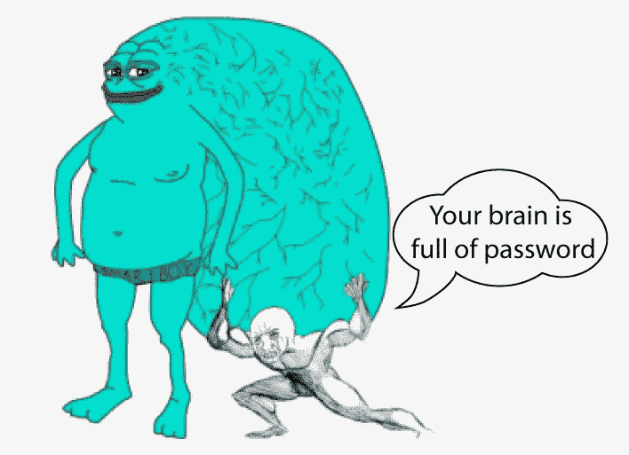

Credit: Author/Adobe Photoshop

## 迷因 13:

Credit: Author/Adobe Photoshop

## 迷因 14:

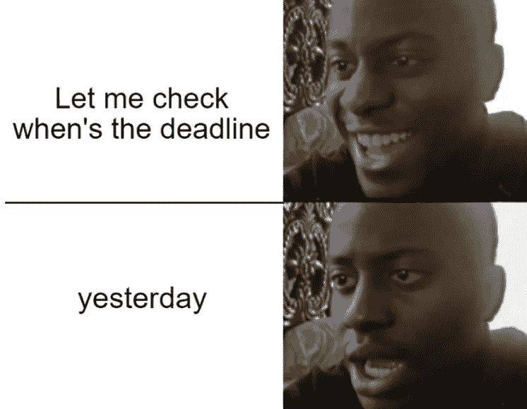

Credit: Author/Adobe Photoshop

## 迷因 15:

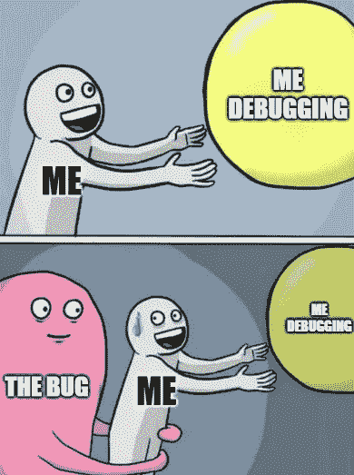

Credit: Author/Adobe Photoshop

*在评论区告诉我你最喜欢哪一个。*

*更多内容尽在*[***plain English . io***](http://plainenglish.io/)