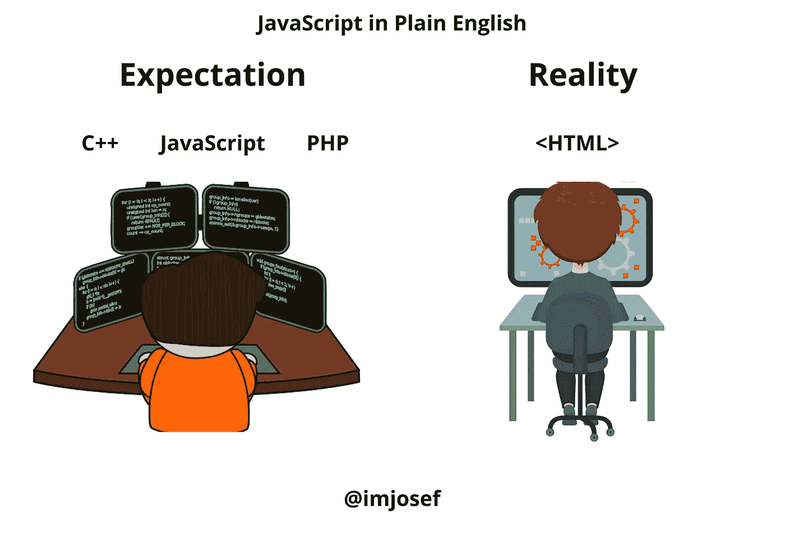

# 所有程序员都能理解的 15 个有趣的期望与现实

> 原文：<https://javascript.plainenglish.io/15-things-all-programmers-can-relate-to-7db1ce811b8?source=collection_archive---------0----------------------->

## 有趣的幽默比在一堆代码中发现一个 bug 更快

[Credit: Youtube Channel of Meredith Mao](https://www.youtube.com/watch?v=aSquBQuo_74)

在我作为程序员的整个职业生涯中，我已经痛苦地认识到，编程是极其困难的，但当你看到自己努力工作的结果时，编程也是有趣的。

我确信所有的程序员和类似的人都能理解下面这些期望与现实之间的冲突。

# 1.每个人都认为程序员在做什么

Photo supplied by the author

# 2.简而言之，所有网络/软件/应用程序开发计划

Photo supplied by the author

# 3.新开发人员是什么样的

Photo supplied by the author

# 4.调试就像

Photo supplied by the author

# 5.我的老板认为我在做什么

Photo supplied by the author

# 5.当我编译我的代码时

Photo supplied by the author

# 6.当我编译我的代码时，它突然工作了

Photo supplied by the author

# 7.当你不能接受残酷的事实时

Photo supplied by the author

# 8.当你认为自己是一个铁杆程序员的时候

Photo supplied by the author

# 9.明天是你的最后期限

Photo supplied by the author

# 10.开发人员的关系状态

Photo supplied by the author

# 11.自由开发者可以理解

Photo supplied by the author

# 12.我不知道我在做什么

Photo supplied by the author

# 13.当你意识到你写了代码

Photo supplied by the author

# 14.开发商在每一分钟

Photo supplied by the author

# 15.新程序员是什么感觉

Photo supplied by the author

编程可能很难，但是在内心深处，你可以比在一堆代码中发现一个错误更快地发现有趣的幽默。