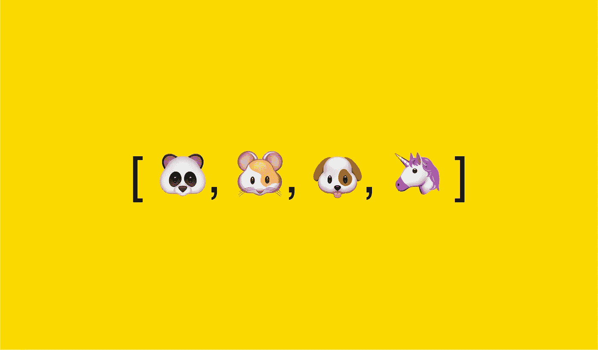

# 每个优秀的 Web 开发人员都应该知道的 16 种 JavaScript 数组方法

> 原文：<https://javascript.plainenglish.io/16-javascript-array-methods-that-every-good-web-developer-should-know-1601da8f3026?source=collection_archive---------4----------------------->

## 内置 JavaScript 数组方法的列表。



Image created by the author | Emoji credits: [emojipedia.org](https://emojipedia.org)

JavaScript 为您提供了一系列处理数组的内置方法。
我们将列出 16 种这样的方法，帮助你提高 JavaScript 开发技能。

# 1.包含

`includes`方法检查数组，如果给定元素存在则返回`true`，如果不存在则返回`false`。

```
const numbers = [1, 2, 3, 4, 5];console.log(numbers.includes(3)); // true
console.log(numbers.includes(3, 3)); // false
```

`includes`方法还接受第二个参数，即开始检查的起始位置。

# **2。地图**

`map`方法获取给定数组的单个元素，并根据传递的函数更改其值，然后返回一个包含这些修改值的新数组。

```
const numbers = [1, 2, 3, 4, 5];
const squared = numbers.map((e) => e ** 2);console.log(squared); // [ 1, 4, 9, 16, 25 ]
```

# 3.过滤器

`filter`方法根据传递的函数中的条件检查数组中的每个元素，并且只返回满足该条件的元素。

```
const numbers = [1, 2, 3, 4, 5];
const result = numbers.filter((element) => element % 2 === 0);console.log(result); // [ 2, 4 ]
```

# 4.为每一个

方法为数组的每个元素运行一次函数。

```
const numbers = [1, 2, 3, 4, 5];numbers.forEach((element) => {
  const message =
    element % 2 === 0
      ? `${element} is an even number`
      : `${element} is an odd number`;console.log(message);});// output: 
// 1 is an odd number
// 2 is an even number
// 3 is an odd number
// 4 is an even number
// 5 is an odd number
```

# **5。减少**

`reduce`方法采用一个带有两个参数的函数，第一个参数用于累加结果，第二个参数用于在迭代时保存当前元素值。在执行给定函数中的操作后，将返回该累积值。

```
const numbers = [1, 2, 3, 4, 5];
const result = numbers.reduce(
    (totalSum, currentValue) => totalSum + currentValue
);console.log(result); // 15
```

# 6.分类

默认情况下,`sort`方法按照升序对数组中的元素进行排序。

```
const numbers = [2, 3, 1, 5, 4];console.log(numbers.sort()); // [ 1, 2, 3, 4, 5 ]
```

您还可以为它提供一个比较器函数，它一次从数组中获取两个元素。如果给定的操作返回`0`，或者负值，那么给定的数组保持不变。如果结果是正值，则元素被翻转，从而按降序对数组进行排序。

```
const numbers = [2, 3, 1, 5, 4];console.log(numbers.sort((first, second) => second - first)); 
// [ 5, 4, 3, 2, 1 ]
```

# 7.加入

`join`方法通过连接给定数组的每个元素来创建并返回一个新的字符串，默认情况下，给定数组的每个元素由逗号分隔，如果用户提供了分隔符，则由指定的分隔符分隔。

```
const numbers = [1, 2, 3, 4, 5];console.log(numbers.join()); // "1,2,3,4,5"console.log(numbers.join(" - ")); // "1 - 2 - 3 - 4 - 5"
```

# 8.串联

`concat`方法将两个或多个给定的数组合并成一个数组。

```
const first = [1, 2];
const second = [3, 4];
const third = [5, 6];console.log(first.concat(second, third)); // [ 1, 2, 3, 4, 5, 6 ]
```

# **9。找到**

`find`方法迭代数组中的每个元素，它返回满足给定条件的第一个元素。

```
const numbers = [1, 2, 3, 4, 5];
const result = numbers.find((element) => element > 2);console.log(result); // 3
```

# 10.索引 Of

如果找到了给定元素，则`indexOf`方法返回该元素在数组中的索引，如果没有找到，则返回`-1`。

```
const numbers = [1, 2, 3, 4, 5];
const result = numbers.indexOf(3);console.log(result); // 2
```

# 11.推

`push`方法在给定数组的末尾添加新元素。

```
const numbers = [1, 2, 3, 4, 5];
numbers.push(6);console.log(numbers); // [ 1, 2, 3, 4, 5, 6 ]
```

# 12.流行音乐

方法从给定数组的末尾移除最后一个元素。

```
const numbers = [1, 2, 3, 4, 5];
numbers.pop();console.log(numbers); // [ 1, 2, 3, 4 ]
```

# 13.变化

方法从给定数组的开头移除一个元素。

```
const numbers = [1, 2, 3, 4, 5];
numbers.shift();console.log(numbers); // [ 2, 3, 4, 5 ]
```

# 14.松开打字机或键盘的字型变换键

`unshift`方法将给定的元素列表添加到现有的数组中。

```
const numbers = [2, 3, 4, 5];
numbers.unshift(0, 1);console.log(numbers); // [ 0, 1, 2, 3, 4, 5 ]
```

# 15.接合

`splice`方法从给定的索引中删除给定数量的元素，并从给定的索引开始添加一个元素列表。

在本例中，拼接方法从第 0 个索引开始删除三个元素，并从第 0 个索引开始添加`“0”`、`“1”`、`“2”`、`“3”`元素。

```
const numbers = [1, 2, 3, 4, 5];
numbers.splice(0, 3, "0", "1", "2", "3");console.log(numbers); // [ '0', '1', '2', '3', 4, 5 ]
```

# 16.薄片

方法从给定的数组中创建并返回一个新的数组，该数组包含从起始索引(包含)到结束索引的元素。如果没有给定结束索引，则返回从给定开始索引到数组结尾的所有元素。

```
const numbers = [1, 2, 3, 4, 5];
console.log(numbers.slice(0, 2)); // [ 1, 2 ]
```

这些是内置 JavaScript 数组方法的列表，将会非常方便，使您的开发工作更加高效和快速。不用遍历数组中的每个元素并编写自定义操作，您可以使用这些方法快速完成工作。

我希望你觉得它们有用。

感谢阅读，祝学习愉快！

如果你喜欢阅读这样的故事，并想支持我成为一名作家，可以考虑[注册成为一名媒体会员](https://nehalk.medium.com/membership)。一个月 5 美元，你可以无限制地阅读 Medium 上的所有故事。如果你用我的链接注册，我会赚一点佣金。

[](https://nehalk.medium.com/membership) [## 通过我的推荐链接加入 Medium-Nehal Khan

### 作为一个媒体会员，你的会员费的一部分会给你阅读的作家，你可以完全接触到每一个故事…

nehalk.medium.com](https://nehalk.medium.com/membership) 

*更多内容请看*[*plain English . io*](http://plainenglish.io/)

## 喜欢这篇文章吗？这里还有一些你可能会喜欢的文章

[](/how-does-javascript-actually-work-under-the-hood-567f9f17b855) [## JavaScript 实际上是如何工作的？

### JavaScript 引擎、事件循环、回调队列和 Web APIs 的概述。

javascript.plainenglish.io](/how-does-javascript-actually-work-under-the-hood-567f9f17b855) [](/12-javascript-concepts-that-every-good-web-developer-should-know-6fac820b507c) [## 每个优秀的 Web 开发人员都应该知道的 12 个 JavaScript 概念

### 帮助您成为更好的 JavaScript 开发人员的重要概念

javascript.plainenglish.io](/12-javascript-concepts-that-every-good-web-developer-should-know-6fac820b507c)