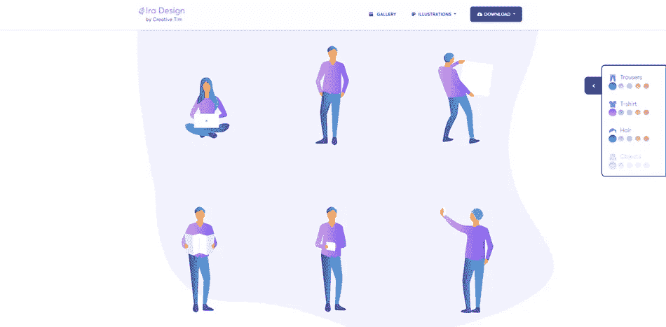
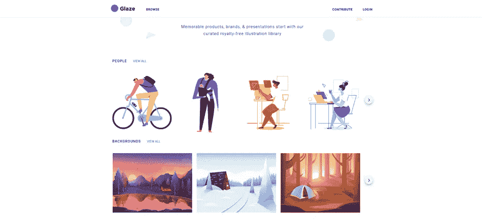

# 为您的项目寻找插图的 16 个地方📚🎨

> 原文：<https://javascript.plainenglish.io/16-places-to-find-illustrations-for-your-projects-a646649164fc?source=collection_archive---------17----------------------->

插图是网页设计的基石之一。它们看起来很棒，能抓住用户的注意力，给人留下专业的印象。

尝试自学一个设计工具可能会很费时间。聘请专业设计师可能会很贵。

幸运的是，有免费的在线资源可以帮助你。我收集了 16 个很棒的免费资源，你可能会想把它们收藏到你的下一个项目中。

## [展开](https://undraw.co/illustrations)

一个设计项目与美丽的 SVG 图像，您可以免费使用。您可以选择插图的主色，这样您就可以轻松地将它们应用到您的设计中。

## [IRA 设计](https://iradesign.io/illustrations)

您可以选择、播放和混合 5 种渐变颜色，以适应您想要在项目中使用的每个角色。许多主题可以从人物、物体、背景等中选择。

## [哎哟](https://icons8.com/illustrations)

Ouch 帮助不会画画的创作者克服缺乏高质量图形的问题。下载免费的 PNG 和 SVG 插图来增强您的产品。

## [抽屉套件](https://www.drawkit.io/)

真棒手绘矢量插图和图标资源。插图通过主题包分类，每包包括多达 100 幅插图。

## [人类](https://www.humaaans.com/)

混合并搭配人物插图。改变发型、上衣、裤子等。按照你喜欢的方式旋转和定位你的人类中的元素。

## [照明站](https://themeisle.com/illustrations/)

一个易于使用的网站，有很多高质量的插图。与 unDraw 类似，用户也可以设置主色，以根据项目主题调整插图。

## [腮红设计](https://blush.design/)

从多种风格中选择一个集合，尝试各种变化，直到你创作出讲述你的故事的艺术作品，并下载你的作品的 PNG 或 SVG。

## [上釉](https://www.glazestock.com/)

插图按类别分类，如人物、地点、团队合作、动物、正念、商业、健康、技术等。免费插图可作为 PNG。

## [多像素](https://www.manypixels.co/gallery)

各种插图类型，如轮廓、单色、等轴测、扁平线和双色。用户可以设置插图的主色，以适应您的特定设计。

## [打开涂鸦](https://www.opendoodles.com/)

基于手绘草图的矢量插图的独特集合。下载源文件或使用生成器创建自己的文件。

## [故事设定](https://storyset.com/)

真棒免费定制插图为您的下一个项目。多亏了他们的在线编辑器，你甚至可以将插图做成动画，给它们一些生命。

## [Skribbl](https://weareskribbl.com/)

由全球有抱负的创意人士组成的社区为您带来了越来越多的免费可用的手绘插图。

## [OpenPeeps](https://www.openpeeps.com/)

手绘人物插图。这个库就像是由矢量手臂、腿和情感组成的积木。您可以混合这些元素来创建不同的 Peeps。

## [优柔寡断](https://illustratious.com/?category=illustration&premium=false)

丰富多彩的插图和动画洛蒂文件很好的收集。

## [LukaszAdam 插图](https://lukaszadam.com/illustrations)

下载由插画师、设计师和开发者 [Lukasz Adam](https://lukaszadam.com/illustrations) 创作的插画包。在麻省理工学院的许可下，可免费用于商业和个人用途。

## [荒唐。设计](https://absurd.design/)

如果你正在寻找一些与众不同的东西，想要脱颖而出，那么这些插图非常推荐给你。

我希望您能找到这些资源的实际使用案例。我试图包含各种资源，包括您可能需要的所有插图类型。

请随意分享它们，这样其他开发人员也可以受益。

写作一直是我的激情所在，帮助和激励他人给我带来了快乐。如果您有任何问题，请随时联系我们！

在 [Twitter](https://twitter.com/madzadev) 、 [LinkedIn](https://www.linkedin.com/in/madzadev/) 和 [GitHub](https://github.com/madzadev) 上给我接通！

检查我的[投资组合](https://madza.dev/code)的所有项目。

*更多内容请看*[***plain English . io***](http://plainenglish.io/)