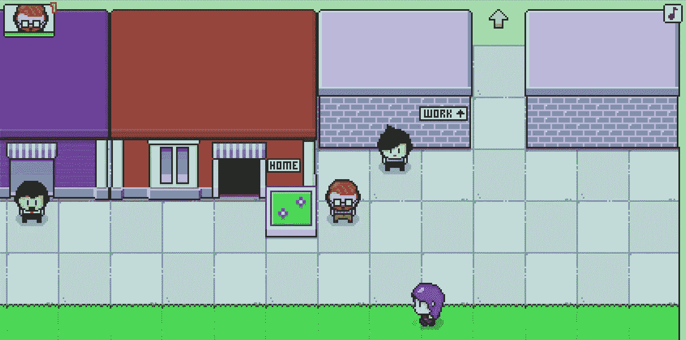

# CodePen 上的 17 个游戏将教你编程

> 原文：<https://javascript.plainenglish.io/17-exciting-games-on-codepen-you-can-learn-from-about-game-coding-5417d90f2490?source=collection_archive---------2----------------------->

## 您可以编辑的实时代码和您可以玩的实时游戏。

Source: Codepen — [punkydrewster713](https://codepen.io/punkydrewster713/post/the-danger-crew-2019-edition)

对我来说，从别人那里学习编码是提高我编程技能的另一种方式。程序员在 CodePen 和 Github 等地方公开地与世界分享他们的项目。

如果你计划用 CSS、JavaScript 和 HTML 创建你的迷你游戏，这个列表可以帮助你。你可以阅读下面每个游戏的源代码，研究它们，并创建你自己的游戏。

## 1.记忆游戏

这个游戏有点刺激。你要配对编程语言(Java-Java)直到你完成游戏。没有时间限制，但是你需要敏锐的记忆力来完成整个游戏。

*   由[内特·威利](https://codepen.io/natewiley)创作
*   在[代码栏](https://codepen.io/natewiley/pen/HBrbL)上查看代码

## 2.RGB 颜色游戏

在这个游戏中，你必须猜出哪个颜色组合是正确的。你有五次机会完成每一轮。你不必急于求成，因为没有时间限制，你很可能会失败几次。

*   由[黄美儿](https://codepen.io/itsmhuang)创作
*   在[代码笔](https://codepen.io/itsmhuang/pen/oxaReK)上查看代码。

## 3.JavaScript 乒乓游戏

这是一个简单的乒乓球游戏，至少有五个回合。你和机器人比赛并得分，直到你赢。游戏是键盘控制的，所以你会觉得像在玩一个真正的游戏。

*   由[加布里埃尔·杜贝](https://codepen.io/gdube/pen/JybxxZ)创作
*   在[代码笔](https://codepen.io/gdube)上查看代码。

## 3.冠状病毒入侵者

这是一场激动人心的比赛，但也是一场累人的比赛。要赢得游戏，你必须通过点击几次来杀死冠状病毒。现在，我建议你用你的鼠标进行硬核点击。

*   创建者— [埃拉德·谢赫特尔](https://codepen.io/elad2412)
*   在[代码笔](https://codepen.io/elad2412/pen/wvabjXy)上查看代码。

## 4.冠状病毒射击游戏

这和上面之前的冠状病毒游戏有着天壤之别。你需要拍摄每一个日冕，直到你清除游戏。你玩游戏的时间越长，你得到的光环就越多。将你的光标指向他们，完成游戏。

*   创建者— [费萨尔·贾韦德](https://codepen.io/faisal-jawed)
*   在[代码笔](https://codepen.io/faisal-jawed/pen/NWqeRNZ)上查看代码。

## 5.泡菜瑞克迷宫游戏

如果你有更多的时间玩，这个游戏是给你的。游戏分为几个难度级别。简单的水平肯定是容易的，但你需要花很长时间来完成极端和困难。如果你不能完成艰难的水平，你总是可以发挥容易和中等水平。他们的迷宫总是在你重启时改变。

*   创建者— [马丁](https://codepen.io/TheCodeDepository)
*   在[代码笔](https://codepen.io/TheCodeDepository/pen/jKBaoN)上查看代码。

## 6.靶心游戏

玩这个游戏，用你的弓箭射中靶心。你必须仔细瞄准才能击中目标。没有时间限制。你的箭是无限的。你想拍多少就拍多少。

*   由— [埃利奥特·吉诺](https://codepen.io/pyrografix)创作
*   在[代码笔](https://codepen.io/pyrografix/pen/qrqpJN)上查看代码。

## 7.火柴人打架

玩这个游戏需要两个玩家。你需要一个可以与之对抗的人来享受这个游戏。游戏就是互相打，谁的命先用完谁就输了游戏。

*   创建者— [莱萨](https://codepen.io/LERUS)
*   在 [CodePen](https://codepen.io/LERUS/pen/rNaZPJv) 上查看游戏。

## 8.贪吃蛇游戏

我们在第一批 3210 手机上都很熟悉这个游戏。这个游戏大概是受了那个游戏的启发，你的蛇会一直往前推，直到你撞到自己。

*   创建者— [杰克·鲁吉勒](https://codepen.io/jackrugile)
*   在[代码笔](https://codepen.io/jackrugile/pen/IHbvh)上查看代码。

## 9.僵尸大混乱

这个游戏是关于时间准确性的。你必须通过一个接一个地射击僵尸来防止他们到达另一边。你每轮有六发子弹，子弹用完了需要重新装弹。

*   创建者— [埃利奥尔·塔贝卡](https://codepen.io/eliortabeka)
*   在[代码笔](https://codepen.io/eliortabeka/pen/RoNgzR)上查看代码。

## 10.隐语游戏

我从来没有清除这个游戏。我试了几次，都没用。你必须猜出黄色方块后面的单词。我不知道单词是什么，因为我的答案是正确的。

*   创建者— [KS](https://codepen.io/KSayrs)
*   在[代码笔](https://codepen.io/KSayrs/pen/KgObmK)上查看代码。

## 11.箭头防御游戏

这个游戏很简单。射向你的箭就好，别让自己被射中。

*   创作人— [费萨尔·贾韦德](https://codepen.io/faisal-jawed)

## 12.倾斜迷宫游戏

这个游戏在开始时很有创意，也很简单。这是一个迷宫游戏，但不同于我上面提到的那个。在这个游戏中，你要让所有的点一个一个地互相撞击，当你降到一个点时，把它放在迷宫中的虚线圆形状。

*   创建者——[胡诺尔·马顿·博贝利](https://codepen.io/HunorMarton)
*   在[代码笔](https://codepen.io/HunorMarton/full/VwKwgxX)上查看代码

## 13.井字游戏

这个游戏是我小时候的游戏。我学会了用纸和笔玩，现在，我可以在网上玩了。在这种游戏中，第一个成功地将三个标记放置在对角线、水平或垂直行中的玩家获胜。

*   创建者— [freeCodeCamp](https://codepen.io/freeCodeCamp)
*   在[代码栏](https://codepen.io/freeCodeCamp/pen/KzXQgy)上查看代码

## 14.避开小行星

在这个游戏中，你需要不惜一切代价避免被小行星击中。

*   由[萨吉·康威](https://codepen.io/saconway)创作
*   在[代码栏](https://codepen.io/saconway/pen/VwvyVpx)上查看代码

## 15.象棋比赛

都知道这个游戏。和另一个棋手一起玩，享受这个游戏。

*   由哈罗德·贝尔创作
*   在[代码栏](https://codepen.io/hbellatcodepen/pen/GxqmaJ)上查看代码

## 16.HTML5 赛车游戏

这是一个简单的赛车游戏，以记住你的童年旧学校赛车游戏。

*   由[洛根](https://codepen.io/HRLRies)创建
*   在[代码笔](https://codepen.io/HRLRies/pen/GpqGWr)上查看代码

## 17.游戏逻辑

这个游戏类似于水果忍者游戏。切断掉在地上的气球——错过三个气球，游戏结束。

*   由[法比奥·奥塔维亚尼](https://codepen.io/supah)创作
*   在[代码笔](https://codepen.io/supah/pen/vYKYKGd)上查看代码

## 奖励——帮我打败这个家伙。

我希望你喜欢这个列表，也希望你在无聊的时候会喜欢玩上面的那些游戏。但是不要只玩这些游戏。你可以阅读他们的代码，研究他们，并创建自己的游戏。