# 17 个面向网络开发人员的黑仔网站

> 原文：<https://javascript.plainenglish.io/17-killer-websites-for-web-developers-13e1e30345b8?source=collection_archive---------0----------------------->

## 99.8%都不知道。

把网站放在手边可能是终极的生产力黑客，这里有一些我用来让我的生活更轻松的最好的网站。

让我们一个一个来看看。

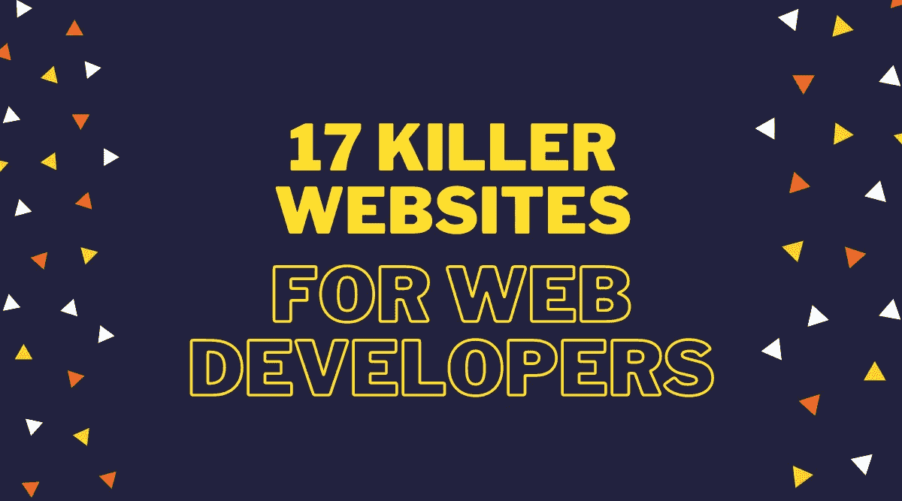

## 1.通过 API 的随机图像

[链接](https://source.unsplash.com)

世界上最强大的照片引擎。Unsplash API 是一个现代的 JSON API，它提供了为用户构建任何体验所需的所有信息

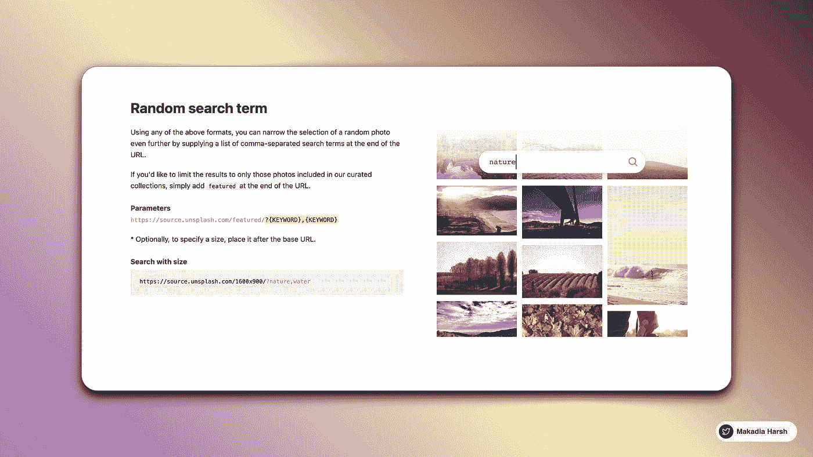

Unsplash

## 2.用于概念的嵌入式小部件应用

[链接](http://apption.co)

添加第三方应用程序嵌入或为您的概念文档创建自定义嵌入。

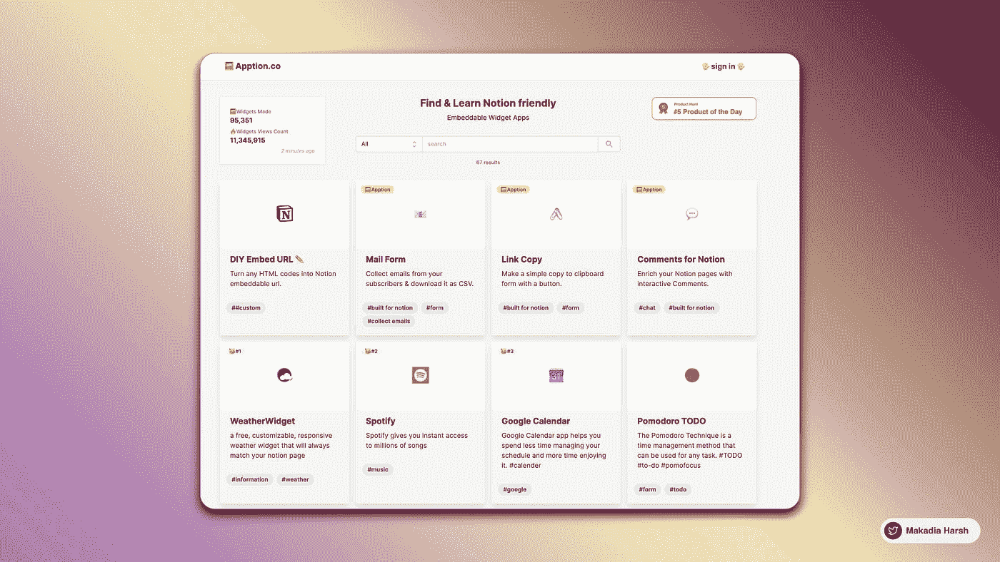

## 3.碳

[链接](http://carbon.now.sh)

创建和分享源代码的美丽图像。开始键入或将文件放入文本区域即可开始。

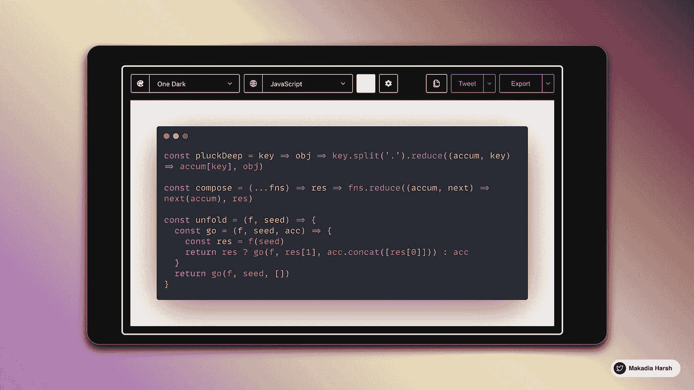

Carbon

## 4.胡椒型

[链接](https://peppertype.ai)

借助人工智能的力量，在几秒钟内生成更好的内容副本。扩展你写博客的内容比以往任何时候都容易。在几秒钟内获得人工智能生成的推文想法。

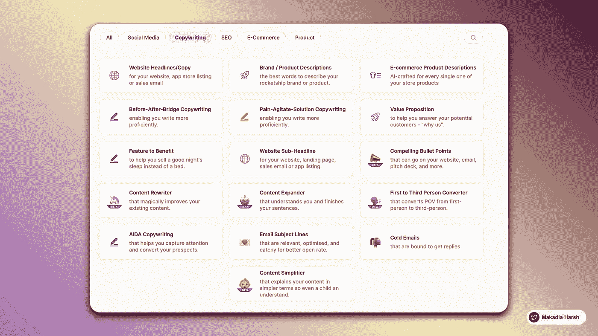

Peppertype

## 5.诗人。因此

[链接](http://poet.so)

将 Twitter 帖子捕捉并分享为美丽的图片。你可以在你的网站上用这个作为社交证明。

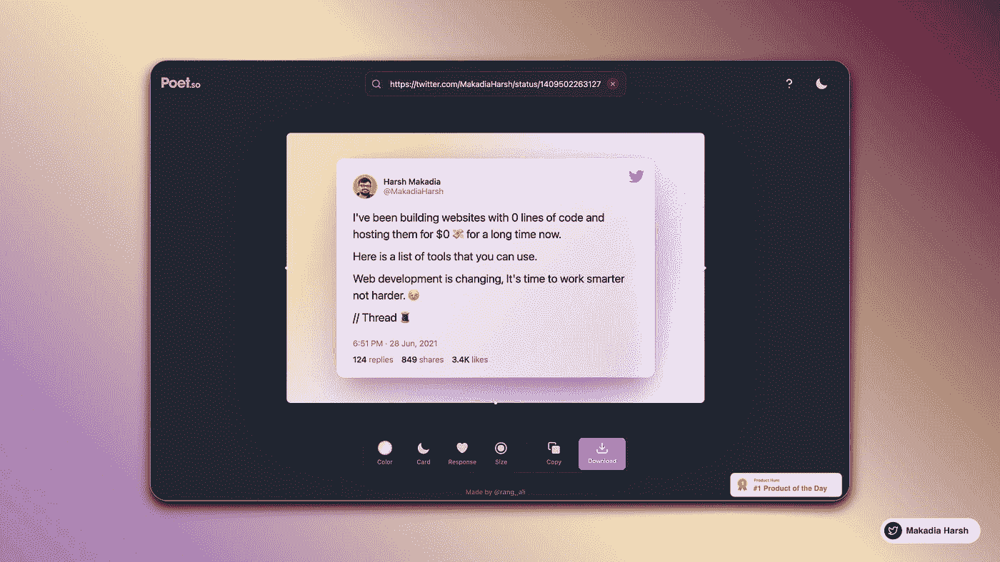

Poet

## 6.每周访客报告

[链接](https://t.co/nuLFTvQhcq?amp=1)

获得公司访问你的网站的每周报告。

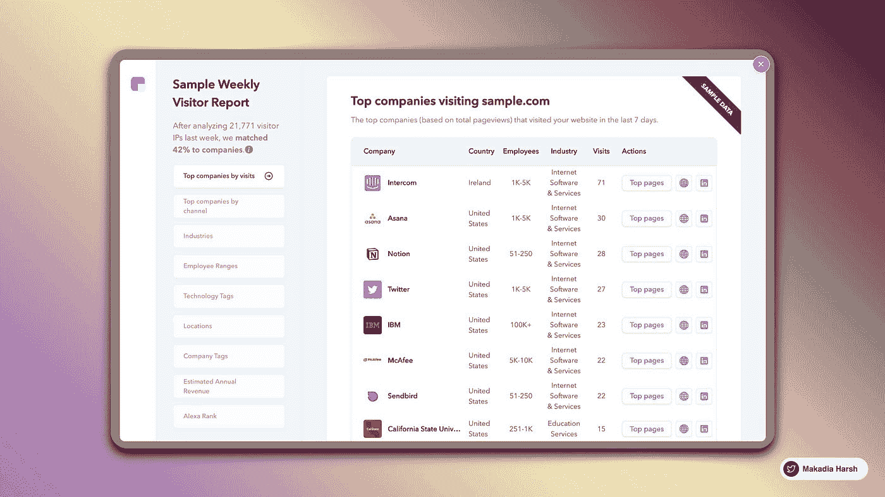

Clearbit

## 7.智能模型

[链接](http://smartmockups.com)

*   轻松在线创建令人惊叹的产品模型
*   最快的基于网络的模型工具
*   不需要经验或技能，超级容易使用

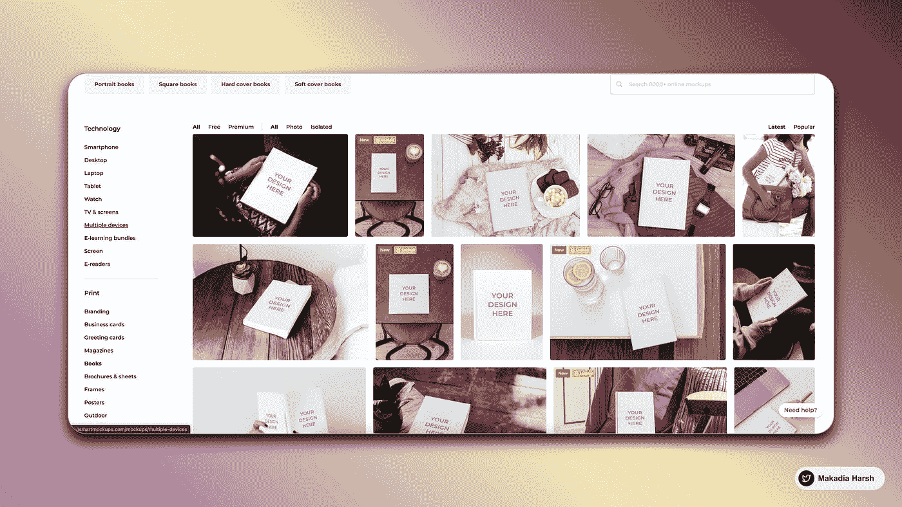

Smartmokcup

## 8.小型开发工具

[链接](https://smalldev.tools)

方便的开发工具，界面友好。提供 20 多种工具，帮助开发人员完成编码/解码、缩小、测试虚拟数据集等常见任务。

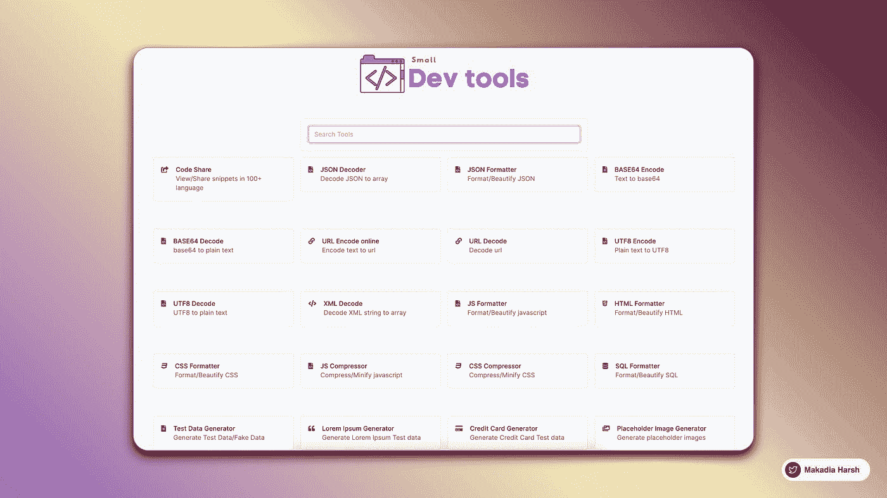

Small Dev tools

## 9.在控制台中显示漂亮的消息

[链接](http://npmjs.com/package/figlet)

FIGlet 是一个用普通文本制作大字母的程序。

FIGlet

## 10.视觉类型量表

[链接](http://type-scale.com)

理解并想象不同字体大小、REM 与 EM 值之间的差异。实时检查预览以查看其外观

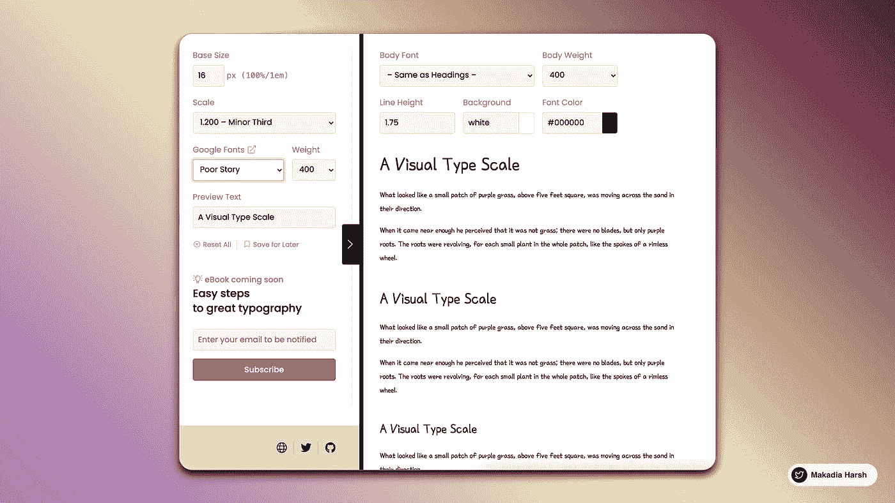

Visual Type Scale

## 11.从图像中移除背景

[链接](https://remove.bg)

零点击，5 秒钟内 100%自动移除背景。

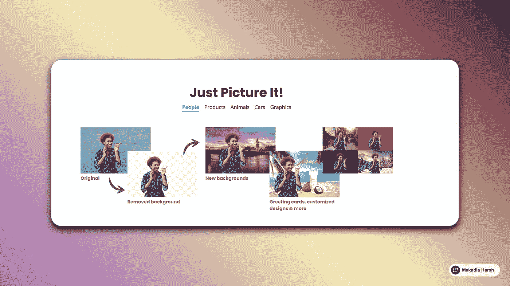

Remove BG

## 12.响应地

[链接](https://responsively.app)

开发响应速度快 5 倍的 web 应用程序！

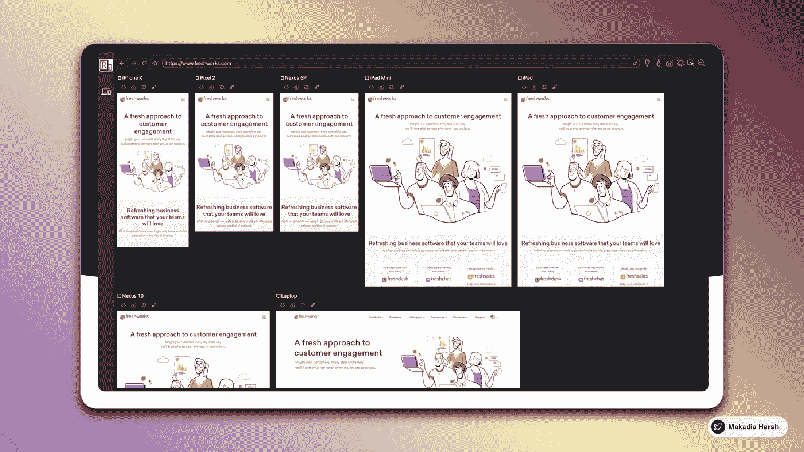

Responsively

## 13.元标记

[链接](http://metatags.io)

Meta Tags 是一个为任何网站调试和生成 meta tag 代码的工具。标签您可以编辑和试验您的内容，然后预览您的网页在谷歌，脸书，Twitter 和更多！

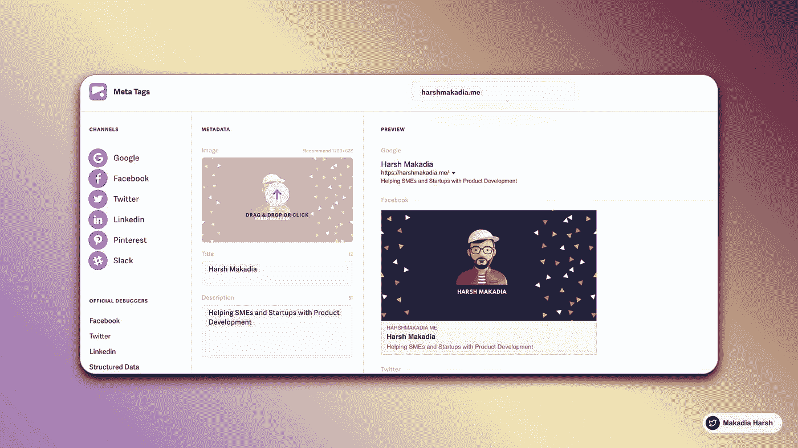

Meta Tags

## 14.自述文件

[链接](https://readme.so)

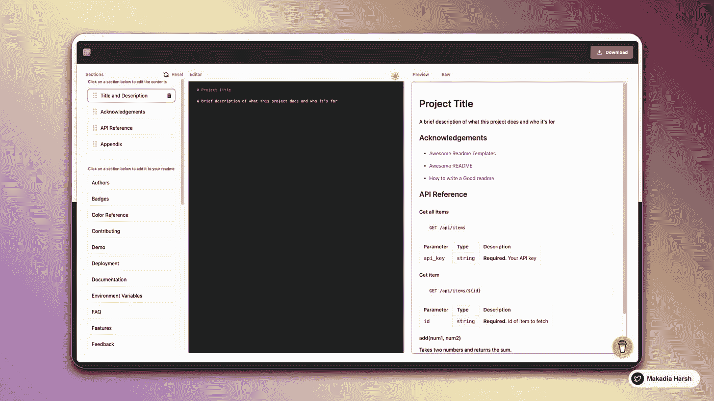

ReadMe

## 15.故事

[链接](https://storytale.io)

网络和移动项目的高级插图。用牛逼的角色让你的项目引人注目。将它用于商业和个人目的。

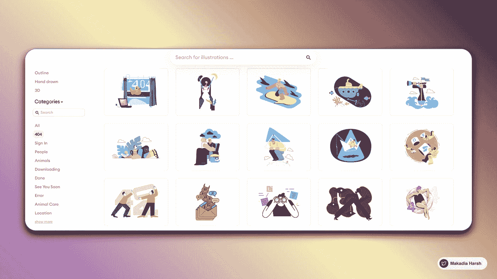

Storytale

## 16.配置文件 Pic Maker

[链接](https://pfpmaker.com)

从任何照片中制作一个令人敬畏的个人资料图片

Profile Picture Maker

## 17.西格玛奥斯

[链接](http://sigmaos.com)

快速浏览你的工作。让您更快更好地在网上工作的浏览器。

Sigma OS

感谢你的来访和阅读这篇文章，我希望你已经了解了很多新的网站，在某个时候会对你有所帮助。

如果你喜欢我的内容，我在 Twitter 上很活跃。我在推特上发布关于 web 开发、无代码和低代码的信息，让开发人员的生活变得简单。

快乐学习！💻 😄

*更多内容请看*[***plain English . io***](http://plainenglish.io/)