# 网站的 18 种 JavaScript CSS 滚动效果

> 原文：<https://javascript.plainenglish.io/18-javascript-css-scroll-effects-for-website-d7cd8bd81da2?source=collection_archive---------3----------------------->

在今天的文章中，我将向您介绍用 HTML、CSS 和 JavaScript 构建的滚动效果，以帮助吸引用户的注意力，并在客户使用网站时创造有趣的感觉！

# 滚动 CSS 背景渐变

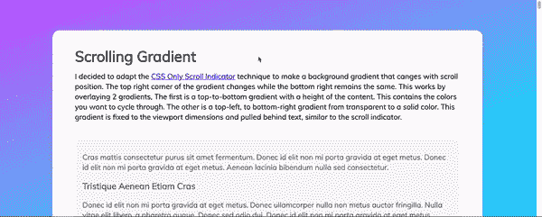

Scroll CSS Background Gradient

你可以在下面看到结果。

[链接](https://codepen.io/MadeByMike/pen/eKPZZz)

# 滚动图像的 jQuery

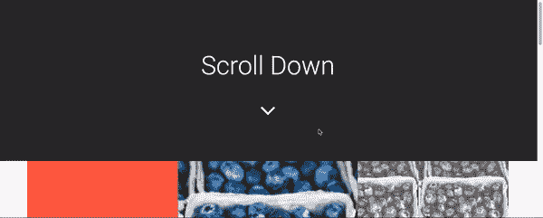

Scroll Jquery For Images

你可以在下面看到结果。

[链接](https://codepen.io/teeganlincoln/pen/MaNxBv)

# 导航滚动 Jquery

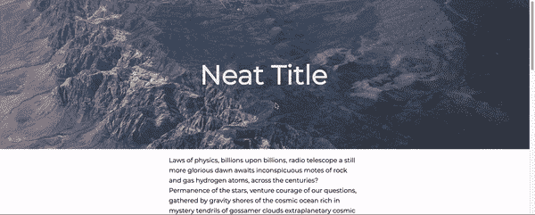

Navigation Scroll Jquery

你可以在下面看到结果。

[链接](https://codepen.io/magnificode/pen/GpqGOm)

# 卷轴绘画

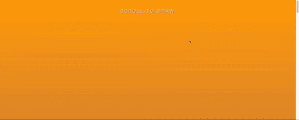

Scroll Drawing

你可以在下面看到结果。

[链接](https://codepen.io/chriscoyier/pen/YXgWam)

# jQuery 滚动背景

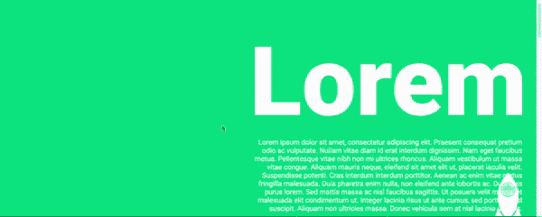

Jquery Scroll Background

你可以在下面看到结果。

[链接](https://codepen.io/jackharner/pen/bdPmQM)

# 图像的滚动动画 CSS

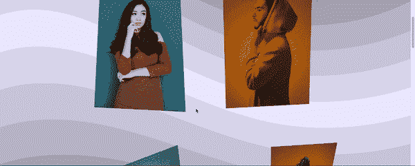

Scroll Animation CSS For Images

你可以在下面看到结果。

[链接](https://codepen.io/lmgonzalves/pen/QPBPJe)

# 标题滚动效果 CSS3 JavaScript

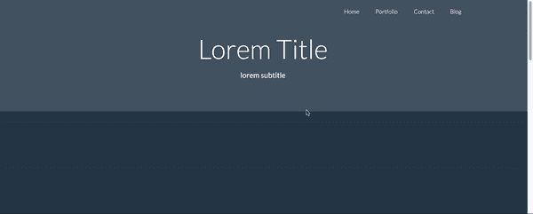

Header Scroll Effect CSS3 JavaScript

你可以在下面看到结果。

[链接](https://codepen.io/igloude/pen/jwuoc)

# 滚动显示

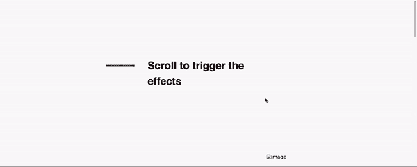

Scroll Reveal

你可以在下面看到结果。

[链接](https://codepen.io/jlnljn/pen/bgjbmB)

# 滚动动画文本显示

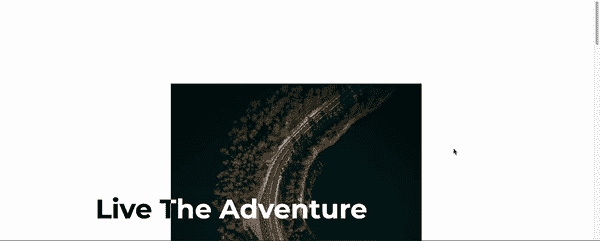

Scroll Animation Text Reveal

你可以在下面看到结果。

[链接](https://codepen.io/ispykenny/pen/BaaYqYZ)

# 滚动文本颜色

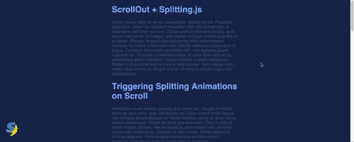

Scroll Text Color

你可以在下面看到结果。

[链接](https://codepen.io/shshaw/pen/YOPqLb)

# 按拆分滚动. js

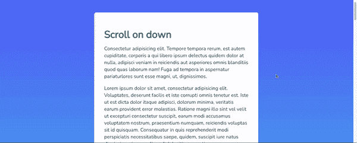

Scroll By Splitting.js

你可以在下面看到结果。

[链接](https://codepen.io/notoriousb1t/pen/zLbVEW)

# 滚动缩放图像

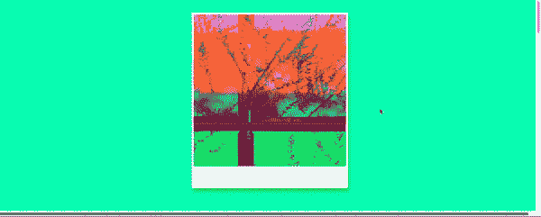

Scroll Zoom Image

你可以在下面看到结果。

[链接](https://codepen.io/CAWeissen/pen/rNNobpJ)

# 图像的视差滚动

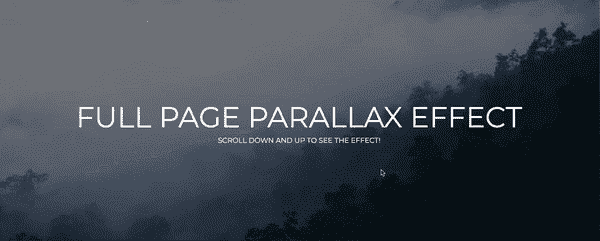

Parallax Scrolling For Images

你可以在下面看到结果。

[链接](https://codepen.io/eehayman/pen/qdGZJr)

# 滚动时播放视频

[链接](https://codepen.io/carpenumidium/pen/dYYwQp)

# 向上滚动时粘性标题

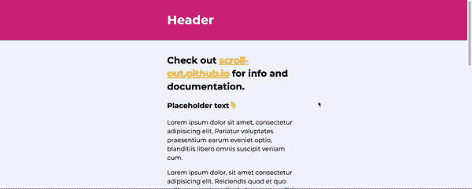

Sticky Header When Scroll Up

你可以在下面看到结果。

[链接](https://codepen.io/ingvi/pen/ZVOqbP)

# 滚动动画 CSS

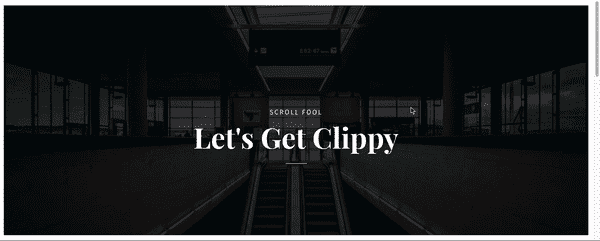

Scroll Aniamtion CSS

你可以在下面看到结果。

[链接](https://codepen.io/StephenScaff/pen/WxoVBo)

# JavaScript 滚动文本

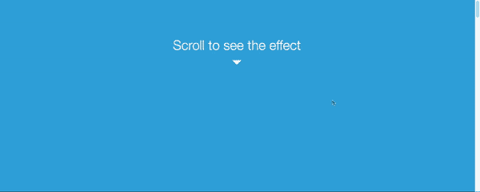

JavaScript Scroll Text

你可以在下面看到结果。

[链接](https://codepen.io/yashyash/pen/EtAoF)

# 滚动动画 JavaScript

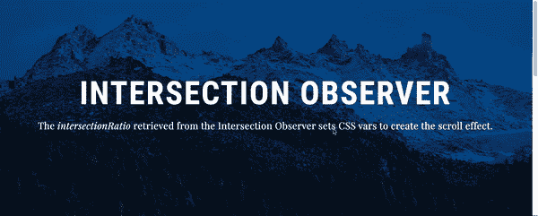

Scroll Aniamtion JavaScript

你可以在下面看到结果。

[链接](https://codepen.io/eehayman/pen/aRLYeb)

# 摘要

我希望文章能为你提供对网页开发和设计有用的滚动效果，如果你有任何问题，请发邮件给我，我会尽快回复。希望大家继续支持网站，让我能写出更多好文章。祝您愉快！

相关文章:

*   [水平滚动 CSS Javascript 特效](https://us.niemvuilaptrinh.com/article/15-horizontal-scroll-css-javascript-effects)
*   [网站滚动指示器示例](https://us.niemvuilaptrinh.com/article/20-examples-of-scroll-indicator-for-website)

*更多内容请看*[*plain English . io*](http://plainenglish.io/)*。在这里报名参加我们的* [*免费周报*](http://newsletter.plainenglish.io/) *。*