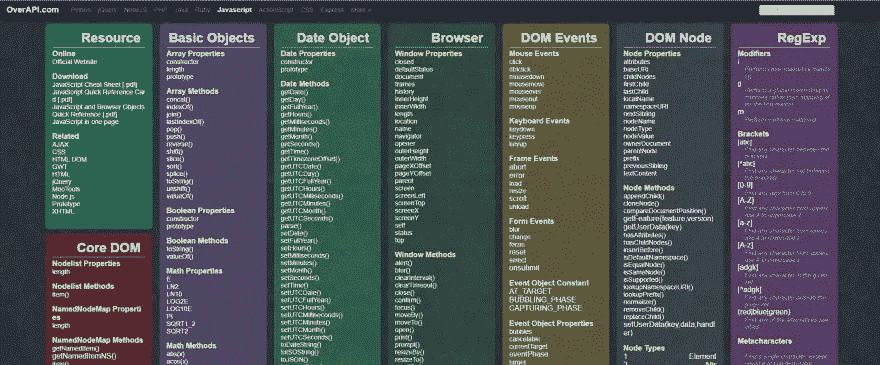

# 18 个有用的备忘单，帮助开发人员更快更聪明地工作

> 原文：<https://javascript.plainenglish.io/18-useful-cheat-sheets-for-developers-to-work-faster-and-smarter-43254200ccd?source=collection_archive---------2----------------------->

## 你会喜欢的 Cheatsheet 资源。

Source: OverAPI.com

作为一名 web 开发人员，我不可能记住所有的语法、方法等。编程或框架。我承认这一点，但大多数时候，我使用备忘单来帮助我更快地编码，更好地编码，前面的错误更少。

无论你是新手还是专家，我希望你会发现这些备忘单对你的日常 web 开发任务有用。让我们开始吧。

## 1.元素索引备忘单

如果你正在学习 HTML5 并且不知道从哪里开始，这个备忘单将会派上用场。每个元素都有一个描述来解释它是做什么的，还有一个代码示例的链接供您学习。

 [## HTML5 元素索引

### 这是 HTML5 中新增或重新定义的元素的快速参考。每个元素都有一个简短的…

html5doctor.com](http://html5doctor.com/element-index/) 

## 2.HTML 5 游说备忘单

这看起来很简单，但是如果你需要 2D 形状和位图图像的动态的、脚本化的渲染，这个备忘单已经为你准备好了。

 [## HTML5 画布备忘单

### 编辑描述

simon.html5.org](https://simon.html5.org/dump/html5-canvas-cheat-sheet.html) 

## 3.HTML 词汇

这不是我们所知道的词汇。这个词汇表备忘单将让你接触 HTML 代码，看看哪个是什么。这会让你听起来像一个 HTML 专家。:)

 [## HTML 词汇

### 点击代码或侧边栏，看看哪个是什么。使用 Tab 键通过键盘浏览。

apps.workflower.fi](http://apps.workflower.fi/vocabs/html/en#tag) 

## 4.CSS3 动画备忘单

你可以用这个工具让你的网页看起来可爱。你可以在这个备忘单中找到有用的 CSS 动画设计。影线`stretchRight.`

 [## CSS3 动画备忘单

### CSS3 动画备忘单是一组为您的 web 项目预设的即插即用的动画。你需要做的就是…

www.justinaguilar.com](http://www.justinaguilar.com/animations/index.html) 

## 5.CSS 网格备忘单

这是一个可视化的指南，你可以用它来轻松地为网页创建一个使用 CSS3 的网格系统。您所需要做的就是提供规范，该工具会将您的数据转换成网格视图。

 [## CSS 网格备忘单

### 编辑描述

alialaa.github.io](https://alialaa.github.io/css-grid-cheat-sheet/) 

## 6.CSS Flexbox

这张小抄是用简单的英语写的。作者解释了关于 flexbox 的一切，从父属性到子属性，每个人都可以使用插图和示例代码。

 [## flexbox 30 | SamanthaMing.com

### 用 30 个代码花絮了解 Flexbox。通过此免费课程成为 flexbox 忍者！

www.samanthaming.com](https://www.samanthaming.com/flexbox30/) 

## 7.CSS 参考

到处都有很多 CSS 备忘单，但是这一个是独一无二的，因为你不仅仅看到为你设计的文本代码，以及当你运行它时代码的样子。激动人心吧？

 [## CSS 参考

### CSS 参考是一个免费的 CSS 可视化指南。它的特点是最受欢迎的属性，并解释他们与…

cssreference.io](https://cssreference.io/) 

## 8.CSS 布局备忘单

这是一个用 CSS 制作的流行布局和模式的集合。你可以为一个网站找到从导航到页脚的任何布局，有不同的设计可用，如粘性页脚、全背景等等。

 [## CSS 布局

### CSS 布局和模式

csslayout.io](https://csslayout.io/) 

## 9.自举 4 备忘单

这将为您提供每个引导类的代码，以便简单地将代码片段复制到您的类中。这肯定会让你的编码更快更智能。

 [## Bootstrap 4 备忘单-Bootstrap 类的最终列表

### 在这个交互式自举备忘单上快速找到你的自举类。它包括代码样本和现场…

hackerthemes.com](https://hackerthemes.com/bootstrap-cheatsheet/) 

## 10.我能用吗

这将让您深入了解浏览器是否支持桌面和移动浏览器上的任何前端 web 技术。对于像我这样的 web 开发人员来说，这绝对是一个小抄。

 [## 我能用吗...HTML5、CSS3 等的支持表

### 测试功能我们与 BrowserStack 的合作现在可以让您测试您的网站在 2，000 多个真实的…

caniuse.com](https://caniuse.com/) 

## 11.Rico 的小抄

对于我们这些网络开发者来说，这是一座金矿。Rico 为每个 web 开发需求制作了一系列有用的备忘单。如果你想更快更聪明地工作，这是一个方便的小抄。

 [## dev hints-TL；开发人员文档灾难恢复

### 一个荒谬的网页开发备忘单收集一页指南

devhints.io](https://devhints.io/) 

## 12.Web 开发人员的 SEO 备忘单

这是一个 SEO 需要开发者去做的综合列表。当我开始使用这个备忘单时，网站上的所有 SEO 任务都被覆盖，并且在启动后没有任何事情被遗漏。

 [## 网络开发者的 SEO 备忘单[2021]

### 你是 SEO。你要处理拙劣的网站迁移，数千页凌乱的标题标签，翻天覆地的谷歌…

moz.com](https://moz.com/learn/seo/seo-cheat-sheet) 

## 13.开发者备忘单

这是 React、Redux 和 ES6 的备忘单集合。你也可以出于教育目的阅读 web 开发的历史，但是小抄会派上用场。

 [## 反应备忘单

### 编辑描述

www.developer-cheatsheets.com](http://www.developer-cheatsheets.com/) 

## 14.Vue 2.3 完整 API 备忘单

 [## Vue.js 2.3 备忘单

### 完整的 API

marozed.com](https://marozed.com/vue-cheatsheet/) 

## 15.全息照相术

这是一个备忘单集合，包括来自 Python、JavaScript、HTML 和 CSS3 等不同编程语言的数据库、工具和标记。

 [## 编程备忘单

### PHP 快速参考指南，包括函数参考，正则表达式语法指南和 PHP…

cheatography.com](https://cheatography.com/programming/) 

## 16.超赞的备忘单

流行编程语言、框架和开发工具的精彩备忘单。

 [## 超赞的备忘单

### 专为那些和我们一样喜欢黑暗界面的人设计。使用最佳 UX 实践实现巨大转变…

lecoupa.github.io](https://lecoupa.github.io/awesome-cheatsheets/) 

## 17.OverAPI.com

这是另一个按字母顺序排列的备忘单集合列表。如果你不想保存很多备忘单文件，这个工具会帮你省去所有的麻烦和时间，更不用说让事情井井有条了。

 [## OverAPI.com |收集所有的小抄

### OverAPI.com 是一个收集所有备忘单的网站，全部！

overapi.com](https://overapi.com/) 

就是这样。我希望这个网站上的备忘单对你有用，能帮助你更快更好地编程。