# 2021 年你可以考虑使用的 18 个有用的 React 动画库

> 原文：<https://javascript.plainenglish.io/18-useful-react-animation-libraries-you-can-consider-using-in-2021-7cad00dbf525?source=collection_archive---------0----------------------->

## 动画库可以处理页面转换、滚动事件、进入、退出组件等等。

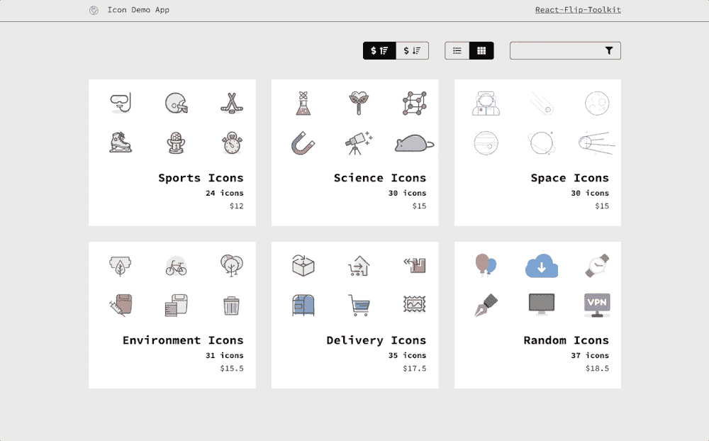

动画在页面转换、滚动事件、进入和退出组件以及应该提醒用户的事件中非常重要。

让我们来看看 15 个 React 动画库，它们可以与 React 集成，用于交互式和有吸引力的网页。

## 1.[反应弹簧](https://github.com/pmndrs/react-spring)

这个库代表了一种现代的动画制作方法。这在 Github 上被加星超过 19000 次。你会惊讶于这个库能给你的网站带来多么优雅的效果。

Source: [React Spring](https://www.react-spring.io/)

## 2.[反应圈](https://github.com/zzarcon/react-circle)

一组用于管理组件状态的组件，专门针对动画而设计。

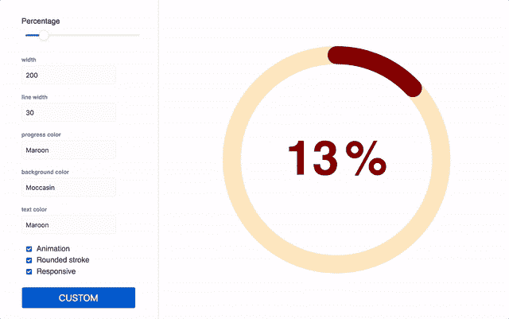

Source: [Github](https://github.com/zzarcon/react-circle)

## 3.[反应粒子效果按钮](https://github.com/transitive-bullshit/react-particle-effect-button)

这个工具可以让你在按钮上创建类似灭霸快照的效果。有不同的效果可供选择。

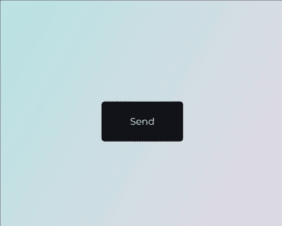

Source: [Github](https://github.com/transitive-bullshit/react-particle-effect-button)

## 4.[反应石匠](https://github.com/dantrain/react-stonecutter)

React 的动画网格布局组件。对于动画效果，您可以选择 CSS 过渡或 react-Motion。

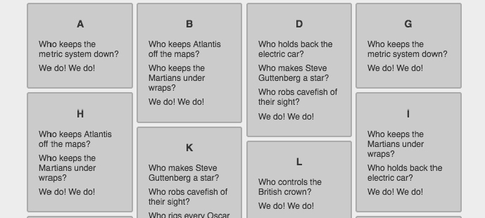

Source: [Full Stack React](http://newsletter.fullstackreact.com/issues/25)

## 5.[蚂蚁运动](https://github.com/ant-design/ant-motion)

这是来自 Ant Design 的运动设计规范，也为您的 React 应用程序提供了一个包含大量开箱即用动画的完整解决方案。

Source: [Ant Design](https://ant.design/docs/spec/motion)

## 6.[反应滚动视差](https://github.com/jscottsmith/react-scroll-parallax)

这个 React 组件用于为横幅、图像或其他 DOM 元素创建视差滚动效果。

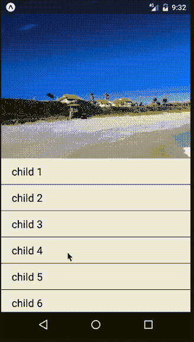

Source: [NPMJS](https://www.npmjs.com/package/react-native-parallax-header-scrollview/v/1.0.1)

## 7.[反作用载荷](https://github.com/fakiolinho/react-loading)

您可以使用该工具为 React 项目创建加载动画效果。

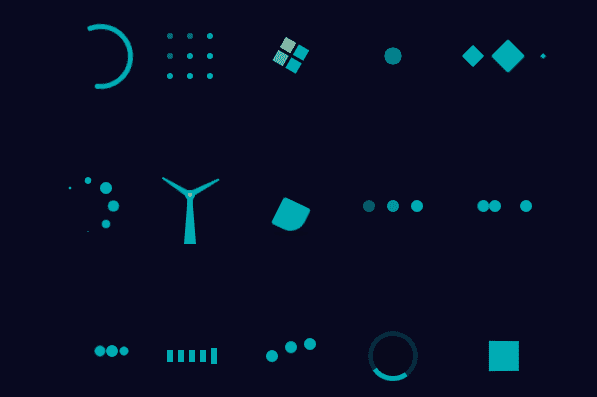

Source: [Morioh](https://morioh.com/p/279e7fbff49b)

## 8. [React 翻转工具包](https://github.com/aholachek/react-flip-toolkit)

您可以使用此 React 动画为可配置的布局过渡创建一个轻量级的 magic-move 库。

Source: [NPMJS](https://www.npmjs.com/package/react-flip-toolkit/v/6.6.7)

## 9.[反应过来的打字员](https://github.com/jstejada/react-typist)

使用该 React 组件创建打字动画。将`Typist`环绕在文本或任何元素树的周围，使树内的文本具有动画效果。易于风格化和高度可配置。

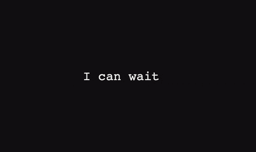

Source: [Github](https://jstejada.github.io/react-typist/)

## 10.[流体过渡](https://github.com/fram-x/FluidTransitions)

该库实现了一个名为`FluidNavigator`的新导航器组件，它具有与`StackNavigator`相同的接口和路由配置。

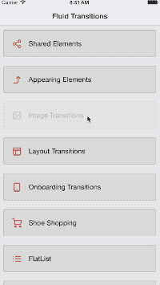

Source: [Github](https://github.com/fram-x/FluidTransitions)

## 11.[反应原生动画](https://github.com/oblador/react-native-animatable)

React Native 的一组易于使用的标准动画和声明性转换。

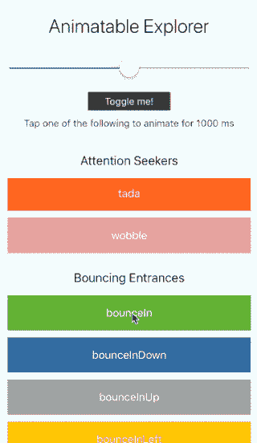

Source: [Github](https://github.com/oblador/react-native-animatable)

## 12.[反应动画](https://github.com/FormidableLabs/react-animations)

可以与任何内嵌样式库一起使用的动画集合支持使用对象来定义关键帧动画，例如 Radium 或 Aphrodite。

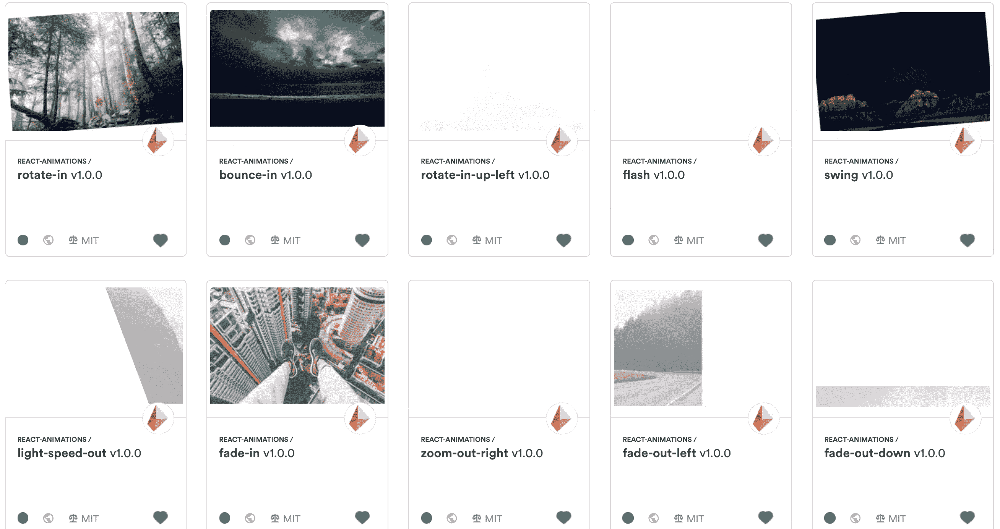

Source: [Github](https://github.com/FormidableLabs/react-animations)

## 13.[反应动作](https://github.com/chenglou/react-motion)

这个库也为 React 的`TransitionGroup`提供了另一个更强大的 API。

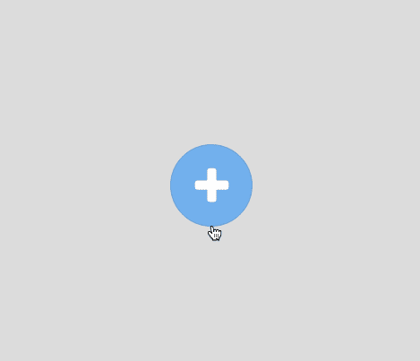

Source: [Nash Vail](https://medium.com/@nashvail/a-gentle-introduction-to-react-motion-dc50dd9f2459)

## 14.[摆姿势](https://popmotion.io/pose/)

这是一个简单的 React、React Native、Vue 甚至普通 JavaScript 的动画库。

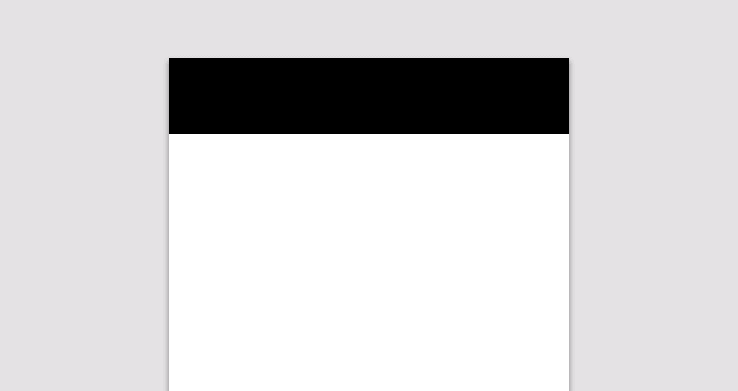

Source: [Hackernoon](https://hackernoon.com/animations-in-react-at-60fps-an-introduction-to-react-pose-6db5a1c1e0ae)

## 15.[反应过渡组](https://github.com/reactjs/react-transition-group)

当 React 组件进入或离开 DOM 时，这是一种执行动画的简单方法。

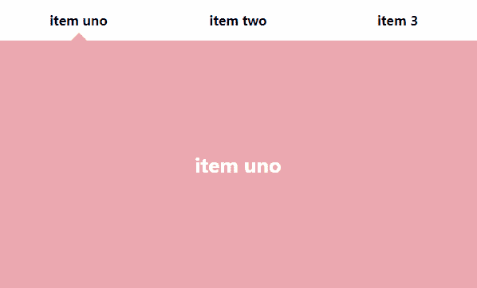

Source: [ReactJSExample](http://reactjsexample.com/a-react-css-transition-group-addon/)

还有其他的动画库，我没有包括在这篇文章中，但我认为我上面列出的那些足以制作出令人惊叹的现代网站。