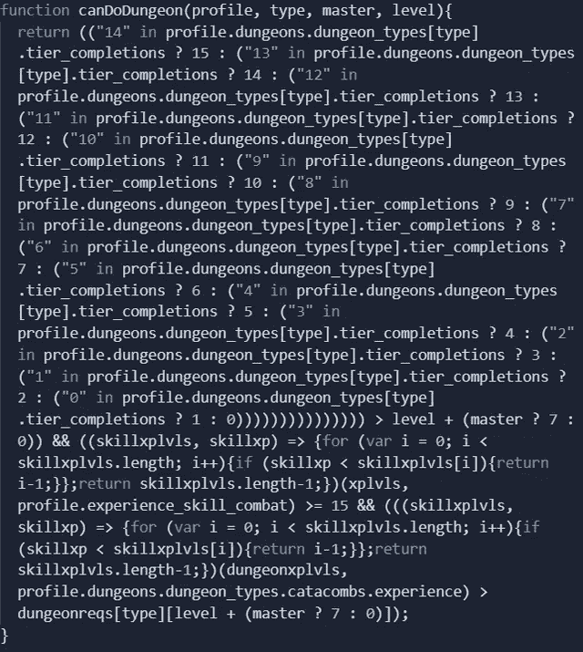

# 人们实际编写的 19 个垃圾代码片段

> 原文：<https://javascript.plainenglish.io/19-garbage-code-snippets-people-actually-wrote-7e176e52f7e1?source=collection_archive---------0----------------------->

## 其中一个可能是你的。

Photo by [Damir Spanic](https://unsplash.com/@spanic?utm_source=medium&utm_medium=referral) on [Unsplash](https://unsplash.com?utm_source=medium&utm_medium=referral)

在某些时候，我们每个人都会遇到这种情况。你写了一些你并不引以为豪的代码。让你纳闷的代码，*“我怎么会写出这样的东西？”*没什么好羞愧的。我们只是人类。而有时候，我们就是没有做到最好。

发生在我身上，发生在你身上，但也发生在其他开发者身上。我花时间收集了我能找到的最糟糕的代码片段。今天，我将把它们呈现给你。

然而，我只有在一个条件下才会这么做。你要向我保证你不会对他们不好。请记住，在某些时候，你可能会写一些类似的东西。话虽如此，还是戴上豁达的眼镜，来点小乐趣吧。第一个来了！

## 重新发明轮子会出错

常规的布尔比较不会返回您想要的结果。你该怎么办？答案很简单，你自己创造一个。

[Original Source](https://www.reddit.com/r/programminghorror/comments/bvyj3j/im_also_coming_with_you/)

## 神奇的数字

看着这张图，我不禁好奇。如果我们改变其中一个数字会发生什么？可能没什么好事。

[Original Source](https://www.reddit.com/r/programminghorror/comments/k6as80/found_this_in_production_today/)

## 至少它被分成了几行

从这个街区的外观来看，我猜这是一个学校项目。不用说，我对老师表示哀悼。

[Original Source](https://www.reddit.com/r/programminghorror/comments/o53rxo/why_make_good_code_when_you_can_make_a/)

## 魔鬼伊塞文函数

今天，我们将看到`isEven`函数的各种实现。这是我们的第一个候选人。我想说我们有了一个好的开始。你怎么想呢?

[Original Source](https://www.reddit.com/r/programminghorror/comments/faoxye/how_to_find_if_a_number_is_even_without_the_mod/)

## 希望有一个函数来获取字符串的大小

我们的开发伙伴想到了这个主意。他没有一秒钟犹豫。并且马上实施了。

[Original Source](https://www.reddit.com/r/programminghorror/comments/dx65ys/found_on_facebook/)

## 唤醒内心的孩子

虽然听起来很疯狂，但你可以用表情符号作为变量名。但是你应该这样使用它们吗？看看下面的代码，自己决定。

[Original Source](https://www.reddit.com/r/programminghorror/comments/m37z6b/stuff_of_nightmare/)

## 谁会阅读提交消息呢

如果你有一个同事反复使用相同的提交消息。她可能是这样做的。

[Original Source](https://www.reddit.com/r/programminghorror/comments/oydis4/was_wondering_why_this_engineer_was_always/)

## 如果有任何变化

未来不可预测。它可以在一夜之间改变。为了以防万一，额外的安全总是一个好主意。

[Original Source](https://www.reddit.com/r/programminghorror/comments/ffuhsc/just_in_case_it_changes_in_the_future/)

## 购买超宽显示器的理由

长变量名没有错。只要它们有助于代码的可读性。但有时候，我们不得不问自己*“多久才算太长？”*

[Original Source](https://www.reddit.com/r/programminghorror/comments/n0m0wc/i_just_found_this_in_the_server_code_of_our/)

## 天才之举

此处无需添加任何内容。我认为评论本身就说明了问题。

[Original Source](https://www.reddit.com/r/programminghorror/comments/ms5hjq/genius_move/)

## Typescript 是最好的

类型安全的感觉是有好处的。如何更好地确保您不会出现任何类型错误？这些家伙，他们想通了。

[Original Source](https://www.reddit.com/r/programminghorror/comments/manjep/half_of_our_outsourced_codebase_be_like_never/)

## 如果成功了，那就是成功了

说什么真的。只要确保参数的总和总是 7。而且这个功能不能失效。

[Original Source](https://www.reddit.com/r/programminghorror/comments/nhxb1d/if_it_works_it_works/)

## 确保它真的是布尔

多少悲观才算过分悲观？我得说这个很接近了。

[Original Source](https://www.reddit.com/r/programminghorror/comments/jdynpg/just_make_sure_its_really_bool/)

## 最佳的测试驱动开发

我们必须支持使用单元测试。但我不禁想知道。如果测试生成随机数，会发生什么？

[Original Source](https://www.reddit.com/r/programminghorror/comments/i1b3cf/is_this_testdriven_development/)

## 你敢扩张吗？

我们都在某个时候写过复杂的 switch 语句。但是，一千行似乎有点多。但是毕竟有很多鼠标状态要覆盖。

[Original Source](https://www.reddit.com/r/programminghorror/comments/f6axrs/i_am_scared_to_expand_this_switch_statement/)

## 尝试 Switch 语句

你认为未来的计划是扩展这个开关吗？什么都没有了，只是去相信。

[Original Source](https://www.reddit.com/r/programminghorror/comments/ldcu7o/when_our_designer_try_coding/)

## 数学很难

有时候，利用外部帮助并不可耻。实际存在 [is-even](https://www.npmjs.com/package/is-even) 包。你敢猜猜它的周下载量吗？15 万多。

[Original Source](https://www.reddit.com/r/ProgrammerHumor/comments/mddf8o/even_numbers_are_so_hard/)

## 当绝妙的想法涌现时

有时候，你只是觉得自己像个叛逆者。你必须按自己的方式做事。但是我认为我们可以达成一致，这种类型的代码不应该通过代码审查。

[Original Source](https://www.reddit.com/r/programminghorror/comments/l9ztqj/someone_had_this_brilliant_idea_if_only_there_was/)

## 当你是一个开发者，但你热爱书法

我尝试了不同类型的字体。但我不得不说，事情从没发展到这一步。如果让你疑惑“盗版软件就是这么写的？”你并不孤单。

[Original Source](https://www.reddit.com/r/programminghorror/comments/ndl7em/someone_in_my_local_facebook_group_posted_this/)

# 最后的想法

我希望你在看这些例子的时候玩得开心。我当然知道。请随时告诉我你最喜欢哪一个。或者如果你有一些可耻的图片要分享，不要害怕在评论中分享。

我很开心地浏览了这些代码片段。这让我想起了我的早期。在我的职业生涯中，我写了一些并不值得骄傲的代码片段。但对我来说幸运的是，没有人给他们截图。或者至少我希望如此。

 [## 亲爱的开发者:这就是你如何将一个 Div 居中

### 让我们一起终结迷因

javascript.plainenglish.io](/dear-developer-this-is-how-you-center-a-div-e526e7cfcc9d)  [## 这个空的 NPM 包有超过 70 万的下载量。原因如下。

### 让我告诉你这个不起眼的软件包，它在过去的一年里产生了超过 70 万次的下载。

javascript.plainenglish.io](/this-empty-npm-package-has-over-700-000-downloads-7718b48bf997) 

*更多内容尽在*[***plain English . io***](http://plainenglish.io/)