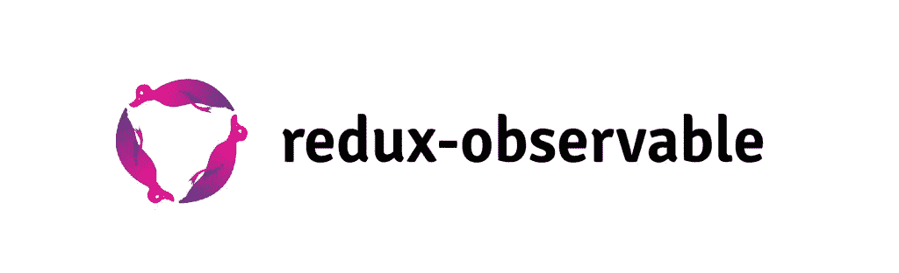

# 19 个强大的 React 库和框架，现在就可以使用

> 原文：<https://javascript.plainenglish.io/19-powerful-react-libraries-and-frameworks-to-use-right-now-2cf60eb4cc93?source=collection_archive---------1----------------------->

[React](https://massivepixel.io/blog/what-is-react/) ，作为一个**开源 JavaScript 库**，它本身并没有提供太多特性。这不一定是一件坏事——对于那些喜欢极简主义方法的人来说，这无疑是一个巨大的好处。但在某些情况下，这还不够。我们将不得不拿出库和框架形式的大枪。

令人欣慰的是，React 的流行确保了广泛的工具可供选择。

这实际上是一种保守的说法。

范围是**巨大的。**该社区非常活跃，人才济济，不断致力于改善开发体验。因此，可用工具的数量可能有点多。但是不要担心，我们会将您的注意力集中到精英中的精英。

# 十大 MPC 的最爱

第一个列表将关注我们自己的 Massive Pixel Creation 的 [React 开发者](https://massivepixel.io/services/react-development-services/)特别青睐和推荐的库和框架。

# [盖茨比](https://www.gatsbyjs.com/)

盖茨比有点难以确定。它通常被定义为“附带 GraphQL 和 Webpack 的 React 静态站点生成器”。这是盖茨比的创造者凯尔·马修斯自己提出的一种粗略的简化。这是一个针对网络和移动应用的成熟框架，有点像编译器，但也是一个 ETL 工具(提取、转换和加载)。那么，静态站点生成的喧嚣是怎么回事呢？

这是一个简单的误解。Gatsby 确实**生产静态文件，可以部署在 CDN** (内容交付网络)**上，而不需要运行服务器**，但它并不仅限于此。Gatsby 完全有能力创建动态的、可伸缩的 React 网站和应用程序，就像任何其他流行的框架一样。直截了当地引用来源*——*[*他汀是快。静态现在缩放*](https://www.gatsbyjs.com/)*后跟*“静态生成它。动态生成。或者，介于两者之间。”**

*Gatsby 最有利于构建静态网站和渐进式网络应用。对于任何需要**高性能、**、 **SEO 友好、**以及需要处理 [**大量插件**](https://medium.com/@OPTASY.com/when-to-use-gatsbyjs-what-are-its-strongest-use-cases-top-10-fcb908d70bef) 的 React 项目来说，这也是一个不错的选择。*

*盖茨比目前被 [Snapchat、Tinder、Revolut](https://stackshare.io/gatsbyjs) 等公司使用，拥有 [51.4k Github stars](https://github.com/gatsbyjs/gatsby) 。*

# *[Next.js](https://nextjs.org/)*

**

*Next.js 是一个**开源 JavaScript 框架**，它通过引入超越视图层的特性来增强 React 的开发体验，React 仅限于视图层。Next.js 的创建者 Guillermo Rauch 想要包含类似于**服务器端渲染、静态站点生成、**和**增量静态重新生成** — [的特性，这样就可以在一个地方找到所有的内容数据](http://podrocket.logrocket.com/vercel)。*

*此外，Next.js [消除了使用捆绑器或编译器](https://nextjs.org/learn/basics/create-nextjs-app)的需要。它还有助于生产和 SEO 优化，并将 React 应用程序连接到服务器端数据存储所需的代码量降至最低。*

*此外，Next.js 的可伸缩性是疯狂的。您可以创建单页应用程序和由多个动态和交互式页面组成的大型企业项目。这使得 Next.js 既具有**的通用性**又具有**的灵活性**——尤其是因为它既可以在客户端运行，也可以在服务器上运行。*

*Next.js 是构建混合应用程序**的完美选择，这种混合应用程序同时拥有服务器渲染页面和静态生成页面。对于大型电子商务网站、门户网站和拥有大量用户的网站来说，这也是一个很好的选择。**当然，对于**单页和多页应用。***

*Next.js 目前被 [Hulu、Twitch、抖音](https://nextjs.org/)等公司使用，拥有 [73.7k Github stars](https://github.com/vercel/next.js/) 。*

# *[反应路由器](https://reactrouter.com/)*

**

*React Router 是由**导航组件**组成的路由库，用于**渲染多个视图**。也就是说，它消除了用户每次浏览站点时刷新页面的需要。它主要用于**单页面应用**如脸书或 Twitter——即使用户可能认为他们被重定向到不同的页面，他们实际上停留在一个页面上，但显示不同的内容。*

*React Router 使用**动态路由，**动态路由发生在应用程序的渲染过程中，而不是像 Angular 或 Rails 那样在渲染之前。虽然静态路由[仍有一些用途](https://blog.bitsrc.io/dynamic-vs-static-routing-in-react-49730baaf3e9)，但动态路由带来了三个主要好处:*

*   *几乎所有的东西都变成了组件，反映了 React 的主要理念，*
*   *配置嵌套组件变得更加容易，*
*   *有条件地渲染组件是可能的。*

*React 路由器是由[瑞安·弗洛伦斯](https://twitter.com/ryanflorence)和[迈克尔·杰克森](https://twitter.com/mjackson)创建的，目前由 [React 培训](https://reacttraining.com/)维护。在 Github 上，React 路由器有 [44.1k 星](https://github.com/remix-run/react-router)。*

# *[React Redux](https://react-redux.js.org/)*

**

*Redux 是一个用于 JavaScript 应用的**可预测状态管理库**。它为应用程序的整个状态创建了一个真实的来源，并消除了通过所有嵌套组件传递数据的需要。此外，它足够独立于不同的库和框架——比如 Angular、Vue、Ember 或 Vanilla JavaScript。但最常见的是与 React 一起使用，并且它**很快作为 React 开发经验的必要部分而出名。***

*因此，如果你同时使用 React 和 Redux，那么你将需要一个 **UI 绑定库**来将它们保持在一起。最有可能的是，您将使用官方库，简称 React Redux。*

*你可能会问，为什么要用这个？*

*   *这是一个由 Redux 团队开发和维护的**官方库**。因此，您不必担心 React Redux 和 Redux 之间的任何差异，*
*   *它是**开发时考虑到 React**的，所以设计原则保持不变。没有比这更个性化的体验了，*
*   *它实现了**内部性能优化**来控制组件的重新渲染。*

*说到人气，React Redux 可以在 Github 上夸夸它的 [21.4k 星](https://github.com/reduxjs/react-redux)。*

# *[Redux–Saga](https://redux-saga.js.org/)*

**

*既然说到 Redux 这个话题，那就让我们仔细看看 Redux-Saga 吧。*

*Redux-Saga 是一个管理副作用的**中间件库，**比如网络请求、修改全局变量、DOM 操作——简而言之，**超出所执行功能之外发生的一切都在您的控制之外。**在处理[不纯函数](https://dev.to/sanspanic/pure-vs-impure-functions-50aj)时，副作用是已知的，即当传递相同的参数时，不总是返回相同的结果。不纯函数的反义词是纯函数。*

*Redux-Saga 很容易将组件与副作用分开，使后者**易于管理和跟踪，甚至更容易测试，并更好地处理故障。由于其分叉模型，它还允许您同时运行并行任务。总的来说，Redux-Saga 给了你对代码更多的控制权。***

*使用 Redux-Saga 的另一个很大的好处是它防止了**回调地狱，**当使用延迟结果返回的异步函数时会发生这种情况。*

*Redux-Saga 目前在 Github 上有 [21.9k 的明星。](https://github.com/redux-saga/redux-saga)*

# *[重复–可观察的](https://redux-observable.js.org/)*

**

*如果 Redux-Saga 没有成功偷走你的心，但你正在寻找类似的东西来处理副作用，请查看 Redux-Observable。*

*Redux-Observable 是 Redux 基于 [**RxJS**](https://rxjs.dev/) 的**中间件，一个处理异步和基于事件的程序的库。所以当然，对于已经了解 RxJS 的人来说，Redux-Observable 应该是个不错的选择。那些不熟悉 RxJS 的人需要更多的时间来掌握它。***

*什么时候选择 Redux-Saga 和 Redux-Observable？它们都在复杂的异步工作流方面做得非常出色，但是前者更适合那些喜欢使用可观察对象和基于管道的数据转换序列的人，而后者更适合那些喜欢命令式和顺序编程的人。*

*Redux-Observable 由 [Ben Lesh](https://twitter.com/BenLesh) 和 [Jay Phelps](https://twitter.com/_jayphelps) 创建，在 Github 上有 [7.7k 颗星星。](https://github.com/redux-observable/redux-observable)*

# *[样式–组件](https://styled-components.com/)*

**

*您是否知道可以在 JavaScript 代码中使用 CSS 来设计 React 组件的样式？好吧，现在你知道了。*

*由于**标记的模板文字和 CSS 的强大功能，样式化组件使这成为可能。**每次你定义样式的时候，你实际上**创建了带有附加样式的可重用的 React 组件**。您还可以构建自己的定制预样式组件，以获得更灵活的开发体验，并在您的样式中使用**道具和变量作为值**。*

*此外，管理样式更容易——你可以毫不费力地跟踪所有涉及的样式——而且你不必担心类名错误。样式化组件生成独特的类，这使得您可以避免任何重复或拼写错误。*

*样式化组件的致命特点是**它是多么容易使用，**即使对于那些不熟悉前端样式或 CSS 的人也是如此。*

*Styled-components 由[麦克斯·斯托伊伯](https://twitter.com/mxstbr)创建，目前在 Github 上拥有 [35.3k 颗星。](https://github.com/styled-components/styled-components)*

# *[查克拉 UI](https://chakra-ui.com/)*

**

*Chakra UI 是一个**简单而强大的基于组件的 React 库**，它可以帮助你快速创建**用户界面**，大大节省时间并提高生产力。虽然这个库没有大量的现成组件，但它拥有现代开发人员可能需要的一切— **动画、表单、布局、抽屉、模态、**等等。*

*它还允许你**创建自己的组件，并以简单直观的方式定制现有的组件**。其他一切——挂钩、门户、包装器、上下文提供者——都遵循最佳的 React 实践。*

*Chakra UI 与其主要竞争对手 [Tailwind CSS](https://tailwindcss.com/) 的区别在于**的可访问性。** Chakra UI 负责语义 HTML 结构、键盘导航，以及最重要的——WAI-ARIA 需求。*

*Chakra UI 是由 Segun Adebayo 创建的，目前它在 Github 上有 21k 颗星星。*

# *[梅姐](https://mui.com/)*

**

*MUI，原名 Material-UI，是一个**大规模的现成组件库**，旨在增加**可访问性**和[降低 UI 设计的准入门槛](https://mui.com/about/)。*

*最重要的是要知道，Material UI **实现了 Google 的 Material Design** ，并严格遵循其准则。所以很**固执己见****不允许太多定制**。虽然为了对抗这一点，MUI 最近推出了 [**无风格组件**](https://mui.com/customization/unstyled-components/) ，它们完全没有任何风格。不幸的是，这项功能仍在开发中。*

*在准备好之前，**覆盖样式**是唯一的方法，有[四种可用的方法可供选择](https://blog.bitsrc.io/4-ways-to-override-material-ui-styles-43aee2348ded):使用 StylesProvider、ThemeProvider、withStyles 或 useStyles。*

*但是与一个非常固执己见的库一起工作并不一定是一件坏事。它导致**极快的结果，并确保整个项目中的内聚设计。**您还可以将其与 Figma、Sketch 和 Adobe XD 集成，以获得更流畅的体验。*

*支持 MUI 的另一点是它的**文档——它清晰、组织良好、易于导航。随着这项技术的普及，寻求帮助也并不困难。在 Github 上，它有 [72k 星星](https://github.com/mui-org/material-ui)。***

# *[用](https://testing-library.com/docs/react-testing-library/intro/) [Jest](https://jestjs.io/) 反应测试库*

**

*React 测试库建立在 DOM 测试库之上，使您能够以一种接近真实使用的方式测试 React 组件。这是可能的，因为测试是直接在 DOM 上执行的，这有助于您检查所有组件的外观和行为。这对用户来说比实现本身更重要。这种以用户为中心的方法遵循了最佳实践，这只能证明 React 测试库确实值得添加到您的堆栈中。*

*此外，React 测试库有助于**重构**，鼓励**可访问性方面的最佳实践**，并使您的测试**从长远来看易于维护**。而且它真的很轻。*

*它也适用于任何框架，但是特别推荐使用 Jest。*

*Jest 是一个简单的 JavaScript 测试框架，不仅可以用于 React，还可以用于 Angular、Vue、Node 和 Babel 等。它**不需要任何配置**，而且**设置起来既快又容易。虽然它的主要优势是速度——因为它并行运行测试，并优先处理最慢的测试，它可以显著减少测试运行时间。***

*而且，它有很棒的**嘲讽模块和定时器，支持 TypeScript，不需要任何额外的工具。难怪它甚至被脸书使用和维护。***

*React 测试库由[肯特·c·多兹](https://twitter.com/kentcdodds)创建，在 Github 上拥有 [15.3k 星](https://github.com/testing-library/react-testing-library)，而 Jest 由[克里斯托夫·中泽友秀](https://twitter.com/cpojer)创建，在 Github 上拥有 [36.7k 星](https://github.com/facebook/jest)。*

# *9 项荣誉奖*

*虽然我们的开发人员没有提到这些工具，但是它们非常受欢迎，值得列出来。这就是接下来的 8 个可以拯救你的项目的 React 库和框架！*

# *[Redux](https://redux.js.org/)*

**

*这可能看起来有点多余，但它值得列出来— **Redux 成为 React 体验如此重要的一部分，以至于它甚至不再被提及，**因为它被视为一个既定事实。但是，正如你已经注意到的，我们已经提到了 Redux 的支持工具，如 React Redux 或 Redux-Saga。所以让我们更深入地研究一下 Redux 本身。*

*Redux 是一个可预测的 JavaScript 状态管理器，**仅在一个位置包含应用程序的整个状态**——也称为“[商店”](https://redux.js.org/api/store)——这成为**事实的一个来源**。它还使应用程序的每个元素都可以直接访问它，而不需要发送道具或回调数据。同样，在你的应用程序变大的情况下，**你不必获得新的附加商店，而是拆分** [**根减速器**](https://redux.js.org/understanding/thinking-in-redux/glossary#reducer) **来代替。所有的新零件以后都可以组合起来。***

*Redux 的主要好处是:状态的永不改变的可预测性、容易调试、测试和维护、可重用的代码、强大的社区支持等等。*

*Redux 由[丹·阿布拉莫夫](https://twitter.com/dan_abramov)和[安德鲁·克拉克](https://twitter.com/acdlite)创作。目前在 Github 上有 [56.8k 星](https://github.com/reduxjs/redux)。*

# *[反应自举](https://react-bootstrap.github.io/)*

**

*直接引用[来源](https://react-bootstrap.github.io/) — React Bootstrap 是*“为 React 重建的最流行的前端框架”*那是 Bootstrap 的**替代品。**本质上，有一个大问题使得 Bootstrap 如此不适合 React: **它对 jQuery 的依赖，jQuery 直接操作 DOM**，在结果上违背了 React 原则。React Bootstrap 完全消除了这种依赖性，同时保留了人们最喜欢的原始 Bootstrap。同时确保与 React 的超级平滑集成，给它一种近乎本土的感觉。*

*使用 React-Bootstrap 确保代码更加清晰可读，以及对每个组件的形式和功能有更多的控制。此外，当插入虚拟 DOM 时，每个组件都成为一个实际的 React 组件。*

*最重要的是， **React-Bootstrap 与 Bootstrap 本身完全兼容:**因此，您可能已经拥有的所有主题都将适用。*

*React-Bootstrap 目前由 Github 上的一个开发团队维护，它有 20k 颗星星。*

# *[反应–头盔](https://github.com/nfl/react-helmet)*

**

*react-头盔只有一个目的:管理文档头。在它的帮助下，你可以动态地**设置页面标题、语言和元数据，**同时避免重复。因此，当处理一个< head >标签树中的多个组件时，以及在多个< meta >标签具有相同属性和/或值的情况下，它特别有用。在与 [Gatsby](https://www.gatsbyjs.com/) 一起工作时，这也是有益的，它默认阻止直接改变<头>。*

*此外，由于 React-helmhead 是一款简单易用的产品，它被认为是适合初学者的**。***

*对于在服务器上完成的异步工作，最好使用 [React 头盔异步](https://github.com/staylor/react-helmet-async)，它基于每个请求封装数据。不幸的是，react-头盔并不完全是线程安全的。*

*在 Github 上，React-头盔有 [15.6k 星](https://github.com/nfl/react-helmet)。*

# *[蚂蚁设计](https://ant.design/)*

**

*Ant Design 是*“世界上第二流行的 React UI 框架”*，直接引自他们的网站。凭借其**高质量组件**，您可以轻松创建最适合**企业级产品的**动态交互式用户界面**。**它还提供了彻底的**主题定制**，并包含丰富的[设计资源](https://ant.design/docs/resources)和开发工具。它庞大的生态系统实际上是它最著名的特征之一。*

*Ant 设计完全用**类型脚本**编写，支持**服务器端渲染**。它还遵循谷歌的[材料设计](https://material.io/design/introduction)原则，以确保用户的高品质体验。*

*作为奖励，Ant Design [支持几十种语言](https://ant.design/docs/react/i18n)，尽管具有讽刺意味的是，还有一些语言障碍问题——Ant Design 在中国非常受欢迎，所以你可以预期不时会遇到中文讨论甚至文档。但总的来说，Ant Design 的**文档写得很好，对初学者很友好**。此外，由于其受欢迎程度，很容易找到帮助或久经考验的解决方案。*

*蚂蚁设计由[中国贡献者](https://ageek.dev/ant-design)创作，在 Github 上有 [74.8k 颗星](https://github.com/ant-design/ant-design)。*

# *[语义界面](https://semantic-ui.com/)*

**

*语义 UI 是一个基于自然语言原则的用户界面框架。有了它，您可以快速构建**响应式布局**以获得轻量级用户体验。除了为**定制**和相对的设计自由度提供广泛的范围外，它还**易于使用**并且非常直观。其原因在于**人性化的 HTML** 具有简单的语法和 JavaScript 同样简单的语义。*

*此外，语义 UI 附带了非常有用的详细文档。*

*有了语义 UI，你就不必担心设计的内聚性。此外，各种各样的可能性确保你的网站看起来不一样，甚至不相似——这是 Bootstrap 经常受到的指责。*

*最重要的是，你可以**重用你的设计**并将相同的代码应用到许多不同的项目中。这可以加快你的开发过程。*

*许多库和框架可以与语义 UI 集成:React、Angular、Ember、Meteor 等等。*

*语义 UI 由[杰克·卢基奇](https://github.com/jlukic)创建，在 Github 上有 [49.6k 星](https://github.com/Semantic-Org/Semantic-UI)。*

# *[反应动作](https://github.com/chenglou/react-motion)*

**

*React Motion 是那些喜欢将似乎遵循物理定律的**现实动画融入设计的人的绝佳选择。有两个变量对此负责:**刚度**和**阻尼。**前者描述物体被拉动的力，后者描述物体在被拉动时会遇到*的摩擦力。由于这一点，避免了硬编码的缓动曲线和动画，而没有损失平滑过渡。结果，所有的动画都获得了一种自然的感觉，让用户真正享受到了应用程序的乐趣。****

*在这两个变量的帮助下，你可以创造出**数量惊人的不同动画**来增强你的网站或应用。*

*此外，React Motion 附带了一个简化的 API，因此使用非常简单快捷。*

*React Motion 由[程楼](https://github.com/chenglou)创作，目前在 Github 上有 [20.2k 星星](https://github.com/chenglou/react-motion)。*

# *[重绕](https://rebassjs.org/)*

**

*在所有的 React 组件库中，这个绝对是最小的一个。由于**只有** **八个组件**和**相应的 4kb 重量**，它提供了您启动项目可能需要的一切。对于那些想要从头开始创建自己的 UI 组件甚至整个自定义用户界面的人来说，这可能特别有用。它还使您能够创建个性化的**设计系统**。*

*所有八个组件都是**原始的和未绑定的，**它们的风格**是孤立的，**而库本身是**最小的、灵活的和一致的。**它也没有任何主题，但是它完全兼容[主题界面](https://theme-ui.com/)。所以如果你确实想添加一个主题，你可以通过主题提供者来完成。*

*Rebass 使得编写任何自定义 CSS 都变得多余，这加快了开发过程。此外，所有组件都被**渲染到画布**而不是 DOM，从而提高了性能。此外，Rebass 配有 **flexbox 布局**和**灵活变体 API。**由于它是用[风格的系统](https://styled-system.com/)、[情感](https://emotion.sh/)、[风格的组件](https://styled-components.com/)构建的，所以所有用这些技术创建的对象都应该与 Rebass 一起工作。*

*Rebass 由 Brent Jackson(T21)创建，目前在 Github 上有 75000 颗星星。*

# *[创建反应 APP](https://create-react-app.dev/)*

**

*创建反应应用程序是一个**命令行界面工具**，它允许您在没有任何配置的情况下快速创建和运行反应应用程序。它被正式称为“在 React 中构建单页应用程序的最佳方式”**，也是开始您的学习之旅的绝佳环境。只需一条命令行，您就可以开始了。***

*Create React APP 附带一个文件打包器( **webpack** )、一个开发服务器( **webpack dev server** )、一个 trans filer(**babel**)、一个 linter(**eslit**)和几个 polyfills。最好的消息是——您不必了解其中任何一个。一切都将**预配置、优化和隐藏**。这将让你专注于代码，特别是在**即时重载**设置到位的情况下。您甚至不用担心维护问题— **更新可以通过一个命令触发。***

*此外，Create React APP 完全不涉及后端逻辑，所以您可以**选择您自己喜欢的后端**。*

*Create React APP 由[Facebook 的 React 团队](https://reactjs.org/community/team.html)创建，目前在 Github 上有 [90.8k 明星](https://github.com/facebook/create-react-app#creating-an-app)。*

# *[反应钩形](https://react-hook-form.com/)*

**

*React Hook Form 是微型 React 库的另一个例子，它通过减少所需的代码量，同时以高性能为目标，提供了出色的 web 开发人员体验。在它的帮助下，您可以创建**灵活且可扩展的表单，具有一致且易于使用的验证**，它遵循 HTML 标准。最重要的是，它**将组件与用户动作触发的不必要的重新渲染**隔离开来。React Hook Form 背后的整个思想正好支持了这一点，即通过钩子管理不受控制的组件以改善用户体验。当然还有性能。*

*React Hook 表单还确保了**更快的安装，**这是可能的，因为许多组件是不受控制的(意味着表单数据是由 DOM 而不是 React 组件管理的)并且具有[更少的开销。](https://react-hook-form.com/ru/faqs/)*

*此外，React Hook 表单没有依赖关系，可以很容易地与 UI 库集成。作为一个额外的好处，它也可以很好地与[反应本地](https://massivepixel.io/blog/react-vs-react-native/)。*

*React Hook Form 是由 [Bill](https://twitter.com/bluebill1049) 创建的，目前在 Github 上有 [23.6k stars](https://github.com/react-hook-form/react-hook-form) 。*

# *过度工程的危险*

*兴奋吗？*

*有没有尽快找到一些新的库或者框架来使用？还是我们提醒了你一些很酷的东西，你应该测试，但最终忘记了？*

*好吧，不要管你的虚拟马。*

*虽然确实有很多有用的工具，而且它们看起来都很方便和有趣，但要小心不要给你的技术堆栈增加太多东西。如果你不确定你是否需要什么，你很可能不需要。所以不要因为工具触手可及就过分使用它们。*

# *关键要点:最佳反应库和框架*

********

**原发布于*[*https://massie pixel . io*](https://massivepixel.io/blog/react-libraries/)*。**

**更多内容看* [*说白了。在这里注册我们的*](http://plainenglish.io/) [*免费周报*](http://newsletter.plainenglish.io/) *。**