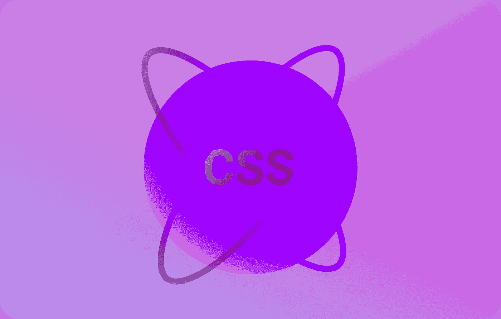
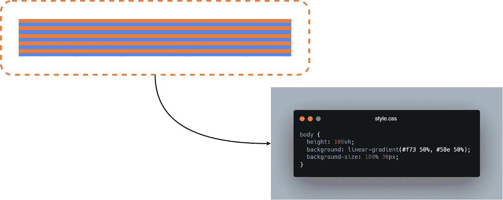
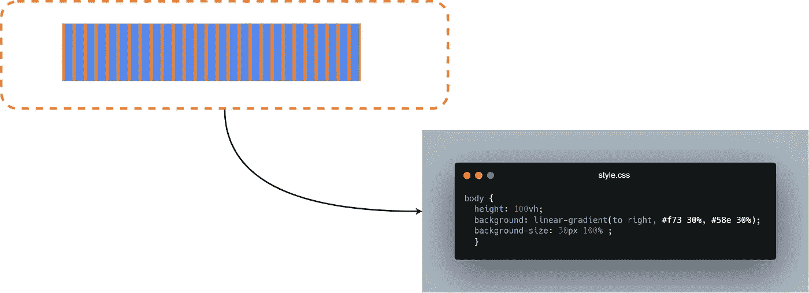
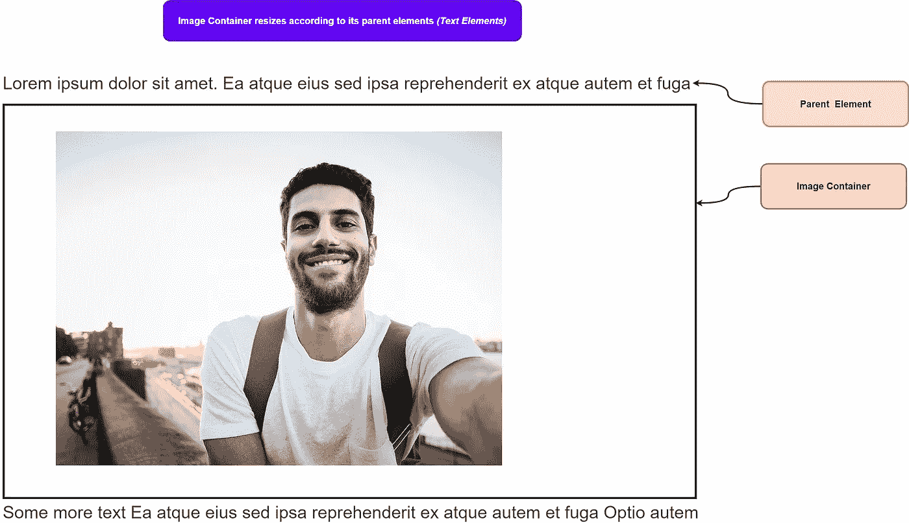
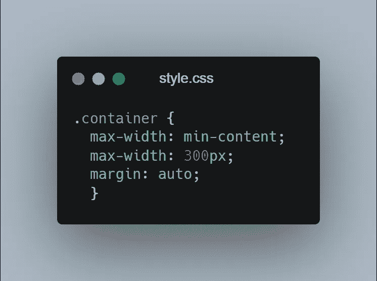
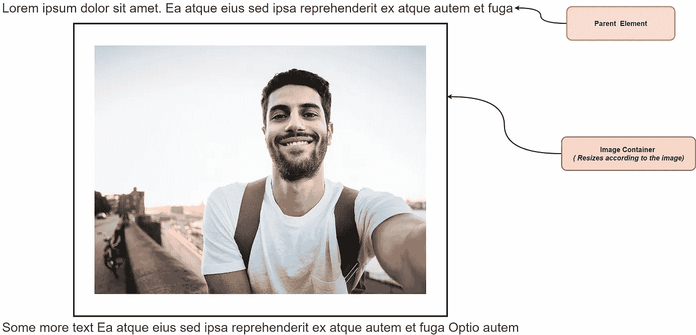

# 2 个你现在才知道的 CSS 特性

> 原文：<https://javascript.plainenglish.io/2-css-features-we-didnt-know-exists-f039471b18cb?source=collection_archive---------6----------------------->

## 未知的 CSS 特性有助于更快的 Web 开发

# 1.条纹背景

有时候，开发人员不得不在他们的应用程序中添加条纹作为背景，作为视觉设计的媒介。通常，这是在每次需要更改时用图像编辑器用单独的图像来完成的，有时 **SVG** 也用作替代，但所有方法都需要一个单独的文件，该文件具有不友好的 HTML & CSS 语法。

> 使用 CSS 只需几个简单的步骤就可以达到同样的效果。

## **渐变为条纹**

在 CSS 渐变的帮助下，条纹背景很容易实现，你只需要深入了解 CSS 渐变的工作方式。如果你简单地使用**两种颜色**和**相等的比率**在渐变功能中，它将立刻创建一个令人敬畏的渐变。

***例如:***

*   我们已经将**线性** - **渐变**作为**背景**应用到我们页面的**主体**上，这里我们使用了相同比例的两种颜色。
*   同样，如果我们应用**背景尺寸**，它会将我们的两个条纹缩小到 **15px** 每一个，这样我们就得到了条纹背景。

## **垂直条纹**

几个变化就足以实现垂直条纹背景，你只需要添加一个额外的参数来指定渐变方向。请注意，我们还需要设置一个不同的背景大小，因为现在我们正在处理一个垂直背景。

# 2.内在尺寸

调整元素高度是我个人遇到的最大的问题之一，你一定也遇到过这个问题，当我们不为一个元素设置一个特定的高度时，它会自动调整它的内容。然而，当我们还必须控制**宽度**时，更大的问题出现了。

有多种可行的黑客解决方案，但是它们仍然是黑客的，而且在某些时候，你会因为使用它们而遭受痛苦。如使用**max-width**&**dislpay:inline-block。**

这个问题的一个简单解决方案是使用 **min-content** 关键字，它给出了盒子内最大的不可打破元素的*宽度*。

***例如:***

*   假设您的登录页面中有**宽度**问题，其中图像容器不会根据**图像**调整自身大小，因为它遵循其**父**元素。

*   为了解决这个问题，我们必须简单地使用 **min-content** 关键字，它将处理导致这些问题的一切。

*   注意，我已经使用了**最大宽度**来为旧浏览器提供一个后备，然而，简单地使用**宽度**就可以完成这项工作。

 [## 你不知道 CSS 能做的 4 件事

### 鲜为人知的 CSS 特性及示例

javascript.plainenglish.io](/4-things-you-didnt-know-css-can-do-13b364296570)  [## 在 4 分钟内解释 4 个关键 CSS 属性

### 基本 CSS 入门

javascript.plainenglish.io](/4-key-css-properties-explained-in-4-minutes-9567d1b5af86) 

*更多内容尽在*[***plain English . io***](http://plainenglish.io)