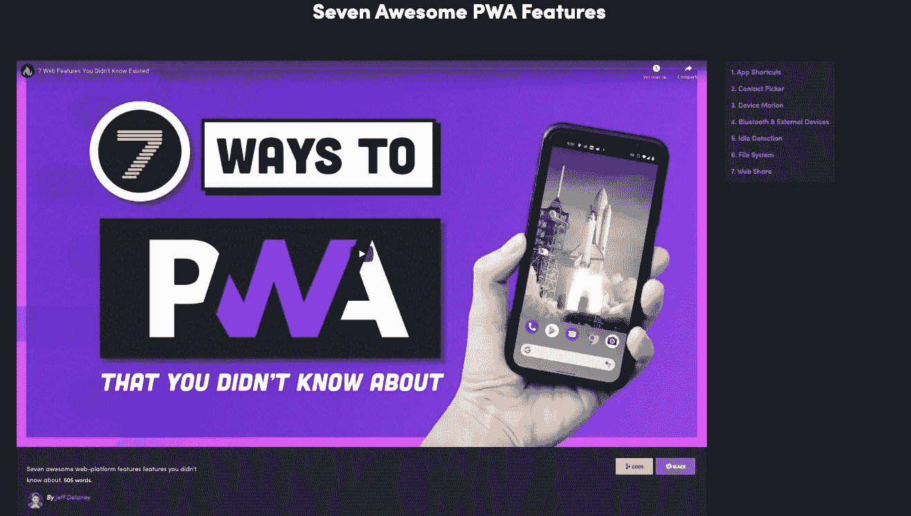
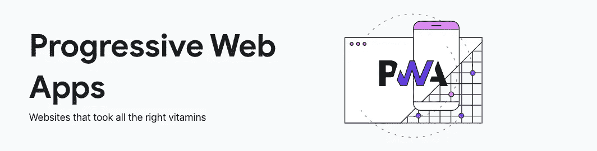
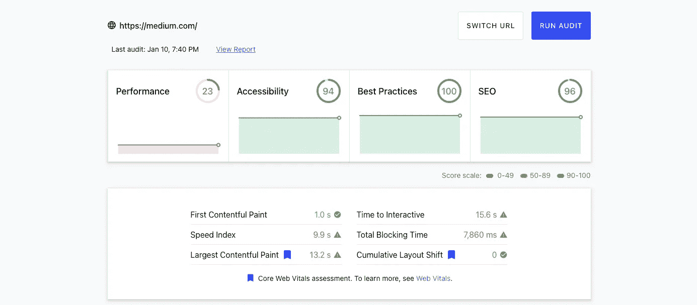

# 2 个优秀的网站供 Web 开发人员使用

> 原文：<https://javascript.plainenglish.io/2-excellent-websites-for-web-developers-781339527ab0?source=collection_archive---------2----------------------->

## 如果你是一个网站开发者，你应该看看这两个资源！

Foto de [Vlada Karpovich](https://www.pexels.com/es-es/@vlada-karpovich?utm_content=attributionCopyText&utm_medium=referral&utm_source=pexels) en [Pexels](https://www.pexels.com/es-es/foto/mujer-taza-ordenador-portatil-cuaderno-4050415/?utm_content=attributionCopyText&utm_medium=referral&utm_source=pexels)

想让自己被优质内容包围？试试这两个网站。

## 本文的视频版本

# 火船

在查看新闻时，我发现了一个关于渐进式网络应用程序的 7 个网络功能的有趣视频，所以我决定去看看。

我被这个视频的质量惊呆了。

它不仅信息量很大(实际上我不知道其中 7 个中的 6 个)，而且做得很好。

这个视频内容丰富、简洁、快速，但并不匆忙，我认为这三样东西是秘方:

## 示例和资源

所有的功能都有一步一步的例子来说明如何开始使用这些功能，包括:代码、图像、动画和为功能生态系统做出贡献的应用程序/网站。

两个例子之间的过渡也非常平滑，暗示也很好，就像其他视觉效果一样，有助于提供出色的观看体验。

## 不打字

我注意到一件有趣的事情，这可能是制作快速分阶段视频而不着急的秘密，那就是缺少打字。

这些示例是一行一行地写下来的，但是每一行都以片段的形式出现，清楚地给出了所需的行以及每个命令的顺序和优先级，但是没有键入每一行所必需的令人厌烦的时间。

## 没有停顿&伟大的脚本

最后，在这个视频中没有停顿，“不急，不停顿”是我的座右铭，但没有实践和一个伟大的剧本是很难实现的。

通过观看视频，你可以看出作者(杰夫)不得不花一些时间来准备/练习或至少编辑视频，以达到这样的水平。

作为一个内容创作者，在交付如此复杂的脚本时没有任何错误是真诚令人钦佩的。

## 但是等等，还有更多

我展示了视频的描述，发现这个 YouTube 频道实际上是一个视频课程和课程(免费和付费)页面，质量非常好。

似乎它最初是围绕 Firebase 和 Angular 的，但今天已经扩展到一般的 Web 开发。

内容包括:

*   渐进式网络应用
*   反应
*   重火力点
*   码头工人
*   NodeJS
*   云平台等等。

我希望你和我一样觉得这个页面很吸引人。

# 网络开发

几年前，谷歌 Chrome 团队决定致力于一个致力于最佳实践和监控网站能力的网站，以确保您始终能够保持网站快速、灵活和可访问。

该网站有两个方面，学习和测量。

## 学习

它的学习部分是最先引起我注意的部分。

他们有大量的知识，完美的参考和分类，以帮助您了解更多关于网络的良好实践和能力，因为今天的主要类别是:

*   表演
*   建立优秀的网站(关于尖端网络技术的知识)
*   结构
*   灯塔

Fireship 本身围绕 *web.dev* 知识库构建参考资料，相当有趣；我一直使用 Mozilla 的 MDN 作为参考，但 *web.dev* 带来了更深入和丰富的例子。

我邀请你去看看是否有你感兴趣的东西，我发现许多条目教给我的东西比我以前在这个领域所知道的要多。

他们还有一个现场博客、一个媒体博客和一个 YouTube 频道。

## 措施

该网站使用 Lighthouse，这是一个用于提高网页质量的开源自动化工具。进而在以下类别中审核您的站点:

*   表演
*   最佳实践
*   搜索引擎优化
*   易接近

这有助于你揭开网站缺点的神秘面纱。

我测试了 Medium 本身，我会说它的得分很高:

## 如果你想以任何方式支持我

*   如果你发现这些网站中有你喜欢的，请告诉我
*   [加入我的 YouTube 频道](https://www.youtube.com/channel/UCIrkqvbX0xx7Rm88kSGJ72Q)
*   [订阅我的每月简讯](http://eepurl.com/hg7AeP)

**参考文献**

*   [你不知道的 7 个网络功能](https://fireship.io/lessons/pwa-top-features/)
*   [Fireship.io](https://fireship.io/)
*   杰夫·德莱尼
*   [Web.dev](https://web.dev/)
*   [Web.dev Learn](https://web.dev/learn/)
*   [Web.dev Medium](https://medium.com/dev-channel)
*   [Web.dev YouTube](https://www.youtube.com/user/ChromeDevelopers)
*   [灯塔](https://developers.google.com/web/tools/lighthouse/)

## 接下来读什么

*   [什么是 JavaScriptLandia？](https://medium.com/javascript-in-plain-english/what-is-javascriptlandia-9859367d2ec1)
*   [为我改变 JavaScript 的 6 个工具](https://medium.com/javascript-in-plain-english/the-6tools-that-changed-javascript-for-me-3ee1faf40585)
*   [避免箭头功能的两种情况](https://medium.com/javascript-in-plain-english/you-should-never-use-an-arrow-function-in-any-of-these-two-situations-8bc2fbbc39b8)