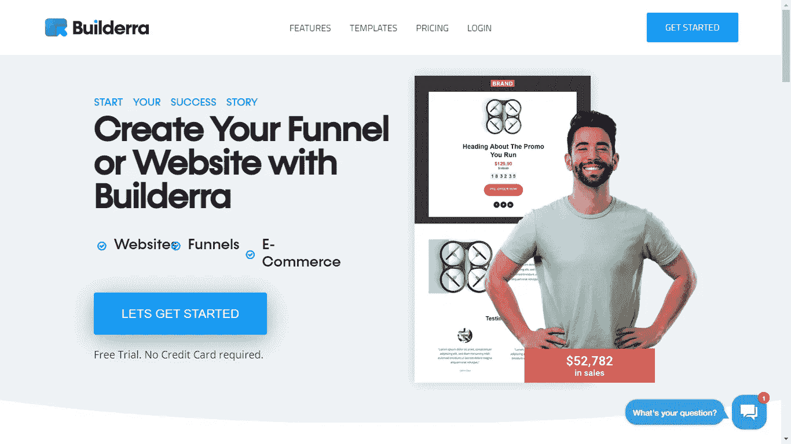

# 2 个鲜为人知但很棒的网站

> 原文：<https://javascript.plainenglish.io/2-lesser-known-but-awesome-websites-for-creators-980910e6aae3?source=collection_archive---------14----------------------->

Image by [200 Degrees](https://pixabay.com/users/200degrees-2051452/?utm_source=link-attribution&utm_medium=referral&utm_campaign=image&utm_content=1624028) from [Pixabay](https://pixabay.com/?utm_source=link-attribution&utm_medium=referral&utm_campaign=image&utm_content=1624028)

## 98%的人不知道这两个网站。

嘿，大家好，我们遇到了许多网站，它们提供了许多功能，帮助我们在不同领域更有效、更轻松地工作。网站是基于用户的业务需求而建立的。用户类型因网站功能而异——需要观看视频的人不会去亚马逊这样的网站，他/她会选择 YouTube。截至 2021 年 9 月，谷歌在访问量最大和最受欢迎的网站列表中排名第一。用户每次访问平均花费大约 11 分钟上网。接下来依次是 YouTube、脸书、Twitter 和 Instagram。

在这篇文章中，你会发现创作者需要的最有用的、隐藏的和被低估的网站。

附:这不是一篇推广文章。

# 检查 sub

这里有 YouTube 内容创作者和博客作者吗？那么 Checksub 就是为你的视频添加标题或字幕的最佳选择。他们认为视频和音频是一种主要的交流媒介，这就是为什么他们通过字幕来帮助你放大你的声音。

## 网站链接

 [## 给视频添加标题和字幕|自动平台

### 加入已经委托给我们 30，000 多个项目的创作者社区。在 Checksub 上，你为你的…

www.checksub.com](https://www.checksub.com/) 

> 我们相信未来是由创造者塑造的。我们帮你写。

## 关键特征

*   它会在一分钟内自动从音频生成字幕。
*   你可以选择专业人士为你的视频提供高质量的产品。
*   它不关心视频的长度和音频质量。它充分利用了它。
*   它制作字幕的速度快了 8 倍。
*   甚至字幕翻译也可以用 Checksub 来做。

他们拥有 5000 多名客户，迄今为止已经创建了 20，000 多个项目，编辑器支持 140 多种语言。

## 定价

1.  ***免费计划***

*   只适合最大文件大小为 300 Mb 的短视频，没有任何翻译功能。
*   字幕将手动生成。
*   一个月只允许 10 个项目。

***2。启动器***

***月计划***

*   字幕可以自动生成，最多 3 种翻译语言，每月 29 美元。
*   您可以有任意数量的项目，但文件大小最大应为 4 GB。
*   你可以每月字幕长达 1 小时，你可以根据自己的兴趣定制字幕设计。

***年度计划***

*   您可以每年添加多达 12 小时的字幕，功能与每月计划相同。
*   每月只需 24 美元(包月计划提供 17%的优惠)，按年计费。

***3。*工作室**

***月计划***

*   它具有启动计划的附加功能，每月使用 3 小时，最多 6 种翻译语言。
*   在客户经理的额外支持下，每月费用约为 76 美元。

***年度计划***

*   每月只需 63 美元(包月计划提供 17%的优惠)，按年计费。
*   您每年最多可以工作 36 小时，功能与月计划相同。

***4。Pro***

*   一键获得专业字幕。如果你想用专业校对来处理字幕的制作，这是很合适的。
*   成本约为 3 欧元/分钟，99%的字幕准确率，每种语言的翻译成本约为 19 欧元/分钟。
*   你可以做任何数量的项目，有 22 种语言可供翻译。

# Builderra

Builderra 是世界上最方便、最简单的 web 构建器之一。它建立网站、渠道以及网上商店。所有这些功能都是在没有任何代码的情况下实现的，只需拖放元素，点击几下，你的网站就准备好了。

## 网站链接

 [## Builderra -世界上最简单的网站建设者-建立高转化率的网站！

### Builderra 是世界上最简单的 web 构建器。做转化网站，漏斗，网店。Builderra…

builderra.com](https://builderra.com/) 

## 关键特征

*   网站和漏斗可以建立，按照你的意愿修改不同的风格和定制。
*   内容可以根据设备宽度进行缩放，这使得您的网站在移动设备和笔记本电脑上看起来都非常漂亮。
*   你有一堆不同领域的网站、渠道、登陆页面和在线商店的模板，这样你就可以选择适合你的模板。
*   马上开始销售你的产品，有效地增加你的销售额。
*   人们可以销售产品，如数字产品、实物产品、任何服务，或者为会员提供大量的在线支付处理器。
*   您可以集成一系列频繁发送邮件的电子邮件营销工具，以便更好地吸引客户。

## 定价

在 Builderra 中，你可以选择 14 天的免费试用，不需要信用卡。

1.  ***基本***

*   基本计划的费用约为 20 美元/月(按年计划)和 25 美元/月(按月计划)。
*   你可以建立一个最多 20 页的网站，拥有 5GB 的存储空间和高达 10GB 的带宽。
*   您可以利用多达 2 个网站管理员以及 25 个免费域名和托管的网站成员，可以做分析和跟踪。

2. ***业务***

*   商业计划的费用约为 45 美元/月(按年计)和 49 美元/月(按月计)。
*   你可以建立 1 个网站和 5 个漏斗，拥有无限的页面，无限的存储空间和高达 60GB 的带宽。
*   你可以利用多达 5 个网站管理员以及 200 个免费域名和托管的网站成员，可以做分析和跟踪。
*   您可以有 2 个预订运营商，4 个预订服务和 100 个产品存储在您的网站上。

3. ***成长***

*   增长计划的费用约为 89 美元/月(按年计划)和 97 美元/月(按月计划)。
*   你可以建立 3 个网站和 30 个漏斗，拥有无限的页面，无限的存储空间和高达 120GB 的带宽。
*   您可以利用多达 33 个网站管理员以及无限的网站成员，拥有一个免费的域名和主机，可以做分析和跟踪。
*   您可以有 5 个预订运营商，10 个预订服务和无限的产品存储在您的网站上。

4. ***专家***

*   专家计划的费用约为 400 美元/月(按年计)和 450 美元/月(按月计)。
*   你可以建立 10 个网站和无限的漏斗，拥有无限的页面，无限的存储空间和高达 400GB 的带宽。
*   您可以利用多达 100 个网站管理员以及无限的网站成员，拥有一个免费的域名和主机，可以做分析和跟踪。
*   您可以有 10 个预订运营商，20 个预订服务和无限的产品存储在您的网站上。

# 结论

希望这篇文章能帮助你找到最被创作者低估的网站。谢谢你花了你最宝贵的时间。如果您对本文有任何疑问或建议，请发表评论。

*感谢学习！*