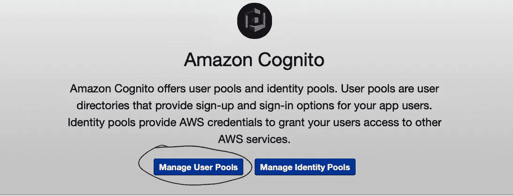
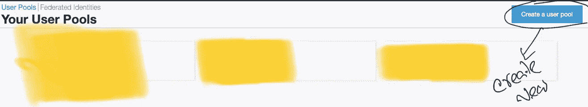
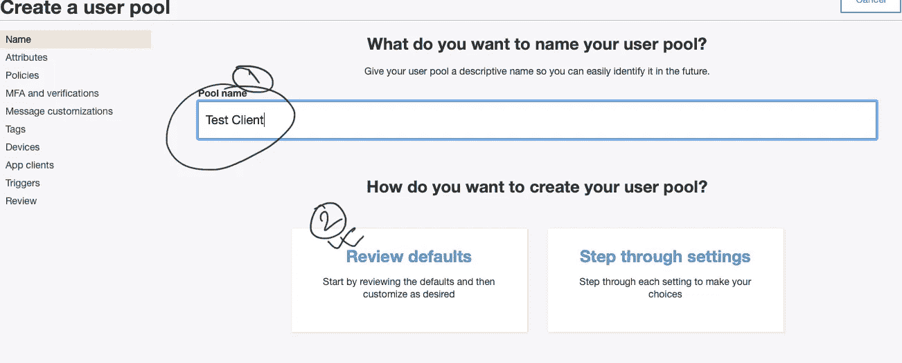
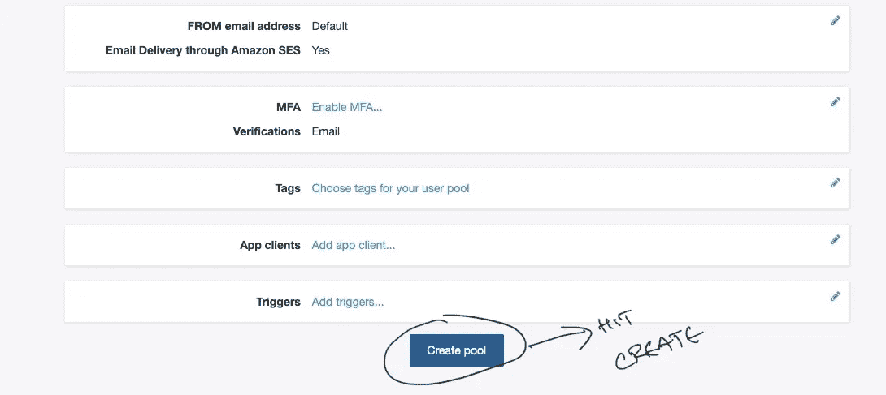
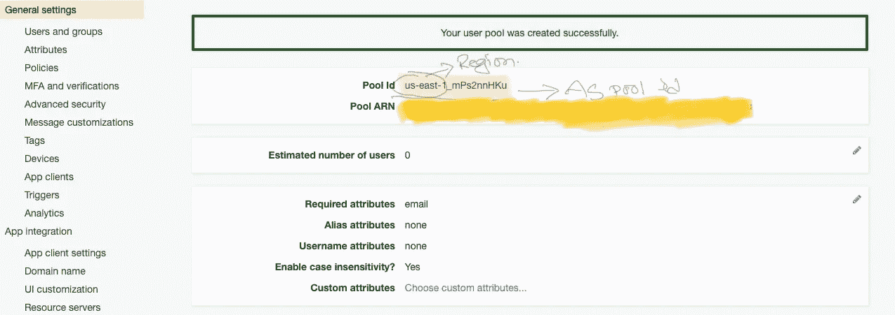
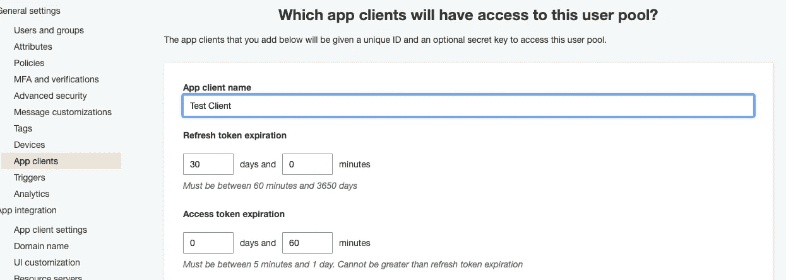
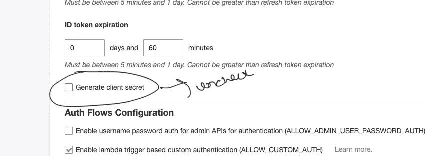
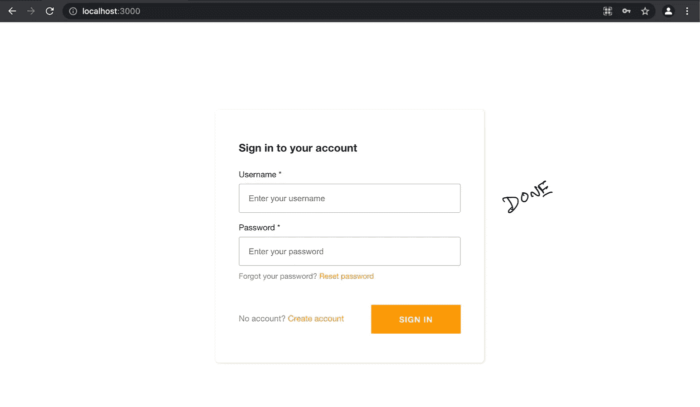

# 使用 AWS Amplify 在 React 应用程序中添加身份验证

> 原文：<https://javascript.plainenglish.io/2-minute-setup-for-authentication-in-a-react-app-using-aws-amplify-59e2824631b1?source=collection_archive---------20----------------------->

## 如何使用 AWS Amplify 在 2 分钟或更短时间内在 React 应用程序中添加身份验证。


Photo by [Georg Bommeli](https://unsplash.com/@calina?utm_source=medium&utm_medium=referral) on [Unsplash](https://unsplash.com?utm_source=medium&utm_medium=referral)

**亚马逊网络服务**提供可靠、可扩展、廉价的云计算服务。它提供了 It 问题可能需要的几乎所有解决方案。

其中，Amplify 为您的应用程序提供了一些开箱即用的功能。

在这里，我将演示如何在两分钟或更短的时间内在 React 应用程序中添加身份验证。

## 第一步

登录您的`AWS`账户，然后转到`cognito`。



Hit Manage User Pools



Create a user Pool



Name your pool



And Create Pool



Copy Pool ID and Region



Create Client



Remember to uncheck this field

**全部用 AWS 设定。**

## 第二步

创建 React 应用程序并安装依赖项

```
yarn add aws-amplify # or npm install aws-amplifyyarn add [@aws](http://twitter.com/aws)-amplify ui-react # or npm install [@aws](http://twitter.com/aws)-amplify/ui-react
```

现在只需粘贴代码

```
import React from "react";
import Amplify, {} from "aws-amplify";
import {withAuthenticator,AmplifySignOut} from "@aws-amplify/ui-react"Amplify.configure({
 aws_cognito_region: "YOUR_REGION",
 aws_user_pools_id: "YOUR_POOL_ID",
 aws_user_pools_web_client_id: "APP_CLIENT_ID"
})const App = (props)=>{
 return(
  <div>
    <text>My Application</text>
    <AmplifySignOut text = "Sign Out"></AmplifySignOut>
  </div>
)}
export default withAuthenticator(App);
```

## 第三步

没有第三步。你现在已经准备好了。你好。



All Set, You can now have authentication in your application

感谢阅读。编码快乐！

*更多内容请看*[***plain English . io***](http://plainenglish.io/)