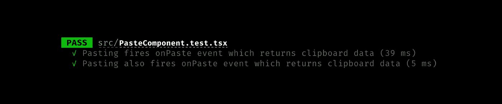

# 用测试库触发 onPaste 事件的两种方法

> 原文：<https://javascript.plainenglish.io/2-ways-to-trigger-the-onpaste-event-with-testing-library-1502c5fdb9e?source=collection_archive---------5----------------------->

## 用粘贴事件测试组件不再麻烦。

Photo by [Mat Napo](https://unsplash.com/@matnapo?utm_source=medium&utm_medium=referral) on [Unsplash](https://unsplash.com?utm_source=medium&utm_medium=referral)

如果您正在构建一个使用粘贴事件来触发某个事件的组件，您可能还希望构建测试来确保它按照预期的方式并且始终如一地工作。

我遇到了一些测试库不触发粘贴操作的问题，或者如果它触发了，它触发了类似`ClipboardEvent is not defined`和`TypeError: Cannot read property 'getData' of undefined`的错误，虽然答案分散在互联网上，但没有一个地方可以将它们集中在一起。所以我们在这里。

下面是两个如何使用 testing-library 和 React 测试粘贴事件的工作示例，它们都触发粘贴事件并能够返回粘贴的文本。这些例子都是用 Typescript 编写的，所以如果你是一个普通的 Javascript 爱好者，只需去掉这些类型，你就可以开始了。

A simple component. When onPaste is triggered, it calls this.pasteEvent which extracts the data (the content you pasted) and passes it back to the paste property (so it can be used outside the component — e.g in a test).

可能值得注意的是，第一个测试确实在 Typescript 的第 20 行触发了一个`Property 'clipboardData' does not exist on type 'Event'`错误。我试图通过将类型改为`const clipboardEvent:ClipboardEvent = new ClipboardEvent(...)`来解决这个问题，但这导致了错误`Cannot assign to 'clipboardData' because it is a read-only property`。因此，如果您正在使用 Typescript，并且不希望出现错误，就使用第二个选项。

Two examples (you only need one) showing how we render the paste component, trigger the on paste event and then test that it calls the paste event and passes the content back.

The proof in the pudding — shows both tests passing successfully

感谢您花时间阅读本文。希望这是有帮助的。

—大卫

*高级前端开发者@*[*TripActions*](https://tripactions.com/)*(通常是* [*招聘*](https://grnh.se/cbeb241d1) *！)*

*更多内容请看*[*plain English . io*](http://plainenglish.io/)