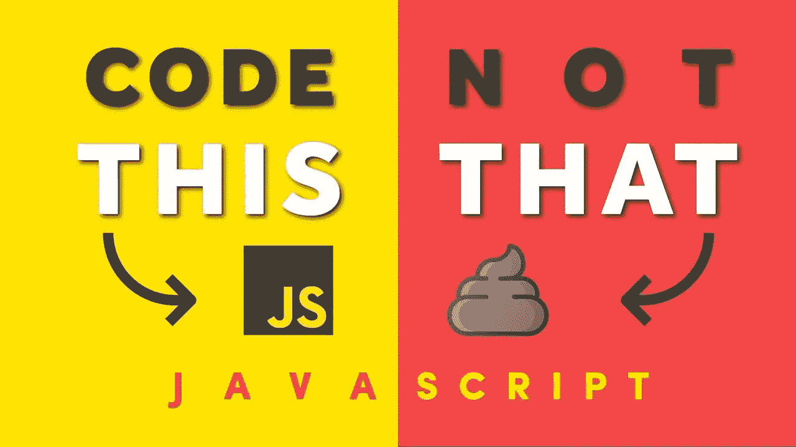

# 对 JavaScript 开发人员非常有用的技巧

> 原文：<https://javascript.plainenglish.io/20-awesome-tips-for-better-and-more-professional-coding-with-javascript-2becaedb5f9?source=collection_archive---------6----------------------->



@Fireship

JavaScript 是顶级编程语言之一，也是许多开发人员最喜欢的语言。你可以建立一个网络或移动混合应用程序，它甚至有能力控制机器人。这种语言对初学者来说很容易学。但是您需要用 JavaScript 解决一些现实生活中的问题。有些你可以解决，有些却很棘手。

今天，在这篇文章中，我们将看看 20 个更好的编码技巧，以更好、更简单的方式解决 JavaScript 中的问题。这些提示可能对专业开发人员有所帮助，但对新开发人员也会很有意思。

## 1.数字到字符串/字符串到数字

这个提示很简单，它可以帮助你将一个数字转换成字符串或者将字符串转换成一个数字。查看下面的代码示例，了解转换是如何工作的。

```
// number to string
let num1 = 4
let string1 = num1.toString();// string to number
let string2 = "5"
let num2 = Number(string2)
```

## 2.短循环

在 JavaScript 中，你通常知道用多行写一个循环，但是你可以只用一行写一个短循环。想知道怎么做吗？查看下面的示例代码。

```
const ProgrammingLang = ["JavaScript", "Python", "C++", "Dart", "Java"]// Long Loop Version
for (let i = 0; i < ProgrammingLang.length; i++) {
  const lang = ProgrammingLang[i];
  console.log(lang);
}// Short Loop Version
for (let lang of ProgrammingLang) console.log(lang);
```

## 3.计算性能

这个技巧将帮助你计算你的代码性能，同样的性能计算是在 Google Chrome 上完成的。

```
const startTime = performance.now();
something();
const endTime = performance.now();
console.log("function took ${startTime - endTime} milliseconds");
```

## 4.以简单的方式交换值

当您需要在没有任何额外变量(如 temp)的情况下交换值时，这个技巧会很方便。这个技巧是一个简单快捷的交换值的方法。

```
let a = 5; 
let b = 6;
[a, b] = [b, a]
console.log(a) // 6
console.log(b) // 5
```

## 5.合并数组

这个技巧将帮助您将数组合并成一个数组。查看下面的代码，了解它是如何工作的。

```
const names1 = ["Haider", "John", "Jessica"];
const names2 = ["Ferb", "Emma", "Watson"];const allnames = [...names1, ...names2];console.log(allnames); // ["Haider", "John", "Jessica", "Ferb", "Emma", "Watson"]
```

## 6.以简单的方式删除重复项

这个技巧可以让你在短时间内以一种简单的方式删除数组中的所有重复项。

```
const fruits = ["apple", "mango", "orange", "apple", "pineapple", "pineapple", "peach", "mango"]
const fruiteWithoutDupli = [...new Set(fruits)];console.log(fruiteWithoutDupli) // [ "apple", "mango", "orange", "pineapple", "peach" ]
```

## 7.验证给定的参数是数字

这个技巧将告诉你如何验证你在函数中传递的参数是否是一个数字。

```
function isNumber(num){
    return !isNaN(parseFloat(num)) && isFinite(num);
}isNumber(34) // true
isNumber('JavaScript') // false
```

## 8.验证给定的参数是数组

这篇技巧将向您展示如何验证您在函数中传递的参数是否是一个数组。

```
function isArray(arr){
    return Object.prototype.toString.call(arr) === '[object Array]' ;
}isArray([34]) // true
isArray('JavaScript') // false
```

## 9.清空数组

这是用一行代码完全清空数组的最酷的技巧。查看下面的代码，了解它是如何工作的。

```
var array1 = [ "JavaScript", "Python", "C++" ];
array1.length = 0;console.log(array1) // [] array will become empty
```

## 10.从数组中获取最大值和最小值

这个技巧将引导你以一种快速简单的方式从一个数组中找到最小值和最大值。现在这个问题不需要写长循环了。

```
var  numbers = [1, 6, 2, 8, 10, 11 ,24, 3, 9];var max = Math.max.apply(Math, numbers); // 24
var min = Math.min.apply(Math, numbers); // 1
```

## 11.数组中的随机项

在这篇技巧文章中，我将向您展示如何从数组中获取一个随机项。Item 可以是字符串、整数或任何数据类型。

```
var items = [1, 4, 5, 6, 7, 8];var  randomItem = items[Math.floor(Math.random() * items.length)];console.log(randomItem) // 4
```

## 12.错误处理

有时会出现异常错误，这给开发人员处理这些错误带来了问题。在这方面，这个技巧会很有用。我将向您展示如何在不终止整个程序的情况下用 try-except 语句处理错误。

```
var items = [1, 4, 5, 6, 7, 8];try 
{
  console.log(items[2])
}
catch (error)
{
  console.log("we got an error")
}
```

## 13.缩短您的阵列

缩短数组的一个好方法是使用 length 方法。这个技巧将指导你使用长度方法来缩短数组，在我看来这是一个快速简单的方法。但是这是一种破坏性的方式，意味着您可能会丢失从数组中移除的其他元素。

```
var items = [1, 4, 5, 6, 7, 8];items.length = 4console.log(items) //[1, 4, 5, 6]
```

## 14.避免使用 For-in 循环

您应该避免使用 for-in 循环。相反，你应该使用一个比 for-in 循环快得多的普通循环。

```
// for in loop
var numbers = [1, 3, 4, 5]
var sum = 0;  
for (var i in numbers) 
{  
    sum += numbers[i];  
}// instead use this
var numbers = [1, 3, 4, 5]
var sum = 0;  
for(var i=0; i < numbers.length; i++)
{
  sum +=numbers[i];
}
```

## 15.使用映射函数在数组中循环

循环数组是一个既耗时又费钱的问题，但是我们可以使用 map 函数以更快的方式来完成。这个技巧将向你展示如何使用 map 函数来遍历一个数组。

```
var squares = [1,2,3,4].map(function (val) {  
    console.log(val)
}); 
// Output
// 1
// 2
// 3
// 4
```

## 16.逗点算符

这个技巧将帮助你理解逗号操作符。逗号运算符(，)计算它的每个操作数(从左到右)，并返回最后一个操作数的值。

```
var a = 1
var b = (a++, 3)
console.log(a) // 2  value of 'a' is increamented
console.log(b) // 3
```

## 17.使用正则表达式替换所有字符

我们可以使用正则表达式替换字符串中的所有字符。这个简单的提示和技巧将告诉你如何做到这一点。

```
var string = "JavaScript"; 

console.log(string.replace(/Script/, "code"));  //Javacode
```

## 18.数组中所有值的总和

如你所知，我们必须使用一个循环来计算数组中所有值的总和。但是这个技巧将帮助您计算数组值的总和，而不需要任何循环。

```
var values = [1, 2, 5, 6];
var sum = values.reduce((x, y) => x + y);
console.log(sum); // 14
```

## 19.洗牌数组的元素

这个很棒的技巧将指导你如何以一种简单的方式打乱数组的元素。

```
var arr = [1, 2, 3, 4, 5];
console.log(arr.sort(function() 
{
    return Math.random() - 0.5
}));  //[1, 4, 5, 2, 3]
```

## 20.Strick 等于(==，===)

在 JavaScript 中，我们不用“==”来比较值或数据；我们总是用“===”。如果你试图使用双重赋值操作符，那会给你带来问题。

```
// wrong way
if(22 == '22'){
  console.log(true)
}//correct way
if(22 === "22"){
  console.log(true)
}
else{
  console.log(false)
}
```

## 最后的想法

嗯，我知道还有许多其他的技巧和诀窍，但这些对我来说是有用的(我认为它们对新手开发者是有帮助的)。如果我错过了任何重要的提示或技巧，请告诉我。希望这篇文章对你以后有帮助。请随意留下您的回复。【JavaScript 编码快乐！

***看看我的另一篇关于 JavaScript 的文章。希望你对它们感兴趣。***

[](/32-useful-snippets-to-code-like-a-pro-in-javascript-c8b5be11752f) [## 32 个有用的 JavaScript 代码片段

### 在这篇文章中，我们将看看 getAngaram，RemoveDupli，maxN，minN，getDate，数组方法，大写，currenturl 和…

javascript.plainenglish.io](/32-useful-snippets-to-code-like-a-pro-in-javascript-c8b5be11752f) [](/9-must-know-array-methods-to-boost-your-javascript-skills-4ae1822f7751) [## 提高 JavaScript 技能的 9 个必须知道的数组方法

### JavaScript 有一些内置的数组方法，可以在不同的情况下使用。了解这些将会提高你的…

javascript.plainenglish.io](/9-must-know-array-methods-to-boost-your-javascript-skills-4ae1822f7751) [](/puppeteer-js-web-scraping-with-a-headless-browser-b5c5151c24a5) [## js:使用无头浏览器进行网络抓取

### Web 开发在很大程度上依赖于测试机制，在我们将它们投入生产之前进行质量检查…

javascript.plainenglish.io](/puppeteer-js-web-scraping-with-a-headless-browser-b5c5151c24a5) 

*更多内容请看*[*plain English . io*](http://plainenglish.io/)