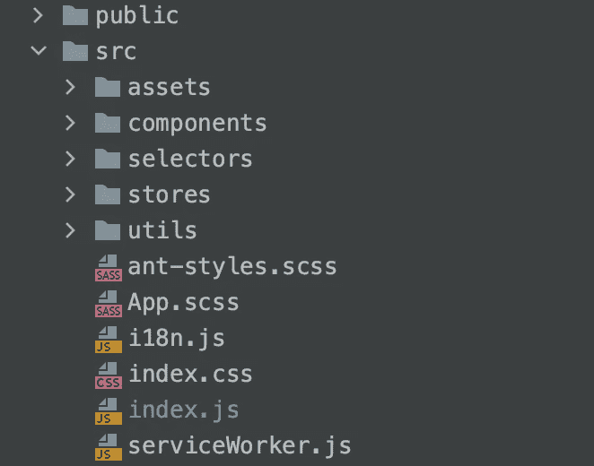

# 任何大型 React 应用程序的 20 个基本部分

> 原文：<https://javascript.plainenglish.io/20-essential-parts-of-any-large-scale-react-app-ee4bd35436a0?source=collection_archive---------0----------------------->

## 如果您正在编写企业级代码，您需要了解这一点

Photo by [Dan Dennis](https://unsplash.com/@cameramandan83?utm_source=unsplash&utm_medium=referral&utm_content=creditCopyText) on [Unsplash](https://unsplash.com/s/photos/enterprise?utm_source=unsplash&utm_medium=referral&utm_content=creditCopyText)

多年来，我有幸参与了一些大型 react 项目。今天，我收集了一些在构建一个新项目或增强任何大规模应用程序的功能时需要记住的重要事情。

我们将从最基本的开始，然后深入学习。所以系好安全带！

# 1.项目结构

当我开始使用 React 时，按照文件类型保存文件对我来说是很直观的。因为我有幸参与了一些更大的项目，所以我明白随着项目越来越大，浏览你的文件是多么困难

> 花一些时间做研究，找出最佳的文件夹结构。

对于大多数情况，我发现遵循域驱动的文件夹模式是非常可伸缩的。例如，您应该将所有的`user-related`文件保存在一个文件夹中，将`authentication-related`文件保存在另一个文件夹中。

这样，您以后很容易找到特定的文件。

My folder structure

这是我的。但是你可以自己选择和定制。

# 2.全球商店

对于任何大规模的 ReactJS 应用程序来说，拥有一个全球商店都是非常重要的。

虽然有很多选择，但对于大型项目来说，`Redux`仍然是一个非常好且安全的选择。

*   `[redux](https://redux.js.org/)`

Redux 生态系统也足够丰富，可以覆盖您的大多数用例。一些助手库是…

`[redux-persist](https://github.com/rt2zz/redux-persist)`:用于本地持久化数据

`[redux-thunk](https://github.com/reduxjs/redux-thunk)`:异步运行

`[reselect](https://github.com/reduxjs/reselect)`:选择器库，优化您的商店访问

`[react-redux](https://github.com/reduxjs/react-redux)`:与 React 集成

此外，您应该使用`[redux-devtools](https://github.com/reduxjs/redux-devtools)`扩展来充分利用任何基于 react-redux 的项目。

随着`[redux-toolkit](https://redux-toolkit.js.org/introduction/quick-start)`的引入，它现在少了很多冗长和简洁。

# 3.按指定路线发送

React 没有为客户端的路由提供官方库。但是`react-router-dom`是大多数项目的首选。

*   `[react-router-dom](https://reactrouter.com/web/guides/quick-start)`

此外，有一些助手库与您的`react-router`生态系统很好地配合。

`[history](https://www.npmjs.com/package/history)`:跟踪导航页面的历史

`[connected-react-router](https://github.com/supasate/connected-react-router)`:帮助连接您的路线与 redux 状态。

# 4.多重环境

任何大型项目都会有多个环境，作为开发人员，您应该知道如何处理它。可能有多种环境，如…

*   发展
*   脚手架
*   生产

您应该为此维护单独的环境文件。为此可以添加`.env`、`.end.development`、`.env.staging`等文件。

您可以从这里了解 react 中有关环境的更多信息

 [## 在 React 中处理多种环境

### 简单而优雅的解决方案

medium.com](https://medium.com/javascript-in-plain-english/handle-multiple-environments-in-react-d3d05b2c4248) 

# 5.表单处理

表单几乎是任何一种 web 应用程序的重要组成部分，以一种简洁的方式手动处理它们可能很棘手。

对于企业级应用程序，您可以使用一些非常流行的库，如

*   `[formik](https://formik.org/)`
*   `[react-hook-form](https://react-hook-form.com/)`

他们将处理组件中的大部分样板逻辑，并提供验证和其他很酷的特性。但我更喜欢`react-hook-form`，因为它更有表现力。

这是给你的入门指南。

 [## 如何在 TypeScript 中使用 React Hook 表单

### 为您的应用程序构建高性能、简洁的表单

javascript.plainenglish.io](/how-to-use-react-hook-form-with-typescript-2cf597c0c45f) 

# 6.式样

你可以使用普通的老式`css`组件，但是在现代，你应该使用`sass`设置来获得更好的风格。

*   `[node-sass](https://www.npmjs.com/package/node-sass)`

如果你想要更现代的东西，你应该使用`styled-components`。事实上，它现在是我的首选图书馆。它帮助我使用样式作为独立的组件，并帮助我摆脱到处使用`className`属性。

*   `[styled-components](https://styled-components.com/)`

# 7.用户界面库

如果你手工设计所有的组件，那么就不需要。但大多数时候并不是这样。所以你应该明智地选择你的组件库。

*   [物料界面](https://material-ui.com/)
*   [语义界面](https://react.semantic-ui.com/)
*   [蚂蚁设计](https://ant.design/)

这些是你应该留意的一些选择。

同样对于一些特定的用例，你可以选择其他的库，比如`[react-loader-spinner](https://www.npmjs.com/package/react-loader-spinner?activeTab=readme)`或者`[react-spinner](https://www.npmjs.com/package/react-spinners)`来加载动画。

或者对于表来说`[react-table](https://www.npmjs.com/package/react-table)`可以是一个可以考虑的强大选项。

# 8.HTTP 查询

从远程服务器获取数据是动态 react 应用程序最常见的任务之一。对于标准的 CRUD 操作， **Axios** 是一个很好的选择

*   `[axios](https://github.com/axios/axios)`

如果你想要更强大的东西，你可以使用`react-query`，它提供了开箱即用的`caching`。

*   `[react-query](https://github.com/tannerlinsley/react-query)`

# 9.证明文件

对于大型项目，文档非常重要。有很多库，但是根据我的看法，最好和最简单的选择是使用`react-styleguidist`

*   `[react-styleguidist](https://react-styleguidist.js.org/docs/documenting/)`

你可以在这里了解更多

 [## 以正确的方式记录 React 应用程序

### 逐步介绍指南

medium.com](https://medium.com/javascript-in-plain-english/document-your-react-applications-the-right-way-f648053c3a70) 

# 10.多语言支持

对于大型国际项目，通常会要求您添加多语言支持。最好把它加在你项目的开头。

最好的选择是使用`react-i18next`和`i18next`库。

你可以在这里了解更多

 [## 在 React 中实现多语言支持

### 6 个简单的步骤

medium.com](https://medium.com/javascript-in-plain-english/implement-multi-language-support-in-react-9854c52ddb55) 

# 11.动画库

动画有助于让你的应用程序看起来反应更快，使用起来更有趣。适量的动画可以带来很大的不同。

但是不要过度！你可以创建自己的动画或使用强大的库，如`react-awesome-reveal`、`react-spring`或`react-transition-group`。

感谢亚历克斯·陈(Alex Chan)的评论，我从他的评论中发现了另一个名为 [Framer Motion](https://www.framer.com/motion/) 的很棒的库。太牛逼了！

# 12.埃斯林特和更漂亮

对于大型项目，让所有开发人员遵循一致的代码风格可能会很棘手。可以借助两个牛逼的库`eslint`和`prettier`。

*   EsLint 为您的项目充当 linter 和静态类型检查器
*   更漂亮有助于实现一致的风格和间距等。

你可以从这里了解更多。

 [## 如何为你的 React 应用添加林挺和格式

### 做好这一点，否则，你的代码会有问题

medium.com](https://medium.com/javascript-in-plain-english/how-to-add-linting-and-formatting-for-your-react-app-78227b328910) 

# 14.以打字打的文件

拥有一个 typescript 设置可以极大地提高您和您的团队的生产力。

这可能需要一些时间来适应，但对于大型项目来说，这是一项伟大的投资。以后可以节省大量的时间。

即使您现在正在处理一个 javascript 项目，您也可以将 typescript 增量地添加到您的项目中，因为 typescript 是 javascript 的超集。

# 15.分析学

对于企业应用程序，分析是最重要的部分之一。您可以跟踪谁在使用以及他们如何使用您的应用程序

*   google analytics for react 正式实施

 [## 如何设置谷歌分析并将其添加到 React 应用程序中

### 谷歌让洞察你的网络应用变得非常容易

medium.com](https://medium.com/javascript-in-plain-english/how-to-setup-and-add-google-analytics-to-your-react-app-fd361f47ac7b) 

# 16.测试

对您的应用程序进行一定量的测试是非常重要的。

您应该有一个合适的测试环境设置。你可以用`create-react-app`自动得到。我最需要的库是

*   `[react-testing-library](https://testing-library.com/docs/react-testing-library/intro/)`:用于测试反应组分
*   `[jest](https://jestjs.io/)`:用于 javascript 单元测试
*   `[cypress](https://www.cypress.io/)`:端到端测试

这是给你的介绍性指南。

 [## 开始反应测试所需的一切

### 对初学者的温和介绍

betterprogramming.pub](https://betterprogramming.pub/everything-you-need-to-get-started-with-testing-in-react-e16819b0eba7) 

# 17.搜索引擎优化性能

如果您正在构建一个 SEO 很重要的应用程序(比如电子商务)，那么您应该了解 SEO 的基础知识以及如何改进它。

 [## 如何提升反应应用的搜索引擎优化

### 反应与搜索引擎优化有其缺点。让我们对付他们

betterprogramming.pub](https://betterprogramming.pub/how-to-boost-the-seo-of-your-react-app-b1c36d272ddf) 

否则，您可以构建一个在服务器端渲染的**同构应用程序**。对于这种情况，NextJS 或 GatsbyJS 是一个很好的选择。这里有一个资源可以让您开始。

 [## 从 Next.js 开始您的旅程

### 一个很好的框架，供反应开发者使用

javascript.plainenglish.io](/start-your-journey-with-next-js-958705cfc299) 

# 18.效用

对于任何项目，我们都需要做一些我们需要外部库帮助的普通工作。其中一些是

*   `[lodash](https://lodash.com/)`:数据操作
*   `[date-fns](https://date-fns.org/)`:日期处理

这些是最常见的需要记住的问题。

# 19.码头工人

这不是一个必要的部分，但是知道如何整理您的反应应用程序是很好的。您可以从中获得一些真正的好处。

Docker 提供了便携性和高效性。所以考虑在你的项目中设置一个码头工人。您可以阅读下面的文章来了解如何有效地对您的反应应用程序进行分类

 [## 我如何将 Docker 映像大小从 1.43 GB 减小到 22.4 MB

### 通过 5 个简单的步骤

medium.com](https://medium.com/javascript-in-plain-english/how-i-reduced-docker-image-size-from-1-43-gb-to-22-4-mb-84058d70574b) 

# 20.连续分娩

在这个自动化的世界里，您不应该担心每次更改内容时都要部署应用程序。

因此，当您构建应用程序时，请记住要有一个连续的交付设置。大多数时间它是开发运营的工作，但是了解这个过程将会帮助你理解全局。这里有一个供您开始使用

 [## 反应应用的连续部署管道

### 使用 Github Actions 和 AWS S3

javascript.plainenglish.io](/continuous-deployment-pipeline-for-react-apps-886f887996f8) 

## 结论

就这样了。如果我错过了什么，请告诉我。谢谢你阅读这篇长帖子。

祝你有愉快的一天！:D

**通过** [**LinkedIn**](https://www.linkedin.com/in/56faisal/) **或我的** [**个人网站**](https://www.mohammadfaisal.dev/) **与我取得联系。**