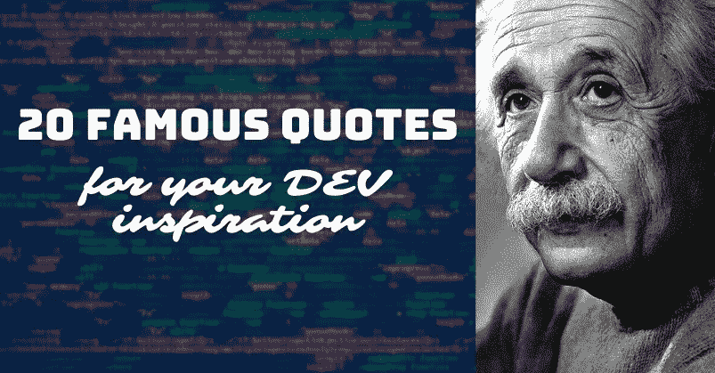

# ✨🧙‍♂️开发灵感的 20 句名言

> 原文：<https://javascript.plainenglish.io/20-famous-quotes-for-dev-inspiration-%EF%B8%8F-80eb0edb735d?source=collection_archive---------10----------------------->

## 1."对知识的投资回报最大。"—本杰明·富兰克林

在投资物质之前，先投资知识。它会持之以恒，让你实现职业目标。

## 2.“知道是不够的；我们必须申请。愿意是不够的；我们必须这样做。”——李小龙

利用网上的沙盒或为你所学的每一项技能创建小的宠物项目。实用技能是最重要的。

## 3.“我们就是我们反复做的事情。因此，优秀不是一种行为，而是一种习惯。”——亚里士多德

选择你的技术，成为这方面的专家。不要试图成为“万事通”，因为你最终会成为“无所不能的大师”。

## 4.“给一个人一条鱼，你可以喂他一天。教一个人钓鱼，你就喂了他一辈子。”——老子

教程不会让你思考。相反，阅读官方文档和开源软件，尝试自己想出一个解决方案。变得独立。

## 5.“你不能循规蹈矩地学习走路。你在实践中学习，在跌倒中学习。”—理查德·布兰森

不要期望你的解决方案总是正确和完整的。把每一次失败都当作一次宝贵的经历，一次教训。

## 6."问题解决好了一半."—约翰·杜威

每个任务都是从定义一个问题开始的。它本身就是一门艺术。确保它被很好地定义和缩放。

## 7."智慧是学会忽略什么。"—威廉·詹姆斯

今天最大的技能是学会什么不要学。了解资源和索引，而不是内容。

## 8.“给我六个小时砍树，我会用前四个小时磨利斧头。”—亚伯拉罕·林肯

优先考虑准备。安装所有应用程序、扩展和工具。在进行实际工作之前，配置最适合您的设置。

## 9.“这并不是说我很聪明。但我会带着问题坚持更长时间。”——阿尔伯特·爱因斯坦

磨砺你的大脑以保持竞争力。解谜，数独，下棋。业余时间做一些代码挑战。

## 10.“教学是理解的最高形式。”——亚里士多德

写博客，创建教程，解释你所学到的。教别人是双赢的，因为这样你自己也能学到最好的东西。

## 11.“保持饥饿。呆傻。”—史蒂夫·乔布斯

成为获取新信息的海绵。关注高质量的博客和人物，了解行业的最新趋势。

## 12."平静的大海造就不出熟练的水手。"—非洲谚语

一边走一边挑战自己。简单的任务不会帮助你成长。

## 13."任何问题都经不起持续思考的攻击."—伏尔泰

把问题分成小块，一点一点解决。必要时寻求帮助。

## 14.“没有行动的想法不是想法。它们是遗憾。”—史蒂夫·乔布斯

做你的副业。在别人之前实现你的想法。

## 15.“培养学习热情。如果你这样做了，你将永远不会停止成长。”安东尼·j·德安杰洛

为你的学习之路设定目标，奖励自己。让学习成为你日常生活中有趣的一部分。

## 16."最崇高的快乐是理解的快乐."—莱昂纳多·达芬奇

使用所有那些令人兴奋的‘啊哈！’学习过程中的时刻是推动你前进的燃料。

## 17.“完美不是在没有更多可以添加的时候实现的，而是在没有更多可以去除的时候实现的。”安托万·德圣埃克苏佩里

不要无缘无故地过度设计事情。当您可以提供所需的功能时，越少越好。

## 18."找一份你喜欢做的工作，你这辈子就一天都不用工作了。"——马克·吐温

找到一个对你来说重要的利基。这个世界充满了机遇。

## 19.“成功是一个旅程，而不是目的地。”——阿瑟·阿什

如果你已经开始，你就在正确的轨道上。你是司机，这就是它的美妙之处。

## 20.“生活中的许多失败都是因为人们在放弃时没有意识到他们离成功有多近。”—托马斯·A·爱迪生

写作一直是我的激情所在，帮助和激励他人给我带来了快乐。如果您有任何问题，请随时联系我们！

在 [Twitter](https://twitter.com/madzadev) 、 [LinkedIn](https://www.linkedin.com/in/madzadev/) 、 [GitHub](https://github.com/madzadev) 和 [DEV](https://dev.to/madza) 上给我接通！

订阅我的[博客](https://blog.madza.dev)获取更多类似的文章。