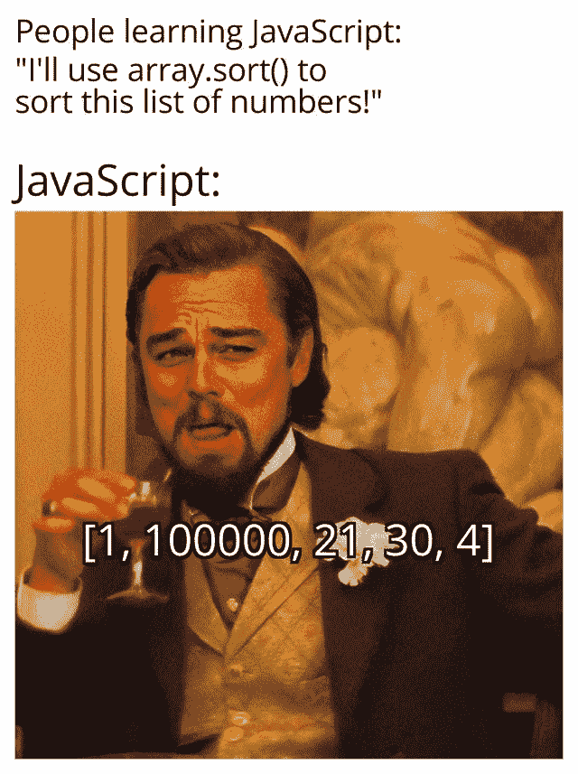

# 20 个有趣的 JavaScript 迷因

> 原文：<https://javascript.plainenglish.io/20-funny-javascript-memes-18b22d55710a?source=collection_archive---------0----------------------->

## 我在 Reddit 上浏览，想起了 Atit T1 的帖子，上面有 30 个编程迷因，让我开心不已，所以我决定为你们制作一个充满 JavaScript 迷因的帖子。尽情享受吧！

## 1.JS devs 就像:

## 2.这就是为什么你可能应该使用打字稿

## 3.呵呵呵，什么体验？

## 4.你一定会喜欢南军的

## 5.很好，现在谁能在 30 秒内教我 Javascript

## 6.这张脸说明了一切——这确实发生在我身上

## 7.啊… JavaScript，3in1

## 8.最低技能要求:PHP，C#，Scala，Ruby，JavaScript，Boostarap 4，CSS 5，Swift，至少 20 年经验。10 美元/小时

## 9.到所有新的 JS 框架

## 10.以及如何成为 one 的开发者

## 11.Javascript 传达了我们只能希望理解的真理

## 12.你为什么不能只研究 JAVAScript 呢？

**13。剧情转折:学的在左边。**

## 14.臭名昭著的那种

## 15.JavaScript 错误

## 16.打印，打印，打印…console.log()，console.log()，console.log()

## 17.安全数据库，什么？

## 18.不都是这样吗？

## 19.**月份从零开始索引。怎么会？为什么？**

20。与 JS 无关但完全正确:

## 结论

如果你喜欢这段短暂的编程休息，你可以试试我的 JavaScript React 教程:

 [## 在 React 中构建一个简单的自定义下拉菜单

### 有很好的方法来制作一个漂亮的下拉菜单。如果你想做你自己的，跟随这个教程。

medium.com](https://medium.com/javascript-in-plain-english/build-a-simple-customized-dropdown-menu-in-react-9e469b06d7c9)  [## 在 React 中构建一个简单的倒计时器

### 让我们用开始/暂停和复位按钮做一个简单的倒计时。

medium.com](https://medium.com/javascript-in-plain-english/building-a-simple-countdown-timer-in-react-f24fdc2a5fd5)  [## 如何在 React 中有条件地应用一个类

### 有几个方法可以有条件地应用一个类，让我们看看如何去做！

medium.com](https://medium.com/javascript-in-plain-english/how-to-conditionally-apply-a-class-in-react-d0e7e34cccf4)