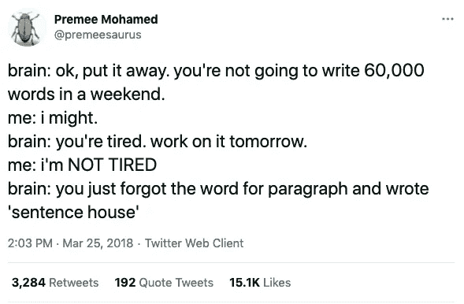

# 20 条只有软件开发人员才能理解的搞笑微博

> 原文：<https://javascript.plainenglish.io/20-funny-tweets-that-real-people-actually-tweeted-about-programming-960e9e5e324d?source=collection_archive---------0----------------------->

## 我发现的一些更有趣的编程推文。

Photo by [Austin Distel](https://unsplash.com/@austindistel?utm_source=medium&utm_medium=referral) on [Unsplash](https://unsplash.com?utm_source=medium&utm_medium=referral)

程序员很聪明。他们创造技术来帮助我们的日常工作。

他们也很有幽默感。即使你不是程序员，他们也能让你对他们简单的笑话发笑。

所以我检查并阅读了那里的程序员的推文，寻找那些我认为有趣的与编程有关的推文，并给你一个微笑的理由。

让我们开始吧。

# 1.你能修理我的打印机吗？

Source: [Ted Pedersen](https://twitter.com/SeeTedTalk/status/1112370558048632834)

# 2.程序员的婚姻状况

Source: [Pranay Pathole](https://twitter.com/PPathole/status/1132278575950749699)

# 3.拉栈开发者

Source: [Jack Forge](https://twitter.com/TheJackForge/status/1340118109898694656)

# 4.调试到底是什么样的

Source: [I am Devloper](https://twitter.com/iamdevloper/status/1096497253911547904)

# 5.程序员幸福的真谛

Source: [Christina Zhu](https://twitter.com/cszhu/status/1230954186520461312)

# 6.自我发展的工作是什么样的

Source: [Catalin Pit](https://twitter.com/catalinmpit/status/1328730038859165699)

# 7.编程到底是什么样的

Source: [Bram Cohen](https://twitter.com/bramcohen/status/51714087842877440)

# 8.我们没有生活——程序员

Source: [Jeremy Padawer](https://twitter.com/ygalanter/status/1317672354336722944)

# 9.开发人员的饮酒游戏

Source: [Shay Friedman](https://twitter.com/ironshay/status/370525864523743232)

# 10.最受欢迎的应用程序已经开发出来

Source: [Dawood Ali](https://twitter.com/yugdiputsa/status/1294498013185028096)

# 11.适合的

Source: [Juraj Bednar](https://twitter.com/jurbed/status/1337827464156950533)

# 12.须藤，你愿意嫁给我吗？

Source: [Windows Developer](https://twitter.com/windowsdev/status/1349406777926889473)

# 13.LinkedIn 是一个反向约会网站

Source: [Juraj Bednar](https://twitter.com/jurbed/status/1337827464156950533)

# 14.问题从未停止

Source: [Twiteeyapa](https://twitter.com/twiteeyapa/status/983381447208648704)

# 15.为我的新公司工作

Source: [Kitze](https://twitter.com/thekitze/status/942746522894168064)

# 16.分号——什么让程序员头疼

Source: [Pranay Pathole](https://twitter.com/PPathole/status/1235922146225872896)

# 16.找工作是什么感觉

Source: [One Devloper Army](https://twitter.com/OneDevloperArmy/status/1005929274870812673)

# 17.如今有经验的程序员都做些什么

Source: [One Devloper Army](https://twitter.com/OneDevloperArmy/status/1028964083813560320)

# 18.调试器真正想要的是什么

Source: [Sasha Laundry](https://twitter.com/SashaLaundy/status/936661004137635840)

# 19.晚上调试是什么样的

Source: [Premee Mohamed](https://twitter.com/premeesaurus/status/977787985558056960)

# 20.高级 Opentext 顾问

Source: [I Am Devloper](https://twitter.com/iamdevloper/status/435555976687923200)

我花了几个小时在 Twitter 上寻找这些有趣的推文，我请求他们允许使用他们的推文。幸好他们同意了。我希望你以这些有趣的推文开始你的一天。