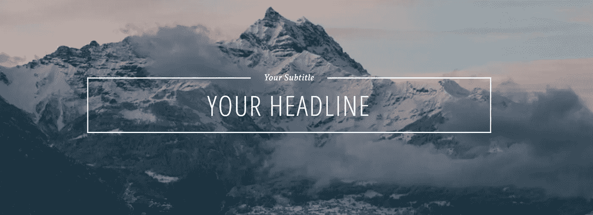
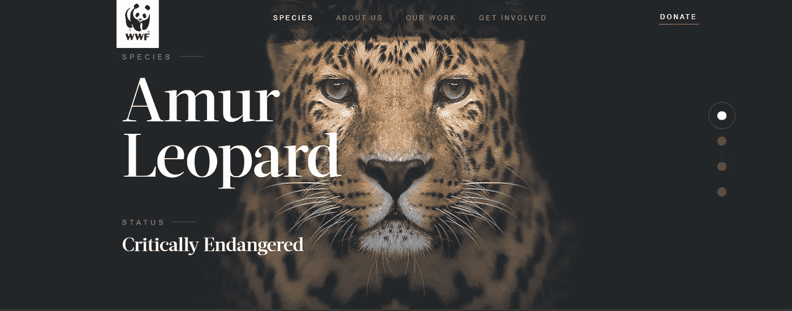

# 20 网页标题设计 HTML

> 原文：<https://javascript.plainenglish.io/20-header-design-html-for-website-c5cd71af6401?source=collection_archive---------0----------------------->

## *今天我们将学习用 HTML、CSS、JavaScript 为网页设计和开发构建的漂亮的标题示例！*

Photo by [Pankaj Patel](https://unsplash.com/@pankajpatel?utm_source=medium&utm_medium=referral) on [Unsplash](https://unsplash.com?utm_source=medium&utm_medium=referral)

# 什么是报头？

网站标题是位于网页顶部的元素。这是用户访问网站时首先看到的地方。因此，你应该仔细清晰地设计标题，以便给用户留下好印象，并轻松地向用户传达你想要的信息。

在标题中，通常会有以下元素:

*   网站的徽标。
*   重要链接的导航栏。
*   网站信息搜索引擎。
*   网站简介。
*   像电子邮件注册这样的行动号召按钮…
*   网站上流行产品的图片。

# 带有 CSS Javascript 的粘性标题

Sticky Header With CSS Javascript

请看下面的结果。

[链接](https://codepen.io/soulrider911/pen/dGuEn)

# CSS 标题动画

CSS Header Animations

请看下面的结果。

[链接](https://codepen.io/webmadewell/pen/zppMBX)

# CSS 标题动画效果

CSS Header Animation Effects

请看下面的结果。

[链接](https://codepen.io/nodws/pen/aWgMMQ)

# 标题 HTML5

Header HTML5

请看下面的结果。

[链接](https://codepen.io/nodws/pen/ugFcC)

# 响应标题 CSS

Responsive Header CSS

请看下面的结果。

[链接](https://codepen.io/abergin/pen/qEGyJa)

# 网站标题

Website Header

请看下面的结果。

[链接](https://codepen.io/ionlyseespots/pen/pvaPwq)

# 标题的滚动效果

Scroll Effect For Header

请看下面的结果。

[链接](https://codepen.io/osublake/pen/NdEONL)

# HTML CSS 标题网站

Header Website By HTML CSS

请看下面的结果。

[链接](https://codepen.io/imreyesjorge/pen/qgYLLz)

# 滑块标题 Javascript

Slider Header Javascript

请看下面的结果。

[链接](https://codepen.io/johnmotyljr/pen/cDpEH)

# Jquery 标题动画

Jquery Header Animation

请看下面的结果。

[链接](https://codepen.io/ashthornton/pen/KRQbMO)

# CSS 的波形标题

Wave Header By CSS

请看下面的结果。

[链接](https://codepen.io/goodkatz/pen/LYPGxQz)

# 带文本效果的页眉

Header With Text Effect

请看下面的结果。

[链接](https://codepen.io/SquishyAndroid/pen/XjRPVV)

# 自举标题

Bootstrap Header

请看下面的结果。

[链接](https://codepen.io/ig_design/pen/omQXoQ)

# 页眉背景图像 CSS

Header Background Image CSS

请看下面的结果。

[链接](https://codepen.io/celincky/pen/zdqso)

# 带有引导转盘的标题网站

Header Website With Bootstrap Carousel

请看下面的结果。

[链接](https://codepen.io/billyhalim/pen/GZbZvO)

# 带滚动图标的标题

Header With Scroll Icon

请看下面的结果。

[链接](https://codepen.io/CodeBoomer/pen/dXgyPq)

# 带有 Flexbox CSS 的页眉

Header With Flexbox CSS

请看下面的结果。

[链接](https://codepen.io/anavicente/pen/pydWeW)

# 视频标题 Javascript

Video Header Javascript

请看下面的结果。

[链接](https://codepen.io/rizer/pen/KaeZwL)

# 标题按剪辑路径 CSS

Header By Clip Path CSS

请看下面的结果。

[链接](https://codepen.io/grardovr/pen/rJQWLN)

# 曲线标题

Curve Header

请看下面的结果。

[链接](https://codepen.io/linux/pen/aEQKWP)

# 摘要

我希望这篇文章能为您提供有用的 web 开发头文件示例。希望大家继续支持页面，让我能写出更多好文章。祝您愉快！

如果你想要更多阅读更多文章，请前往[https://us.niemvuilaptrinh.com/](https://us.niemvuilaptrinh.com/)

*更多内容看* [***说白了就是***](http://plainenglish.io/) ***。*** *报名参加我们的* [***免费每周简讯这里***](http://newsletter.plainenglish.io/) ***。***