# 20 个有趣的迷因给那些在敏捷框架中工作的人

> 原文：<https://javascript.plainenglish.io/20-hilarious-memes-for-those-who-have-worked-in-the-agile-framework-e6c17b4d8260?source=collection_archive---------2----------------------->

## 最佳敏捷开发笑话汇编

Photo by [Leon](https://unsplash.com/@myleon?utm_source=medium&utm_medium=referral) on [Unsplash](https://unsplash.com?utm_source=medium&utm_medium=referral)

作为一种快速开发方法，许多公司开始在他们的软件开发过程中实施[敏捷框架](https://en.wikipedia.org/wiki/Scaled_agile_framework)。

在敏捷中工作时，我们中的许多人会经历不同的阶段，比如完成时间线或遇到阻碍，或者接受某人的回溯。

在这里，我整理了一些我觉得很好笑的敏捷相关的笑话。

# 描述现实最好的一个

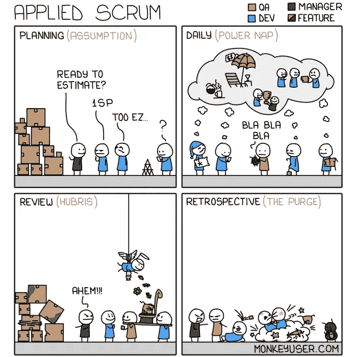

[https://www.monkeyuser.com/](https://www.monkeyuser.com/)

# 你的春天是如何开始的？

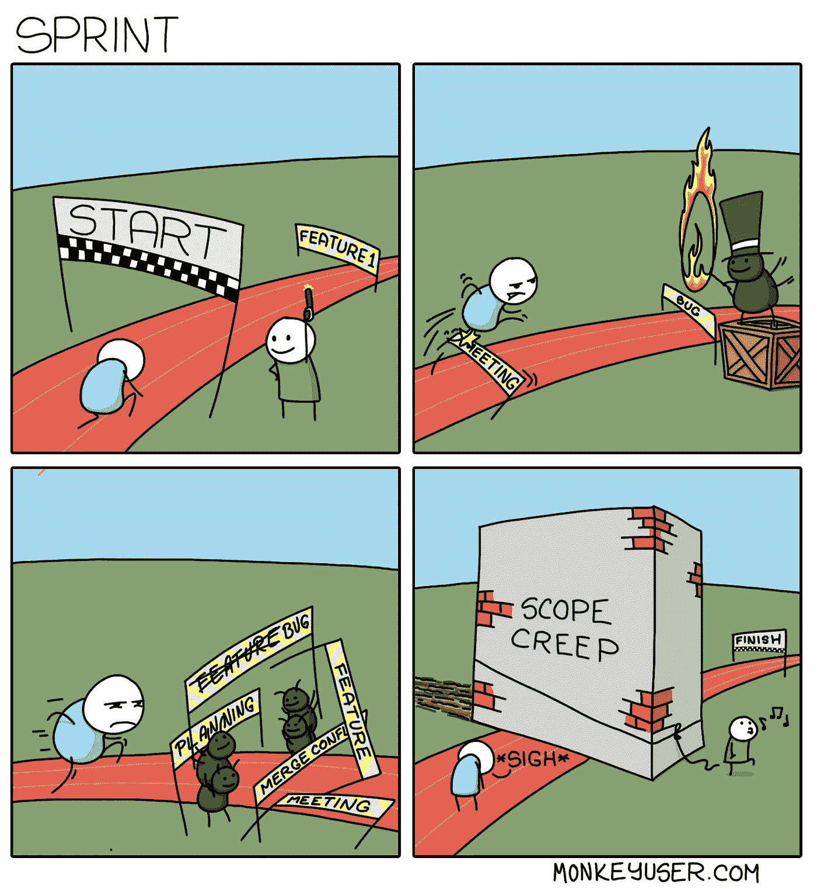

[https://www.monkeyuser.com/](https://www.monkeyuser.com/)

# 期望与现实

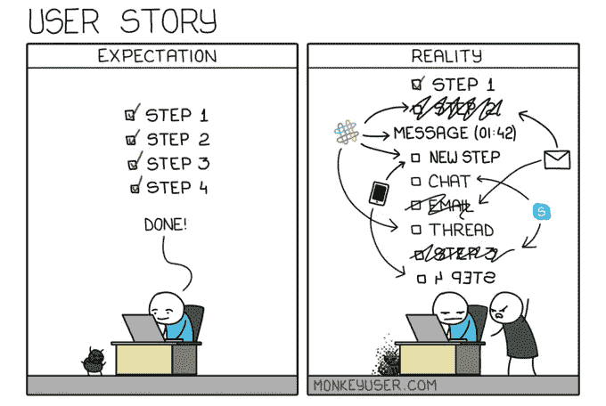

[https://www.monkeyuser.com/](https://www.monkeyuser.com/)

# 测试驱动的方法总是有效的。不在这里…

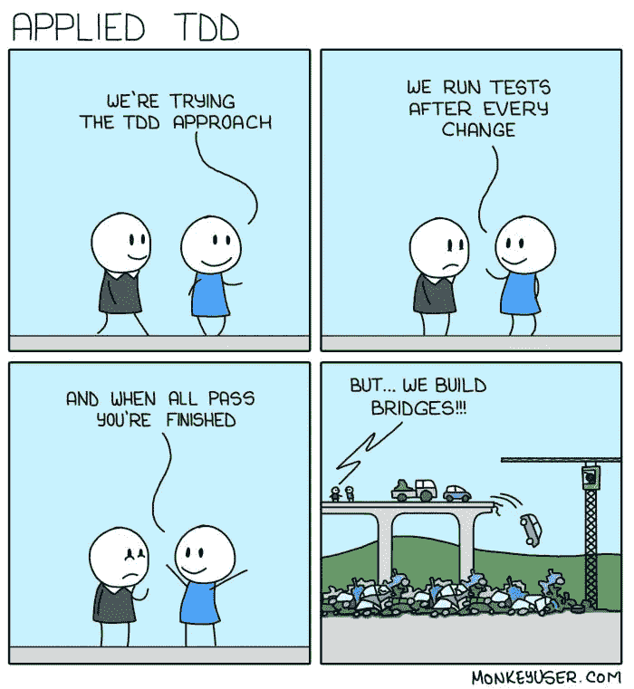

[https://www.monkeyuser.com/](https://www.monkeyuser.com/)

# 你属于哪一类？

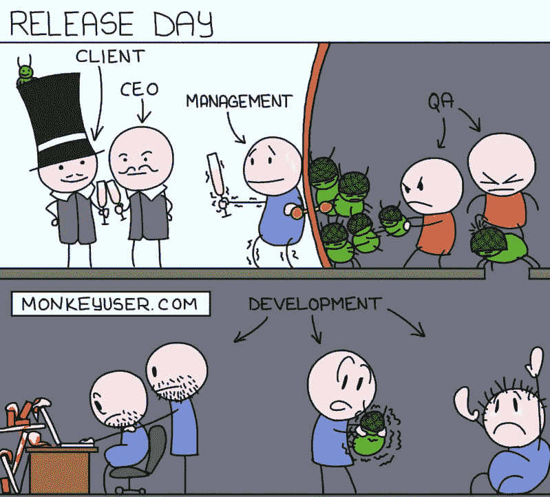

[https://www.monkeyuser.com/](https://www.monkeyuser.com/)

# 到处都是 JIRA 的票…

# 总是这样吗？

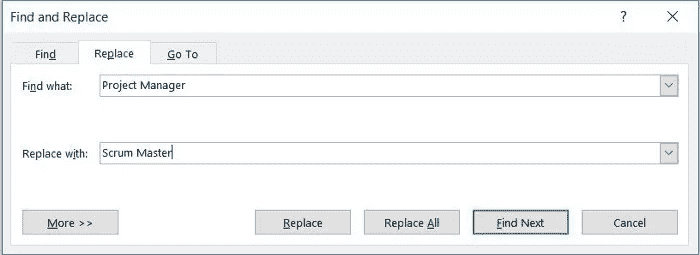

# 单口相声不能迟到…

# 你最喜欢的复古格式是哪一种？

# 站着说话不腰疼？

# 这是为业务团队准备的…

# 有几分真实。

# 不同的项目…不同的板…

# 复杂的故事…更多的点…你仍然需要 2 个故事来刻录图表…

# 发生在 QA 和 dev 中

# 没有已知的阻止程序…

# 奖金时间

## 当有人问你是如何开始这个项目的…

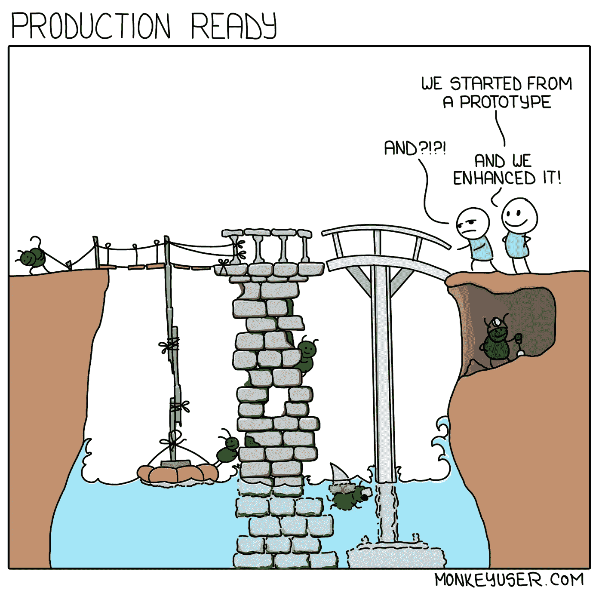

[https://www.monkeyuser.com/2018/production-ready/?sc=true&dir=random](https://www.monkeyuser.com/2018/production-ready/?sc=true&dir=random)

【https://www.monkeyuser.com】来源:

## 添加功能…添加功能…等等…我们来重构一下

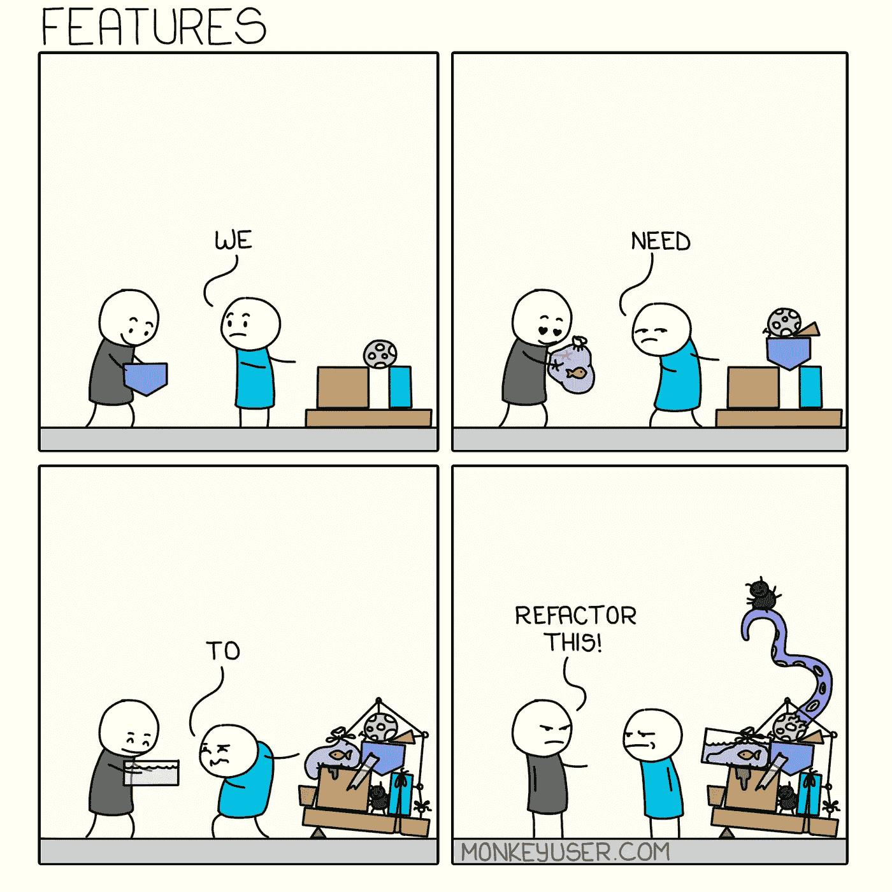

[https://www.monkeyuser.com/2020/features/?sc=true&dir=random](https://www.monkeyuser.com/2020/features/?sc=true&dir=random)

**来源:**[https://www.monkeyuser.com](https://www.monkeyuser.com/2018/production-ready/?sc=true&dir=random)

# 哈哈…有意思，但是我的非程序员朋友盯着我的屏幕问的时候我就用这个…

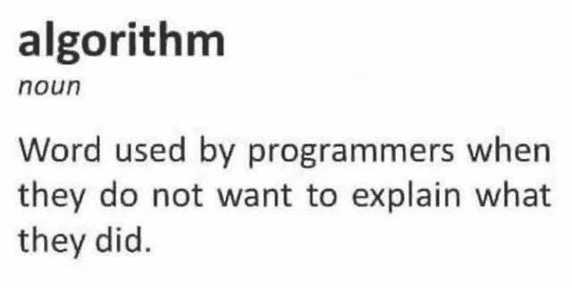

[https://www.reddit.com/r/ProgrammerHumor/comments/p5thip/my_secret_weapon/](https://www.reddit.com/r/ProgrammerHumor/comments/p5thip/my_secret_weapon/)

**来源:**[https://www.reddit.com/r/ProgrammerHumor/](https://www.reddit.com/r/ProgrammerHumor/comments/p5thip/my_secret_weapon/)

## 你不能抱怨用户…英雄联盟

[https://programmerhumor.io/programming-memes/page/4/](https://programmerhumor.io/programming-memes/page/4/)

**来源:**[https://programmerhumor.io/programming-memes/](https://programmerhumor.io/programming-memes/page/4/)

## 我也是这么想的…

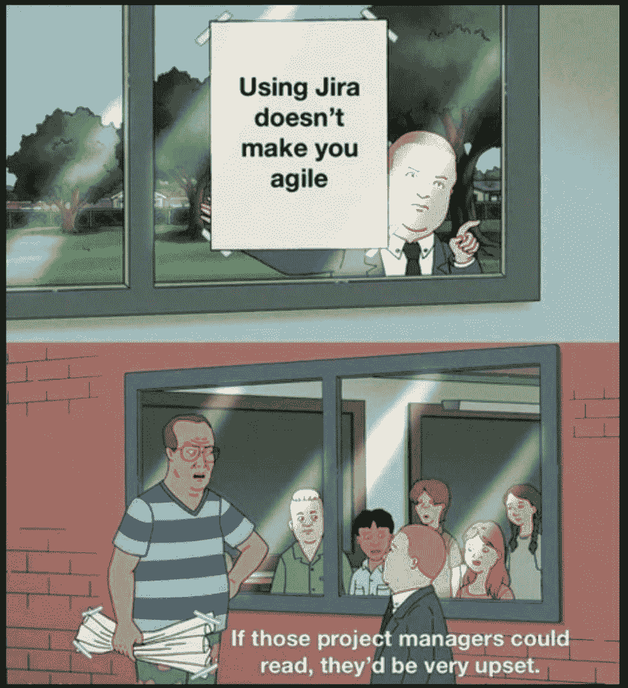

[https://www.reddit.com/r/ProgrammerHumor/comments/p62a26/we_use_agile_but/](https://www.reddit.com/r/ProgrammerHumor/comments/p62a26/we_use_agile_but/)

**来源:**[https://www.reddit.com/r/ProgrammerHumor/](https://www.reddit.com/r/ProgrammerHumor/comments/p62a26/we_use_agile_but/)

## 用户界面设计器调色板…

[https://programmerhumor.io/programming-memes/%f0%9f%a4%94%f0%9f%91%a9%e2%80%8d%f0%9f%8e%a8/](https://programmerhumor.io/programming-memes/%f0%9f%a4%94%f0%9f%91%a9%e2%80%8d%f0%9f%8e%a8/)

**来源:**[https://programmerhumor.io/programming-memes/](https://programmerhumor.io/programming-memes/%f0%9f%a4%94%f0%9f%91%a9%e2%80%8d%f0%9f%8e%a8/)

## QA 如何看待测试过马路场景…

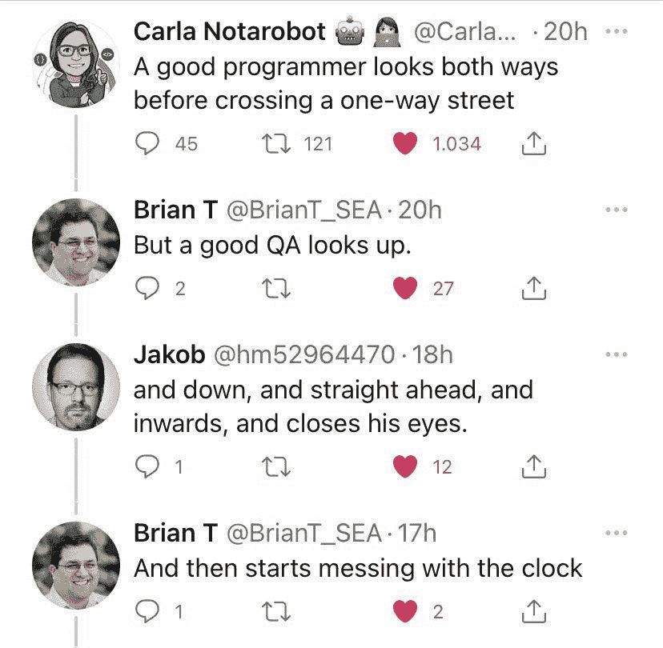

[https://www.reddit.com/r/ProgrammerHumor/comments/p67c54/qa/](https://www.reddit.com/r/ProgrammerHumor/comments/p67c54/qa/)

**来源:**[https://www.reddit.com/r/ProgrammerHumor](https://www.reddit.com/r/ProgrammerHumor/comments/p67c54/qa/)

## 哇…编程幽默也能给你关系建议…

[https://www.facebook.com/photo/?fbid=3918974688212255&set=gm.953267221898555](https://www.facebook.com/photo/?fbid=3918974688212255&set=gm.953267221898555)

**来源:**【https://www.facebook.com/groups/151139362111349】T2

## 等等…我们稍后会用到它…

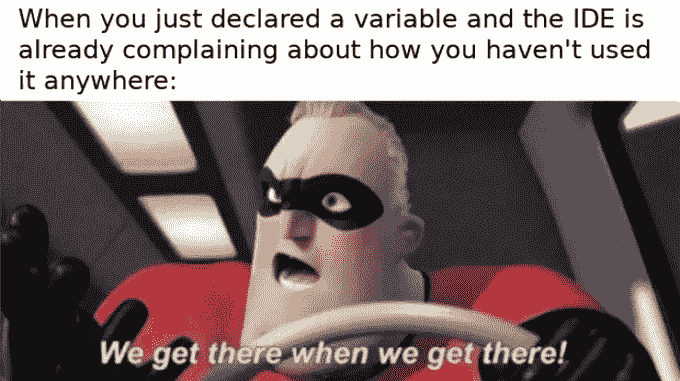

[https://programmerhumor.io/programming-memes/unused-variables-2/](https://programmerhumor.io/programming-memes/unused-variables-2/)

【https://programmerhumor.io/】来源:

# 进一步阅读

 [## 2021 年最佳编程幽默汇编

### 编程迷因可以减轻你的压力

blog.devgenius.io](https://blog.devgenius.io/best-programming-humor-compilations-2021-623473bfb0d)  [## 有趣的编程迷因会让你笑死

### 编笑话来点亮你的周五

blog.devgenius.io](https://blog.devgenius.io/funny-programming-memes-that-will-make-you-die-laughing-1ccd8e139040)  [## 编程迷因和幸福之间的联系

### 2021 年最佳编程迷因汇编

blog.devgenius.io](https://blog.devgenius.io/the-connection-between-programming-memes-and-happiness-d768ab85b83d)  [## 10 个能让你心情轻松的最佳编程笑话

### 你读过的关于编程迷因 2021 的最不可思议的文章

medium.com](https://medium.com/geekculture/10-best-programming-jokes-to-lighten-up-your-mood-8870dab2bff7) 

*更多内容请看*[***plain English . io***](http://plainenglish.io/)