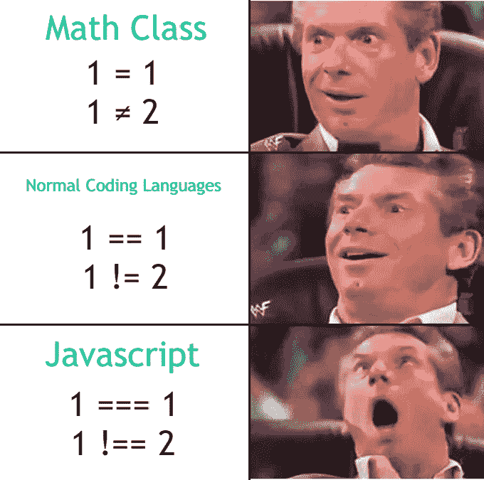

# 20 多个 JavaScript 迷因

> 原文：<https://javascript.plainenglish.io/20-more-javascript-memes-b9f4c3e49f90?source=collection_archive---------4----------------------->

## 上一个很成功，所以这里还有 20 个 JavaScript 迷因！

## 1.这是给初级 JS 开发人员的

## 2.完全握手

## 3.因为 JS 需要特别

## 4.是活的还是不活的？

## 5.你是哪一个？

## 6.var = var

## 7.哦…经典的迷因

## 8.我不知道。这也不是

## 9.TS ❤

## 10.我们都很害怕！

## 11.不会说谎，离真相不远。

## 12.换一个灯泡需要多少个 JS Devs？

## 13.纯粹的邪恶

## 14.JavaScript 类似于 Java，但脚本在末尾

## 15.jQuery 就是答案

## 16.我就是你

## 17.我是 unga bunga

## 18.也许太苛刻了？

## 19.但是当我这样做的时候，我会打印太大的数字吗？…

## 20.最后一杯…

> 如果您想要更多:

 [## 20 个有趣的 JavaScript 迷因

### 进来，我们前面有迷因。

javascript.plainenglish.io](/20-funny-javascript-memes-18b22d55710a)