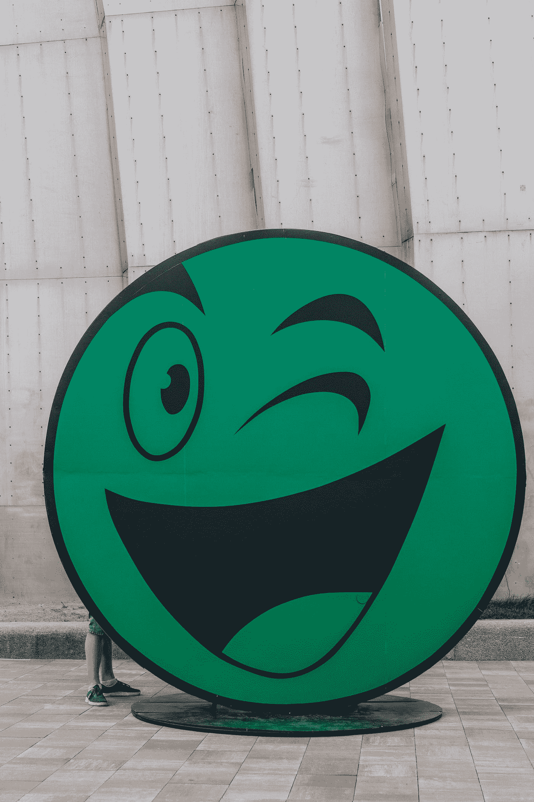
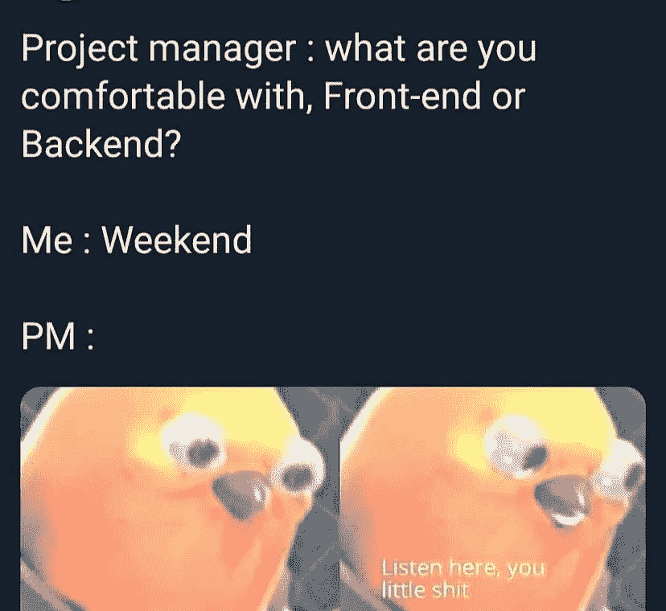
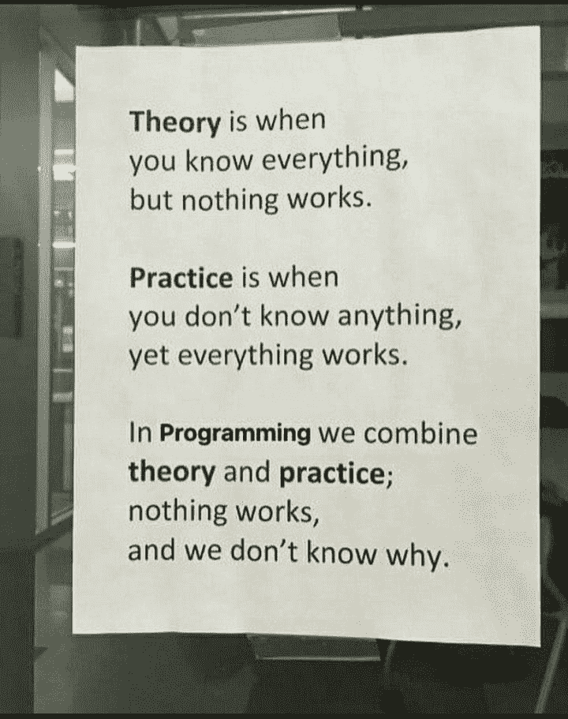
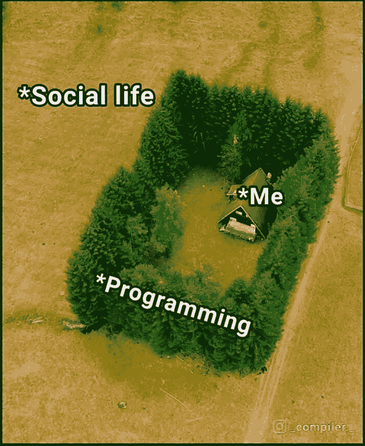

# 20 个最好最搞笑的编程迷因

> 原文：<https://javascript.plainenglish.io/20-of-the-best-and-most-hilarious-programming-memes-f3a9b75ae6ac?source=collection_archive---------1----------------------->

## 程序员的日常幽默

Photo by [Marjan Blan | @marjanblan](https://unsplash.com/@marjan_blan?utm_source=medium&utm_medium=referral) on [Unsplash](https://unsplash.com?utm_source=medium&utm_medium=referral)

你听过这样一句话吗，“笑是缓解压力的最佳良药”？

但是怎么做呢？心情不好的时候怎么笑或者微笑？

今天，我试图整理一些我在互联网和社交媒体上发现的与编程相关的笑话/迷因。这些笑话让我笑了，希望它也能让你笑。

> *我们走吧。准备好注射第一剂。*

# 真实的事实…

[https://www.facebook.com/photo/?fbid=3980444155398641&set=gm.966157407276203](https://www.facebook.com/photo/?fbid=3980444155398641&set=gm.966157407276203)

【https://www.facebook.com/groups/151139362111349】来源:

# 你喜欢什么？

[https://www.facebook.com/groups/programming.jokes](https://www.facebook.com/groups/programming.jokes)

# 你属于哪种类型？

[https://www.facebook.com/groups/programming.jokes](https://www.facebook.com/groups/programming.jokes)

# 为什么我的大脑会在午夜后激活？有人有同感吗？

[https://www.facebook.com/groups/programming.jokes](https://www.facebook.com/groups/programming.jokes)

# 什么是编程？

[https://www.facebook.com/groups/programming.jokes](https://www.facebook.com/groups/programming.jokes)

# 当我找到新的库并将其添加到我的项目中时…

[https://www.monkeyuser.com/](https://www.monkeyuser.com/)

# 我总是遇到这种事…

[https://www.monkeyuser.com/](https://www.monkeyuser.com/)

# 我的学校项目…

[https://www.facebook.com/JokesTechnical](https://www.facebook.com/JokesTechnical)

# 有人有同感吗？

[https://www.facebook.com/JokesTechnical](https://www.facebook.com/JokesTechnical)

# 新文件夹 4 即将推出，

[https://www.facebook.com/JokesTechnical](https://www.facebook.com/JokesTechnical)

# 你是做什么工作的？

[https://www.reddit.com/r/ProgrammerHumor/comments/nfw864/programming_summed_up/](https://www.reddit.com/r/ProgrammerHumor/comments/nfw864/programming_summed_up/)

# 积压将不会得到解决，直到我离开:高级开发

[https://www.reddit.com/r/ProgrammerHumor](https://www.reddit.com/r/ProgrammerHumor/comments/nfw864/programming_summed_up/)

# 当有人破坏我的计划时…猜猜是谁？

[https://www.reddit.com/r/ProgrammerHumor](https://www.reddit.com/r/ProgrammerHumor/comments/nfw864/programming_summed_up/)

# 奖励时间:

# 如何避免线头问题？用任何…英雄联盟

[https://www.facebook.com/photo/?fbid=507053803737120&set=gm.2892947247639492](https://www.facebook.com/photo/?fbid=507053803737120&set=gm.2892947247639492)

# 让我们与模拟响应并行工作，稍后我们将集成…

[https://www.facebook.com/101406868766057/photos/a.111476934425717/152664723640271/](https://www.facebook.com/101406868766057/photos/a.111476934425717/152664723640271/)

# 字面上的我，现在…

[https://www.facebook.com/101406868766057/photos/a.111476934425717/152664863640257/](https://www.facebook.com/101406868766057/photos/a.111476934425717/152664863640257/)

# 文档是什么？我知道 StackOverflow…

[https://www.facebook.com/photo?fbid=3878936845549373&set=gm.944860159405928](https://www.facebook.com/photo?fbid=3878936845549373&set=gm.944860159405928)

# 为什么它不起作用？嗯嗯？哦！这就是为什么…

[https://www.facebook.com/CodersPhilippines/photos/a.103712541841220/150585230487284/](https://www.facebook.com/CodersPhilippines/photos/a.103712541841220/150585230487284/)

# 找不到相同的结果，但是的…这是完美的定义

[https://www.facebook.com/photo/?fbid=4637136529652355&set=gm.6513183998707329](https://www.facebook.com/photo/?fbid=4637136529652355&set=gm.6513183998707329)

# 行内注释就像…

[https://www.reddit.com/r/ProgrammerHumor/comments/oxpi0x/inline_comments_be_like/](https://www.reddit.com/r/ProgrammerHumor/comments/oxpi0x/inline_comments_be_like/)

# 当你需要向你的经理解释某事时…

[https://www.reddit.com/r/ProgrammerHumor/comments/oxr93p/how_why/](https://www.reddit.com/r/ProgrammerHumor/comments/oxr93p/how_why/)

# 任何人都不应该碰一个功能…即使它没有用…

[https://www.reddit.com/r/ProgrammerHumor/comments/ox51s7/tf_does_it_even_do/](https://www.reddit.com/r/ProgrammerHumor/comments/ox51s7/tf_does_it_even_do/)

# 自动化脚本正在运行，但没有人更新它们…

[https://www.monkeyuser.com/2019/the-superficial-high/?sc=true&dir=random](https://www.monkeyuser.com/2019/the-superficial-high/?sc=true&dir=random)

# 从哪里开始？

[https://www.facebook.com/javascriptJS/photos/a.1387402908063976/2261895900614668/](https://www.facebook.com/javascriptJS/photos/a.1387402908063976/2261895900614668/)

# 在家工作或学习时可以考虑哪些交通？

[https://www.facebook.com/adultswholovecartoons/photos/a.105042201224485/361407612254608/](https://www.facebook.com/adultswholovecartoons/photos/a.105042201224485/361407612254608/)

# 现在让我们来评论一下..我们稍后会修复它…

[https://www.facebook.com/jokesvala/photos/a.2330223400336101/6283557961669272/](https://www.facebook.com/jokesvala/photos/a.2330223400336101/6283557961669272/)

# 正则表达式可以在网上找到…老实说，从来没有试图学习这个东西…

[https://www.facebook.com/DZoneInc/photos/10159094540494712](https://www.facebook.com/DZoneInc/photos/10159094540494712)

# 所以编程给你守卫还是成为守卫？

[https://www.facebook.com/Coding000/photos/a.100326075349488/210613724320722/](https://www.facebook.com/Coding000/photos/a.100326075349488/210613724320722/)

# 她的眼睛说明了一切…

[https://www.facebook.com/yuva.krishna.memes/photos/a.105527467815845/376834894018433/](https://www.facebook.com/yuva.krishna.memes/photos/a.105527467815845/376834894018433/)

# 测试人员无论如何都能找到 bug 即使它是有效的或无效的…

[https://www.facebook.com/javascriptJS/photos/2210011465803112](https://www.facebook.com/javascriptJS/photos/2210011465803112)

# 为什么有人问它，盖伊？他们应该打电话给医生…

[https://www.facebook.com/photo/?fbid=10159583001913436&set=gm.6450394781652918](https://www.facebook.com/photo/?fbid=10159583001913436&set=gm.6450394781652918)

# 你的地址是什么？让我们检查一下你的 IT 幽默…

[https://www.facebook.com/techwithcodex/photos/a.137007467972178/333269081679348/](https://www.facebook.com/techwithcodex/photos/a.137007467972178/333269081679348/)

# 你想念我以前的搞笑炸弹吗？请在这里查看它们，并在笑声中爆发…

 [## 有趣的比较:程序员与普通人

### 是什么让程序员与众不同？

javascript.plainenglish.io](/funny-comparisons-programmers-vs-normal-people-3aa7002f62f0)  [## 给程序员的 10 个 Ulitmate 笑话

### 最佳编程笑话汇编 2021 系列

javascript.plainenglish.io](/10-ulitmate-jokes-for-programmers-4cc070cbbcf5)  [## 检验你是否是程序员的 10 个幽默模因

### 程序员的周五幽默

javascript.plainenglish.io](/10-humorous-memes-to-check-out-if-you-are-a-programmer-3244248e3e7e) 

*更多内容请看*[***plain English . io***](http://plainenglish.io/)