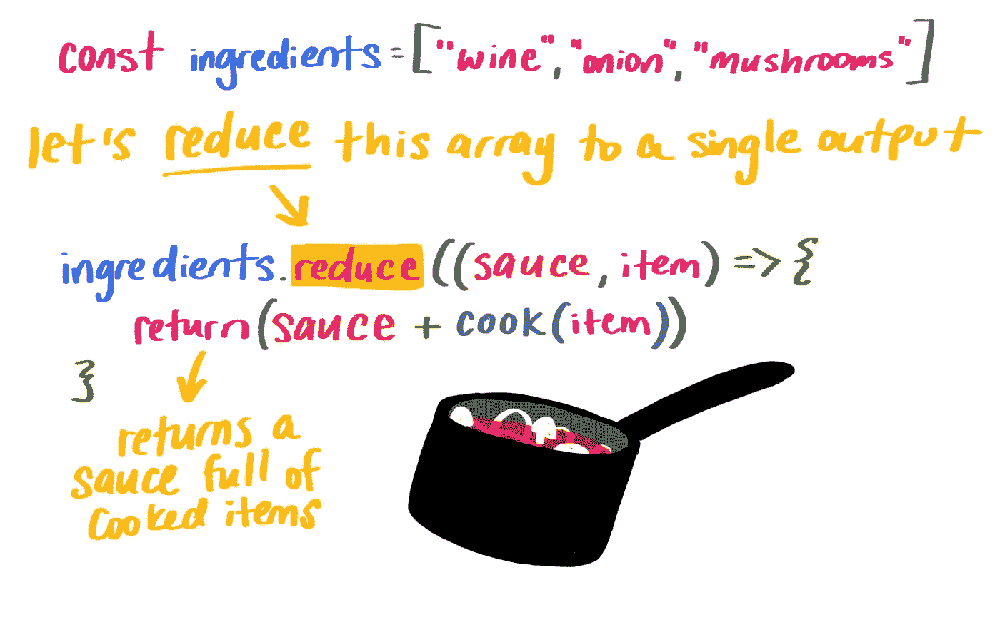

# 每个初学者都应该知道的 10 个编程术语

> 原文：<https://javascript.plainenglish.io/20-programming-terms-every-beginner-and-muggle-struggle-in-javascript-6d00c9b7a599?source=collection_archive---------19----------------------->

## 想摆脱麻瓜身份？现在你来对地方了。

# **1。普通 JavaScript**

VanillaJS 是一个名称，指的是不使用任何附加库的普通 JavaScript。不要试图从他们的官方网站下载 VanillaJS API。是程序员之间的玩笑。

Vanilla

# **2。配置文件**

配置文件，通常简称为 config 文件，在 IT 环境中定义了许多复杂的变量。例如，配置文件信息指定来自应用程序的日志文件通过存储路径存储在哪里，在给定程序中允许哪些插件，甚至用户界面(UI)中的仪表板小部件偏好。

Rolling Chair by Moncho Massé

# **3。蓄能器**

在 JavaScript 中。累加器累加回调的返回值。它是上次调用回调时返回的累积值，或者是 initialValue(如果提供的话)。在下面这张超级有趣的图中，酱代表累加器:

by Una Kravets

在 JavaScript 中。作为参数传递给另一个函数的函数。使用回调的好处是函数可以按以下顺序执行。

# **4。鼻涕虫**

这是一个来自 WordPress 社区的单词，帮助用户更容易地识别网站地址(SEO ),这是每个帖子页面的名称！但是现在有一种新东西叫做 UUID，通用唯一标识符。

slug

# **5。**可迭代对象

在 JavaScript 中。可迭代对象是数组的一般化。这是一个允许我们在森林中使用任何对象的概念..循环的。

# **6。Favicon =收藏夹图标**

与特定网站相关联的图标，通常显示在浏览器的地址栏中

# 7\. …

当我们在 JavaScript 代码中看到三个点(…)时，要么是 rest 参数，要么是 spread 操作符。当三个点(…)位于函数参数的末尾时，它是“rest parameters ”,并将参数列表的其余部分聚集到一个数组中。当三个点(…)出现在一个函数调用或类似的调用中时，它被称为“扩展操作符”并将一个数组扩展为一个列表。

# 8.处理者

处理程序是一个例程/函数/方法，它专用于某种类型的数据或专注于某些特殊的任务。示例:事件处理程序—接收并消化来自周围系统的事件和信号。内存处理程序—在内存上执行某些特殊任务。文件输入处理器——接收文件输入并对数据执行特殊任务的函数，当然这一切都取决于上下文。

# 9.饭桶

[https://guides.github.com/introduction/git-handbook/?FB clid = iwar 3 tpqmqx _ pgaq 63 NW cisa 5 qdauyhdwilnjstu 61 xtga 8 dcx-ZJ 21 h1 hwfa](https://guides.github.com/introduction/git-handbook/?fbclid=IwAR3TpQMQX_PGAQ63NWcisa5qdAuyhdWILNjSTu61XtGa8dcX-zj21H1hwfA)

Git 是一个版本控制系统(VCS)。当你创建一个存储库时，git 会创建一个空的 repo，你要上传的文件你必须添加并提交它们。

一个著名的 Git GUI 叫做 GitKraken:[https://www.gitkraken.com/](https://www.gitkraken.com/)，它允许用户返回上一步。

# 10.更多技术新闻和资源

 [## 黑客新闻

### 编辑描述

news.ycombinator.com](https://news.ycombinator.com/) 

如果你是学生，这个链接会拯救你的编码生活！注册后就可以飞了。

https://education.github.com/pack

# 谢谢你

*希望你有一个愉快的阅读之旅。欢迎和任何像我一样的编程新手分享。如果你有更多的问题，欢迎在这里讨论。还有，我活跃在 IG: sourrain_art 让我们保持联系！*