# 20 个有用的 VS 代码快捷方式，可以节省你的时间

> 原文：<https://javascript.plainenglish.io/20-useful-vs-code-shortcuts-that-will-prevent-you-from-distractions-124698c93dc4?source=collection_archive---------13----------------------->

## 你将学习带有 gif 的 VS 代码快捷方式

Photo by [Ron Lach](https://www.pexels.com/@ron-lach?utm_content=attributionCopyText&utm_medium=referral&utm_source=pexels) from [Pexels](https://www.pexels.com/photo/light-hands-people-woman-7848988/?utm_content=attributionCopyText&utm_medium=referral&utm_source=pexels)

当我开始学习如何编码时，我写代码非常慢。主要原因是我没有足够的编程知识。在我学习了各种编程概念之后，我有了更好的速度来完成一个代码文件。

然而，这并不足以让我完成任务。我因为某些原因分心了。比如我发现我用键盘写字很慢。所以，我学会了如何用十个手指写字。
我的键盘速度从每分钟 36 字提高到每分钟 80 字。对于我来说，这是一个完美的步骤，可以让我不受干扰地完成编程任务。

当我写代码的时候，我发现了其他让我分心的事情。比如经常用我的鼠标，在一个代码块的开头移动光标，写两个字符，然后在一个代码块的结尾移动光标，再写两个字符，使代码块成为注释行。

于是，我决定学一些捷径，排除其他杂念。因为我通常在 VS 代码上写代码，所以我学习了这个编辑器中的快捷键。为了避免在编写代码时分心，你还应该学习一些快捷方式。这 20 个 VS 代码快捷键一般都是程序员用的最多的。

## 1.在文件间导航

作为一名开发人员，您通常在文件之间导航。这样做时，使用键盘比使用鼠标更快。您可以不使用鼠标，而是键入文件名并按 enter 键来导航文件。为此，您可以对 Windows 使用`CTRL + P`,对 Mac 设备使用`COMMAND + P`。

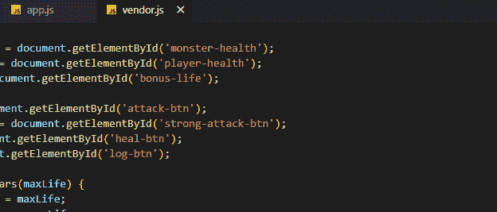

Navigate Between Files: added by author.

## 2.切换侧栏

对于一个高效的空间，你可能只想看到你的代码，而不是分散注意力的区域。您可以隐藏边栏来关闭文件图标。您可以使用相同的快捷键再次显示文件图标，Windows 使用`CTRL + B`，Mac 使用`COMMAND + B`。

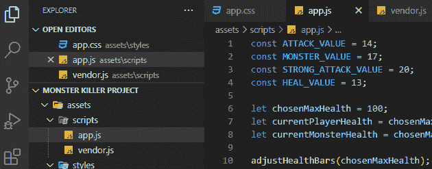

Toggle SideBar: added by author.

## 3.多光标选择

不需要一个一个把名字都改了。如果您想立即重命名它们，可以使用快捷方式。你需要选择一个你想同时改变所有事件的名字，然后按下`CTRL + SHIFT + I`键(Windows)和`COMMAND + SHIFT + I`键(Mac)。现在，您可以写入新名称，然后按下`ESC`结束该过程。

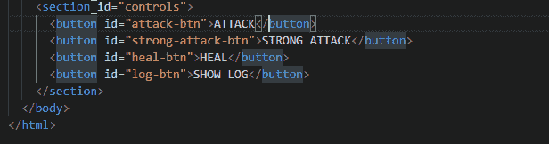

Multi Cursor Selection: added by author.

## 4.逐个选择名称

在前面的示例中，您可以一次更改所有名称。但是，如果您不想更改文件中的每个事件，您会怎么做呢？您可能只想更改部分名称。因此，您可以使用快捷方式逐个选择名称。你应该做的是选择你想改变的名字，然后按下`CTRL + D`键(Windows)和`COMMAND + D`键(Mac)。现在，您可以写下您想要更改的新名称。

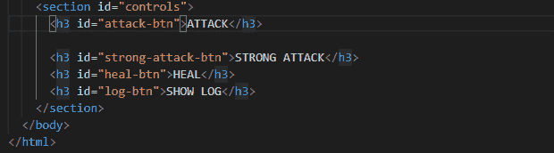

Select Names One by One: added by author.

## 5.切换注释行

通常，要将一行代码转换成注释，光标必须位于该行的开头。然后，你可以写`//`让它成为评论。相反，您可以使用快捷方式切换注释行，光标在代码行的哪个位置并不重要。Windows 的快捷键是`CTRL + /`，Mac 的快捷键是`COMMAND + /`。

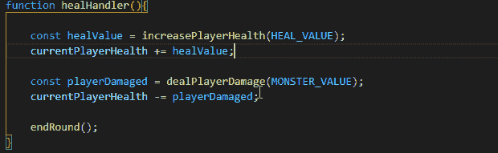

Toggle Comment Line: added by author.

## 6.切换块注释

此外，您可以使用快捷方式将代码块转换成注释。不是将`/*`放在代码块的开头，而将`*/`放在代码块的结尾，快捷方式更容易切换代码块注释。您可以选择代码块，在 Windows 中使用`SHIFT + ALT + A`，在 Mac 中使用`SHIFT + OPTION + A`

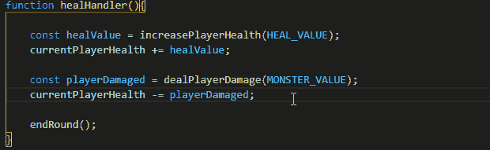

Toggle Block Comment: added by author.

## 7.格式化整个文件

格式化代码文件有助于更好地组织代码。您可以使用 Windows 的`SHIFT + ALT + F`和 Mac 的`SHIFT + OPTION + F`来格式化整个文件

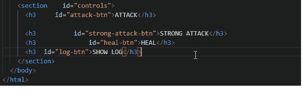

Format the Entire File: added by author.

## 8.上下移动线条

您可以使用快捷方式上下移动代码行。你应该做什么来上下移动代码行？可以复制粘贴。然后，您需要删除原始行。有一个更好的方法来做这件事。可以把线剪下来粘贴。然而，这也不是一个快速的方法。您可以使用 Windows 的`ALT + UP ARROW / DOWN ARROW`和 Mac 的`OPTION + UP ARROW / DOWN ARROW`来更快地移动代码行。

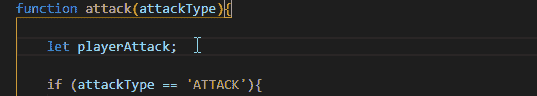

Move Line Up and Down: added by author.

## 9.包装 HTML 元素

您可以用一个 HTML 元素包装另一个 HTML 元素。例如，您可以向 HTML 代码块添加 div 标记。默认情况下，没有为其分配快捷方式。但是，你可以用一个键绑定它。比如可以和`ALT + N` for Windows 和`OPTION + N` Mac 绑定。为此，请转至`File -> Preferences -> Keyboard Shortcuts`。将**“wrap”**写入搜索框。选择**“用缩写换行”**。然后，指定一个快捷键。

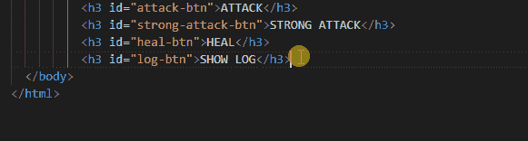

Wrap an HTML Element: added by author.

## 10.选择代码向上一行

您可以使用快捷方式选择上方或下方的行，而不是使用鼠标选择行。这将很容易复制和粘贴行。要使用它，可以在 Windows 和 Mac 上使用`SHIFT + UP ARROW / DOWN ARROW`

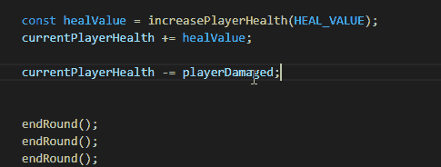

Select Code One Line Up: added by author.

## 11.转到定义

作为开发人员，您在代码文件中定义了许多函数。此外，您还可以在代码中的某个地方使用自己创建的函数。当您在函数行上时，您可能想要更改函数中的一些代码。通过使用快捷方式，您可以转到函数的定义。点击功能名称后，Windows 和 Mac 都可以按`F12` 12。

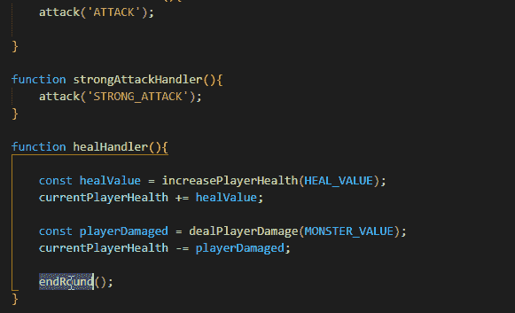

Go to Definition: added by author.

## 12.转到线

您可以使用快捷方式转到代码文件的特定行。如果你在 Windows 上按`CTRL + G`，在 Mac 上按`CONTROL + G`，会有帮助。然后，您可以输入行号。

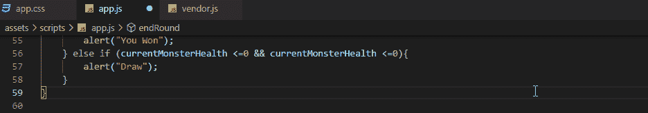

Go To Line: added by author.

## 13.转到符号

随着代码文件中行数的增加，找到想要的内容通常会变得越来越困难。例如，在代码文件中定义变量、函数或常数。此外，您不希望每次旅行时都使用您指定的名称。如果你要去定义你的——比如说一个常数——的那一行，你可以按下`CTRL + SHIFT + O`( Windows)和`SHIFT + COMMAND + O`( Mac)。当你这样做的时候，一个搜索框将会打开，正如你在 GIF 中看到的。现在，你可以写下你的常数的名字，并转到你定义它的那一行。

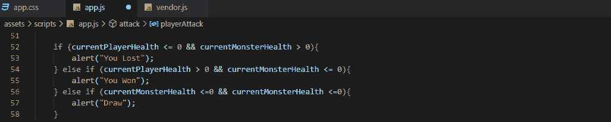

Go to Symbol: added by author.

## 14.上下复制一行

除了移动行之外，您还可以使用快捷方式上下复制行。这种快捷方式很方便，不用把光标放在上面，然后用`CTRL + C`复制，再用`CTRL + V`粘贴到行上。Windows 可以按`SHIFT + ALT + UP ARROW / DOWN ARROW`，Mac 可以按`SHIFT + OPTION + UP ARROW / DOWN ARROW`。

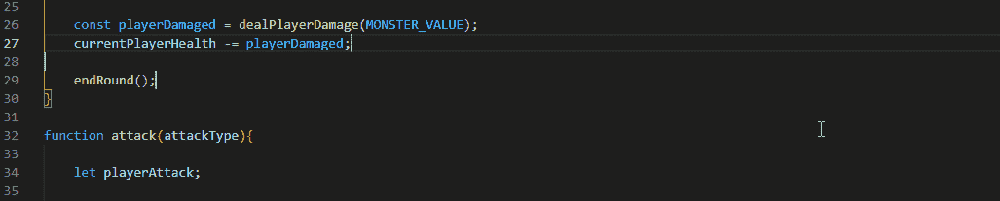

Copy One Line Up and Down: added by author.

## 15.向上或向下复制选定的代码块

您可能想复制一段选定的代码并粘贴它，而不是复制一行代码。您可以使用`ALT + SHIFT + UP ARROW / DOWN ARROW`键(Windows)和`OPTION + SHIFT + UP ARROW / DOWN ARROW`键(Mac)将所选代码块向上或向下复制一行。

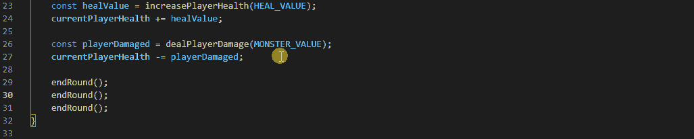

Copy the Selected Code Block Up or Down: added by author.

## 16.删除行

在学习这个快捷键之前，我把光标放在一行的末尾或开头，用`CTRL + SHIFT + LEFT ARROW / RIGHT ARROW`选择整行，然后按下`DELETE`键。现在，我只是用 Windows 的`CTRL + SHIFT + K`和 Mac 的`SHIFT + COMMAND + K`来删除这条线。当你需要删除一行时，学习这个会让你更开心，因为它很快。

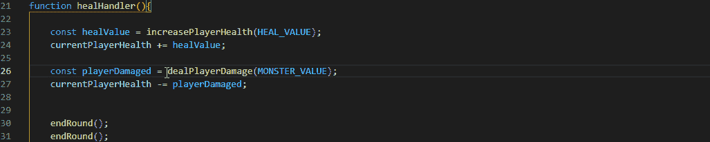

Delete Line: added by author.

## 17.上下滚动行

除了使用鼠标，你还可以使用快捷键`CTRL + UP ARROW / DOWN ARROW`上下滚动鼠标，使用快捷键`CONTROL + PgUp / PgDn`上下滚动鼠标。如果你想更快地查看文件，你还可以使用 Windows 的`ALT + PgUp / PgDn`和 Mac 的`COMMAND + PgUp / PgDn`来上下滚动页面。

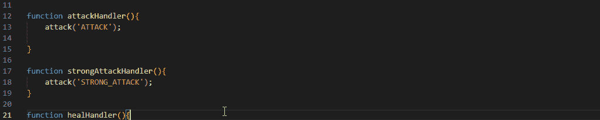

Scroll Line Up and Down: added by author.

## 18.后退或前进

您可以使用 Windows 的`ALT + LEFT ARROW / RIGHT ARROW`和 Mac 的`CONTROL + - / CONTROL + SHIFT + -`后退或前进。

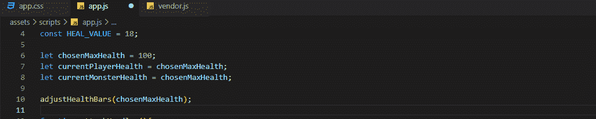

Go Back or Forward: added by author.

## 19.转到用户设置

有时候，你不想去菜单栏找，也不想去用户设置。您可以使用 Windows 的`CTRL + ,`和 Mac 的`COMMAND + ,`进入用户设置。

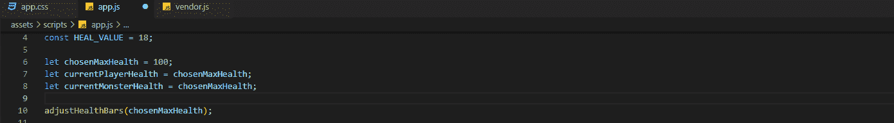

Go to User Settings: added by author.

## 20.键盘快捷键部分

这个部分对我来说是最好的，因为你也可以随意编辑你的快捷键。不用 VS 代码告诉你需要按哪些键，你可以选择对你来说容易记忆的键。您可以前往`File -> Preferences -> Keyboard Shortcuts`编辑您所有的快捷方式。或者，Windows 可以按`CTRL + K + CTRL + S`，Mac 可以按`COMMAND + K + COMMAND + S`。

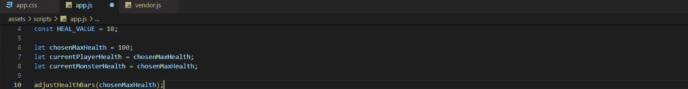

Keyboard Section: added by author.

作为开发人员，我们每次都需要提高自己的技能。技术变化太快了。我们需要跟上创新的步伐——最好的方法是研究新概念，深入我们已经知道的概念。

作为一名开发人员，在提高自己的同时，你也应该避免那些降低你学习和完成任务速度的干扰。我已经找到了一些避免这些干扰的方法。

第一个是学习十指打字。它可以防止你过多地盯着键盘，让你专注于你正在做的事情。

第二个是使用快捷方式，我今天告诉你 20 个重要的。使用快捷方式可以防止您过多地使用鼠标。

此外，它节省您的时间，因为它是一个快捷方式的名称。与其使用鼠标，在行首和行尾放置一些字符来切换注释，不如使用快捷方式。

学习十指打字，使用这二十个 VS 代码快捷键，会让你不分心。其他代码编辑器也有这些快捷键。它们的快捷键可能不同。但是，您可以绑定想要使用这些快捷键的键。

*更多内容看*[***plain English . io***](http://plainenglish.io/)