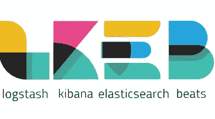
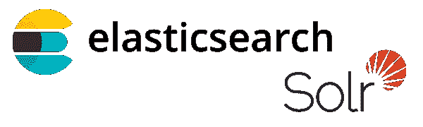

# 2021 年全栈开发者路线图

> 原文：<https://javascript.plainenglish.io/2021-js-fullstack-web-developer-roadmap-part3-a583d4ade3df?source=collection_archive---------13----------------------->

## 第三部分

在过去的几年中，JavaScript 成为最强大和最常用的编程语言之一，它被用于 web、游戏、桌面开发等等。只要使用 JavaScript，你就可以成为一名完整的 web 开发人员(前端和后端开发人员)，因此我喜欢写一篇关于路线图的文章，这样对初学者和其他人来说都是有用的**，可以填补他们知识中的空白(如果存在的话**)。

您可以通过以下链接查看第一部分和第二部分:

 [## 2021 JS Fullstack Web 开发者路线图-第 1 部分

### 在过去的几年中，JavaScript 成为最强大和最常用的编程语言之一，它被用于 web…

medium.com](https://medium.com/swlh/2021-js-fullstack-web-developer-roadmap-part1-d86ac51d5c39)  [## 2021 JS Fullstack web 开发者路线图-第二部分

### 在过去的几年中，JavaScript 成为最强大和最常用的编程语言之一，它被用于 web…

a-mhaish.medium.com](https://a-mhaish.medium.com/2021-js-fullstack-web-developer-roadmap-part2-d3579330b0e5) 

# 概念主题

现在，如果您想开始编写企业应用程序，更多的概念将出现在您的阅读列表中，如下所示:

*   **高级开发原则**:提高您的代码质量和系统软件设计的另一个步骤是理解一些重要的开发原则，如 **(TDD、BDD、TLD、DDD、ATDD)** ，接下来是我的另一篇关于 TDD 和 TLD 的文章和另外两篇关于 DDD 以及 TDD、BDD 和 DDD 的交集的文章，其他的我会留给您去搜索。

 [## TDD 与 TLD 的比较，需要的最小代码覆盖率是多少

### 测试最后开发(TLD)和测试驱动开发(TDD)是两个主要的测试过程。我们将讨论…

medium.com](https://medium.com/swlh/tdd-vs-tld-and-what-is-the-minimum-code-coverage-needed-f380181d3400)  [## 领域驱动设计:你一直想知道，但又不敢问的一切

### DDD 是一个整体的方法来解决业务问题，通过丰富的合作与领域专家和严格的…

medium.com](https://medium.com/ssense-tech/domain-driven-design-everything-you-always-wanted-to-know-about-it-but-were-afraid-to-ask-a85e7b74497a)  [## TDD、DDD 和 BDD 交点处的值

### 软件开发充斥着框架、方法和过程；其中大部分都承诺…

medium.com](https://medium.com/datadriveninvestor/the-value-at-the-intersection-of-tdd-ddd-and-bdd-da58ea1f3ac8) 

*   **软件架构模式**:在了解了前面的概念之后，你应该开始深入了解架构模式，以及如今人们如何为他们的系统选择正确的架构，如果你想有一个坚实的了解，你应该看看**“软件架构实践”，作者 Len Bass，Paul Clements，Rick Kazman，**你也可以在互联网上进行研究，你需要了解的最重要的概念是**(单片应用、微服务应用、无服务器应用)。**我建议你关注**微服务**，因为这是当今的趋势，下一篇文章是介绍微服务的绝佳材料。除此之外，你应该知道

 [## 微服务架构的内容、原因和方式

### 帮助你从今天开始的 8 个关键

medium.com](https://medium.com/hashmapinc/the-what-why-and-how-of-a-microservices-architecture-4179579423a9) 

*   **可观察性**:测量、收集和分析来自系统的各种诊断信号的活动。这些包括度量、跟踪和日志。这个概念由微服务架构中的三个主要概念组成(**日志记录、审计日志记录、跟踪和收集指标**)。我们将在本文后面讨论实现这一目标的工具，但是理解这个概念非常重要。您可以找到关于跟踪和收集指标的下一篇好文章，我将把剩下的留给您去研究。

 [## 微服务可观察性—指标

### 密切关注让你对软件充满信心的信号

medium.com](https://medium.com/better-programming/microservice-observability-metrics-bd9be270bc62)  [## 分布式跟踪的微服务可观测性。

### 荷鲁斯计划的持续案例研究。

medium.com](https://medium.com/swlh/microservices-observability-with-distributed-tracing-32ae467bb72a) 

*   **敏捷开发中的高级主题:**我们将继续关注敏捷开发，以理解更重要的概念，尤其是敏捷开发的报告方面。接下来是一篇非常有用的文章:

 [## 敏捷开发:Scrum 团队的 KPI

### Scrum 团队在多个层面上使用 KPI 来评估他们是否成功达到目标。有一组 KPI 是…

medium.com](https://medium.com/swlh/agile-development-kpis-for-scrum-teams-a84a0381d469) 

*   高级设计模式(Advanced design patterns):软件设计模式是一种通用的、可重用的解决方案，针对软件设计中给定环境下的常见问题，在[第 2 部分](https://a-mhaish.medium.com/2021-js-fullstack-web-developer-roadmap-part2-d3579330b0e5)中，我们讨论了其中的一些。一本值得一读的好书是《KevinZhang 的设计模式》。

# 开发和监控工具

当然，我们将继续使用更多的开发工具，并从高级工具开始，如下所示:

*   **Kubernetes:** 在这一阶段，我们将需要继续学习我们在[第 2 部分](https://a-mhaish.medium.com/2021-js-fullstack-web-developer-roadmap-part2-d3579330b0e5)中所讲的内容，而且大多数情况下，您需要敲开下一件事情的大门**(K8 的集群架构、入口控制器、K8 策略、K8 的存储、管理容器、证书、状态集、守护集、作业等资源)**在这一阶段和这些日子里，K8 的专业精神是如此重要。

*   **伸缩性**:伸缩性是目前最热门的术语之一。您需要知道如何在 K8 或云提供商的资源中进行纵向和横向扩展，以及二者之间的区别。并根据特定的指标构建实现自动扩展的策略。在这个阶段，对云提供商的一些研究和实践是必不可少的。另外，别忘了看看 **Kubernetes pod 水平缩放。**
*   **事件监控**:我们之前已经讨论过**可观察性**的重要性，收集指标是其中必不可少的一部分。有一些产品可以帮助你收集和存储这些指标，**普罗米修斯**是实现这一目标的最重要的工具之一。了解如何设置 **Prometheus** 及其如何工作以及如何使用 **Grafana** 来监控和可视化指标是非常重要的**。**此外，在每个云提供商中，都有一些您可以使用的监控工具。当然，市场上还有其他产品可以做到这一点，你可以研究一下。

*   **测井**:另一个重要的部分**可观测性，**和这些天**麋鹿**堆栈是如此著名，以实现一个坚实的测井系统。此外，云提供商提供了许多丰富的日志工具，但在这种情况下，当您坚持使用特定的云工具时，您可能会失去系统的可移植性。 **ELK** 栈由四个主要产品组成， **Logstash** 用于格式化日志并将其推送到 **ElasticSearch** ，其中 **ElasticSearch** 作为存储和搜索日志的数据引擎， **Kibana** 是一个优秀的 UI 工具来显示日志，最后，B **eats** 是一个从应用程序中收集日志并将其发送到 **Logstash** 的产品。

*   **追踪**:另一个**可观察性的重要部分，**现在 Zipkin 是实现这一点的最著名的系统之一。此外，这里的云提供商也提供他们自己的追踪工具。所以你需要了解 Zipkin 是如何安装的，以及它是如何工作的。以及如何分析捕捉到的痕迹。

*   代码质量:在这个阶段，你的职责之一是强制你的团队拥有高质量的代码。这将需要你做大量的工作和审查，开会列出标准，使用一些代码检查器，如 **ESLint** 。但是现在有一个很好的工具被广泛使用，那就是 **SonarQube** ，了解这个工具并看看你如何将它与你的 CI/CD 管道相集成也是很棒的。

# 后端高级技术

我们在这里可以说，我们将更多地讨论可用于设计应用程序的组件，而不是编程工具和框架。现在我们开始关注软件架构师，而不是我们如何编写软件。

*   搜索引擎:搜索引擎支持平台快速有效地搜索内部数据。最著名的搜索引擎是 **ElasticSearch** 和 **Solr** 。但是你可以在每个大的云提供商内部找到搜索引擎的实现。理解这些搜索引擎的用法在这个阶段是非常重要的。

*   **消息代理:根据 IBM 的定义:**

> 消息代理是一种应用程序间通信技术，有助于构建通用集成机制，以支持云原生、基于微服务、无服务器和混合云架构。

如果您想使用企业应用程序，您肯定需要了解消息代理的用法。

他们的文章很棒:

 [## 什么是消息代理？

### 消息代理使应用程序、系统和服务能够通信和交换信息，通过翻译…

www.ibm.com](https://www.ibm.com/cloud/learn/message-brokers) 

市场上有很多消息代理，RabbitMQ 和 Kafka 是最著名的开源代理，你也可以在云提供商那里找到一些消息代理解决方案。

*   **入口控制器**:如果您正在使用 K8，那么了解入口控制器的用法是非常重要的，入口控制器的主题是如何将到达您集群的请求路由到正确的服务，市场上有不同的入口控制器软件， **Nginx** 控制器是最著名的一个，接下来是一篇列出所有可用入口控制器的精彩文章:

 [## Kubernetes 入口控制器概述

### 比较 Kubernetes 的流行入口控制器，并列出选择正确控制器的重要考虑因素…

medium.com](https://medium.com/swlh/kubernetes-ingress-controller-overview-81abbaca19ec) 

*   **服务网格**:这是一个现代化的服务网络层，它提供了一种透明且独立于语言的方式来灵活、轻松地自动化应用网络功能。它提供了许多安全性、可靠性和效率优势。Kubernetes **上有三个主要产品(Istio、Linkerd、Consul)。**如果您想使用 Kubernetes 来处理微服务，了解这些服务网格的概念、用法和配置是非常重要的。

# 前端先进技术

在 frontend technologies 中，我们还将讨论如何设计我们的 FE 工作空间，了解一些重要的工具和概念:

*   Monorepo 是一个存储所有代码和资产的仓库。它创建了一个单一的事实来源，使代码共享和重构变得更加容易。Monorepo 目前在 FE 项目中是首选，特别是允许在项目之间轻松共享组件和逻辑，并简化 CI/CD 管道和跟踪库依赖关系。帮助你实现单一回购的最著名的工具是 **Nx** 和 **Lerna。**

*   微前沿:这是关于将微服务理念延伸到前端世界。理解这个概念会非常有用，因为你可能会选择它作为 FE 项目的架构。你可以从这里回顾这个想法[https://micro-frontends.org/](https://micro-frontends.org/)还有一本关于 https://www.manning.com/books/micro-frontends-in-action?的书 a _ aid = mfia&a _ bid = 5f 09 fdeb

# 什么是建筑师

**架构师**定义**架构**、**基础架构**、**系统总体布局**、**技术、**和**框架**。而**开发者**实现它。**这是一个直截了当的定义**，所以要成为一名架构师，首先必须成为一名高级开发人员，然后理解**架构设计**、**组件之间的通信方法**、**部署策略，实现可观察性，选择正确的设计模式，为您的系统选择正确的平台和云资源。简而言之，您应该了解如何设计企业应用程序。这篇文章只是对一些工具和概念的简单介绍，可以帮助你开始你的工作。**

# 结论

我浏览了一些企业主题，如果你能掌握它们的话，这些主题会把你提升到架构师的级别。虽然这部分技术是如此狭窄和专业，但我相信它在这些日子里是如此重要，或者至少对功能来说是如此。我相信理解它们将有助于您切换到该特性中的任何其他技术。**请注意，概念部分现在比工具更重要、更大，这与我以前的文章相反，我以前的文章更关注工具而不是概念。**

我相信我暂时不能继续下去，因为首先，我暂时没有更多的东西可以分享，其次，我相信在那之后，每个人都应该继续独自绘制他或她的道路:)

但是请永远记住,**学习之路**永远不会结束。

如果您想查看以前的文章，请查看以下内容:

 [## 2021 JS Fullstack Web 开发者路线图-第 1 部分

### 在过去的几年中，JavaScript 成为最强大和最常用的编程语言之一，它被用于 web…

medium.com](https://medium.com/swlh/2021-js-fullstack-web-developer-roadmap-part1-d86ac51d5c39)  [## 2021 JS Fullstack web 开发者路线图-第二部分

### 在过去的几年中，JavaScript 成为最强大和最常用的编程语言之一，它被用于 web…

a-mhaish.medium.com](https://a-mhaish.medium.com/2021-js-fullstack-web-developer-roadmap-part2-d3579330b0e5)