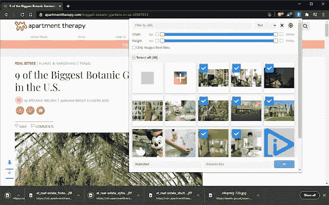
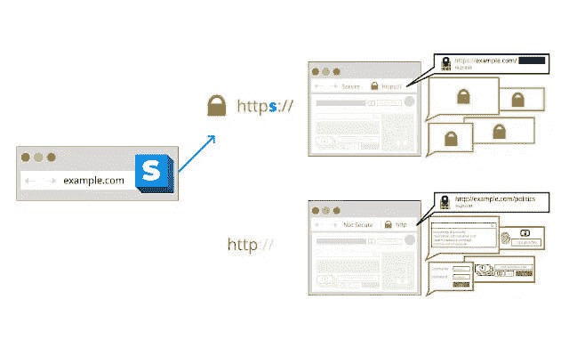

# 面向 Web 开发人员和设计人员的 38 个 Chrome 扩展

> 原文：<https://javascript.plainenglish.io/21-chrome-extension-for-web-developer-and-designer-4f791ef6bde2?source=collection_archive---------4----------------------->

Photo by [Rajeshwar Bachu](https://unsplash.com/@rajeshwerbatchu7?utm_source=medium&utm_medium=referral) on [Unsplash](https://unsplash.com?utm_source=medium&utm_medium=referral)

# 什么运行

WhatRuns 实用程序帮助我们识别网站上使用的网络技术，如框架、分析工具、WordPress 插件、字体等。你只需要访问你想要的页面，然后点击 WhatRuns 图标。然后不到 1 分钟信息就会全部出现。您还可以注册，以便在您要监控的站点向该站点添加新技术时收到通知。

[运行什么](https://www.whatruns.com/)

# 什么字体

WhatFont 使得确定网页元素使用哪种字体变得容易。你只需要安装并移动鼠标到我们想要看到的对象上，就可以看到它的字体名称。很简单，对。

[什么字体](https://chrome.google.com/webstore/detail/whatfont/jabopobgcpjmedljpbcaablpmlmfcogm)

# 色彩奇拉

Colorzilla 使得读取网页上任何对象的颜色值成为可能。此外，它还支持一些其他有用的功能，如自动复制颜色到剪贴板，显示我们最近选择的颜色的历史，高级颜色选择器…

[Colorzilla](https://chrome.google.com/webstore/detail/colorzilla/bhlhnicpbhignbdhedgjhgdocnmhomnp/related)

# 窗口大小调整器

Window Resizer 是一个重要的工具，可以帮助我们在浏览器上快速构建或测试网站的响应性，例如手机、平板电脑、笔记本电脑、台式机的屏幕。此外，您可以通过设置浏览器窗口的宽度和高度来自动调整所需的显示大小。

[窗口大小调整器](https://chrome.google.com/webstore/detail/window-resizer/kkelicaakdanhinjdeammmilcgefonfh/related?hl=en)

# Web 开发人员

Web Developer 是为数不多的超过 100 万用户安装的扩展之一。它帮助网站开发者快速开发和调试网站。这个工具是各种工具的集合，例如 Disable、Cookies、CSS、Forms、Image。你可以很容易地找到损坏的图像，不允许网站运行 JavaScript，检查 CSS 通过标准与否，隐藏所有图像，显示当前网页上的链接信息。

[网络开发者](https://chrome.google.com/webstore/detail/web-developer/bfbameneiokkgbdmiekhjnmfkcnldhhm)

# 邮递员

Postman 是一个帮助我们向服务器发出 HTTP 请求的应用程序。当你为你的程序运行或测试 API 时，它真的很有用，而且它还允许你很容易地发出 GET、POST、DELETE、PUT 请求。另外它还有一个论坛，里面有大量的程序员，帮助我们在刚开始使用 Postman 的时候解决问题。

[邮递员](https://chrome.google.com/webstore/detail/postman/fhbjgbiflinjbdggehcddcbncdddomop/related?hl=en%20)

# Lorem Ipsum 生成器

Lorem Ipsum Generator 通过指定我们想要的段落和行数来帮助我们快速创建文档。当你在你的网站中构建组件时，通常会使用内容来测试或查看它在网页上的显示。因此，这个工具使得只需一次点击就可以创建虚假内容。

[Lorem Ipsum 发生器](https://chrome.google.com/webstore/detail/lorem-ipsum-generator-def/mcdcbjjoakogbcopinefncmkcamnfkdb?hl=en%20)

# CSSViewer

CSSViewer 帮助我们以最普通的方式查看网页中对象的 CSS 属性，如颜色、字体、大小、位置。你只需要选择这个工具，然后将鼠标悬停在他们想要的对象上。如果你愿意，CSS 信息会自动出现。

[CSSViewer](https://chrome.google.com/webstore/detail/cssviewer/ggfgijbpiheegefliciemofobhmofgce)

# 页面标尺冗余

页面标尺 Redux 帮助我们以像素为单位获得网页上一个单元的大小。当你需要得到网页上某个元素的确切大小时，它适合于网页设计者。

[页面标尺重叠](https://chrome.google.com/webstore/detail/page-ruler-redux/giejhjebcalaheckengmchjekofhhmal)

# TinEye 反向图像搜索

TinEye 反向图像搜索使用图像识别技术来帮助您在网络上搜索图像，结果是许多不同的链接，其中包含已调整大小、编辑或具有不同分辨率的图像。方法也很简单，你右击你想搜索的图片，在 TinEye 上选择搜索图片，等一会儿，我们就会有结果了。

[TinEye 反向图像搜索](https://chrome.google.com/webstore/detail/tineye-reverse-image-sear/haebnnbpedcbhciplfhjjkbafijpncjl)

# 伟大的吊杆

如你所知，在使用谷歌 Chrome 时，Ram 的使用问题一直是提高电脑速度的重要因素。伟大的吊杆工具可以帮助我们暂停不用的标签，使浏览器运行更流畅。你也可以让标签页在不使用时暂停一段时间，比如 20 秒、1 分钟、5 分钟等等。它还为我们提供了一些有用的工具，如自动关闭，标签播放。

[伟大的吊杆](https://chrome.google.com/webstore/detail/the-great-suspender/jaekigmcljkkalnicnjoafgfjoefkpeg?hl=en)

# 小猿

Marmoset 帮助我们将程序中的代码保存为图像。比如，当你需要把程序中某个功能的代码放到社交网站上分享时，就会非常方便。它还提供了一些额外的功能，如调整颜色，语言，主题。

[绒猴](https://chrome.google.com/webstore/detail/marmoset/npkfpddkpefnmkflhhligbkofhnafieb/related)

# 用户代理切换器

用户代理切换器使得在许多不同的设备和浏览器上测试我们的网站成为可能，而无需安装任何额外的程序，例如在显示时查看您的网站。显示在 Opera、Safari、Firefox、Internet Explorer 浏览器上。

[用户代理切换器](https://chrome.google.com/webstore/detail/user-agent-switcher-for-c/djflhoibgkdhkhhcedjiklpkjnoahfmg/related)

# 清除缓存

清除缓存负责清除缓存，只需一键浏览数据。此外，我们可以选择要删除的数据，如应用程序缓存、cookies、历史记录和数据库。

[清除缓存](https://chrome.google.com/webstore/detail/clear-cache/cppjkneekbjaeellbfkmgnhonkkjfpdn/related)

# React 开发人员工具

React 开发者工具是 Chrome 的开发者工具中增加的一个 React 调试工具。它允许您在网站开发过程中轻松快速地测试 React 组件。

[React 开发者工具](https://chrome.google.com/webstore/detail/react-developer-tools/fmkadmapgofadopljbjfkapdkoienihi/related)

# 检查我的链接

“检查我的链接”使得只需一次点击就可以检查网站中的断开链接。

[查看我的链接](https://chrome.google.com/webstore/detail/check-my-links/ojkcdipcgfaekbeaelaapakgnjflfglf/related)

# Checkbot

Checkbot 有助于检查网站的速度，安全性和搜索引擎优化的各种因素，如网站地图，404 页，重复内容，JavaScript，CSS 文件，HTTPS，网址重定向。

[检查机器人](https://chrome.google.com/webstore/detail/checkbot-seo-web-speed-se/dagohlmlhagincbfilmkadjgmdnkjinl/related)

# 网站调色板

网站调色板帮助您快速方便地自动导出您正在浏览器中使用的网站的多个调色板。

[站点调色板](https://chrome.google.com/webstore/detail/site-palette/pekhihjiehdafocefoimckjpbkegknoh/related)

# Web 开发人员清单

网站开发者清单帮助你检查一个网站应该具备的所有要素。

[网络开发人员清单](https://chrome.google.com/webstore/detail/web-developer-checklist/iahamcpedabephpcgkeikbclmaljebjp/related?hl=en)

# 编辑 ThisCookie

EditThisCookie 是一个 Cookie 管理器，其任务是帮助您添加、删除、编辑、使用、搜索、保护和阻止网站上的 cookie。

[编辑 ThisCookie](https://chrome.google.com/webstore/detail/editthiscookie/fngmhnnpilhplaeedifhccceomclgfbg/related)

# HTML 验证程序

帮助您检查 HTML 代码，然后给出解决方案来修复网站中的错误。

HTML Validator

[HTML 验证器](https://chrome.google.com/webstore/detail/html-validator/mpbelhhnfhfjnaehkcnnaknldmnocglk)

# JSON 查看器

它的任务是让您快速轻松地设计、定制和管理 JSON。

JSON Viewer

[JSON 查看器](https://chrome.google.com/webstore/detail/json-viewer/gbmdgpbipfallnflgajpaliibnhdgobh)

# 强光灯

它帮助你快速捕捉网站的屏幕。

Lightshot

[Lightshot](https://chrome.google.com/webstore/detail/lightshot-screenshot-tool/mbniclmhobmnbdlbpiphghaielnnpgdp)

# 每日发展

通过每日更新，帮助您获得网站设计和开发方面的重要新闻。

daily.dev

[daily.dev](https://chrome.google.com/webstore/detail/dailydev-the-homepage-dev/jlmpjdjjbgclbocgajdjefcidcncaied)

# 图像下载器

帮助您快速下载网站上的图像。

Image Downloader

[图像下载器](https://chrome.google.com/webstore/detail/image-downloader/cnpniohnfphhjihaiiggeabnkjhpaldj)

# 完美像素

用 pixel 让你的网站元素完美。

PerfectPixel

[完美像素](https://chrome.google.com/webstore/detail/perfectpixel-by-welldonec/dkaagdgjmgdmbnecmcefdhjekcoceebi)

# 悬停化

改善用户体验，如检查 HTML，CSS，直接编辑元素，在 DOM 中移动元素。

Hoverify

[悬停化](https://chrome.google.com/webstore/detail/hoverify/bbpokcagpggnekcmamgdieebhpkjmljm)

# Evernote Web Clipper

Evernote Web Clipper 是一个浏览器扩展，允许您将在线遇到的有趣内容直接保存到您的 Evernote 帐户。

Evernote Web Clipper

[Evernote 网页剪](https://chrome.google.com/webstore/detail/evernote-web-clipper/pioclpoplcdbaefihamjohnefbikjilc)

# 瓦帕里斯

Wappalyzer 让我们知道网站正在使用哪个 CMS、电子商务平台、JavaScript 库或框架。

Wappalyzer

[Wappalyzer](https://chrome.google.com/webstore/detail/wappalyzer/gppongmhjkpfnbhagpmjfkannfbllamg?hl=en)

# 铬的语法

帮你检查网站上内容的语法。

Grammarly for Chrome

[语法上为 Chrome](https://chrome.google.com/webstore/detail/grammarly-for-chrome/kbfnbcaeplbcioakkpcpgfkobkghlhen)

# Vue.js 开发工具

帮助你在你的网站上测试 Vue.js 代码。

Vue.js devtools

[Vue.js 开发工具](https://chrome.google.com/webstore/detail/vuejs-devtools/nhdogjmejiglipccpnnnanhbledajbpd)

# Redux 开发工具

当状态改变时，帮助您调试应用程序。

Redux DevTools

[Redux 开发工具](https://chrome.google.com/webstore/detail/redux-devtools/lmhkpmbekcpmknklioeibfkpmmfibljd)

# 保存到 Google Drive

允许自动保存网页或图像到 Google Drive。

Save to Google Drive

[链接](https://chrome.google.com/webstore/detail/save-to-google-drive/gmbmikajjgmnabiglmofipeabaddhgne?utm_source=chrome-ntp-icon)

# HTTPS 无处不在

帮助自动将 HTTP 页面转换为 HTTPS。

HTTPS Everywhere

[HTTPS 无处不在](https://chrome.google.com/webstore/detail/https-everywhere/gcbommkclmclpchllfjekcdonpmejbdp?utm_source=chrome-ntp-icon)

# 字体忍者

显示网站上的所有字体，提供关于该字体的完整信息。

Fonts Ninja

[字体忍者](https://chrome.google.com/webstore/detail/fonts-ninja/eljapbgkmlngdpckoiiibecpemleclhh/related?hl=en)

# 相似网络

提供许多功能，以帮助您检查网站，如网页排名，交通来源，主要国家访问网站，搜索引擎优化。

Similarweb

[相似网](https://chrome.google.com/webstore/detail/similarweb-traffic-rank-w/hoklmmgfnpapgjgcpechhaamimifchmp)

# 灯塔

这是一个完全免费的工具，可以帮助你测试网站速度，提供改进网站的解决方案等。

Lighthouse

[灯塔](https://chrome.google.com/webstore/detail/lighthouse/blipmdconlkpinefehnmjammfjpmpbjk)

# 谷歌浏览器扩展帮助你放松

# 动力

Momentum 将用一个包含待办事项、天气和灵感的个人仪表盘取代新的标签页。

[气势](https://chrome.google.com/webstore/detail/momentum/laookkfknpbbblfpciffpaejjkokdgca/related?hl=en%20)

相关文章:

*   [面向 Web 开发人员的 Visual Studio 代码扩展](https://us.niemvuilaptrinh.com/article/30-best-visual-studio-code-extensions)
*   [面向前端开发者的开源项目](https://us.niemvuilaptrinh.com/article/63-open-source-web-development-tools)
*   [免费的网页设计生成工具](https://us.niemvuilaptrinh.com/article/41-free-generator-tools-for-web-design)

*更多内容看* [***说白了就是***](http://plainenglish.io/) *。报名参加我们的* [***免费周报***](http://newsletter.plainenglish.io/) *。在我们的* [***社区获得独家访问写作机会和建议***](https://discord.gg/GtDtUAvyhW) *。*